# Advanced Features

<cite>
**Referenced Files in This Document**
- [index.html](file://index.html)
- [MermaidSyncController.js](file://js/editors/mermaid/MermaidSyncController.js)
- [MermaidVisualEditor.js](file://js/editors/mermaid/index.js)
- [MermaidFlowchartEditor.js](file://js/editors/mermaid/MermaidFlowchartEditor.js)
- [MermaidSequenceEditor.js](file://js/editors/mermaid/MermaidSequenceEditor.js)
- [MermaidDataEditors.js](file://js/editors/mermaid/MermaidDataEditors.js)
- [MermaidGenericEditor.js](file://js/editors/mermaid/MermaidGenericEditor.js)
- [error-diagnostics/index.js](file://js/error-diagnostics/index.js)
- [error-diagnostics/fixes.js](file://js/error-diagnostics/fixes.js)
- [error-diagnostics/explanations.js](file://js/error-diagnostics/explanations.js)
- [react-helpers.js](file://js/react-helpers.js)
- [utils.js](file://js/utils.js)
- [ui.js](file://js/components/ui.js)
- [update-manager.js](file://js/update-manager.js)
- [update-tester.js](file://js/update-tester.js)
- [library-registry.js](file://js/library-registry.js)
- [cdn-version-checker.js](file://js/cdn-version-checker.js)
- [html-rewriter.js](file://js/html-rewriter.js)
</cite>

## Update Summary
**Changes Made**
- Added comprehensive documentation for the new library update management system
- Documented sophisticated dependency version tracking and automated update workflow
- Added detailed coverage of the iframe-based testing framework for library updates
- Included advanced features for CDN version checking, HTML rewriting, and update validation
- Enhanced architecture overview to include the complete update management pipeline

## Table of Contents
1. [Introduction](#introduction)
2. [Project Structure](#project-structure)
3. [Core Components](#core-components)
4. [Architecture Overview](#architecture-overview)
5. [Detailed Component Analysis](#detailed-component-analysis)
6. [Library Update Management System](#library-update-management-system)
7. [Dependency Analysis](#dependency-analysis)
8. [Performance Considerations](#performance-considerations)
9. [Troubleshooting Guide](#troubleshooting-guide)
10. [Conclusion](#conclusion)
11. [Appendices](#appendices)

## Introduction
This document explains the advanced features and technical implementations powering the diagramming platform, with a focus on:
- Bi-directional synchronization between code and visual modes using Mermaid AST
- Change detection, debouncing, and state management to prevent infinite loops
- Real-time preview generation via Kroki and memory-safe blob URLs
- Conflict resolution between code and visual modes
- Advanced editor features: cursor tracking, error highlighting, syntax validation, and quick fixes
- **NEW: Sophisticated library update management system with automated dependency version tracking**
- **NEW: Advanced iframe-based testing framework for safe library updates**
- Performance optimizations: memory management, lazy loading, caching, and bundle size reduction
- Extensibility points for power users and developers

## Project Structure
The application is a single-page app built with React and Monaco Editor, with modular Mermaid visual editors and robust error diagnostics. The new update management system integrates seamlessly with the existing architecture.

**Diagram sources**
- [index.html](file://index.html#L53-L59)
- [MermaidVisualEditor.js](file://js/editors/mermaid/index.js#L20-L121)
- [MermaidSyncController.js](file://js/editors/mermaid/MermaidSyncController.js#L9-L92)
- [error-diagnostics/index.js](file://js/error-diagnostics/index.js#L13-L44)
- [utils.js](file://js/utils.js#L14-L28)
- [react-helpers.js](file://js/react-helpers.js#L4-L39)
- [ui.js](file://js/components/ui.js#L16-L66)
- [update-manager.js](file://js/update-manager.js#L1-L343)
- [library-registry.js](file://js/library-registry.js#L1-L409)
- [cdn-version-checker.js](file://js/cdn-version-checker.js#L1-L270)
- [update-tester.js](file://js/update-tester.js#L1-L505)
- [html-rewriter.js](file://js/html-rewriter.js#L1-L274)

**Section sources**
- [index.html](file://index.html#L53-L59)
- [MermaidVisualEditor.js](file://js/editors/mermaid/index.js#L20-L121)
- [MermaidSyncController.js](file://js/editors/mermaid/MermaidSyncController.js#L9-L92)
- [error-diagnostics/index.js](file://js/error-diagnostics/index.js#L13-L44)
- [utils.js](file://js/utils.js#L14-L28)
- [react-helpers.js](file://js/react-helpers.js#L4-L39)
- [ui.js](file://js/components/ui.js#L16-L66)
- [update-manager.js](file://js/update-manager.js#L1-L343)
- [library-registry.js](file://js/library-registry.js#L1-L409)
- [cdn-version-checker.js](file://js/cdn-version-checker.js#L1-L270)
- [update-tester.js](file://js/update-tester.js#L1-L505)
- [html-rewriter.js](file://js/html-rewriter.js#L1-L274)

## Core Components
- Mermaid AST synchronization controller: central state machine for bi-directional sync, debouncing, and loop prevention
- Mermaid visual editor router: routes to specialized editors based on AST type and manages live previews
- Specialized editors: flowchart, sequence, and data editors with inline editing and element lists
- Error diagnostics: structured error parsing, fix suggestions, and human-readable explanations
- **NEW: Library update management system: comprehensive dependency version tracking and automated update workflow**
- **NEW: Update tester: iframe-based sandbox testing for safe library updates**
- Utilities: compression, regex escaping, script/CSS loaders, and debounce helpers
- UI primitives: reusable buttons, badges, loaders, and editable fields

**Section sources**
- [MermaidSyncController.js](file://js/editors/mermaid/MermaidSyncController.js#L9-L92)
- [MermaidVisualEditor.js](file://js/editors/mermaid/index.js#L20-L121)
- [MermaidFlowchartEditor.js](file://js/editors/mermaid/MermaidFlowchartEditor.js#L10-L117)
- [MermaidSequenceEditor.js](file://js/editors/mermaid/MermaidSequenceEditor.js#L4-L50)
- [MermaidDataEditors.js](file://js/editors/mermaid/MermaidDataEditors.js#L7-L171)
- [MermaidGenericEditor.js](file://js/editors/mermaid/MermaidGenericEditor.js#L11-L98)
- [error-diagnostics/index.js](file://js/error-diagnostics/index.js#L13-L44)
- [error-diagnostics/fixes.js](file://js/error-diagnostics/fixes.js#L332-L366)
- [error-diagnostics/explanations.js](file://js/error-diagnostics/explanations.js#L237-L271)
- [update-manager.js](file://js/update-manager.js#L1-L343)
- [update-tester.js](file://js/update-tester.js#L1-L505)
- [library-registry.js](file://js/library-registry.js#L1-L409)
- [utils.js](file://js/utils.js#L14-L28)
- [react-helpers.js](file://js/react-helpers.js#L4-L39)
- [ui.js](file://js/components/ui.js#L16-L66)

## Architecture Overview
The system integrates three pillars:
- AST-based synchronization: parse code to AST and render AST back to code
- Real-time preview pipeline: debounce user input, call Kroki, manage blob URLs
- Error diagnostics and quick fixes: parse errors, suggest fixes, and present explanations
- **NEW: Library update management pipeline: automated dependency version tracking and safe update application**

```mermaid
sequenceDiagram
participant U as "User"
participant M as "Monaco Editor"
participant VS as "MermaidVisualEditor"
participant SC as "MermaidSyncController"
participant AST as "Mermaid AST"
participant KR as "Kroki API"
U->>M : "Edit code"
M->>VS : "onChange(code)"
VS->>SC : "parseCode(code)"
SC->>AST : "parse(code)"
AST-->>SC : "ast"
SC-->>VS : "ast"
VS->>KR : "POST /mermaid/svg (debounced)"
KR-->>VS : "SVG blob"
VS-->>U : "Live preview update"
Note over VS,SC : "Visual → Code sync uses render(ast) and resets changeSource"
Note over U,G : "Library Update Workflow"
U->>G : "Check for Updates"
G->>G2 : "Query CDN APIs"
G2-->>G : "Latest versions"
G->>G3 : "Test selected updates"
G3-->>G : "Test results"
G->>G4 : "Apply updates to HTML"
G4-->>U : "Download updated HTML"
```

**Diagram sources**
- [MermaidSyncController.js](file://js/editors/mermaid/MermaidSyncController.js#L21-L58)
- [MermaidVisualEditor.js](file://js/editors/mermaid/index.js#L25-L53)
- [index.html](file://index.html#L794-L800)
- [update-manager.js](file://js/update-manager.js#L63-L98)
- [cdn-version-checker.js](file://js/cdn-version-checker.js#L191-L214)
- [update-tester.js](file://js/update-tester.js#L398-L444)
- [html-rewriter.js](file://js/html-rewriter.js#L66-L99)

## Detailed Component Analysis

### Mermaid AST Synchronization Controller
The controller encapsulates:
- AST state and change-source tracking to avoid infinite loops
- Debounced parsing from code to AST
- AST rendering back to code for visual-mode edits
- Diagram type detection and MermaidAST readiness checks

**Diagram sources**
- [MermaidSyncController.js](file://js/editors/mermaid/MermaidSyncController.js#L9-L92)

Key behaviors:
- Debounce parsing to reduce redundant AST computations
- Prevent re-entry when change originates from visual edits
- Reset changeSource asynchronously to allow subsequent code changes

**Section sources**
- [MermaidSyncController.js](file://js/editors/mermaid/MermaidSyncController.js#L21-L58)

### Mermaid Visual Editor Router and Preview Pipeline
The router:
- Generates a preview URL from code via Kroki
- Debounces requests and manages loading states
- Revokes previous blob URLs to prevent memory leaks
- Routes to specialized editors based on AST type

**Diagram sources**
- [MermaidVisualEditor.js](file://js/editors/mermaid/index.js#L25-L60)

**Section sources**
- [MermaidVisualEditor.js](file://js/editors/mermaid/index.js#L20-L121)

### Flowchart Editor: Node/Edge Management
The flowchart editor:
- Parses AST to extract nodes and edges
- Supports inline editing of node labels
- Generates precise replacements for node labels in code
- Adds new nodes and edges via code injection

**Diagram sources**
- [MermaidFlowchartEditor.js](file://js/editors/mermaid/MermaidFlowchartEditor.js#L62-L105)
- [MermaidSyncController.js](file://js/editors/mermaid/MermaidSyncController.js#L21-L38)

**Section sources**
- [MermaidFlowchartEditor.js](file://js/editors/mermaid/MermaidFlowchartEditor.js#L10-L117)

### Sequence Editor: Participants and Messages
The sequence editor:
- Extracts participants and messages from AST
- Adds new participants and messages by injecting code at appropriate positions

**Section sources**
- [MermaidSequenceEditor.js](file://js/editors/mermaid/MermaidSequenceEditor.js#L4-L50)

### Data Editors: Timeline, Gantt, Pie, Mindmap, Journey
These editors:
- Parse diagram-specific constructs from code
- Provide inline controls to add elements
- Display structured views of extracted data

**Section sources**
- [MermaidDataEditors.js](file://js/editors/mermaid/MermaidDataEditors.js#L7-L171)
- [MermaidDataEditors.js](file://js/editors/mermaid/MermaidDataEditors.js#L91-L151)
- [MermaidDataEditors.js](file://js/editors/mermaid/MermaidDataEditors.js#L154-L203)
- [MermaidDataEditors.js](file://js/editors/mermaid/MermaidDataEditors.js#L206-L234)
- [MermaidDataEditors.js](file://js/editors/mermaid/MermaidDataEditors.js#L237-L305)

### Generic Editor: AST Explorer and Preview
The generic editor:
- Renders a live preview and an AST structure panel
- Useful fallback when a specialized editor is not available

**Section sources**
- [MermaidGenericEditor.js](file://js/editors/mermaid/MermaidGenericEditor.js#L11-L98)

### Error Diagnostics: Parsing, Fix Suggestions, and Explanations
The diagnostics system:
- Parses raw error text to extract line/column and categorize errors
- Provides Monaco-compatible markers and quick-fix actions
- Supplies human-readable explanations with examples and links

**Diagram sources**
- [error-diagnostics/index.js](file://js/error-diagnostics/index.js#L13-L44)
- [error-diagnostics/index.js](file://js/error-diagnostics/index.js#L52-L145)
- [error-diagnostics/index.js](file://js/error-diagnostics/index.js#L153-L254)
- [error-diagnostics/index.js](file://js/error-diagnostics/index.js#L261-L298)
- [error-diagnostics/fixes.js](file://js/error-diagnostics/fixes.js#L332-L366)
- [error-diagnostics/explanations.js](file://js/error-diagnostics/explanations.js#L237-L271)

**Section sources**
- [error-diagnostics/index.js](file://js/error-diagnostics/index.js#L13-L44)
- [error-diagnostics/index.js](file://js/error-diagnostics/index.js#L52-L145)
- [error-diagnostics/index.js](file://js/error-diagnostics/index.js#L153-L254)
- [error-diagnostics/index.js](file://js/error-diagnostics/index.js#L261-L298)
- [error-diagnostics/fixes.js](file://js/error-diagnostics/fixes.js#L332-L366)
- [error-diagnostics/explanations.js](file://js/error-diagnostics/explanations.js#L237-L271)

### Utilities and Helpers
- Compression for Kroki URLs
- Regex escaping and debounce helpers
- Script/CSS loaders with AMD compatibility handling
- React helpers for JSX-like syntax without a bundler

**Section sources**
- [utils.js](file://js/utils.js#L14-L28)
- [utils.js](file://js/utils.js#L107-L110)
- [utils.js](file://js/utils.js#L166-L176)
- [utils.js](file://js/utils.js#L116-L146)
- [react-helpers.js](file://js/react-helpers.js#L4-L39)
- [ui.js](file://js/components/ui.js#L16-L66)

## Library Update Management System

### Overview
The library update management system provides a sophisticated solution for tracking and updating CDN dependencies across the application. It features automated version checking, safe testing in sandboxed environments, and comprehensive update validation.

**Diagram sources**
- [update-manager.js](file://js/update-manager.js#L23-L335)
- [library-registry.js](file://js/library-registry.js#L15-L228)
- [cdn-version-checker.js](file://js/cdn-version-checker.js#L191-L214)
- [update-tester.js](file://js/update-tester.js#L398-L444)
- [html-rewriter.js](file://js/html-rewriter.js#L66-L99)

### Key Features

#### Automated Version Tracking
The system automatically tracks library versions from HTML content and compares them against CDN APIs to identify available updates.

**Section sources**
- [library-registry.js](file://js/library-registry.js#L297-L345)
- [cdn-version-checker.js](file://js/cdn-version-checker.js#L141-L182)

#### Safe Testing Framework
Before applying updates, the system tests library versions in isolated iframe sandboxes to ensure compatibility and proper functionality.

**Section sources**
- [update-tester.js](file://js/update-tester.js#L398-L444)
- [update-tester.js](file://js/update-tester.js#L19-L362)

#### Comprehensive Update Validation
The system validates HTML integrity, performs URL accessibility checks, and generates detailed change summaries before downloading updated files.

**Section sources**
- [html-rewriter.js](file://js/html-rewriter.js#L240-L264)
- [update-tester.js](file://js/update-tester.js#L458-L497)

#### Major Version Detection
The system identifies major version changes and flags them appropriately to prevent breaking updates.

**Section sources**
- [library-registry.js](file://js/library-registry.js#L382-L394)
- [cdn-version-checker.js](file://js/cdn-version-checker.js#L219-L228)

### Update Workflow Process

**Diagram sources**
- [update-manager.js](file://js/update-manager.js#L63-L98)
- [update-manager.js](file://js/update-manager.js#L103-L153)
- [update-manager.js](file://js/update-manager.js#L158-L197)

**Section sources**
- [update-manager.js](file://js/update-manager.js#L63-L197)

## Dependency Analysis
High-level dependencies:
- index.html loads Mermaid AST module and initializes window.MermaidAST
- MermaidVisualEditor depends on MermaidSyncController and Monaco Editor
- Specialized editors depend on AST parsing and code injection
- Error diagnostics depend on Monaco markers and code actions
- **NEW: Update system components depend on each other in a coordinated workflow**
- Utilities support compression, debouncing, and dynamic asset loading

**Diagram sources**
- [index.html](file://index.html#L53-L59)
- [MermaidVisualEditor.js](file://js/editors/mermaid/index.js#L20-L121)
- [MermaidSyncController.js](file://js/editors/mermaid/MermaidSyncController.js#L9-L92)
- [error-diagnostics/index.js](file://js/error-diagnostics/index.js#L13-L44)
- [update-manager.js](file://js/update-manager.js#L1-L343)
- [library-registry.js](file://js/library-registry.js#L1-L409)
- [cdn-version-checker.js](file://js/cdn-version-checker.js#L1-L270)
- [update-tester.js](file://js/update-tester.js#L1-L505)
- [html-rewriter.js](file://js/html-rewriter.js#L1-L274)
- [utils.js](file://js/utils.js#L14-L28)
- [ui.js](file://js/components/ui.js#L16-L66)

**Section sources**
- [index.html](file://index.html#L53-L59)
- [MermaidVisualEditor.js](file://js/editors/mermaid/index.js#L20-L121)
- [MermaidSyncController.js](file://js/editors/mermaid/MermaidSyncController.js#L9-L92)
- [error-diagnostics/index.js](file://js/error-diagnostics/index.js#L13-L44)
- [update-manager.js](file://js/update-manager.js#L1-L343)
- [library-registry.js](file://js/library-registry.js#L1-L409)
- [cdn-version-checker.js](file://js/cdn-version-checker.js#L1-L270)
- [update-tester.js](file://js/update-tester.js#L1-L505)
- [html-rewriter.js](file://js/html-rewriter.js#L1-L274)
- [utils.js](file://js/utils.js#L14-L28)
- [ui.js](file://js/components/ui.js#L16-L66)

## Performance Considerations
- Memory management
  - Revoke object URLs after use to prevent memory leaks
  - Clear Monaco markers and decorations when switching contexts
  - **NEW: Manage iframe sandbox memory for update testing**
- Debouncing
  - Debounce AST parsing and preview generation to reduce redundant work
  - Debounce preview fetches to limit network calls
  - **NEW: Cache CDN version checks to reduce API calls**
- Lazy loading
  - Dynamically load external scripts and CSS only when needed
  - Initialize Monaco and visual editors on demand
  - **NEW: Load update system components on-demand for better performance**
- Bundle size optimization
  - Use CDN-hosted libraries and ESM modules
  - Avoid bundling by leveraging browser-native modules and CDNs
  - **NEW: Minimize update system bundle size with selective imports**
- Caching
  - Reuse blob URLs until code changes
  - Cache Mermaid AST when possible during short editing sessions
  - **NEW: Cache CDN version responses for 5 minutes to improve performance**

## Troubleshooting Guide
- Infinite sync loops
  - Ensure changeSource is set when rendering from visual mode and reset asynchronously
- Missing MermaidAST
  - Check MermaidAST readiness before parsing or rendering
- Preview not updating
  - Confirm debounce timing and that blob URLs are revoked and re-created
- Error markers not appearing
  - Verify Monaco language registration and provider registration
  - Ensure markers are attached to the correct model and diagnostic code matches
- **NEW: Update system issues**
  - **CDN API failures**: Check network connectivity and CDN availability
  - **Test failures**: Review iframe sandbox errors and library compatibility
  - **HTML validation errors**: Verify generated HTML structure and syntax
  - **Version parsing issues**: Check library registry configuration and URL patterns

**Section sources**
- [MermaidSyncController.js](file://js/editors/mermaid/MermaidSyncController.js#L46-L58)
- [MermaidSyncController.js](file://js/editors/mermaid/MermaidSyncController.js#L28-L31)
- [MermaidVisualEditor.js](file://js/editors/mermaid/index.js#L41-L49)
- [error-diagnostics/index.js](file://js/error-diagnostics/index.js#L261-L298)
- [update-manager.js](file://js/update-manager.js#L93-L97)
- [update-tester.js](file://js/update-tester.js#L427-L438)
- [html-rewriter.js](file://js/html-rewriter.js#L240-L264)

## Conclusion
The platform combines AST-driven synchronization, real-time previews, and intelligent diagnostics to deliver a seamless authoring experience. Its architecture emphasizes correctness (loop prevention), responsiveness (debouncing), and efficiency (memory-safe blob URLs, lazy loading, and CDN-first bundles). **The new library update management system adds powerful automation capabilities for dependency version tracking and safe updates, while the iframe-based testing framework ensures compatibility and stability.** Developers can extend editors, add new diagram types, integrate additional diagnostics, and leverage the comprehensive update system for maintaining modern, secure dependencies.

## Appendices

### Advanced Usage Scenarios and Power User Tips
- Visual-to-code editing
  - Use specialized editors to modify nodes and edges; rely on render(ast) to keep code synchronized
- Quick fixes
  - Apply Monaco quick fixes to add missing declarations or brackets
- Cursor tracking
  - Use Monaco's cursor change callbacks to highlight corresponding AST elements
- Error explanations
  - Hover over markers to see contextual help with examples and documentation links
- **NEW: Library updates**
  - **Use the update panel to check for and apply library updates safely**
  - **Review test results before applying major version updates**
  - **Monitor update history and manage ignored updates**
  - **Leverage changelog links to understand breaking changes**