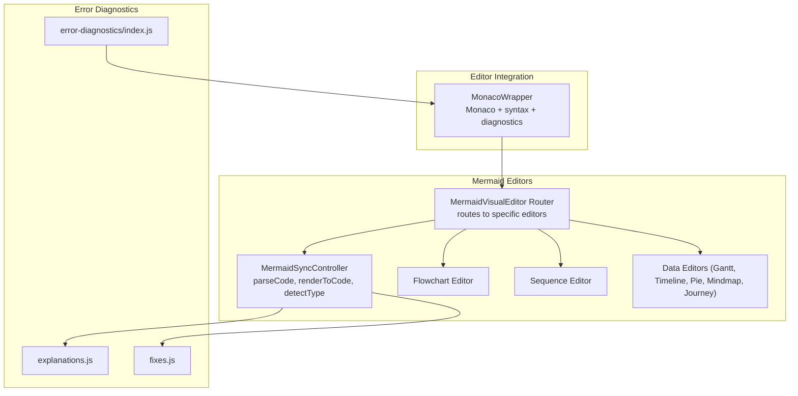
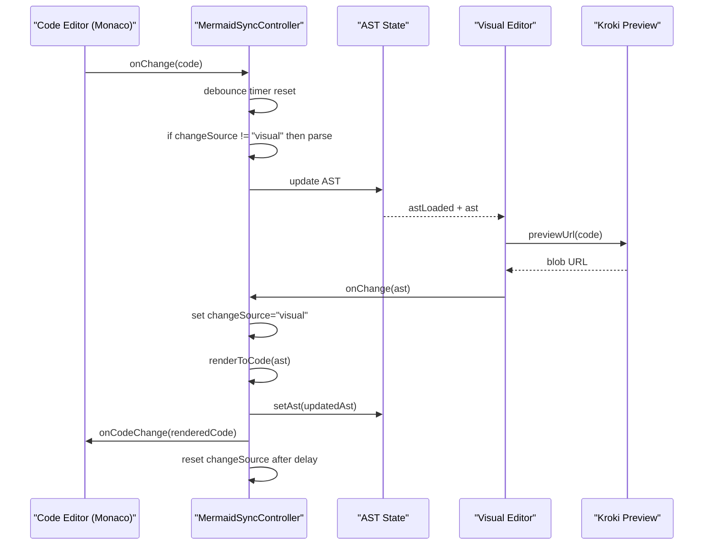
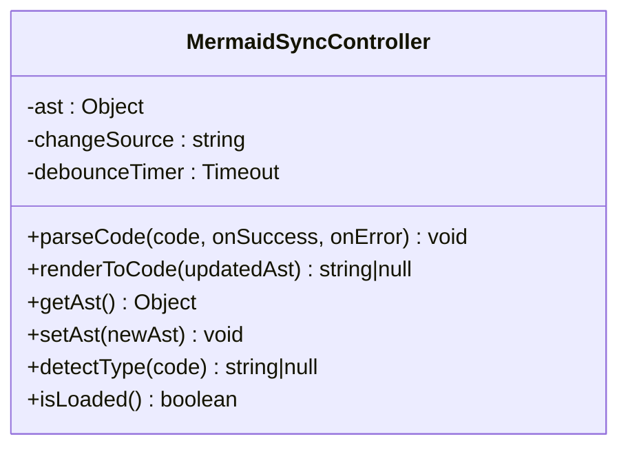
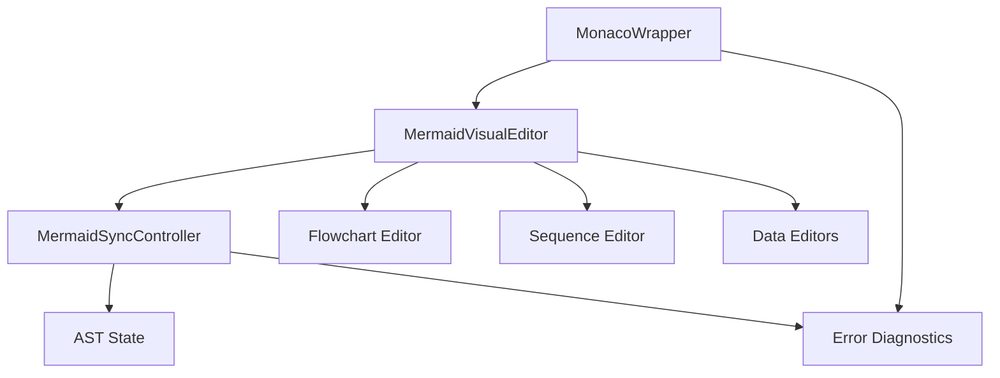
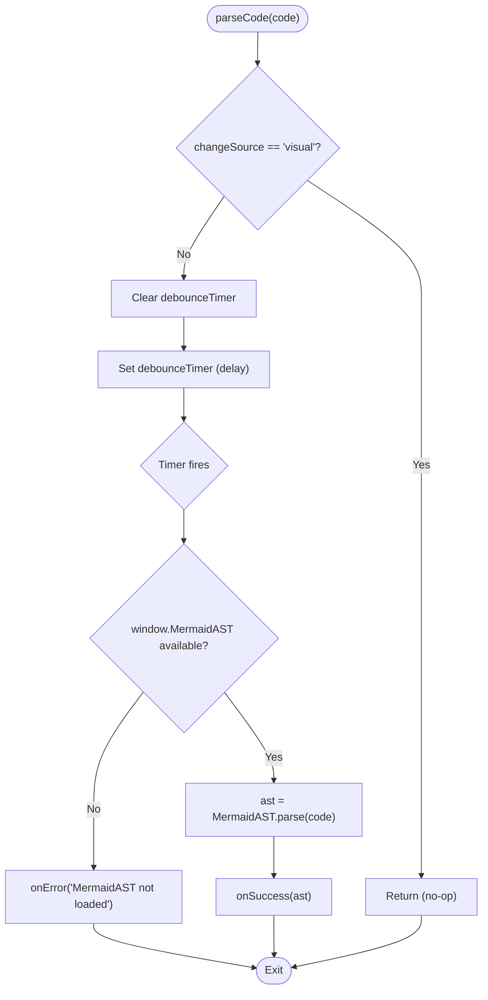

# Bi-directional Synchronization

<cite>
**Referenced Files in This Document**
- [MermaidSyncController.js](file://js/editors/mermaid/MermaidSyncController.js)
- [index.js](file://js/editors/mermaid/index.js)
- [MermaidFlowchartEditor.js](file://js/editors/mermaid/MermaidFlowchartEditor.js)
- [MermaidSequenceEditor.js](file://js/editors/mermaid/MermaidSequenceEditor.js)
- [MermaidDataEditors.js](file://js/editors/mermaid/MermaidDataEditors.js)
- [MonacoWrapper.js](file://js/components/MonacoWrapper.js)
- [explanations.js](file://js/error-diagnostics/explanations.js)
- [fixes.js](file://js/error-diagnostics/fixes.js)
- [index.js](file://js/error-diagnostics/index.js)
</cite>

## Table of Contents
1. [Introduction](#introduction)
2. [Project Structure](#project-structure)
3. [Core Components](#core-components)
4. [Architecture Overview](#architecture-overview)
5. [Detailed Component Analysis](#detailed-component-analysis)
6. [Dependency Analysis](#dependency-analysis)
7. [Performance Considerations](#performance-considerations)
8. [Troubleshooting Guide](#troubleshooting-guide)
9. [Conclusion](#conclusion)

## Introduction
This document explains the bi-directional synchronization system between code and visual editors for Mermaid diagrams. It focuses on the Mermaid AST-based synchronization mechanism, including change detection, loop prevention, debouncing, controller architecture, and the parseCode and renderToCode methods. It also covers error handling, conflict resolution, and practical scenarios for real-time synchronization.

## Project Structure
The synchronization system spans several modules:
- A controller that manages AST state, change source tracking, and debounced parsing.
- A router that selects the appropriate visual editor based on AST type.
- Editor components that convert AST to UI and back to code.
- An editor wrapper that integrates Monaco with syntax highlighting and diagnostics.
- Error diagnostics that explain and fix common syntax issues.

**Diagram sources**
- [MermaidSyncController.js](file://js/editors/mermaid/MermaidSyncController.js#L1-L93)
- [index.js](file://js/editors/mermaid/index.js#L20-L121)
- [MermaidFlowchartEditor.js](file://js/editors/mermaid/MermaidFlowchartEditor.js#L10-L276)
- [MermaidSequenceEditor.js](file://js/editors/mermaid/MermaidSequenceEditor.js#L4-L110)
- [MermaidDataEditors.js](file://js/editors/mermaid/MermaidDataEditors.js#L6-L306)
- [MonacoWrapper.js](file://js/components/MonacoWrapper.js#L13-L169)
- [explanations.js](file://js/error-diagnostics/explanations.js#L1-L302)
- [fixes.js](file://js/error-diagnostics/fixes.js#L1-L403)
- [index.js](file://js/error-diagnostics/index.js#L1-L303)

**Section sources**
- [MermaidSyncController.js](file://js/editors/mermaid/MermaidSyncController.js#L1-L93)
- [index.js](file://js/editors/mermaid/index.js#L20-L121)
- [MonacoWrapper.js](file://js/components/MonacoWrapper.js#L13-L169)
- [explanations.js](file://js/error-diagnostics/explanations.js#L1-L302)
- [fixes.js](file://js/error-diagnostics/fixes.js#L1-L403)
- [index.js](file://js/error-diagnostics/index.js#L1-L303)

## Core Components
- MermaidSyncController: central state machine for AST, change source, and debounced parsing.
- MermaidVisualEditor: routes to specific editors based on AST type.
- Editor components: transform AST into UI and back to code.
- MonacoWrapper: integrates Monaco editor with syntax and diagnostics.
- Error diagnostics: explanations and quick fixes for common errors.

Key responsibilities:
- parseCode(code, onSuccess, onError): converts code to AST (code→visual).
- renderToCode(updatedAst): converts AST back to code (visual→code).
- detectType(code): identifies diagram type for routing.
- Debounce and changeSource tracking to prevent sync loops.

**Section sources**
- [MermaidSyncController.js](file://js/editors/mermaid/MermaidSyncController.js#L9-L92)
- [index.js](file://js/editors/mermaid/index.js#L20-L121)
- [MonacoWrapper.js](file://js/components/MonacoWrapper.js#L13-L169)
- [explanations.js](file://js/error-diagnostics/explanations.js#L12-L229)
- [fixes.js](file://js/error-diagnostics/fixes.js#L11-L296)
- [index.js](file://js/error-diagnostics/index.js#L13-L145)

## Architecture Overview
The synchronization pipeline operates in two directions:
- Code→Visual: parseCode debounces incoming code, checks changeSource, and parses to AST.
- Visual→Code: renderToCode sets changeSource to visual, renders AST to code, and resets changeSource after a short delay.

**Diagram sources**
- [MermaidSyncController.js](file://js/editors/mermaid/MermaidSyncController.js#L21-L58)
- [index.js](file://js/editors/mermaid/index.js#L20-L121)
- [MermaidFlowchartEditor.js](file://js/editors/mermaid/MermaidFlowchartEditor.js#L70-L105)
- [MermaidSequenceEditor.js](file://js/editors/mermaid/MermaidSequenceEditor.js#L38-L50)
- [MonacoWrapper.js](file://js/components/MonacoWrapper.js#L134-L140)

## Detailed Component Analysis

### MermaidSyncController
The controller encapsulates:
- AST state: current parsed AST.
- changeSource: tracks origin of changes ('code' | 'visual' | null).
- debounceTimer: delays parsing to coalesce rapid edits.
- Methods:
  - parseCode(code, onSuccess, onError): debounced AST parse with changeSource guard.
  - renderToCode(updatedAst): sets changeSource='visual', renders AST to code, resets changeSource.
  - getAst/setAst: accessors for AST.
  - detectType(code): detects diagram type via MermaidAST.
  - isLoaded(): checks MermaidAST availability.

Change detection and loop prevention:
- parseCode returns early if changeSource is 'visual'.
- renderToCode sets changeSource to 'visual' and resets after a short delay to allow subsequent code changes.

Debounce implementation:
- parseCode clears and restarts a timer before parsing.
- Delay chosen to balance responsiveness and stability.

Error handling:
- parseCode catches exceptions and invokes onError with message.
- renderToCode catches exceptions, logs error, resets changeSource, and returns null.

Timing mechanisms:
- renderToCode schedules changeSource reset after a small delay to allow next code change to proceed.

Conflict resolution:
- changeSource prevents infinite loops by blocking code→visual→code cycles.
- Debounce ensures only the latest code is parsed.

**Section sources**
- [MermaidSyncController.js](file://js/editors/mermaid/MermaidSyncController.js#L9-L92)

#### Controller Class Diagram

**Diagram sources**
- [MermaidSyncController.js](file://js/editors/mermaid/MermaidSyncController.js#L9-L92)

### Visual Editor Router
The router selects the appropriate editor based on AST type:
- flowchart → MermaidFlowchartEditor
- sequence → MermaidSequenceEditor
- timeline/journey → timeline/journey editors
- gantt/pie → gantt/pie editors
- mindmap → mindmap editor
- others → MermaidGenericEditor

It also generates a preview URL from code via Kroki and handles loading states.

**Section sources**
- [index.js](file://js/editors/mermaid/index.js#L77-L121)

### Flowchart Editor
Converts AST to nodes and edges, supports inline editing of node labels, and adds nodes/edges by updating code.

Key behaviors:
- Extracts nodes and edges from AST.
- Handles node label edit via inline input and saves changes by replacing the label in code.
- Adds nodes and edges by appending new lines to code.

**Section sources**
- [MermaidFlowchartEditor.js](file://js/editors/mermaid/MermaidFlowchartEditor.js#L17-L124)

### Sequence Editor
Displays participants and messages, supports adding participants and messages by inserting lines into code.

**Section sources**
- [MermaidSequenceEditor.js](file://js/editors/mermaid/MermaidSequenceEditor.js#L8-L50)

### Data Editors (Gantt, Timeline, Pie, Mindmap, Journey)
Provide specialized UIs for data-centric diagrams:
- Timeline: extracts sections and periods.
- Gantt: extracts tasks and sections.
- Pie: extracts slices.
- Mindmap: encourages code editing for hierarchical structures.
- Journey: extracts tasks with scores and actors.

**Section sources**
- [MermaidDataEditors.js](file://js/editors/mermaid/MermaidDataEditors.js#L6-L306)

### Monaco Integration
MonacoWrapper integrates Monaco editor with:
- Language registration for Mermaid and PlantUML.
- Error providers for quick fixes and hover explanations.
- Content change handling and cursor position reporting.

Monaco emits onChange(value) which triggers synchronization.

**Section sources**
- [MonacoWrapper.js](file://js/components/MonacoWrapper.js#L13-L169)
- [MonacoWrapper.js](file://js/components/MonacoWrapper.js#L174-L303)
- [MonacoWrapper.js](file://js/components/MonacoWrapper.js#L310-L423)

### Error Diagnostics
Error diagnostics provide:
- getErrorExplanation(code, message): human-readable explanations.
- getFixSuggestions(errorText, diagramType, line): quick fixes for common errors.
- parseError(errorText, diagramType): structured error info with markers.
- toMonacoMarker/toMonacoCodeAction: Monaco-compatible error markers and actions.

These integrate with Monaco to show squiggly underlines and quick fixes.

**Section sources**
- [explanations.js](file://js/error-diagnostics/explanations.js#L12-L271)
- [fixes.js](file://js/error-diagnostics/fixes.js#L11-L366)
- [index.js](file://js/error-diagnostics/index.js#L13-L276)

## Dependency Analysis
- MermaidSyncController depends on window.MermaidAST for parsing and rendering.
- MermaidVisualEditor depends on AST type to route to the correct editor.
- Editor components depend on AST to populate UI and on code updates to persist changes.
- MonacoWrapper depends on Monaco editor APIs and error diagnostics modules.
- Error diagnostics modules are shared across editors and Monaco integration.

**Diagram sources**
- [MermaidSyncController.js](file://js/editors/mermaid/MermaidSyncController.js#L9-L92)
- [index.js](file://js/editors/mermaid/index.js#L20-L121)
- [MermaidFlowchartEditor.js](file://js/editors/mermaid/MermaidFlowchartEditor.js#L10-L276)
- [MermaidSequenceEditor.js](file://js/editors/mermaid/MermaidSequenceEditor.js#L4-L110)
- [MermaidDataEditors.js](file://js/editors/mermaid/MermaidDataEditors.js#L6-L306)
- [MonacoWrapper.js](file://js/components/MonacoWrapper.js#L13-L169)
- [explanations.js](file://js/error-diagnostics/explanations.js#L1-L302)
- [fixes.js](file://js/error-diagnostics/fixes.js#L1-L403)
- [index.js](file://js/error-diagnostics/index.js#L1-L303)

**Section sources**
- [MermaidSyncController.js](file://js/editors/mermaid/MermaidSyncController.js#L9-L92)
- [index.js](file://js/editors/mermaid/index.js#L20-L121)
- [MonacoWrapper.js](file://js/components/MonacoWrapper.js#L13-L169)
- [explanations.js](file://js/error-diagnostics/explanations.js#L1-L302)
- [fixes.js](file://js/error-diagnostics/fixes.js#L1-L403)
- [index.js](file://js/error-diagnostics/index.js#L1-L303)

## Performance Considerations
- Debounce delay: parseCode uses a fixed delay to batch rapid edits and reduce parsing overhead.
- AST caching: controller maintains AST in memory to avoid repeated parsing until new code arrives.
- ChangeSource gating: prevents redundant parsing when visual edits trigger code updates.
- Preview throttling: visual editor uses a short delay to avoid excessive preview requests.
- Monaco lazy initialization: Monaco is initialized only once and reused across sessions.

[No sources needed since this section provides general guidance]

## Troubleshooting Guide
Common synchronization issues and resolutions:
- Infinite loop between code and visual:
  - Cause: visual edits trigger code updates and vice versa.
  - Resolution: changeSource blocks parseCode when set to 'visual'; ensure renderToCode resets changeSource promptly.
- Parser not loaded:
  - Cause: window.MermaidAST unavailable.
  - Resolution: check isLoaded() and wait for library to load; onError callbacks should surface this.
- Stale preview:
  - Cause: preview URL not updated after code changes.
  - Resolution: router regenerates preview URL on code change with a short delay.
- Error markers not appearing:
  - Cause: Monaco markers not set or error diagnostics not invoked.
  - Resolution: ensure parseError and toMonacoMarker are used; Monaco provider registration is required.
- Quick fixes not offered:
  - Cause: error text does not match known patterns.
  - Resolution: extend getFixSuggestions with additional patterns or improve error extraction.

**Section sources**
- [MermaidSyncController.js](file://js/editors/mermaid/MermaidSyncController.js#L21-L58)
- [index.js](file://js/editors/mermaid/index.js#L25-L53)
- [MonacoWrapper.js](file://js/components/MonacoWrapper.js#L310-L423)
- [explanations.js](file://js/error-diagnostics/explanations.js#L237-L271)
- [fixes.js](file://js/error-diagnostics/fixes.js#L332-L366)
- [index.js](file://js/error-diagnostics/index.js#L261-L298)

## Detailed Component Analysis

### parseCode Method (Code → Visual)
Behavior:
- If changeSource is 'visual', return immediately to prevent loop.
- Clear existing debounce timer and schedule new one.
- On timeout, check MermaidAST availability; parse code to AST; call onSuccess(ast).
- On error, call onError with message.

Debounce flow:

**Diagram sources**
- [MermaidSyncController.js](file://js/editors/mermaid/MermaidSyncController.js#L21-L38)

**Section sources**
- [MermaidSyncController.js](file://js/editors/mermaid/MermaidSyncController.js#L21-L38)

### renderToCode Method (Visual → Code)
Behavior:
- Set changeSource to 'visual' and update AST.
- Attempt to render AST to code via MermaidAST.
- Reset changeSource after a short delay to allow next code change.
- On error, log and reset changeSource, returning null.

Timing and reset:
- A short delay ensures subsequent code changes are not blocked by the 'visual' flag.

**Section sources**
- [MermaidSyncController.js](file://js/editors/mermaid/MermaidSyncController.js#L45-L58)

### Editor-to-Code Updates
- Flowchart editor replaces node label text in code using multiple bracket variants.
- Sequence editor inserts participant and message lines at appropriate positions.
- Data editors append new elements to code.

These operations trigger onCodeChange, which feeds back into the sync loop.

**Section sources**
- [MermaidFlowchartEditor.js](file://js/editors/mermaid/MermaidFlowchartEditor.js#L70-L105)
- [MermaidSequenceEditor.js](file://js/editors/mermaid/MermaidSequenceEditor.js#L38-L50)
- [MermaidDataEditors.js](file://js/editors/mermaid/MermaidDataEditors.js#L44-L45)
- [MermaidDataEditors.js](file://js/editors/mermaid/MermaidDataEditors.js#L118-L119)
- [MermaidDataEditors.js](file://js/editors/mermaid/MermaidDataEditors.js#L171-L171)
- [MermaidDataEditors.js](file://js/editors/mermaid/MermaidDataEditors.js#L264-L264)
- [MermaidDataEditors.js](file://js/editors/mermaid/MermaidDataEditors.js#L30-L39)
- [MermaidDataEditors.js](file://js/editors/mermaid/MermaidDataEditors.js#L110-L113)
- [MermaidDataEditors.js](file://js/editors/mermaid/MermaidDataEditors.js#L163-L167)
- [MermaidDataEditors.js](file://js/editors/mermaid/MermaidDataEditors.js#L256-L259)
- [MermaidDataEditors.js](file://js/editors/mermaid/MermaidDataEditors.js#L30-L39)

### Error Handling and Diagnostics
- parseError extracts line/column and assigns error code.
- getErrorExplanation provides human-readable explanations.
- getFixSuggestions proposes quick fixes.
- toMonacoMarker and toMonacoCodeAction integrate with Monaco.

**Section sources**
- [index.js](file://js/error-diagnostics/index.js#L13-L145)
- [explanations.js](file://js/error-diagnostics/explanations.js#L237-L271)
- [fixes.js](file://js/error-diagnostics/fixes.js#L332-L366)
- [index.js](file://js/error-diagnostics/index.js#L261-L298)

## Dependency Analysis

**Diagram sources**
- [MermaidSyncController.js](file://js/editors/mermaid/MermaidSyncController.js#L9-L92)
- [index.js](file://js/editors/mermaid/index.js#L20-L121)
- [MermaidFlowchartEditor.js](file://js/editors/mermaid/MermaidFlowchartEditor.js#L10-L276)
- [MermaidSequenceEditor.js](file://js/editors/mermaid/MermaidSequenceEditor.js#L4-L110)
- [MermaidDataEditors.js](file://js/editors/mermaid/MermaidDataEditors.js#L6-L306)
- [MonacoWrapper.js](file://js/components/MonacoWrapper.js#L13-L169)
- [explanations.js](file://js/error-diagnostics/explanations.js#L1-L302)
- [fixes.js](file://js/error-diagnostics/fixes.js#L1-L403)
- [index.js](file://js/error-diagnostics/index.js#L1-L303)

**Section sources**
- [MermaidSyncController.js](file://js/editors/mermaid/MermaidSyncController.js#L9-L92)
- [index.js](file://js/editors/mermaid/index.js#L20-L121)
- [MonacoWrapper.js](file://js/components/MonacoWrapper.js#L13-L169)
- [explanations.js](file://js/error-diagnostics/explanations.js#L1-L302)
- [fixes.js](file://js/error-diagnostics/fixes.js#L1-L403)
- [index.js](file://js/error-diagnostics/index.js#L1-L303)

## Performance Considerations
- Debounce delay: parseCode uses a fixed delay to batch rapid edits and reduce parsing overhead.
- AST caching: controller maintains AST in memory to avoid repeated parsing until new code arrives.
- ChangeSource gating: prevents redundant parsing when visual edits trigger code updates.
- Preview throttling: visual editor uses a short delay to avoid excessive preview requests.
- Monaco lazy initialization: Monaco is initialized only once and reused across sessions.

[No sources needed since this section provides general guidance]

## Troubleshooting Guide
Common synchronization issues and resolutions:
- Infinite loop between code and visual:
  - Cause: visual edits trigger code updates and vice versa.
  - Resolution: changeSource blocks parseCode when set to 'visual'; ensure renderToCode resets changeSource promptly.
- Parser not loaded:
  - Cause: window.MermaidAST unavailable.
  - Resolution: check isLoaded() and wait for library to load; onError callbacks should surface this.
- Stale preview:
  - Cause: preview URL not updated after code changes.
  - Resolution: router regenerates preview URL on code change with a short delay.
- Error markers not appearing:
  - Cause: Monaco markers not set or error diagnostics not invoked.
  - Resolution: ensure parseError and toMonacoMarker are used; Monaco provider registration is required.
- Quick fixes not offered:
  - Cause: error text does not match known patterns.
  - Resolution: extend getFixSuggestions with additional patterns or improve error extraction.

**Section sources**
- [MermaidSyncController.js](file://js/editors/mermaid/MermaidSyncController.js#L21-L58)
- [index.js](file://js/editors/mermaid/index.js#L25-L53)
- [MonacoWrapper.js](file://js/components/MonacoWrapper.js#L310-L423)
- [explanations.js](file://js/error-diagnostics/explanations.js#L237-L271)
- [fixes.js](file://js/error-diagnostics/fixes.js#L332-L366)
- [index.js](file://js/error-diagnostics/index.js#L261-L298)

## Conclusion
The bi-directional synchronization system leverages a Mermaid AST-based controller to safely parse code into AST and render AST back to code. ChangeSource tracking and debouncing prevent infinite loops and stabilize rapid edits. The visual editor router and specialized editors provide a responsive authoring experience, while Monaco integration and error diagnostics enhance usability. Following the troubleshooting steps and performance recommendations ensures reliable real-time synchronization.