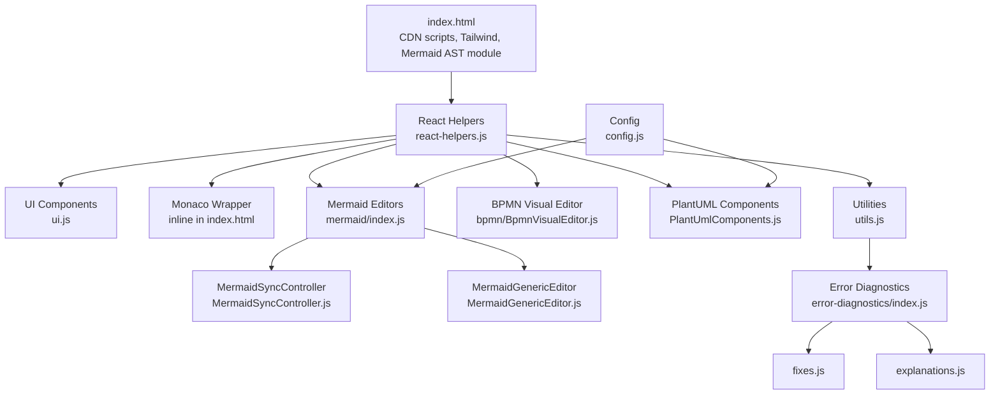
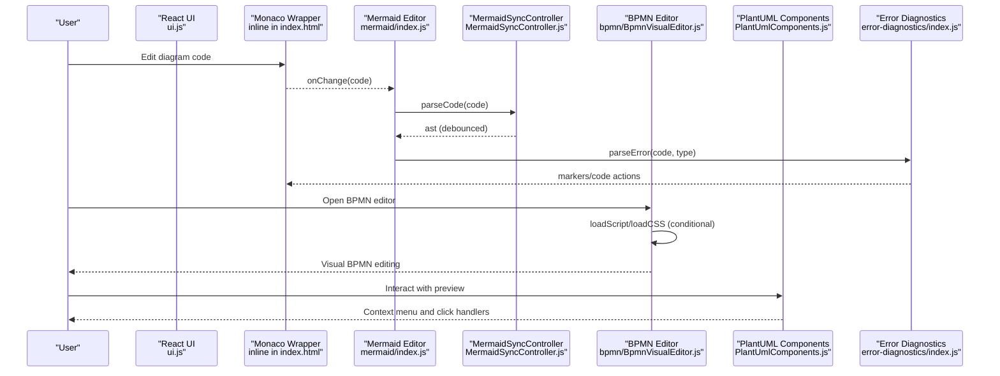
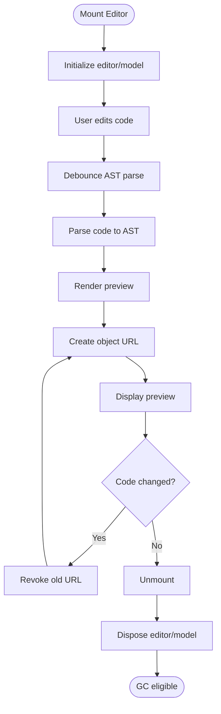
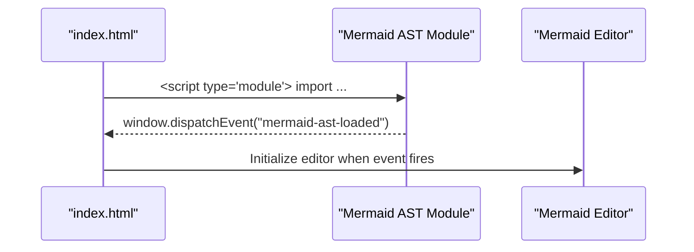
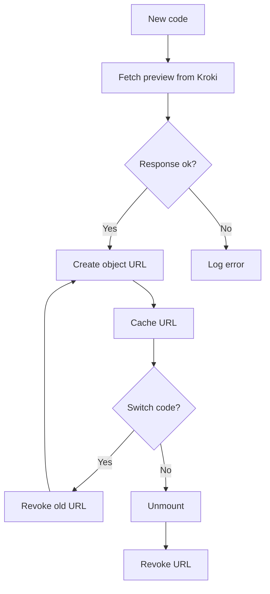
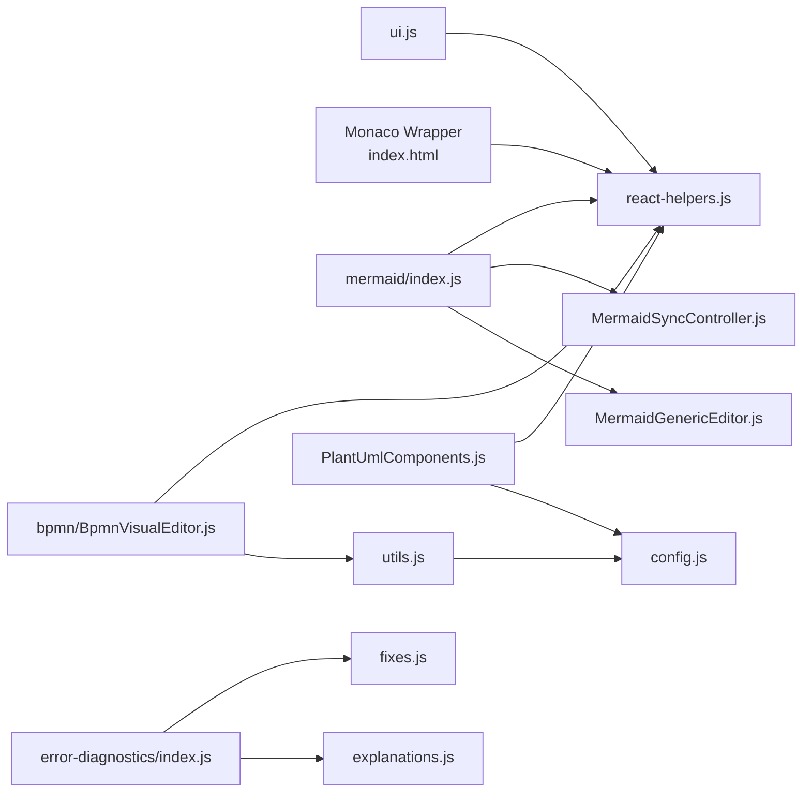

# Performance Optimization

<cite>
**Referenced Files in This Document**
- [index.html](file://index.html)
- [js/config.js](file://js/config.js)
- [js/utils.js](file://js/utils.js)
- [js/react-helpers.js](file://js/react-helpers.js)
- [js/components/ui.js](file://js/components/ui.js)
- [js/components/PlantUmlComponents.js](file://js/components/PlantUmlComponents.js)
- [js/editors/mermaid/MermaidSyncController.js](file://js/editors/mermaid/MermaidSyncController.js)
- [js/editors/mermaid/index.js](file://js/editors/mermaid/index.js)
- [js/editors/mermaid/MermaidGenericEditor.js](file://js/editors/mermaid/MermaidGenericEditor.js)
- [js/editors/bpmn/BpmnVisualEditor.js](file://js/editors/bpmn/BpmnVisualEditor.js)
- [js/error-diagnostics/index.js](file://js/error-diagnostics/index.js)
- [js/error-diagnostics/fixes.js](file://js/error-diagnostics/fixes.js)
- [js/error-diagnostics/explanations.js](file://js/error-diagnostics/explanations.js)
</cite>

## Table of Contents
1. [Introduction](#introduction)
2. [Project Structure](#project-structure)
3. [Core Components](#core-components)
4. [Architecture Overview](#architecture-overview)
5. [Detailed Component Analysis](#detailed-component-analysis)
6. [Dependency Analysis](#dependency-analysis)
7. [Performance Considerations](#performance-considerations)
8. [Troubleshooting Guide](#troubleshooting-guide)
9. [Conclusion](#conclusion)
10. [Appendices](#appendices)

## Introduction
This document focuses on performance optimization techniques and strategies for the Universal Diagram application. It covers memory management (AST cleanup, event listener cleanup, garbage collection optimization), lazy loading and CDN resource optimization, conditional loading, caching mechanisms, bundle size optimization, code splitting, dependency management, performance monitoring and profiling, bottleneck identification, browser-specific optimizations, progressive enhancement, and responsive performance tuning. Concrete implementation references are provided from the repository’s source files.

## Project Structure
The application is a single-page app with inline HTML and modular JavaScript. It uses CDN-hosted libraries for React, Monaco Editor, Mermaid AST, and other UI libraries. Editors are organized by diagram type, with shared utilities and error diagnostics.

**Diagram sources**
- [index.html](file://index.html#L1-L80)
- [js/react-helpers.js](file://js/react-helpers.js#L1-L39)
- [js/components/ui.js](file://js/components/ui.js#L1-L175)
- [js/editors/mermaid/index.js](file://js/editors/mermaid/index.js#L1-L137)
- [js/editors/mermaid/MermaidSyncController.js](file://js/editors/mermaid/MermaidSyncController.js#L1-L93)
- [js/editors/mermaid/MermaidGenericEditor.js](file://js/editors/mermaid/MermaidGenericEditor.js#L1-L101)
- [js/editors/bpmn/BpmnVisualEditor.js](file://js/editors/bpmn/BpmnVisualEditor.js#L1-L106)
- [js/components/PlantUmlComponents.js](file://js/components/PlantUmlComponents.js#L1-L249)
- [js/utils.js](file://js/utils.js#L1-L177)
- [js/error-diagnostics/index.js](file://js/error-diagnostics/index.js#L1-L303)
- [js/error-diagnostics/fixes.js](file://js/error-diagnostics/fixes.js#L1-L403)
- [js/error-diagnostics/explanations.js](file://js/error-diagnostics/explanations.js#L1-L302)
- [js/config.js](file://js/config.js#L1-L566)

**Section sources**
- [index.html](file://index.html#L1-L80)
- [js/config.js](file://js/config.js#L1-L566)

## Core Components
- CDN and asset loading: React, ReactDOM, Babel, Monaco, Mermaid AST, Tailwind, Font Awesome, Dagre, and other libraries are loaded via CDNs. This enables fast startup but requires careful resource optimization and conditional loading.
- Utilities: Compression for Kroki URLs, script/CSS loaders, debouncing, and error parsing.
- Editors:
  - Mermaid visual editor with AST synchronization and preview generation.
  - BPMN visual editor using bpmn-js with conditional loading and cleanup.
  - PlantUML components with interactive previews and context menus.
- Error diagnostics: Structured error parsing, fix suggestions, and explanations for Monaco integration.

**Section sources**
- [index.html](file://index.html#L8-L48)
- [js/utils.js](file://js/utils.js#L1-L177)
- [js/editors/mermaid/index.js](file://js/editors/mermaid/index.js#L1-L137)
- [js/editors/bpmn/BpmnVisualEditor.js](file://js/editors/bpmn/BpmnVisualEditor.js#L1-L106)
- [js/components/PlantUmlComponents.js](file://js/components/PlantUmlComponents.js#L1-L249)
- [js/error-diagnostics/index.js](file://js/error-diagnostics/index.js#L1-L303)

## Architecture Overview
The runtime architecture centers on:
- Inline HTML with CDN scripts for rapid bootstrapping.
- React helpers binding to global React for JSX-like templating without a bundler.
- Editor components that lazily load external libraries and manage lifecycle.
- Error diagnostics integrated with Monaco for immediate feedback.

**Diagram sources**
- [index.html](file://index.html#L597-L727)
- [js/editors/mermaid/index.js](file://js/editors/mermaid/index.js#L20-L121)
- [js/editors/mermaid/MermaidSyncController.js](file://js/editors/mermaid/MermaidSyncController.js#L9-L92)
- [js/editors/bpmn/BpmnVisualEditor.js](file://js/editors/bpmn/BpmnVisualEditor.js#L14-L90)
- [js/components/PlantUmlComponents.js](file://js/components/PlantUmlComponents.js#L153-L248)
- [js/error-diagnostics/index.js](file://js/error-diagnostics/index.js#L13-L44)

## Detailed Component Analysis

### Memory Management and Garbage Collection Optimization
Key areas for memory optimization:
- Monaco editor lifecycle: dispose on unmount to release DOM and worker resources.
- Mermaid preview object URLs: revoke on unmount and when switching diagrams to prevent memory leaks.
- BPMN modeler lifecycle: destroy on unmount to free DOM and event listeners.
- Debounced AST parsing: cancel timers to avoid stale closures and redundant work.
- Event listeners for SVG elements: attach/remove listeners carefully to prevent leaks.

**Diagram sources**
- [index.html](file://index.html#L700-L712)
- [js/editors/mermaid/index.js](file://js/editors/mermaid/index.js#L55-L60)
- [js/editors/bpmn/BpmnVisualEditor.js](file://js/editors/bpmn/BpmnVisualEditor.js#L71-L75)
- [js/editors/mermaid/MermaidSyncController.js](file://js/editors/mermaid/MermaidSyncController.js#L25-L37)

**Section sources**
- [index.html](file://index.html#L700-L712)
- [js/editors/mermaid/index.js](file://js/editors/mermaid/index.js#L55-L60)
- [js/editors/bpmn/BpmnVisualEditor.js](file://js/editors/bpmn/BpmnVisualEditor.js#L71-L75)
- [js/editors/mermaid/MermaidSyncController.js](file://js/editors/mermaid/MermaidSyncController.js#L25-L37)

### Lazy Loading Strategies and Conditional Loading
- Mermaid AST module is loaded via an ES module script tag and dispatched as a DOM event. This defers heavy parsing until the module is ready.
- External libraries are conditionally loaded:
  - loadScript checks for existing script tags before injecting.
  - loadCSS avoids duplicate link injection.
- BPMN editor loads CSS and modeler only when needed.

**Diagram sources**
- [index.html](file://index.html#L53-L59)
- [js/editors/mermaid/index.js](file://js/editors/mermaid/index.js#L63-L72)

**Section sources**
- [index.html](file://index.html#L53-L59)
- [js/utils.js](file://js/utils.js#L116-L146)
- [js/utils.js](file://js/utils.js#L152-L158)
- [js/editors/bpmn/BpmnVisualEditor.js](file://js/editors/bpmn/BpmnVisualEditor.js#L19-L30)

### Caching Mechanisms
- Preview caching: Mermaid preview URLs are cached per code snapshot and revoked when replaced or unmounted.
- Object URL lifecycle: URL.revokeObjectURL is used to release memory for blob previews.
- Template and snippet caches: Config-driven arrays are reused across sessions.

**Diagram sources**
- [js/editors/mermaid/index.js](file://js/editors/mermaid/index.js#L32-L53)
- [js/editors/mermaid/index.js](file://js/editors/mermaid/index.js#L55-L60)

**Section sources**
- [js/editors/mermaid/index.js](file://js/editors/mermaid/index.js#L32-L53)
- [js/editors/mermaid/index.js](file://js/editors/mermaid/index.js#L55-L60)
- [js/config.js](file://js/config.js#L118-L192)
- [js/config.js](file://js/config.js#L194-L565)

### Bundle Size Optimization and Code Splitting
Current implementation:
- Single HTML entry with CDN scripts and inline React helpers.
- Modular JavaScript files for editors and utilities.
- No explicit bundling or tree-shaking; performance relies on CDN caching and selective loading.

Recommendations:
- Split Mermaid AST and editor bundles behind feature flags.
- Use dynamic imports for diagram-specific editors to reduce initial payload.
- Enable gzip/HTTP/2 push for frequently used assets.

[No sources needed since this section provides general guidance]

### Dependency Management
- External dependencies are loaded via CDNs; ensure version pinning and integrity checks.
- Internal dependencies are explicit via ES modules and named exports.

**Section sources**
- [index.html](file://index.html#L8-L48)
- [js/react-helpers.js](file://js/react-helpers.js#L4-L38)
- [js/utils.js](file://js/utils.js#L2-L2)

### Performance Monitoring and Profiling
- Monaco markers and hover providers surface errors immediately; integrate with performance budgets to avoid excessive re-renders.
- Debounce AST parsing to limit CPU usage during rapid typing.
- Monitor preview generation latency and cache misses.

**Section sources**
- [index.html](file://index.html#L474-L509)
- [js/editors/mermaid/MermaidSyncController.js](file://js/editors/mermaid/MermaidSyncController.js#L25-L37)
- [js/editors/mermaid/index.js](file://js/editors/mermaid/index.js#L32-L53)

### Browser-Specific Optimizations and Progressive Enhancement
- Tailwind is loaded via CDN; ensure fallbacks for older browsers.
- Use feature detection for Mermaid AST and Monaco before initializing editors.
- Progressive enhancement: start with code view, then enable visual editors when dependencies are ready.

**Section sources**
- [index.html](file://index.html#L30-L45)
- [index.html](file://index.html#L53-L59)
- [js/editors/mermaid/index.js](file://js/editors/mermaid/index.js#L63-L72)

### Responsive Performance Tuning
- Minimap and line highlighting in Monaco can impact performance on large documents; keep editor options minimal by default.
- Debounce preview generation to balance responsiveness and accuracy.

**Section sources**
- [index.html](file://index.html#L686-L695)
- [js/editors/mermaid/index.js](file://js/editors/mermaid/index.js#L51-L53)

## Dependency Analysis
The system exhibits low coupling between components, with clear separation of concerns:
- UI components depend on shared helpers.
- Editors depend on utilities for loading and debouncing.
- Error diagnostics are decoupled and reusable.

**Diagram sources**
- [js/components/ui.js](file://js/components/ui.js#L1-L175)
- [js/react-helpers.js](file://js/react-helpers.js#L1-L39)
- [js/editors/mermaid/index.js](file://js/editors/mermaid/index.js#L1-L137)
- [js/editors/mermaid/MermaidSyncController.js](file://js/editors/mermaid/MermaidSyncController.js#L1-L93)
- [js/editors/mermaid/MermaidGenericEditor.js](file://js/editors/mermaid/MermaidGenericEditor.js#L1-L101)
- [js/editors/bpmn/BpmnVisualEditor.js](file://js/editors/bpmn/BpmnVisualEditor.js#L1-L106)
- [js/components/PlantUmlComponents.js](file://js/components/PlantUmlComponents.js#L1-L249)
- [js/config.js](file://js/config.js#L1-L566)
- [js/utils.js](file://js/utils.js#L1-L177)
- [js/error-diagnostics/index.js](file://js/error-diagnostics/index.js#L1-L303)
- [js/error-diagnostics/fixes.js](file://js/error-diagnostics/fixes.js#L1-L403)
- [js/error-diagnostics/explanations.js](file://js/error-diagnostics/explanations.js#L1-L302)

**Section sources**
- [js/editors/mermaid/index.js](file://js/editors/mermaid/index.js#L1-L137)
- [js/editors/mermaid/MermaidSyncController.js](file://js/editors/mermaid/MermaidSyncController.js#L1-L93)
- [js/editors/bpmn/BpmnVisualEditor.js](file://js/editors/bpmn/BpmnVisualEditor.js#L1-L106)
- [js/components/PlantUmlComponents.js](file://js/components/PlantUmlComponents.js#L1-L249)
- [js/error-diagnostics/index.js](file://js/error-diagnostics/index.js#L1-L303)

## Performance Considerations
- CDN caching: Pin versions and leverage long-lived cache headers for static assets.
- Lazy initialization: Defer heavy libraries until user interaction or editor activation.
- Debouncing: Limit frequent operations like AST parsing and preview generation.
- Lifecycle hooks: Dispose editors and revoke object URLs promptly.
- Error diagnostics: Avoid expensive computations in hot paths; cache parsed results.

[No sources needed since this section provides general guidance]

## Troubleshooting Guide
- Preview not updating: Ensure preview URL is revoked and re-created on code changes.
- Editor not disposing: Verify unmount effects dispose Monaco and BPMN modeler instances.
- Memory leaks: Check for retained references to DOM nodes or event listeners.
- Error markers not appearing: Confirm Monaco provider registration and event dispatch for Mermaid AST.

**Section sources**
- [js/editors/mermaid/index.js](file://js/editors/mermaid/index.js#L55-L60)
- [index.html](file://index.html#L700-L712)
- [js/editors/bpmn/BpmnVisualEditor.js](file://js/editors/bpmn/BpmnVisualEditor.js#L71-L75)
- [index.html](file://index.html#L474-L509)

## Conclusion
The application achieves fast startup via CDN scripts and inline React helpers, with modular editors enabling incremental loading. Performance hinges on disciplined memory management (dispose/dispose, revoke object URLs), debounced operations, and careful lifecycle handling. Future enhancements can include dynamic imports, CDN integrity checks, and structured performance monitoring to sustain responsiveness as features expand.

[No sources needed since this section summarizes without analyzing specific files]

## Appendices
- Practical examples of optimization implementations:
  - Use loadScript/loadCSS guards to avoid duplicate injections.
  - Revoke object URLs before replacing or unmounting.
  - Debounce AST parsing and preview generation.
  - Destroy editors and modelers on unmount.

[No sources needed since this section provides general guidance]