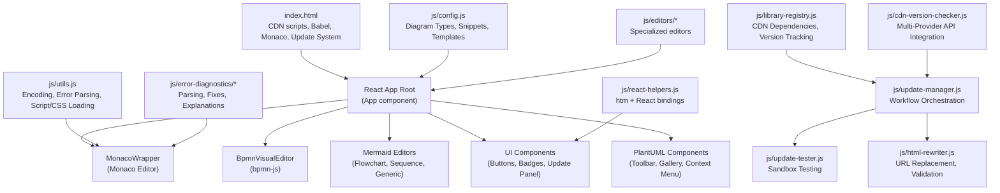
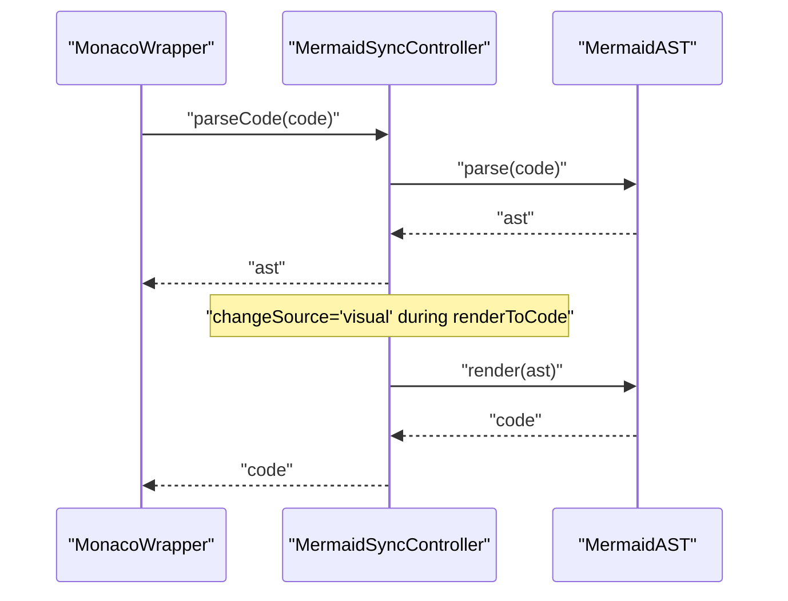
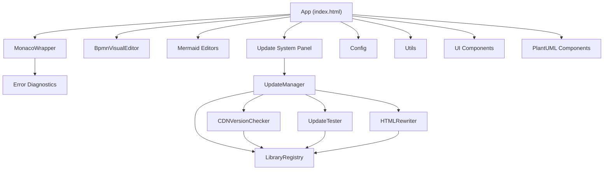

# Technical Implementations

<cite>
**Referenced Files in This Document**
- [index.html](file://index.html)
- [js/utils.js](file://js/utils.js)
- [js/react-helpers.js](file://js/react-helpers.js)
- [js/components/MonacoWrapper.js](file://js/components/MonacoWrapper.js)
- [js/config.js](file://js/config.js)
- [js/error-diagnostics/index.js](file://js/error-diagnostics/index.js)
- [js/error-diagnostics/explanations.js](file://js/error-diagnostics/explanations.js)
- [js/error-diagnostics/fixes.js](file://js/error-diagnostics/fixes.js)
- [js/components/PlantUmlComponents.js](file://js/components/PlantUmlComponents.js)
- [js/components/ui.js](file://js/components/ui.js)
- [js/editors/bpmn/BpmnVisualEditor.js](file://js/editors/bpmn/BpmnVisualEditor.js)
- [js/editors/mermaid/MermaidFlowchartEditor.js](file://js/editors/mermaid/MermaidFlowchartEditor.js)
- [js/editors/mermaid/MermaidSequenceEditor.js](file://js/editors/mermaid/MermaidSequenceEditor.js)
- [js/editors/mermaid/MermaidGenericEditor.js](file://js/editors/mermaid/MermaidGenericEditor.js)
- [js/editors/mermaid/MermaidSyncController.js](file://js/editors/mermaid/MermaidSyncController.js)
- [js/library-registry.js](file://js/library-registry.js)
- [js/cdn-version-checker.js](file://js/cdn-version-checker.js)
- [js/update-manager.js](file://js/update-manager.js)
- [js/update-tester.js](file://js/update-tester.js)
- [js/html-rewriter.js](file://js/html-rewriter.js)
</cite>

## Update Summary
**Changes Made**
- Added comprehensive library update management system documentation
- Documented new library registry with CDN version tracking
- Added CDN version checker with multi-provider API integration
- Documented update manager with state management and workflow orchestration
- Added update tester with iframe-based sandbox testing
- Documented HTML rewriter with URL pattern matching and validation
- Integrated update system into main application UI with React components

## Table of Contents
1. [Introduction](#introduction)
2. [Project Structure](#project-structure)
3. [Core Components](#core-components)
4. [Architecture Overview](#architecture-overview)
5. [Detailed Component Analysis](#detailed-component-analysis)
6. [Library Update Management System](#library-update-management-system)
7. [Dependency Analysis](#dependency-analysis)
8. [Performance Considerations](#performance-considerations)
9. [Troubleshooting Guide](#troubleshooting-guide)
10. [Conclusion](#conclusion)

## Introduction
This document explains the advanced technical implementations and architectural patterns used in the Universal Diagram Editor. It covers the utility function architecture (encoding/decoding, error handling, cross-platform compatibility), React helper utilities for DOM/event/lifecycle management, the Monaco wrapper implementation (syntax highlighting, error markers, custom languages), integration patterns for external libraries and CDNs, configuration and plugin/extensibility points, advanced JavaScript patterns, asynchronous programming, state management strategies, and the new comprehensive library update management system.

## Project Structure
The application is a single-page React application with a hybrid module approach:
- The main HTML loads React, ReactDOM, Babel, Monaco, and other libraries via CDN.
- Core logic is split into modular JS files under js/ for utilities, React helpers, Monaco wrapper, configuration, error diagnostics, specialized editors, and the new library update management system.
- The main application is bootstrapped inside a Babel-enabled script tag in index.html.
- The library update system is integrated as an ES module with a dedicated UI panel.

**Diagram sources**
- [index.html](file://index.html#L1-L80)
- [js/utils.js](file://js/utils.js#L1-L177)
- [js/config.js](file://js/config.js#L1-L566)
- [js/react-helpers.js](file://js/react-helpers.js#L1-L39)
- [js/components/MonacoWrapper.js](file://js/components/MonacoWrapper.js#L1-L426)
- [js/editors/bpmn/BpmnVisualEditor.js](file://js/editors/bpmn/BpmnVisualEditor.js#L1-L106)
- [js/editors/mermaid/MermaidFlowchartEditor.js](file://js/editors/mermaid/MermaidFlowchartEditor.js#L1-L276)
- [js/editors/mermaid/MermaidSequenceEditor.js](file://js/editors/mermaid/MermaidSequenceEditor.js#L1-L110)
- [js/editors/mermaid/MermaidGenericEditor.js](file://js/editors/mermaid/MermaidGenericEditor.js#L1-L101)
- [js/library-registry.js](file://js/library-registry.js#L1-L409)
- [js/update-manager.js](file://js/update-manager.js#L1-L343)
- [js/update-tester.js](file://js/update-tester.js#L1-L505)
- [js/html-rewriter.js](file://js/html-rewriter.js#L1-L274)
- [js/cdn-version-checker.js](file://js/cdn-version-checker.js#L1-L270)

**Section sources**
- [index.html](file://index.html#L1-L120)
- [js/config.js](file://js/config.js#L1-L120)

## Core Components
- Utility functions: Encoding (Kroki URL-safe base64), MIME/type detection, error extraction, regex escaping, dynamic script/CSS loading, debouncing.
- React helpers: htm-based JSX-like syntax bound to React globals loaded from CDN.
- Monaco wrapper: AMD-configured Monaco editor with custom PlantUML/Mermaid Monarch tokens, error providers, and imperative methods.
- Error diagnostics: Parser for extracting line/column, categorization, and conversion to Monaco markers; fix suggestions and explanations.
- Configuration: Central registry of diagram types, language mappings, snippets, and templates.
- Specialized editors: BPMN visual editor (bpmn-js), Mermaid editors (flowchart, sequence, generic), and UI components.
- **New**: Library update management system: Centralized dependency tracking, CDN version checking, automated testing, and HTML rewriting.

**Section sources**
- [js/utils.js](file://js/utils.js#L1-L177)
- [js/react-helpers.js](file://js/react-helpers.js#L1-L39)
- [js/components/MonacoWrapper.js](file://js/components/MonacoWrapper.js#L1-L170)
- [js/error-diagnostics/index.js](file://js/error-diagnostics/index.js#L1-L303)
- [js/error-diagnostics/explanations.js](file://js/error-diagnostics/explanations.js#L1-L302)
- [js/error-diagnostics/fixes.js](file://js/error-diagnostics/fixes.js#L1-L403)
- [js/config.js](file://js/config.js#L1-L120)
- [js/editors/bpmn/BpmnVisualEditor.js](file://js/editors/bpmn/BpmnVisualEditor.js#L1-L106)
- [js/editors/mermaid/MermaidFlowchartEditor.js](file://js/editors/mermaid/MermaidFlowchartEditor.js#L1-L276)
- [js/editors/mermaid/MermaidSequenceEditor.js](file://js/editors/mermaid/MermaidSequenceEditor.js#L1-L110)
- [js/editors/mermaid/MermaidGenericEditor.js](file://js/editors/mermaid/MermaidGenericEditor.js#L1-L101)
- [js/library-registry.js](file://js/library-registry.js#L1-L409)
- [js/update-manager.js](file://js/update-manager.js#L1-L343)
- [js/update-tester.js](file://js/update-tester.js#L1-L505)
- [js/html-rewriter.js](file://js/html-rewriter.js#L1-L274)
- [js/cdn-version-checker.js](file://js/cdn-version-checker.js#L1-L270)

## Architecture Overview
High-level architecture:
- Frontend: React + Monaco + specialized editors.
- External integrations: CDN-hosted libraries (React, Monaco, bpmn-js, Mermaid AST), Kroki backend for rendering.
- Data flow: Code changes trigger debounced preview generation; errors are parsed and surfaced via Monaco markers and hover explanations; visual editors update code and vice versa via a sync controller.
- **New**: Update system: Automated dependency version tracking, testing, and HTML rewriting with sandboxed validation.

**Diagram sources**
- [index.html](file://index.html#L2200-L2237)
- [js/update-manager.js](file://js/update-manager.js#L63-L98)
- [js/cdn-version-checker.js](file://js/cdn-version-checker.js#L191-L214)
- [js/update-tester.js](file://js/update-tester.js#L398-L444)
- [js/html-rewriter.js](file://js/html-rewriter.js#L66-L99)

## Detailed Component Analysis

### Utility Function Architecture
- Encoding/Decoding: Converts text to bytes, compresses with pako, base64-encodes, and URL-safes the result for Kroki URLs.
- Type Detection: Infers diagram type from file extension and content.
- Error Extraction: Parses line/column from various error formats.
- Regex Escaping: Safe construction of RegExp from user-provided strings.
- Dynamic Loading: Loads external scripts/CSS avoiding AMD conflicts; deduplicates existing resources.
- Debounce: Throttles expensive operations (e.g., Mermaid AST parsing).

**Diagram sources**
- [js/utils.js](file://js/utils.js#L14-L85)
- [js/error-diagnostics/index.js](file://js/error-diagnostics/index.js#L13-L145)
- [js/error-diagnostics/explanations.js](file://js/error-diagnostics/explanations.js#L237-L271)

**Section sources**
- [js/utils.js](file://js/utils.js#L1-L177)
- [js/error-diagnostics/index.js](file://js/error-diagnostics/index.js#L1-L303)
- [js/error-diagnostics/explanations.js](file://js/error-diagnostics/explanations.js#L1-L302)
- [js/error-diagnostics/fixes.js](file://js/error-diagnostics/fixes.js#L1-L403)

### React Helper Utilities
- Uses htm to enable JSX-like syntax without a bundler, binding to globally loaded React.
- Exports React hooks and html tagged template for consistent component creation.
- Enables zero-build development while maintaining modern React patterns.

**Diagram sources**
- [js/react-helpers.js](file://js/react-helpers.js#L1-L39)
- [index.html](file://index.html#L8-L13)

**Section sources**
- [js/react-helpers.js](file://js/react-helpers.js#L1-L39)

### Monaco Wrapper Implementation
Key capabilities:
- AMD configuration for Monaco loader.
- Registers PlantUML and Mermaid Monarch grammars with keywords, operators, and tokenizer rules.
- Registers error providers: CodeActionProvider for quick fixes and HoverProvider for explanations.
- Exposes imperative methods: setValue, insertAtCursor, setMarkers, clearMarkers, scrollToLine, getModel, getMonaco.
- Synchronizes language and value changes; clears decorations on content change.

**Diagram sources**
- [js/components/MonacoWrapper.js](file://js/components/MonacoWrapper.js#L13-L169)
- [js/components/MonacoWrapper.js](file://js/components/MonacoWrapper.js#L309-L423)

**Section sources**
- [js/components/MonacoWrapper.js](file://js/components/MonacoWrapper.js#L1-L426)

### Error Diagnostics System
- Parsing: Extracts line/column from error text using diagram-type-aware patterns; categorizes errors and assigns codes.
- Conversion: Translates parsed errors into Monaco markers and code actions.
- Explanations: Human-readable explanations with examples and documentation links.
- Fixes: Automated quick fixes with auto-edit ranges; handles special EOF marker positions.

**Diagram sources**
- [js/error-diagnostics/index.js](file://js/error-diagnostics/index.js#L13-L276)
- [js/error-diagnostics/explanations.js](file://js/error-diagnostics/explanations.js#L237-L299)
- [js/error-diagnostics/fixes.js](file://js/error-diagnostics/fixes.js#L332-L366)

**Section sources**
- [js/error-diagnostics/index.js](file://js/error-diagnostics/index.js#L1-L303)
- [js/error-diagnostics/explanations.js](file://js/error-diagnostics/explanations.js#L1-L302)
- [js/error-diagnostics/fixes.js](file://js/error-diagnostics/fixes.js#L1-L403)

### Configuration and Plugin Architecture
- Central configuration defines diagram types, extensions, Monaco language mappings, docs links, and example templates.
- Snippets and templates are organized per diagram type for quick insertion and onboarding.
- Extensibility: Adding a new diagram type requires updating the configuration and registering a Monaco language/provider if needed.

**Diagram sources**
- [js/config.js](file://js/config.js#L6-L116)
- [js/config.js](file://js/config.js#L118-L192)
- [js/config.js](file://js/config.js#L194-L566)

**Section sources**
- [js/config.js](file://js/config.js#L1-L566)

### Advanced JavaScript Patterns and Asynchronous Programming
- Debouncing: Used for Mermaid AST parsing to avoid excessive re-renders.
- Promise-based dynamic loading: Ensures AMD compatibility and avoids conflicts.
- Controlled state updates: Change-source flag prevents feedback loops between code and visual editors.
- Event-driven editors: Monaco emits change/cursor events; bpmn-js emits command stack changes.

**Diagram sources**
- [js/editors/mermaid/MermaidSyncController.js](file://js/editors/mermaid/MermaidSyncController.js#L9-L93)
- [index.html](file://index.html#L532-L557)

**Section sources**
- [js/utils.js](file://js/utils.js#L165-L177)
- [js/editors/mermaid/MermaidSyncController.js](file://js/editors/mermaid/MermaidSyncController.js#L1-L93)
- [index.html](file://index.html#L532-L557)

### State Management Strategies
- Local React state: App manages diagram type, detected model, text input, preview URL, stats, loading, errors, cursor position, view mode, and template modal visibility.
- Editor refs: Imperative methods on MonacoWrapper coordinate with App state.
- Visual editor state: BPMN visual editor maintains internal modeler state and syncs XML back to code.
- **New**: Update system state: UpdateManager maintains available updates, test results, and loading states with subscription-based notifications.

**Diagram sources**
- [index.html](file://index.html#L1398-L1751)
- [js/editors/bpmn/BpmnVisualEditor.js](file://js/editors/bpmn/BpmnVisualEditor.js#L14-L91)
- [js/update-manager.js](file://js/update-manager.js#L23-L58)

**Section sources**
- [index.html](file://index.html#L1398-L1751)
- [js/editors/bpmn/BpmnVisualEditor.js](file://js/editors/bpmn/BpmnVisualEditor.js#L1-L106)
- [js/update-manager.js](file://js/update-manager.js#L1-L343)

### Integration Patterns for External Libraries and CDNs
- React and ReactDOM loaded from CDN; Babel standalone enables JSX without build step.
- Monaco AMD loader configured to load from CDN; language providers registered post-load.
- bpmn-js dynamically loaded and initialized; CSS assets injected.
- Mermaid AST loaded as an ES module; event-driven readiness.
- Pako for zlib compression used in encoding.
- **New**: Library update system integrates with CDN APIs for version checking and automated updates.

**Diagram sources**
- [index.html](file://index.html#L8-L59)
- [js/utils.js](file://js/utils.js#L116-L158)
- [js/editors/bpmn/BpmnVisualEditor.js](file://js/editors/bpmn/BpmnVisualEditor.js#L20-L30)
- [js/library-registry.js](file://js/library-registry.js#L16-L228)

**Section sources**
- [index.html](file://index.html#L1-L80)
- [js/utils.js](file://js/utils.js#L116-L158)
- [js/editors/bpmn/BpmnVisualEditor.js](file://js/editors/bpmn/BpmnVisualEditor.js#L1-L106)
- [js/library-registry.js](file://js/library-registry.js#L1-L409)

### React Helpers, DOM Manipulation, and Lifecycle
- DOM manipulation: Components use refs to attach to containers and inject SVG content for interactive previews.
- Event handling: Click, contextmenu, drag-and-drop handlers; controlled input for inline editing.
- Lifecycle: Effects manage initialization, cleanup, and synchronization; debouncing prevents thrashing.

**Diagram sources**
- [js/components/PlantUmlComponents.js](file://js/components/PlantUmlComponents.js#L153-L214)

**Section sources**
- [js/components/PlantUmlComponents.js](file://js/components/PlantUmlComponents.js#L1-L249)
- [js/components/ui.js](file://js/components/ui.js#L1-L175)

### Specialized Editors
- BPMN Visual Editor: Dynamically loads bpmn-js, initializes modeler, listens for changes, and imports XML.
- Mermaid Editors: Dedicated editors for flowchart, sequence, pie, gantt, timeline, journey, mindmap; generic fallback with AST explorer.
- Mermaid Sync Controller: Debounces parsing, prevents sync loops, and renders AST back to code.

**Diagram sources**
- [js/editors/bpmn/BpmnVisualEditor.js](file://js/editors/bpmn/BpmnVisualEditor.js#L14-L91)
- [js/editors/mermaid/MermaidFlowchartEditor.js](file://js/editors/mermaid/MermaidFlowchartEditor.js#L10-L59)
- [js/editors/mermaid/MermaidSequenceEditor.js](file://js/editors/mermaid/MermaidSequenceEditor.js#L4-L36)
- [js/editors/mermaid/MermaidGenericEditor.js](file://js/editors/mermaid/MermaidGenericEditor.js#L11-L97)
- [js/editors/mermaid/MermaidSyncController.js](file://js/editors/mermaid/MermaidSyncController.js#L9-L93)

**Section sources**
- [js/editors/bpmn/BpmnVisualEditor.js](file://js/editors/bpmn/BpmnVisualEditor.js#L1-L106)
- [js/editors/mermaid/MermaidFlowchartEditor.js](file://js/editors/mermaid/MermaidFlowchartEditor.js#L1-L276)
- [js/editors/mermaid/MermaidSequenceEditor.js](file://js/editors/mermaid/MermaidSequenceEditor.js#L1-L110)
- [js/editors/mermaid/MermaidGenericEditor.js](file://js/editors/mermaid/MermaidGenericEditor.js#L1-L101)
- [js/editors/mermaid/MermaidSyncController.js](file://js/editors/mermaid/MermaidSyncController.js#L1-L93)

## Library Update Management System

### Library Registry
The library registry serves as the central configuration hub for all CDN dependencies, providing version tracking, URL patterns, and testing configurations.

**Key Features:**
- Multi-CDN support: Unpkg, CDNJS, ESM.sh, JSR, and Tailwind CSS
- Version tracking: Current versions and URL patterns for automatic updates
- Testing configurations: Complex libraries with CSS requirements and import maps
- Linked versions: React and ReactDOM versions synchronized automatically
- Skip version checks: Libraries using 'latest' tags or special cases

**Section sources**
- [js/library-registry.js](file://js/library-registry.js#L1-L409)

### CDN Version Checker
Integrates with multiple CDN APIs to fetch the latest versions of libraries with intelligent caching and error handling.

**Supported Providers:**
- **Unpkg**: Package.json endpoint for npm packages
- **CDNJS**: Official API with version field
- **ESM.sh**: Mirrors npm packages through npm registry
- **JSR**: jsr.io package metadata
- **Tailwind**: Special case - CDN always serves latest

**Features:**
- 5-minute cache TTL for performance optimization
- Semantic version comparison
- Major version detection
- Changelog URL generation

**Section sources**
- [js/cdn-version-checker.js](file://js/cdn-version-checker.js#L1-L270)

### Update Manager
Orchestrates the complete library update workflow with state management, testing, and HTML rewriting.

**Core Workflow:**
1. **Check for Updates**: Parse current HTML, fetch latest versions, filter available updates
2. **Test Updates**: Validate URLs and test in sandboxed iframe
3. **Apply Updates**: Rewrite HTML, validate, and generate download
4. **State Management**: Reactive updates with subscription pattern

**State Management:**
- Available updates with selection state
- Test results with pass/fail status
- Loading states for checking/testing
- History tracking with localStorage persistence
- Ignored updates to prevent repeated notifications

**Section sources**
- [js/update-manager.js](file://js/update-manager.js#L1-L343)

### Update Tester
Provides comprehensive sandboxed testing for library updates using iframe isolation and visual validation.

**Testing Capabilities:**
- **URL Validation**: HEAD requests to verify accessibility
- **Import Map Testing**: Complex libraries like Excalidraw with external dependencies
- **Visual Rendering**: Libraries that require DOM rendering for validation
- **Timeout Handling**: 20-second timeout for test completion
- **Result Aggregation**: Detailed pass/fail reports with error messages

**Supported Libraries:**
- **Excalidraw**: Complex ESM module with React dependencies and CSS requirements
- **BPMN-JS**: Visual modeler testing with diagram instantiation
- **Monaco Editor**: AMD loader and editor initialization
- **React/ReactDOM**: Basic rendering validation
- **Pako**: Compression functionality verification
- **Dagre**: Graph library validation
- **Babel**: Transpilation capability testing

**Section sources**
- [js/update-tester.js](file://js/update-tester.js#L1-L505)

### HTML Rewriter
Handles precise URL replacement in HTML with pattern matching and validation.

**URL Pattern Matching:**
- **Unpkg**: `@version/` pattern in package@version/ paths
- **CDNJS**: `/package/version/` pattern in library paths  
- **ESM.sh**: `@version` pattern at end of package names

**Features:**
- Regex-based pattern matching with escape handling
- Multiple URL replacement per library
- Change tracking with detailed summaries
- HTML validation before download
- Blob-based file download generation

**Section sources**
- [js/html-rewriter.js](file://js/html-rewriter.js#L1-L274)

### Integration with Main Application
The update system is seamlessly integrated into the main application with a dedicated UI panel and React component.

**Integration Points:**
- ES module import in index.html with global exposure
- React component with subscription-based state updates
- Modal interface with progress indicators and results display
- Error handling with user-friendly messaging
- Download workflow with generated HTML files

**Section sources**
- [index.html](file://index.html#L117-L132)
- [index.html](file://index.html#L2200-L2397)

## Dependency Analysis
- Internal dependencies:
  - MonacoWrapper depends on React helpers, error diagnostics, and config for language mapping.
  - App orchestrates MonacoWrapper, visual editors, and diagnostics.
  - Specialized editors depend on shared UI components and utils.
  - **New**: Update system components depend on each other in a coordinated workflow.
- External dependencies:
  - CDN-hosted React, ReactDOM, Babel, Monaco, bpmn-js, Mermaid AST, Pako.
  - **New**: CDN APIs for version checking (unpkg, cdnjs, npm registry, jsr.io).
  - **New**: Third-party services for library testing and validation.

**Diagram sources**
- [index.html](file://index.html#L1398-L1751)
- [js/components/MonacoWrapper.js](file://js/components/MonacoWrapper.js#L1-L426)
- [js/editors/bpmn/BpmnVisualEditor.js](file://js/editors/bpmn/BpmnVisualEditor.js#L1-L106)
- [js/editors/mermaid/MermaidFlowchartEditor.js](file://js/editors/mermaid/MermaidFlowchartEditor.js#L1-L276)
- [js/error-diagnostics/index.js](file://js/error-diagnostics/index.js#L1-L303)
- [js/config.js](file://js/config.js#L1-L566)
- [js/utils.js](file://js/utils.js#L1-L177)
- [js/components/ui.js](file://js/components/ui.js#L1-L175)
- [js/components/PlantUmlComponents.js](file://js/components/PlantUmlComponents.js#L1-L249)
- [js/update-manager.js](file://js/update-manager.js#L1-L343)
- [js/cdn-version-checker.js](file://js/cdn-version-checker.js#L1-L270)
- [js/update-tester.js](file://js/update-tester.js#L1-L505)
- [js/html-rewriter.js](file://js/html-rewriter.js#L1-L274)
- [js/library-registry.js](file://js/library-registry.js#L1-L409)

**Section sources**
- [index.html](file://index.html#L1398-L1751)
- [js/components/MonacoWrapper.js](file://js/components/MonacoWrapper.js#L1-L426)
- [js/editors/bpmn/BpmnVisualEditor.js](file://js/editors/bpmn/BpmnVisualEditor.js#L1-L106)
- [js/editors/mermaid/MermaidFlowchartEditor.js](file://js/editors/mermaid/MermaidFlowchartEditor.js#L1-L276)
- [js/error-diagnostics/index.js](file://js/error-diagnostics/index.js#L1-L303)
- [js/config.js](file://js/config.js#L1-L566)
- [js/utils.js](file://js/utils.js#L1-L177)
- [js/components/ui.js](file://js/components/ui.js#L1-L175)
- [js/components/PlantUmlComponents.js](file://js/components/PlantUmlComponents.js#L1-L249)
- [js/update-manager.js](file://js/update-manager.js#L1-L343)
- [js/cdn-version-checker.js](file://js/cdn-version-checker.js#L1-L270)
- [js/update-tester.js](file://js/update-tester.js#L1-L505)
- [js/html-rewriter.js](file://js/html-rewriter.js#L1-L274)
- [js/library-registry.js](file://js/library-registry.js#L1-L409)

## Performance Considerations
- Debouncing: Applied to Mermaid AST parsing and preview fetching to reduce network and CPU usage.
- Lazy loading: Visual editors and libraries are loaded on demand to minimize initial payload.
- Efficient Monaco updates: Imperative setValue and deltaDecorations used to avoid full re-renders.
- CDN caching: Leveraging CDN-hosted libraries improves load times and reduces bandwidth.
- **New**: Update system caching: 5-minute TTL for version checks to minimize API calls.
- **New**: Sandbox testing: Isolated iframe testing prevents DOM pollution and improves reliability.
- **New**: Incremental HTML rewriting: Only modified URLs are replaced, reducing processing overhead.

## Troubleshooting Guide
- Monaco AMD conflicts: Dynamic script loader temporarily removes window.define to avoid conflicts; restores it on load/error.
- Error markers: If markers do not appear, verify diagram type mapping and ensure error providers are registered.
- Visual editor failures: Check console logs for bpmn-js load errors; ensure CORS allows external CSS/JS.
- Encoding issues: If preview fails, confirm encodeKroki returns a non-empty string and URL length does not exceed GET limits.
- **New**: Update system failures: Check browser console for update system errors; verify CDN accessibility for version checking.
- **New**: Test failures: Review test results in update panel; check sandbox iframe for rendering errors.
- **New**: HTML rewrite issues: Verify generated HTML validates; check for blocked downloads or security restrictions.

**Section sources**
- [js/utils.js](file://js/utils.js#L116-L146)
- [js/components/MonacoWrapper.js](file://js/components/MonacoWrapper.js#L309-L423)
- [js/editors/bpmn/BpmnVisualEditor.js](file://js/editors/bpmn/BpmnVisualEditor.js#L63-L75)
- [js/update-manager.js](file://js/update-manager.js#L94-L97)
- [js/update-tester.js](file://js/update-tester.js#L427-L438)

## Conclusion
The Universal Diagram Editor combines a CDN-first architecture with modular React components and a powerful Monaco-based editor. Its error diagnostics system, dynamic loading utilities, and specialized editors deliver a robust authoring experience across multiple diagram types. The new comprehensive library update management system represents a significant architectural enhancement, providing automated dependency version tracking, sandboxed testing, and safe HTML rewriting capabilities. This system ensures the application stays current with library updates while maintaining stability and preventing breaking changes through comprehensive validation and testing workflows. The design emphasizes extensibility (configuration-driven), maintainability (modular JS), and usability (imperative editor APIs, quick fixes, and hover explanations), now augmented with automated dependency management for long-term sustainability.