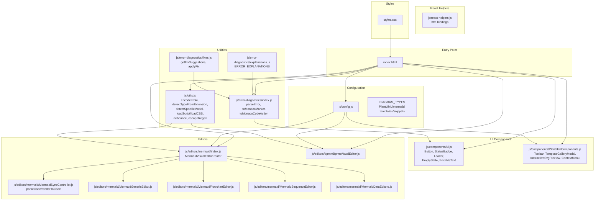
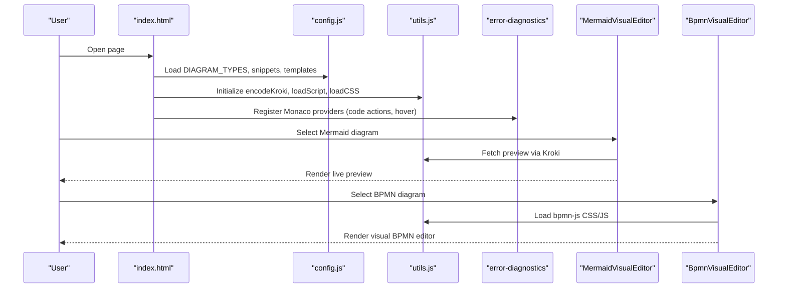
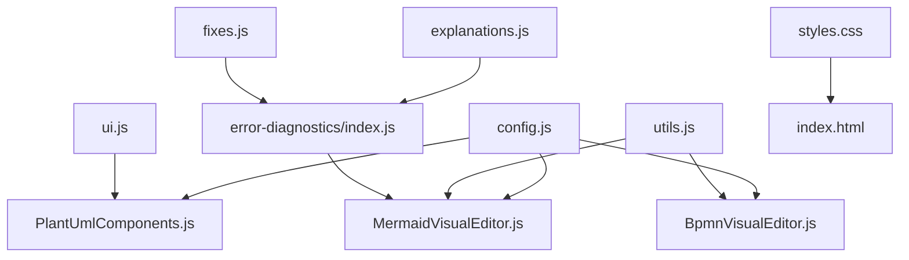
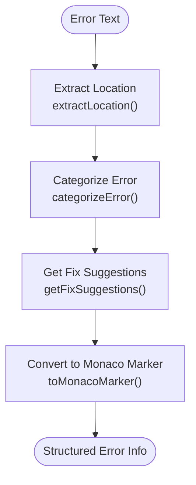

# Configuration and Customization

<cite>
**Referenced Files in This Document**
- [config.js](file://js/config.js)
- [index.html](file://index.html)
- [utils.js](file://js/utils.js)
- [react-helpers.js](file://js/react-helpers.js)
- [MermaidSyncController.js](file://js/editors/mermaid/MermaidSyncController.js)
- [MermaidVisualEditor.js](file://js/editors/mermaid/index.js)
- [MermaidGenericEditor.js](file://js/editors/mermaid/MermaidGenericEditor.js)
- [MermaidFlowchartEditor.js](file://js/editors/mermaid/MermaidFlowchartEditor.js)
- [MermaidSequenceEditor.js](file://js/editors/mermaid/MermaidSequenceEditor.js)
- [MermaidDataEditors.js](file://js/editors/mermaid/MermaidDataEditors.js)
- [BpmnVisualEditor.js](file://js/editors/bpmn/BpmnVisualEditor.js)
- [error-diagnostics/index.js](file://js/error-diagnostics/index.js)
- [error-diagnostics/explanations.js](file://js/error-diagnostics/explanations.js)
- [error-diagnostics/fixes.js](file://js/error-diagnostics/fixes.js)
- [PlantUmlComponents.js](file://js/components/PlantUmlComponents.js)
- [ui.js](file://js/components/ui.js)
- [styles.css](file://styles.css)
</cite>

## Table of Contents
1. [Introduction](#introduction)
2. [Project Structure](#project-structure)
3. [Core Components](#core-components)
4. [Architecture Overview](#architecture-overview)
5. [Detailed Component Analysis](#detailed-component-analysis)
6. [Dependency Analysis](#dependency-analysis)
7. [Performance Considerations](#performance-considerations)
8. [Troubleshooting Guide](#troubleshooting-guide)
9. [Conclusion](#conclusion)
10. [Appendices](#appendices)

## Introduction
This document explains how to configure and customize the Universal Diagram application. It covers:
- Diagram type configuration and how to add new diagram types
- Language configuration for editors and syntax highlighting
- Template registration and snippet systems
- Extension management for external libraries and services
- Application settings for themes, styling, editor preferences, and export behavior
- Runtime configuration changes and dependency injection patterns
- Utility functions for encoding, compression, and external service integration
- Practical examples for extending the app, customizing the UI, and integrating additional services
- Best practices, performance tips, and troubleshooting common configuration issues

## Project Structure
The application is a single-page React-based editor that supports multiple diagramming languages. Configuration is centralized in shared modules and HTML, with modular editor components and utilities.

**Diagram sources**
- [index.html](file://index.html#L60-L371)
- [config.js](file://js/config.js#L1-L566)
- [utils.js](file://js/utils.js#L1-L177)
- [error-diagnostics/index.js](file://js/error-diagnostics/index.js#L1-L303)
- [error-diagnostics/explanations.js](file://js/error-diagnostics/explanations.js#L1-L302)
- [error-diagnostics/fixes.js](file://js/error-diagnostics/fixes.js#L1-L403)
- [react-helpers.js](file://js/react-helpers.js#L1-L39)
- [MermaidVisualEditor.js](file://js/editors/mermaid/index.js#L1-L137)
- [MermaidSyncController.js](file://js/editors/mermaid/MermaidSyncController.js#L1-L93)
- [MermaidGenericEditor.js](file://js/editors/mermaid/MermaidGenericEditor.js#L1-L101)
- [MermaidFlowchartEditor.js](file://js/editors/mermaid/MermaidFlowchartEditor.js#L1-L276)
- [MermaidSequenceEditor.js](file://js/editors/mermaid/MermaidSequenceEditor.js#L1-L110)
- [MermaidDataEditors.js](file://js/editors/mermaid/MermaidDataEditors.js#L1-L306)
- [BpmnVisualEditor.js](file://js/editors/bpmn/BpmnVisualEditor.js#L1-L106)
- [PlantUmlComponents.js](file://js/components/PlantUmlComponents.js#L1-L249)
- [ui.js](file://js/components/ui.js#L1-L175)
- [styles.css](file://styles.css#L1-L370)

**Section sources**
- [index.html](file://index.html#L1-L120)
- [config.js](file://js/config.js#L1-L116)
- [utils.js](file://js/utils.js#L1-L177)
- [error-diagnostics/index.js](file://js/error-diagnostics/index.js#L1-L303)
- [error-diagnostics/explanations.js](file://js/error-diagnostics/explanations.js#L1-L302)
- [error-diagnostics/fixes.js](file://js/error-diagnostics/fixes.js#L1-L403)
- [react-helpers.js](file://js/react-helpers.js#L1-L39)
- [MermaidVisualEditor.js](file://js/editors/mermaid/index.js#L1-L137)
- [MermaidSyncController.js](file://js/editors/mermaid/MermaidSyncController.js#L1-L93)
- [MermaidGenericEditor.js](file://js/editors/mermaid/MermaidGenericEditor.js#L1-L101)
- [MermaidFlowchartEditor.js](file://js/editors/mermaid/MermaidFlowchartEditor.js#L1-L276)
- [MermaidSequenceEditor.js](file://js/editors/mermaid/MermaidSequenceEditor.js#L1-L110)
- [MermaidDataEditors.js](file://js/editors/mermaid/MermaidDataEditors.js#L1-L306)
- [BpmnVisualEditor.js](file://js/editors/bpmn/BpmnVisualEditor.js#L1-L106)
- [PlantUmlComponents.js](file://js/components/PlantUmlComponents.js#L1-L249)
- [ui.js](file://js/components/ui.js#L1-L175)
- [styles.css](file://styles.css#L1-L370)

## Core Components
- Diagram type registry: Centralized configuration of supported diagram types, extensions, language IDs, documentation links, and example content.
- Editor routing: A Mermaid visual editor router that selects the appropriate specialized editor based on AST type.
- Error diagnostics: Structured error parsing, categorization, suggestions, and Monaco integration.
- Utilities: Encoding, compression, detection helpers, external script/CSS loaders, debouncing, and regex escaping.
- UI components: Reusable buttons, badges, loaders, editable text, and section headers.
- PlantUML components: Snippet toolbar, template gallery, interactive SVG preview, and context menus.
- Styling: Tailwind-based theme overrides and component-specific styles.

**Section sources**
- [config.js](file://js/config.js#L6-L116)
- [MermaidVisualEditor.js](file://js/editors/mermaid/index.js#L20-L121)
- [error-diagnostics/index.js](file://js/error-diagnostics/index.js#L13-L44)
- [utils.js](file://js/utils.js#L14-L85)
- [ui.js](file://js/components/ui.js#L16-L175)
- [PlantUmlComponents.js](file://js/components/PlantUmlComponents.js#L8-L249)
- [styles.css](file://styles.css#L1-L370)

## Architecture Overview
The application uses a modular architecture:
- Configuration is declared in a central module and optionally duplicated in the HTML for inline demos.
- Utilities encapsulate cross-cutting concerns (encoding, detection, external loading).
- Editors are composed of small, focused components with clear responsibilities.
- Error diagnostics integrate with Monaco to provide actionable feedback.
- Styling leverages Tailwind with targeted overrides.

**Diagram sources**
- [index.html](file://index.html#L60-L520)
- [config.js](file://js/config.js#L60-L116)
- [utils.js](file://js/utils.js#L14-L146)
- [error-diagnostics/index.js](file://js/error-diagnostics/index.js#L474-L509)
- [MermaidVisualEditor.js](file://js/editors/mermaid/index.js#L24-L60)
- [BpmnVisualEditor.js](file://js/editors/bpmn/BpmnVisualEditor.js#L19-L75)

## Detailed Component Analysis

### Diagram Type Configuration System
The diagram type configuration defines:
- Keys for diagram families (e.g., mermaid, plantuml, bpmn)
- Display label, supported file extensions, Monaco language ID, documentation link
- Example content for quick start
- Special flags (e.g., hasVisualEditor for BPMN)
- Subtypes detection for Mermaid and PlantUML/C4

Key responsibilities:
- Adding a new diagram family: Extend the registry with label, extensions, monacoLang, docs, and example.
- Enabling visual editor: Set hasVisualEditor for families supporting visual editing.
- Subtype detection: Use detection helpers to infer subtype from code content.

Practical steps to add a new diagram type:
- Define metadata in the registry (extensions, monacoLang, docs, example).
- If a visual editor exists, wire it into the routing or create a new editor component.
- Register Monaco language tokens if needed.
- Optionally add subtype detection logic.

**Section sources**
- [config.js](file://js/config.js#L6-L116)
- [utils.js](file://js/utils.js#L35-L85)
- [index.html](file://index.html#L70-L87)

### Language Configuration and Syntax Highlighting
Monaco language registration and token providers are set up per diagram type:
- PlantUML and Mermaid languages are registered with Monarch tokenizers.
- Error providers and hover providers are registered for these languages.
- The Monaco wrapper sets language dynamically and applies theme and editor options.

Customization points:
- Add new language registrations by registering the language and tokenizer.
- Extend error providers for new languages.
- Adjust Monaco options (theme, fonts, minimap, etc.) in the wrapper.

**Section sources**
- [index.html](file://index.html#L654-L724)
- [utils.js](file://js/utils.js#L474-L509)

### Template Registration and Snippet Systems
Template and snippet systems enable rapid authoring:
- PlantUML templates: A gallery of ready-to-use diagrams with icons and descriptions.
- PlantUML snippets: Per-model snippet collections for quick insertion.
- Mermaid templates: A curated set of Mermaid diagram templates.

Customization points:
- Add new PlantUML templates by extending the template array with id, label, icon, description, and code.
- Add new snippet groups by adding entries to the snippet map under appropriate model keys.
- Extend Mermaid templates similarly for Mermaid diagrams.

**Section sources**
- [config.js](file://js/config.js#L118-L192)
- [config.js](file://js/config.js#L194-L565)
- [PlantUmlComponents.js](file://js/components/PlantUmlComponents.js#L52-L95)

### Extension Management
External libraries and services are loaded dynamically:
- External scripts: loadScript handles AMD conflict mitigation and caching.
- External CSS: loadCSS prevents duplicate link tags.
- Visual editors: BPMN editor loads bpmn-js CSS and JS on demand.
- Preview generation: Mermaid editor fetches SVG previews from Kroki.

Best practices:
- Check for existing resources before loading.
- Handle load failures gracefully.
- Revoke object URLs to avoid memory leaks.

**Section sources**
- [utils.js](file://js/utils.js#L116-L158)
- [BpmnVisualEditor.js](file://js/editors/bpmn/BpmnVisualEditor.js#L22-L66)
- [MermaidVisualEditor.js](file://js/editors/mermaid/index.js#L32-L60)

### Application Settings and UI Customization
Theme and styling options:
- Tailwind configuration extends colors and monospace font family.
- Component-specific CSS overrides for Monaco, BPMN, interactive SVG, and layout elements.
- Reusable UI components provide consistent styling and behavior.

Editor preferences:
- Monaco wrapper exposes theme, language, and editor options.
- Visual editors support preview toggles and loading states.

Export settings:
- Encoding and compression pipeline uses pako for URL-safe base64 encoding.
- Preview fetching uses Kroki endpoints for rendering.

**Section sources**
- [index.html](file://index.html#L32-L45)
- [styles.css](file://styles.css#L1-L370)
- [utils.js](file://js/utils.js#L14-L28)
- [MermaidVisualEditor.js](file://js/editors/mermaid/index.js#L32-L60)

### Configuration Object Structure
The configuration object structure includes:
- DIAGRAM_TYPES: keyed by diagram family with label, extensions, monacoLang, docs, hasVisualEditor, example.
- PLANTUML_TEMPLATES: array of template objects with id, label, icon, description, code.
- PLANTUML_SNIPPETS: grouped snippet arrays by diagram model.
- MERMAID_TEMPLATES: Mermaid templates.
- MERMAID_SNIPPETS: Mermaid snippets.

These structures are consumed by:
- Editor routing and subtype detection
- Template galleries and snippet toolbars
- Error diagnostics and explanations

**Section sources**
- [config.js](file://js/config.js#L6-L116)
- [config.js](file://js/config.js#L118-L565)
- [index.html](file://index.html#L70-L371)

### Dependency Injection Patterns
The application uses minimal dependency injection:
- React helpers bind htm to React.createElement for JSX-like syntax.
- Monaco is globally available after loader initialization.
- Utilities are imported and used directly by components.

Where to inject:
- Replace Monaco provider registration with a factory if needed.
- Wrap utilities in factories for testability.
- Pass configuration objects as props to components for decoupling.

**Section sources**
- [react-helpers.js](file://js/react-helpers.js#L4-L38)
- [index.html](file://index.html#L649-L724)

### Runtime Configuration Changes
Runtime behaviors:
- Monaco language switching via model.setLanguage.
- Preview URL updates trigger re-renders.
- Visual editor readiness gates prevent inconsistent states.
- Debounce timers manage expensive operations (e.g., AST parsing).

How to change:
- Update Monaco language dynamically by passing language prop.
- Modify debounce timing for AST parsing or preview generation.
- Toggle visual editor availability based on feature flags.

**Section sources**
- [index.html](file://index.html#L721-L724)
- [MermaidSyncController.js](file://js/editors/mermaid/MermaidSyncController.js#L21-L58)
- [MermaidVisualEditor.js](file://js/editors/mermaid/index.js#L24-L60)

### Utility Functions: Encoding, Compression, and External Services
Encoding and compression:
- textToBytes converts text to Uint8Array.
- encodeKroki compresses with pako, base64 encodes, and URL-safes the result.

External services:
- loadScript and loadCSS load external resources safely.
- debounced operations reduce unnecessary computations.
- escapeRegex prepares strings for RegExp.

Integration examples:
- Use encodeKroki to prepare source for Kroki endpoints.
- Use loadScript to initialize third-party libraries.
- Use debounce to optimize frequent updates.

**Section sources**
- [utils.js](file://js/utils.js#L7-L28)
- [utils.js](file://js/utils.js#L116-L176)
- [index.html](file://index.html#L378-L387)

### Practical Examples

#### Example 1: Extending with a New Diagram Format
Steps:
- Add a new entry to DIAGRAM_TYPES with label, extensions, monacoLang, docs, and example.
- If visual editing is needed, create or wire a visual editor component.
- Register Monaco language tokens if the language is not already supported.
- Optionally add subtype detection logic in detectSpecificModel.

Outcome:
- Users can select the new format, open files with supported extensions, and use syntax highlighting.

**Section sources**
- [config.js](file://js/config.js#L6-L116)
- [utils.js](file://js/utils.js#L35-L85)
- [index.html](file://index.html#L654-L681)

#### Example 2: Customizing the User Interface
Steps:
- Extend Tailwind theme colors and fonts in the HTML head.
- Override component-specific styles in styles.css.
- Use reusable UI components (Button, StatusBadge, EditableText) for consistency.

Outcome:
- Consistent look-and-feel across editors and dialogs.

**Section sources**
- [index.html](file://index.html#L32-L45)
- [styles.css](file://styles.css#L1-L370)
- [ui.js](file://js/components/ui.js#L16-L175)

#### Example 3: Integrating Additional External Services
Steps:
- Use loadScript to load external libraries.
- Use loadCSS to inject styles.
- Implement a fetch-based preview mechanism similar to Mermaid’s.

Outcome:
- Seamless integration of new rendering engines or tools.

**Section sources**
- [utils.js](file://js/utils.js#L116-L158)
- [MermaidVisualEditor.js](file://js/editors/mermaid/index.js#L32-L60)

## Dependency Analysis
The following diagram shows key dependencies among modules:

**Diagram sources**
- [config.js](file://js/config.js#L6-L116)
- [PlantUmlComponents.js](file://js/components/PlantUmlComponents.js#L1-L249)
- [MermaidVisualEditor.js](file://js/editors/mermaid/index.js#L1-L137)
- [BpmnVisualEditor.js](file://js/editors/bpmn/BpmnVisualEditor.js#L1-L106)
- [utils.js](file://js/utils.js#L1-L177)
- [error-diagnostics/index.js](file://js/error-diagnostics/index.js#L1-L303)
- [error-diagnostics/explanations.js](file://js/error-diagnostics/explanations.js#L1-L302)
- [error-diagnostics/fixes.js](file://js/error-diagnostics/fixes.js#L1-L403)
- [ui.js](file://js/components/ui.js#L1-L175)
- [styles.css](file://styles.css#L1-L370)
- [index.html](file://index.html#L1-L120)

**Section sources**
- [config.js](file://js/config.js#L6-L116)
- [utils.js](file://js/utils.js#L1-L177)
- [error-diagnostics/index.js](file://js/error-diagnostics/index.js#L1-L303)
- [error-diagnostics/explanations.js](file://js/error-diagnostics/explanations.js#L1-L302)
- [error-diagnostics/fixes.js](file://js/error-diagnostics/fixes.js#L1-L403)
- [PlantUmlComponents.js](file://js/components/PlantUmlComponents.js#L1-L249)
- [ui.js](file://js/components/ui.js#L1-L175)
- [styles.css](file://styles.css#L1-L370)
- [index.html](file://index.html#L1-L120)

## Performance Considerations
- Debounce expensive operations: Use debounce for preview generation and AST parsing.
- Lazy loading: Load external libraries only when needed (e.g., bpmn-js, Mermaid AST).
- Memory management: Revoke object URLs and dispose editors to prevent leaks.
- Minimize re-renders: Keep configuration immutable and pass only necessary props.
- Compression: Use pako compression for efficient URL encoding of diagram sources.

[No sources needed since this section provides general guidance]

## Troubleshooting Guide
Common configuration issues and resolutions:
- Missing @startuml/@enduml: Use fix suggestions to add missing directives.
- Unclosed brackets/parentheses: Apply bracket fixes or rely on Monaco quick fixes.
- Unknown diagram type: Insert a diagram declaration (e.g., flowchart TD).
- XML parsing errors (BPMN): Ensure all tags are closed and attributes are quoted.
- External library load failures: Check network connectivity and script URLs.

Diagnostic workflow:
- Parse error text into structured information.
- Extract line/column and categorize error.
- Provide fix suggestions and explanations.
- Register Monaco code actions and hover providers.

**Section sources**
- [error-diagnostics/index.js](file://js/error-diagnostics/index.js#L13-L44)
- [error-diagnostics/index.js](file://js/error-diagnostics/index.js#L52-L145)
- [error-diagnostics/index.js](file://js/error-diagnostics/index.js#L261-L276)
- [error-diagnostics/fixes.js](file://js/error-diagnostics/fixes.js#L332-L366)
- [error-diagnostics/explanations.js](file://js/error-diagnostics/explanations.js#L237-L271)
- [index.html](file://index.html#L474-L509)

## Conclusion
The Universal Diagram application provides a flexible configuration and customization framework:
- Centralized diagram type configuration enables easy addition of new formats.
- Modular editor components and utilities support robust runtime behavior.
- Error diagnostics and Monaco integration improve developer experience.
- Styling and UI components ensure a consistent, customizable appearance.
Adhering to the patterns and best practices outlined here will help you extend the application effectively and maintain high performance and reliability.

[No sources needed since this section summarizes without analyzing specific files]

## Appendices

### Appendix A: Configuration Object Reference
- DIAGRAM_TYPES: keys map to diagram families with label, extensions, monacoLang, docs, hasVisualEditor, example.
- PLANTUML_TEMPLATES: array of template objects with id, label, icon, description, code.
- PLANTUML_SNIPPETS: grouped snippet arrays by diagram model.
- MERMAID_TEMPLATES: Mermaid templates.
- MERMAID_SNIPPETS: Mermaid snippets.

**Section sources**
- [config.js](file://js/config.js#L6-L116)
- [config.js](file://js/config.js#L118-L565)
- [index.html](file://index.html#L70-L371)

### Appendix B: Error Parsing Flow

**Diagram sources**
- [error-diagnostics/index.js](file://js/error-diagnostics/index.js#L52-L145)
- [error-diagnostics/index.js](file://js/error-diagnostics/index.js#L153-L254)
- [error-diagnostics/index.js](file://js/error-diagnostics/index.js#L261-L276)
- [error-diagnostics/fixes.js](file://js/error-diagnostics/fixes.js#L332-L366)