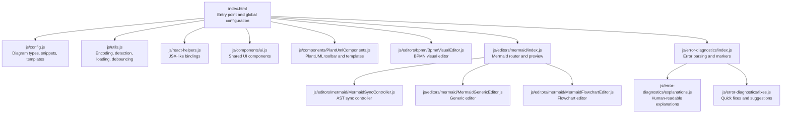
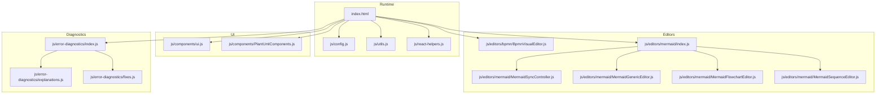
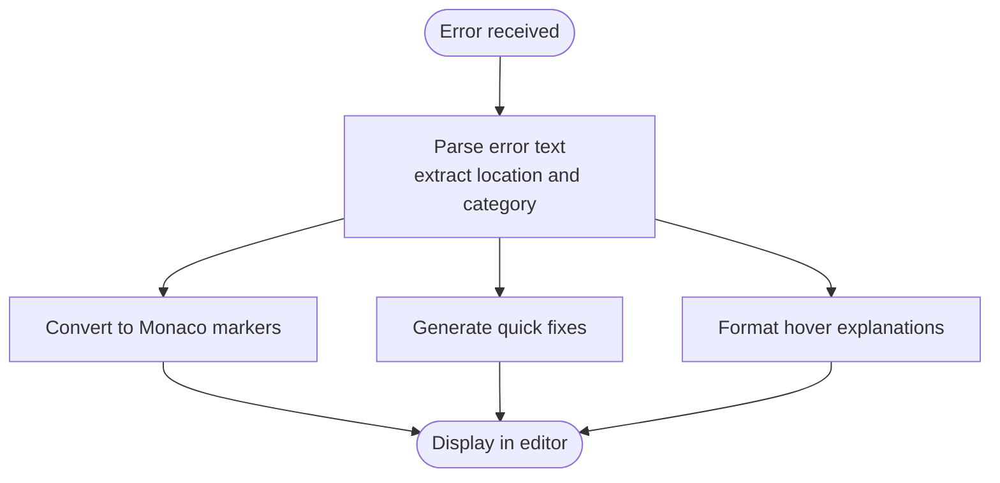

# Development and Contributing

<cite>
**Referenced Files in This Document**
- [RULES.md](file://RULES.md)
- [index.html](file://index.html)
- [js/config.js](file://js/config.js)
- [js/utils.js](file://js/utils.js)
- [js/react-helpers.js](file://js/react-helpers.js)
- [js/components/ui.js](file://js/components/ui.js)
- [js/components/PlantUmlComponents.js](file://js/components/PlantUmlComponents.js)
- [js/editors/bpmn/BpmnVisualEditor.js](file://js/editors/bpmn/BpmnVisualEditor.js)
- [js/editors/mermaid/index.js](file://js/editors/mermaid/index.js)
- [js/editors/mermaid/MermaidSyncController.js](file://js/editors/mermaid/MermaidSyncController.js)
- [js/editors/mermaid/MermaidGenericEditor.js](file://js/editors/mermaid/MermaidGenericEditor.js)
- [js/editors/mermaid/MermaidFlowchartEditor.js](file://js/editors/mermaid/MermaidFlowchartEditor.js)
- [js/error-diagnostics/index.js](file://js/error-diagnostics/index.js)
- [js/error-diagnostics/explanations.js](file://js/error-diagnostics/explanations.js)
- [js/error-diagnostics/fixes.js](file://js/error-diagnostics/fixes.js)
</cite>

## Update Summary
**Changes Made**
- Added comprehensive Project Rules section based on RULES.md
- Enhanced development workflow documentation with Repowiki maintenance requirements
- Updated contribution guidelines with mandatory documentation review process
- Added new section on maintaining Repowiki documentation alongside code changes
- Integrated Repowiki structure guidance for documentation organization

## Table of Contents
1. [Introduction](#introduction)
2. [Project Rules and Guidelines](#project-rules-and-guidelines)
3. [Project Structure](#project-structure)
4. [Core Components](#core-components)
5. [Architecture Overview](#architecture-overview)
6. [Detailed Component Analysis](#detailed-component-analysis)
7. [Dependency Analysis](#dependency-analysis)
8. [Performance Considerations](#performance-considerations)
9. [Troubleshooting Guide](#troubleshooting-guide)
10. [Conclusion](#conclusion)
11. [Appendices](#appendices)

## Introduction
This document provides comprehensive guidance for setting up a local development environment, contributing to the project, and extending its capabilities. It covers build processes, testing strategies, debugging approaches, and quality assurance procedures. It also explains the extension development process for adding new diagram types, integrating custom editors, leveraging the plugin architecture, and following community contribution workflows. Practical examples demonstrate common development tasks and contribution scenarios.

**Updated** Enhanced with formal Project Rules and Repowiki maintenance requirements for all contributors.

## Project Rules and Guidelines

### Project Rules Overview
The project enforces strict guidelines for all contributors working on this workspace. These rules ensure consistency, maintainability, and knowledge preservation across the codebase.

### Rule Categories

#### 1. Consulting Repowiki
**Before starting any implementation plan or executing tasks**, you MUST consult the documentation in `.qoder/repowiki/en`. This requirement ensures that contributors have access to the most current architectural guidance and implementation patterns.

**Key Requirements:**
- Path: `.qoder/repowiki/en/content`
- Purpose: Contains the source of truth for project architecture, patterns, and guides
- Action: Read relevant files in this directory to understand the existing system before proposing changes

#### 2. Maintaining Repowiki
**When making key changes to the application**, you MUST update the Repowiki to reflect these changes. This maintains documentation currency and prevents knowledge drift.

**Key Changes That Require Documentation Updates:**
- New architectural patterns or components
- New utilities or shared libraries
- Changes to build/deployment workflows
- Major refactors

**Action Requirements:**
- Update existing markdown files in `.qoder/repowiki/en/content`
- Create new files if introducing new domains
- Ensure documentation remains accurate and helpful for future contributors

#### 3. Repowiki Structure
The documentation system follows a structured organization:

**Directory Structure:**
- `content/`: Markdown files documenting the project
- `meta/`: Metadata for the wiki system

**Section sources**
- [RULES.md](file://RULES.md#L1-L24)

### Compliance Workflow
Contributors must follow this workflow for all development activities:

1. **Research Phase**: Consult Repowiki for existing patterns and architecture
2. **Design Phase**: Document proposed changes in Repowiki before implementation
3. **Implementation Phase**: Execute changes while maintaining documentation parity
4. **Review Phase**: Ensure documentation reflects all code changes

**Section sources**
- [RULES.md](file://RULES.md#L6-L24)

## Project Structure
The project is a browser-based diagramming application that integrates multiple diagramming engines and editors. It is organized into modular JavaScript packages under js/ with HTML and CSS assets at the repository root. Key areas include:
- Configuration and constants for diagram types, snippets, and templates
- Utilities for compression, detection, loading, and debouncing
- React helpers for JSX-like syntax without a traditional bundler
- Shared UI components
- Editor components for BPMN and Mermaid
- Error diagnostics and explanations for syntax errors
- PlantUML-specific UI components for toolbars and templates

**Diagram sources**
- [index.html](file://index.html#L60-L520)
- [js/config.js](file://js/config.js#L1-L116)
- [js/utils.js](file://js/utils.js#L1-L177)
- [js/react-helpers.js](file://js/react-helpers.js#L1-L39)
- [js/components/ui.js](file://js/components/ui.js#L1-L175)
- [js/components/PlantUmlComponents.js](file://js/components/PlantUmlComponents.js#L1-L249)
- [js/editors/bpmn/BpmnVisualEditor.js](file://js/editors/bpmn/BpmnVisualEditor.js#L1-L106)
- [js/editors/mermaid/index.js](file://js/editors/mermaid/index.js#L1-L137)
- [js/editors/mermaid/MermaidSyncController.js](file://js/editors/mermaid/MermaidSyncController.js#L1-L93)
- [js/editors/mermaid/MermaidGenericEditor.js](file://js/editors/mermaid/MermaidGenericEditor.js#L1-L101)
- [js/editors/mermaid/MermaidFlowchartEditor.js](file://js/editors/mermaid/MermaidFlowchartEditor.js#L1-L276)
- [js/error-diagnostics/index.js](file://js/error-diagnostics/index.js#L1-L303)
- [js/error-diagnostics/explanations.js](file://js/error-diagnostics/explanations.js#L1-L302)
- [js/error-diagnostics/fixes.js](file://js/error-diagnostics/fixes.js#L1-L403)

**Section sources**
- [index.html](file://index.html#L1-L120)
- [js/config.js](file://js/config.js#L1-L116)

## Core Components
This section outlines the foundational building blocks used across the application.

- Global configuration and constants
  - Diagram types, file extensions, Monaco language mappings, documentation links, and example code are centralized for discoverability and maintainability.
  - Snippets and templates for PlantUML and Mermaid are defined for rapid authoring and onboarding.

- Utilities
  - Encoding for Kroki URLs using compression and base64 URL-safe encoding
  - Detection of diagram type from filename and content
  - Error extraction and regex escaping
  - Dynamic script and CSS loading with AMD compatibility handling
  - Debounce utility for performance-sensitive operations

- React helpers
  - Lightweight bindings to enable JSX-like syntax via a third-party transformer without a build step

- Shared UI components
  - Buttons, status badges, loaders, empty states, section headers, editable text fields, and other reusable elements

- Error diagnostics
  - Structured error parsing with location extraction, categorization, and conversion to Monaco markers
  - Human-readable explanations and quick-fix suggestions for common syntax errors

**Section sources**
- [js/config.js](file://js/config.js#L1-L116)
- [js/utils.js](file://js/utils.js#L1-L177)
- [js/react-helpers.js](file://js/react-helpers.js#L1-L39)
- [js/components/ui.js](file://js/components/ui.js#L1-L175)
- [js/error-diagnostics/index.js](file://js/error-diagnostics/index.js#L1-L303)
- [js/error-diagnostics/explanations.js](file://js/error-diagnostics/explanations.js#L1-L302)
- [js/error-diagnostics/fixes.js](file://js/error-diagnostics/fixes.js#L1-L403)

## Architecture Overview
The application follows a modular, component-driven architecture with clear separation of concerns:
- HTML entry point initializes libraries, themes, and the main React app
- Configuration defines supported diagram types and editor integrations
- Editors provide both code and visual editing experiences
- Error diagnostics integrate with Monaco to provide actionable feedback
- Utilities encapsulate cross-cutting concerns like encoding and loading

**Diagram sources**
- [index.html](file://index.html#L1-L120)
- [js/config.js](file://js/config.js#L1-L116)
- [js/utils.js](file://js/utils.js#L1-L177)
- [js/react-helpers.js](file://js/react-helpers.js#L1-L39)
- [js/components/ui.js](file://js/components/ui.js#L1-L175)
- [js/components/PlantUmlComponents.js](file://js/components/PlantUmlComponents.js#L1-L249)
- [js/editors/bpmn/BpmnVisualEditor.js](file://js/editors/bpmn/BpmnVisualEditor.js#L1-L106)
- [js/editors/mermaid/index.js](file://js/editors/mermaid/index.js#L1-L137)
- [js/editors/mermaid/MermaidSyncController.js](file://js/editors/mermaid/MermaidSyncController.js#L1-L93)
- [js/editors/mermaid/MermaidGenericEditor.js](file://js/editors/mermaid/MermaidGenericEditor.js#L1-L101)
- [js/editors/mermaid/MermaidFlowchartEditor.js](file://js/editors/mermaid/MermaidFlowchartEditor.js#L1-L276)
- [js/editors/mermaid/MermaidSequenceEditor.js](file://js/editors/mermaid/MermaidSequenceEditor.js#L1-L110)
- [js/error-diagnostics/index.js](file://js/error-diagnostics/index.js#L1-L303)
- [js/error-diagnostics/explanations.js](file://js/error-diagnostics/explanations.js#L1-L302)
- [js/error-diagnostics/fixes.js](file://js/error-diagnostics/fixes.js#L1-L403)

## Detailed Component Analysis

### Local Development Environment Setup
- Prerequisites
  - Modern web browser with ES module support
  - Basic understanding of HTML, CSS, and JavaScript
- Running locally
  - Open index.html in a browser to launch the application
  - Libraries are loaded dynamically via CDN for convenience
- Build and bundling
  - No traditional build step is required; the app uses ES modules and a third-party JSX transformer
  - For production, consider bundling and minification using a modern bundler if desired

**Section sources**
- [index.html](file://index.html#L1-L120)
- [js/react-helpers.js](file://js/react-helpers.js#L1-L39)

### Extension Development: Adding a New Diagram Type
Follow these steps to add support for a new diagram format:
1. Define the diagram type
   - Add a new entry to the diagram types configuration with label, extensions, Monaco language, documentation link, and example code
2. Integrate Monaco language support
   - Register a new language provider and monarch tokenizer if the format requires syntax highlighting
3. Implement editor integration
   - Create a new editor component under js/editors/ with a route in the Mermaid router or a dedicated router for the new format
   - Implement preview generation via Kroki or the target engine's API
4. Add error diagnostics
   - Extend error parsing and explanations to recognize and explain common errors for the new format
5. Update configuration and templates
   - Add snippets and templates if applicable to improve authoring experience

Practical example paths:
- Diagram type registration: [js/config.js](file://js/config.js#L6-L116)
- Monaco language registration: [index.html](file://index.html#L654-L681)
- Mermaid router: [js/editors/mermaid/index.js](file://js/editors/mermaid/index.js#L20-L121)
- Error parsing and explanations: [js/error-diagnostics/index.js](file://js/error-diagnostics/index.js#L13-L44), [js/error-diagnostics/explanations.js](file://js/error-diagnostics/explanations.js#L12-L229)

**Section sources**
- [js/config.js](file://js/config.js#L6-L116)
- [index.html](file://index.html#L654-L681)
- [js/editors/mermaid/index.js](file://js/editors/mermaid/index.js#L20-L121)
- [js/error-diagnostics/index.js](file://js/error-diagnostics/index.js#L13-L44)
- [js/error-diagnostics/explanations.js](file://js/error-diagnostics/explanations.js#L12-L229)

### Plugin Architecture and Extension Points
- Modular component design
  - Each editor and diagnostic module is self-contained and can be extended independently
- Configuration-driven routing
  - Diagram types and editor routes are driven by configuration, enabling easy addition of new formats
- Monaco integration
  - Code actions and hover providers are registered per language, allowing quick fixes and contextual help

Practical example paths:
- Diagram type configuration: [js/config.js](file://js/config.js#L6-L116)
- Monaco code actions and hover providers: [index.html](file://index.html#L474-L509)
- Error marker conversion: [js/error-diagnostics/index.js](file://js/error-diagnostics/index.js#L261-L276)

**Section sources**
- [js/config.js](file://js/config.js#L6-L116)
- [index.html](file://index.html#L474-L509)
- [js/error-diagnostics/index.js](file://js/error-diagnostics/index.js#L261-L276)

### Custom Editor Integration Examples
- BPMN visual editor
  - Dynamically loads the BPMN-JS library and synchronizes XML changes back to the code editor
  - Handles initialization, error reporting, and external updates

- Mermaid visual editor
  - Routes to diagram-specific editors based on AST type
  - Provides live preview via Kroki and a property panel for AST exploration

Practical example paths:
- BPMN visual editor: [js/editors/bpmn/BpmnVisualEditor.js](file://js/editors/bpmn/BpmnVisualEditor.js#L14-L103)
- Mermaid router and preview: [js/editors/mermaid/index.js](file://js/editors/mermaid/index.js#L20-L121)
- Mermaid sync controller: [js/editors/mermaid/MermaidSyncController.js](file://js/editors/mermaid/MermaidSyncController.js#L9-L92)

**Section sources**
- [js/editors/bpmn/BpmnVisualEditor.js](file://js/editors/bpmn/BpmnVisualEditor.js#L14-L103)
- [js/editors/mermaid/index.js](file://js/editors/mermaid/index.js#L20-L121)
- [js/editors/mermaid/MermaidSyncController.js](file://js/editors/mermaid/MermaidSyncController.js#L9-L92)

### Error Handling and Diagnostics
- Error parsing
  - Extracts line/column information and categorizes errors by diagram type
- Quick fixes
  - Provides automated fixes for common syntax issues
- Human-readable explanations
  - Offers contextual help and examples for resolving errors

**Diagram sources**
- [js/error-diagnostics/index.js](file://js/error-diagnostics/index.js#L13-L44)
- [js/error-diagnostics/index.js](file://js/error-diagnostics/index.js#L261-L276)
- [js/error-diagnostics/fixes.js](file://js/error-diagnostics/fixes.js#L332-L366)
- [js/error-diagnostics/explanations.js](file://js/error-diagnostics/explanations.js#L237-L271)

**Section sources**
- [js/error-diagnostics/index.js](file://js/error-diagnostics/index.js#L13-L44)
- [js/error-diagnostics/fixes.js](file://js/error-diagnostics/fixes.js#L332-L366)
- [js/error-diagnostics/explanations.js](file://js/error-diagnostics/explanations.js#L237-L271)

### Testing Strategies and Quality Assurance
- Manual testing
  - Validate syntax highlighting, error markers, and quick fixes in Monaco
  - Test round-trip editing for Mermaid and BPMN editors
- Automated testing (recommended)
  - Unit tests for parsing and diagnostics logic
  - Snapshot tests for rendered previews
  - Integration tests for editor synchronization and error flows
- Code quality
  - Enforce consistent formatting and linting rules
  - Keep components modular and testable

### Repowiki Maintenance Workflow
**Updated** All key changes require concurrent documentation updates in the Repowiki system.

#### Pre-Implementation Requirements
1. **Consult Repowiki**: Review existing documentation for similar patterns
2. **Document Proposed Changes**: Create or update wiki pages describing the implementation approach
3. **Get Approval**: Ensure architectural alignment with existing patterns

#### Post-Implementation Requirements
1. **Update Documentation**: Reflect all code changes in `.qoder/repowiki/en/content`
2. **Verify Accuracy**: Ensure documentation matches implementation details
3. **Maintain Structure**: Organize content according to Repowiki structure guidelines

#### Documentation Categories
- **Architecture Patterns**: New component designs and integration approaches
- **Configuration Changes**: Updates to diagram types, editor settings, or system parameters
- **Workflow Updates**: Changes to build processes, deployment procedures, or development workflows
- **Utility Documentation**: New helper functions, shared libraries, or tooling enhancements

**Section sources**
- [RULES.md](file://RULES.md#L12-L24)

## Dependency Analysis
The application relies on external libraries loaded via CDN and internal modules that collaborate through configuration and shared utilities.

```mermaid
graph TB
CDN_MERMAID["Mermaid AST (ESM)"] --> APP["Application"]
CDN_MONACO["Monaco Editor"] --> APP
CDN_BPMNJS["BPMN-JS"] --> APP
CDN_DAGRE["Dagre"] --> APP
CDN_TAILWIND["Tailwind CSS"] --> APP
CDN_FONTAWESOME["Font Awesome"] --> APP
CDN_KROKI["Kroki API"] --> APP
CFG["js/config.js"] --> APP
UTL["js/utils.js"] --> APP
RH["js/react-helpers.js"] --> APP
UI["js/components/ui.js"] --> APP
PU["js/components/PlantUmlComponents.js"] --> APP
BPMN["js/editors/bpmn/BpmnVisualEditor.js"] --> APP
MERMAID["js/editors/mermaid/index.js"] --> APP
SYNC["js/editors/mermaid/MermaidSyncController.js"] --> APP
DIAG["js/error-diagnostics/index.js"] --> APP
```

**Diagram sources**
- [index.html](file://index.html#L18-L60)
- [js/config.js](file://js/config.js#L1-L116)
- [js/utils.js](file://js/utils.js#L1-L177)
- [js/react-helpers.js](file://js/react-helpers.js#L1-L39)
- [js/components/ui.js](file://js/components/ui.js#L1-L175)
- [js/components/PlantUmlComponents.js](file://js/components/PlantUmlComponents.js#L1-L249)
- [js/editors/bpmn/BpmnVisualEditor.js](file://js/editors/bpmn/BpmnVisualEditor.js#L1-L106)
- [js/editors/mermaid/index.js](file://js/editors/mermaid/index.js#L1-L137)
- [js/editors/mermaid/MermaidSyncController.js](file://js/editors/mermaid/MermaidSyncController.js#L1-L93)
- [js/error-diagnostics/index.js](file://js/error-diagnostics/index.js#L1-L303)

**Section sources**
- [index.html](file://index.html#L18-L60)
- [js/config.js](file://js/config.js#L1-L116)

## Performance Considerations
- Debouncing
  - Use debounced parsing and preview generation to avoid excessive re-renders during rapid edits
- Lazy loading
  - Dynamically load heavy libraries only when needed (e.g., BPMN-JS, Mermaid AST)
- Efficient error parsing
  - Limit expensive operations to necessary scopes and cache results where possible
- Preview generation
  - Debounce preview requests and revoke object URLs to prevent memory leaks

**Section sources**
- [js/utils.js](file://js/utils.js#L166-L176)
- [js/editors/mermaid/index.js](file://js/editors/mermaid/index.js#L56-L60)
- [js/editors/mermaid/MermaidSyncController.js](file://js/editors/mermaid/MermaidSyncController.js#L25-L37)

## Troubleshooting Guide
- Monaco editor issues
  - Ensure language providers and error providers are registered after Monaco loads
  - Use the loader utilities to avoid AMD conflicts when injecting scripts
- Preview generation failures
  - Verify network connectivity to the Kroki API and handle errors gracefully
- Editor synchronization
  - Prevent infinite loops by tracking the change source in the Mermaid sync controller
- Error diagnostics
  - Confirm that error markers are attached to the correct model and that hover providers display explanations

Practical example paths:
- Monaco language registration and providers: [index.html](file://index.html#L654-L727), [index.html](file://index.html#L474-L509)
- Preview generation and cleanup: [js/editors/mermaid/index.js](file://js/editors/mermaid/index.js#L32-L60)
- Sync controller loop prevention: [js/editors/mermaid/MermaidSyncController.js](file://js/editors/mermaid/MermaidSyncController.js#L22-L57)
- Error marker creation: [js/error-diagnostics/index.js](file://js/error-diagnostics/index.js#L261-L276)

**Section sources**
- [index.html](file://index.html#L654-L727)
- [index.html](file://index.html#L474-L509)
- [js/editors/mermaid/index.js](file://js/editors/mermaid/index.js#L32-L60)
- [js/editors/mermaid/MermaidSyncController.js](file://js/editors/mermaid/MermaidSyncController.js#L22-L57)
- [js/error-diagnostics/index.js](file://js/error-diagnostics/index.js#L261-L276)

## Conclusion
This guide outlined how to set up a development environment, extend the application with new diagram types, integrate custom editors, and maintain code quality. By leveraging the modular architecture, configuration-driven routing, and robust error diagnostics, contributors can efficiently add features and improve the developer experience.

**Updated** All contributions must now include concurrent Repowiki documentation updates to ensure knowledge preservation and maintain project standards.

## Appendices

### Development Tasks and Contribution Scenarios
- Add a new diagram type
  - Update configuration, register Monaco language, implement editor, and add diagnostics
  - Reference: [js/config.js](file://js/config.js#L6-L116), [index.html](file://index.html#L654-L681), [js/editors/mermaid/index.js](file://js/editors/mermaid/index.js#L20-L121), [js/error-diagnostics/index.js](file://js/error-diagnostics/index.js#L13-L44)
- Improve existing functionality
  - Enhance error explanations and quick fixes, refine editor UX, or optimize performance
  - Reference: [js/error-diagnostics/explanations.js](file://js/error-diagnostics/explanations.js#L12-L229), [js/error-diagnostics/fixes.js](file://js/error-diagnostics/fixes.js#L332-L366), [js/utils.js](file://js/utils.js#L166-L176)
- Debugging common issues
  - Use Monaco markers, hover explanations, and quick fixes to diagnose and resolve errors
  - Reference: [js/error-diagnostics/index.js](file://js/error-diagnostics/index.js#L261-L276), [index.html](file://index.html#L474-L509)

### Repowiki Maintenance Checklist
**Updated** Essential steps for maintaining documentation quality:

- **Before Implementation**: Review related wiki pages for existing patterns
- **During Implementation**: Document architectural decisions and design choices
- **After Implementation**: Update all affected documentation sections
- **Quality Assurance**: Verify documentation accuracy and completeness
- **Structure Compliance**: Ensure proper organization within Repowiki structure

**Section sources**
- [RULES.md](file://RULES.md#L12-L24)