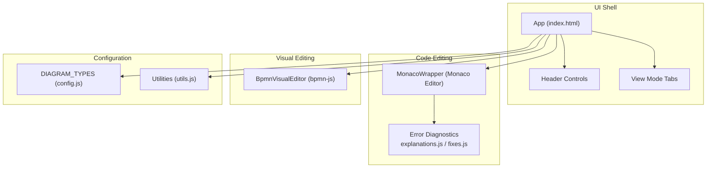
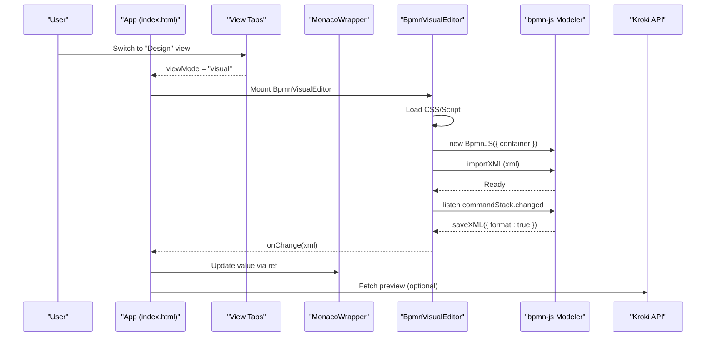
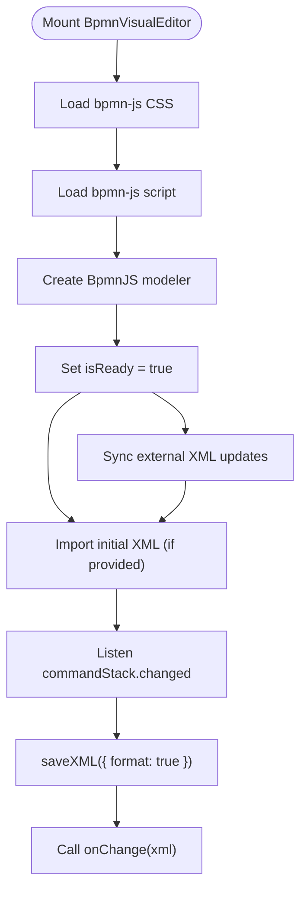
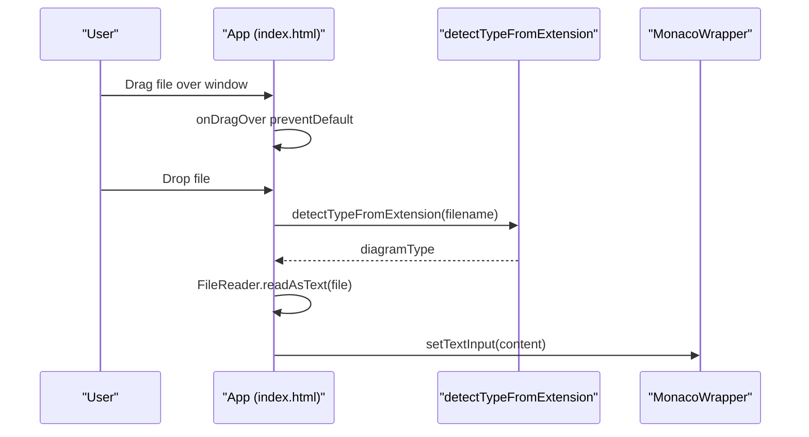
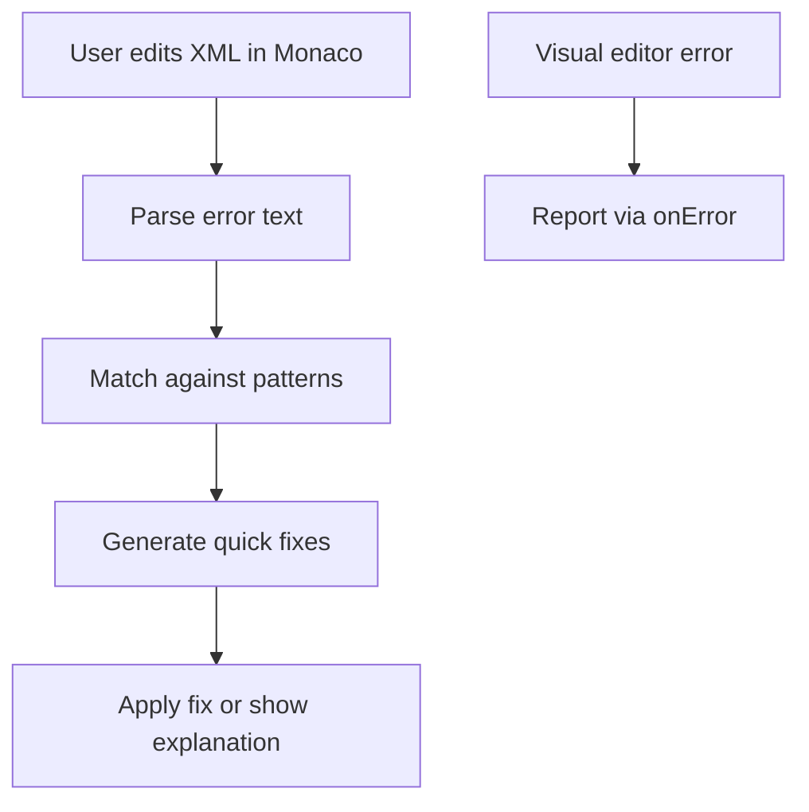
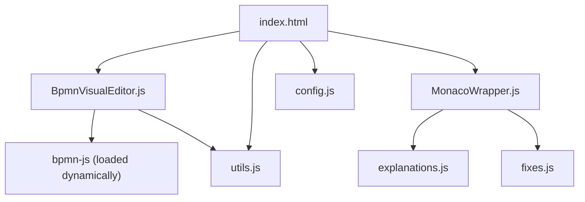

# BPMN (Business Process Model and Notation)

<cite>
**Referenced Files in This Document**
- [index.html](file://index.html)
- [BpmnVisualEditor.js](file://js/editors/bpmn/BpmnVisualEditor.js)
- [MonacoWrapper.js](file://js/components/MonacoWrapper.js)
- [config.js](file://js/config.js)
- [explanations.js](file://js/error-diagnostics/explanations.js)
- [fixes.js](file://js/error-diagnostics/fixes.js)
- [utils.js](file://js/utils.js)
</cite>

## Table of Contents
1. [Introduction](#introduction)
2. [Project Structure](#project-structure)
3. [Core Components](#core-components)
4. [Architecture Overview](#architecture-overview)
5. [Detailed Component Analysis](#detailed-component-analysis)
6. [Dependency Analysis](#dependency-analysis)
7. [Performance Considerations](#performance-considerations)
8. [Troubleshooting Guide](#troubleshooting-guide)
9. [Conclusion](#conclusion)
10. [Appendices](#appendices)

## Introduction
This document explains BPMN diagram support in the Universal Diagram Generator. It covers the visual BPMN editor powered by bpmn-js, the declarative configuration system, integration with the Monaco Editor for code editing, drag-and-drop capabilities, validation features, and export options. It also provides best practices for BPMN modeling, common patterns, and guidance for troubleshooting.

## Project Structure
The Universal Diagram Generator is a single-page application that integrates multiple diagramming technologies. BPMN support is implemented through:
- A visual editor component using bpmn-js
- A declarative configuration registry for diagram types
- A Monaco Editor integration for code editing and diagnostics
- Utilities for detection, encoding, and loading external assets

**Diagram sources**
- [index.html](file://index.html#L1600-L1759)
- [MonacoWrapper.js](file://js/components/MonacoWrapper.js#L1-L426)
- [BpmnVisualEditor.js](file://js/editors/bpmn/BpmnVisualEditor.js#L1-L106)
- [config.js](file://js/config.js#L6-L116)
- [utils.js](file://js/utils.js#L1-L177)

**Section sources**
- [index.html](file://index.html#L1600-L1759)
- [config.js](file://js/config.js#L6-L116)

## Core Components
- BpmnVisualEditor: A React component that embeds bpmn-js to provide a visual BPMN editor. It loads bpmn-js CSS and script dynamically, initializes the modeler, listens for changes, and synchronizes XML back to the code editor.
- MonacoWrapper: A React wrapper for the Monaco Editor that registers PlantUML, Mermaid, and XML (used for BPMN) languages, provides error diagnostics, quick fixes, and cursor tracking.
- DIAGRAM_TYPES: A centralized registry that defines supported diagram types, including BPMN, with metadata such as file extensions, Monaco language, documentation links, and example content.
- Error Diagnostics: Modules that provide human-readable explanations and automated quick fixes for common syntax errors across diagram types, including BPMN/XML.
- Utilities: Functions for detecting diagram type from file extension, detecting specific diagram models from code, encoding source for Kroki, and loading external scripts/CSS.

**Section sources**
- [BpmnVisualEditor.js](file://js/editors/bpmn/BpmnVisualEditor.js#L14-L106)
- [MonacoWrapper.js](file://js/components/MonacoWrapper.js#L13-L169)
- [config.js](file://js/config.js#L6-L116)
- [explanations.js](file://js/error-diagnostics/explanations.js#L12-L229)
- [fixes.js](file://js/error-diagnostics/fixes.js#L11-L296)
- [utils.js](file://js/utils.js#L35-L85)

## Architecture Overview
The application orchestrates between the code editor and the visual editor. When the user switches to the visual mode for BPMN, the BpmnVisualEditor mounts and renders the bpmn-js modeler inside a container. Changes made in the visual editor are saved to XML and propagated back to the Monaco editor. The Monaco editor provides syntax highlighting and diagnostics for XML (BPMN), powered by the error diagnostics modules.

**Diagram sources**
- [index.html](file://index.html#L1725-L1744)
- [BpmnVisualEditor.js](file://js/editors/bpmn/BpmnVisualEditor.js#L19-L90)
- [MonacoWrapper.js](file://js/components/MonacoWrapper.js#L134-L141)

## Detailed Component Analysis

### BpmnVisualEditor Component
The visual BPMN editor integrates bpmn-js to enable drag-and-drop creation and editing of BPMN diagrams. It:
- Dynamically loads bpmn-js CSS and script
- Creates a modeler instance bound to a DOM container
- Listens for command stack changes to export formatted XML
- Imports initial XML content and handles errors
- Cleans up on unmount

**Diagram sources**
- [BpmnVisualEditor.js](file://js/editors/bpmn/BpmnVisualEditor.js#L19-L90)

**Section sources**
- [BpmnVisualEditor.js](file://js/editors/bpmn/BpmnVisualEditor.js#L14-L106)

### Visual Editor Integration with bpmn-js
Key behaviors:
- Dynamic asset loading ensures minimal startup cost and avoids bundling large libraries.
- Keyboard binding is configured to capture global keyboard shortcuts.
- Change synchronization uses the command stack to capture user actions and export XML.
- Error handling during import and export is surfaced via the onError callback.

Practical implications:
- The visual editor is ideal for rapid prototyping and collaborative design.
- XML export enables seamless handoff to code-based workflows and validation.

**Section sources**
- [BpmnVisualEditor.js](file://js/editors/bpmn/BpmnVisualEditor.js#L22-L59)

### Drag-and-Drop Interface Capabilities
The application supports drag-and-drop file uploads:
- The App component listens for drop and dragover events.
- It detects the diagram type from the file extension and loads the file content into the editor.
- The Monaco editor is language-aware based on the detected type.

**Diagram sources**
- [index.html](file://index.html#L1524-L1534)
- [utils.js](file://js/utils.js#L35-L41)

**Section sources**
- [index.html](file://index.html#L1524-L1534)
- [utils.js](file://js/utils.js#L35-L41)

### Element Properties Panel
The visual editor does not include a dedicated properties panel. Instead, it relies on:
- bpmn-js’s built-in palette and properties panel for element manipulation and inspection.
- XML export for programmatic inspection and validation.

Best practice:
- Use the visual editor for interactive design and export XML for precise control and validation.

**Section sources**
- [BpmnVisualEditor.js](file://js/editors/bpmn/BpmnVisualEditor.js#L34-L49)

### Validation Features
Validation is handled through two channels:
- Monaco-based diagnostics for XML (BPMN) code:
  - Error providers register quick fixes and hover explanations.
  - Fix suggestions are generated based on error patterns.
- Runtime error reporting from the visual editor:
  - Import and change export errors are caught and forwarded to the onError callback.

**Diagram sources**
- [MonacoWrapper.js](file://js/components/MonacoWrapper.js#L314-L423)
- [explanations.js](file://js/error-diagnostics/explanations.js#L237-L271)
- [fixes.js](file://js/error-diagnostics/fixes.js#L332-L366)
- [BpmnVisualEditor.js](file://js/editors/bpmn/BpmnVisualEditor.js#L57-L66)

**Section sources**
- [MonacoWrapper.js](file://js/components/MonacoWrapper.js#L314-L423)
- [explanations.js](file://js/error-diagnostics/explanations.js#L12-L229)
- [fixes.js](file://js/error-diagnostics/fixes.js#L11-L296)
- [BpmnVisualEditor.js](file://js/editors/bpmn/BpmnVisualEditor.js#L57-L66)

### BPMN XML Syntax and Standard Shapes
- The configuration declares BPMN as having XML as its Monaco language and includes a comprehensive example.
- The visual editor uses bpmn-js, which implements BPMN 2.0 semantics and rendering.

Recommended XML structure highlights:
- Definitions element with namespaces
- Process element containing start events, tasks, sequence flows, and end events
- BPMNDiagram with BPMNShape and BPMNEdge elements for layout

**Section sources**
- [config.js](file://js/config.js#L7-L57)
- [BpmnVisualEditor.js](file://js/editors/bpmn/BpmnVisualEditor.js#L22-L29)

### Swimlanes and Pools
- The visual editor uses bpmn-js, which supports collaboration (swimlanes/pools) and process flows.
- The detection utility recognizes collaboration and process flows in BPMN content.

Practical usage:
- Use the visual editor to create collaboration diagrams with lanes and pools.
- Export XML for validation and integration with downstream tools.

**Section sources**
- [utils.js](file://js/utils.js#L78-L82)
- [BpmnVisualEditor.js](file://js/editors/bpmn/BpmnVisualEditor.js#L34-L39)

### Best Practices for Business Process Modeling
- Keep processes focused and bounded; use collaboration for cross-organizational flows.
- Use standard BPMN symbols consistently: start/end events, tasks, gateways, sequence flows.
- Leverage swimlanes to clarify roles and responsibilities.
- Validate XML regularly and rely on the visual editor for iterative design.

[No sources needed since this section provides general guidance]

### Practical Examples of Common BPMN Patterns
- Basic process with start, task, and end events
- Collaboration with pools and lanes
- Gateways for decision-making and parallel flows

These examples are included in the configuration’s BPMN example and can be used as templates.

**Section sources**
- [config.js](file://js/config.js#L13-L56)

### Export Options
- The application supports downloading rendered diagrams as SVG and PNG.
- For BPMN, the visual editor exports XML; the code editor can be used to download the XML file directly.

Export behavior:
- SVG/PNG downloads use the rendered preview image.
- XML export occurs automatically from the visual editor when the user interacts with the modeler.

**Section sources**
- [index.html](file://index.html#L1561-L1599)
- [BpmnVisualEditor.js](file://js/editors/bpmn/BpmnVisualEditor.js#L42-L49)

### Declarative Configuration System for BPMN
The configuration system centralizes:
- Diagram type metadata (label, extensions, Monaco language, docs link)
- Example content for quick start
- Visual editor availability flag

This enables consistent behavior across the UI and editor integrations.

**Section sources**
- [config.js](file://js/config.js#L6-L116)

### Integration with Monaco Editor for Code Editing
Monaco integration includes:
- Language registration for XML (used for BPMN)
- Syntax highlighting tailored to BPMN XML
- Error providers for quick fixes and hover explanations
- Cursor tracking and editor methods exposed via ref

**Section sources**
- [MonacoWrapper.js](file://js/components/MonacoWrapper.js#L13-L169)
- [MonacoWrapper.js](file://js/components/MonacoWrapper.js#L314-L423)

## Dependency Analysis
The BPMN feature depends on:
- bpmn-js runtime and CSS
- Monaco Editor for code editing and diagnostics
- Error diagnostics modules for explanations and quick fixes
- Utilities for type detection and encoding

**Diagram sources**
- [BpmnVisualEditor.js](file://js/editors/bpmn/BpmnVisualEditor.js#L22-L29)
- [MonacoWrapper.js](file://js/components/MonacoWrapper.js#L314-L423)
- [index.html](file://index.html#L1600-L1759)
- [config.js](file://js/config.js#L6-L116)
- [utils.js](file://js/utils.js#L116-L146)

**Section sources**
- [BpmnVisualEditor.js](file://js/editors/bpmn/BpmnVisualEditor.js#L22-L29)
- [MonacoWrapper.js](file://js/components/MonacoWrapper.js#L314-L423)
- [index.html](file://index.html#L1600-L1759)
- [config.js](file://js/config.js#L6-L116)
- [utils.js](file://js/utils.js#L116-L146)

## Performance Considerations
- Asset loading is deferred until the visual editor is mounted, reducing initial load time.
- XML export is triggered on command stack changes; debouncing can be considered if performance becomes a concern.
- Large BPMN diagrams may benefit from incremental rendering and careful use of lanes to keep the visual manageable.

[No sources needed since this section provides general guidance]

## Troubleshooting Guide
Common BPMN issues and resolutions:
- XML parsing errors: Use the error diagnostics to identify unclosed tags or invalid attributes; apply quick fixes or correct the XML manually.
- Import failures: Ensure the XML is well-formed and includes required namespaces; check for missing closing tags.
- Visual editor not loading: Confirm that the dynamic script and CSS are loaded successfully; check browser console for errors.

Diagnostic workflow:
- Monaco highlights errors and offers quick fixes.
- Hover explanations provide actionable guidance.
- Visual editor errors surface via the onError callback.

**Section sources**
- [explanations.js](file://js/error-diagnostics/explanations.js#L168-L192)
- [fixes.js](file://js/error-diagnostics/fixes.js#L240-L278)
- [MonacoWrapper.js](file://js/components/MonacoWrapper.js#L314-L423)
- [BpmnVisualEditor.js](file://js/editors/bpmn/BpmnVisualEditor.js#L57-L66)

## Conclusion
The Universal Diagram Generator provides robust BPMN support through a visual editor powered by bpmn-js and a code editor integrated with Monaco. The declarative configuration system, dynamic asset loading, and integrated diagnostics deliver a smooth authoring experience. By combining the visual editor for interactive design with the code editor for validation and export, teams can efficiently model and iterate on business processes.

[No sources needed since this section summarizes without analyzing specific files]

## Appendices

### BPMN Concepts Overview
- Processes: Top-level containers for activities and flows
- Activities: Tasks, sub-processes, and service tasks
- Events: Start, intermediate, and end events
- Gateways: Exclusive, inclusive, parallel, and complex gateways
- Flows: Sequence flows connecting elements

[No sources needed since this section provides general guidance]