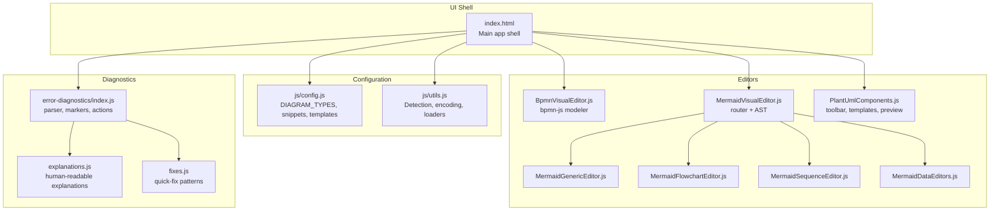
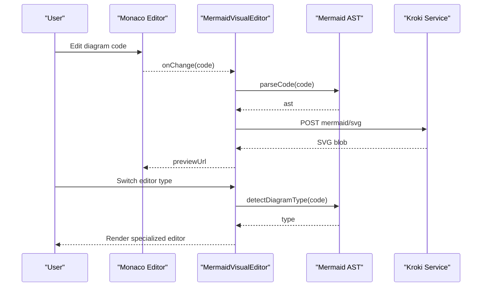
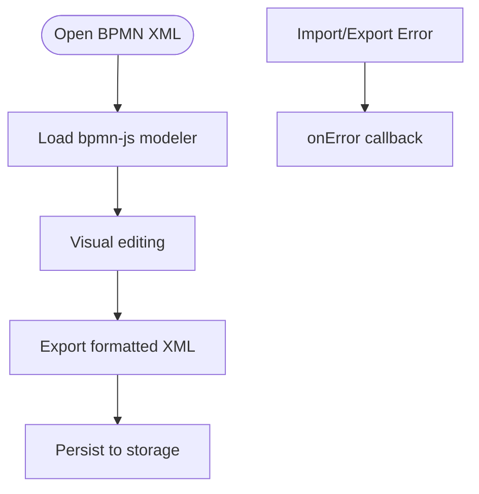
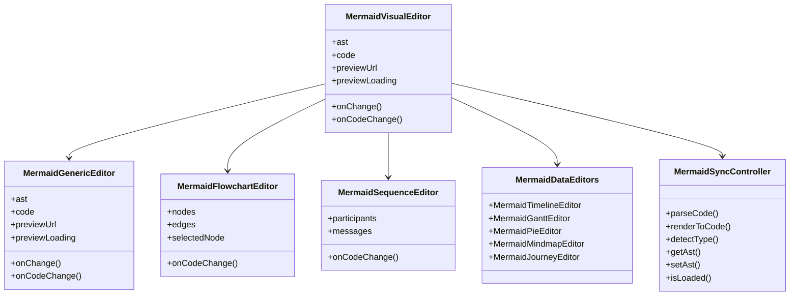
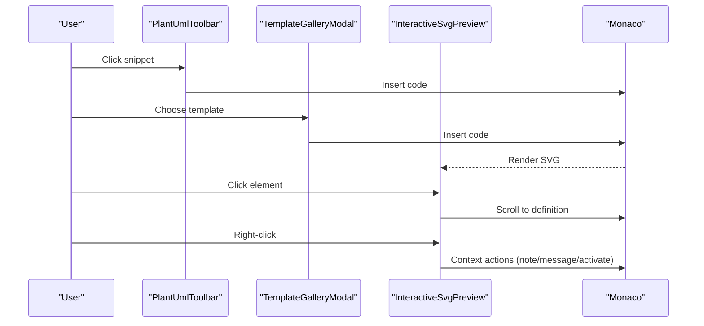
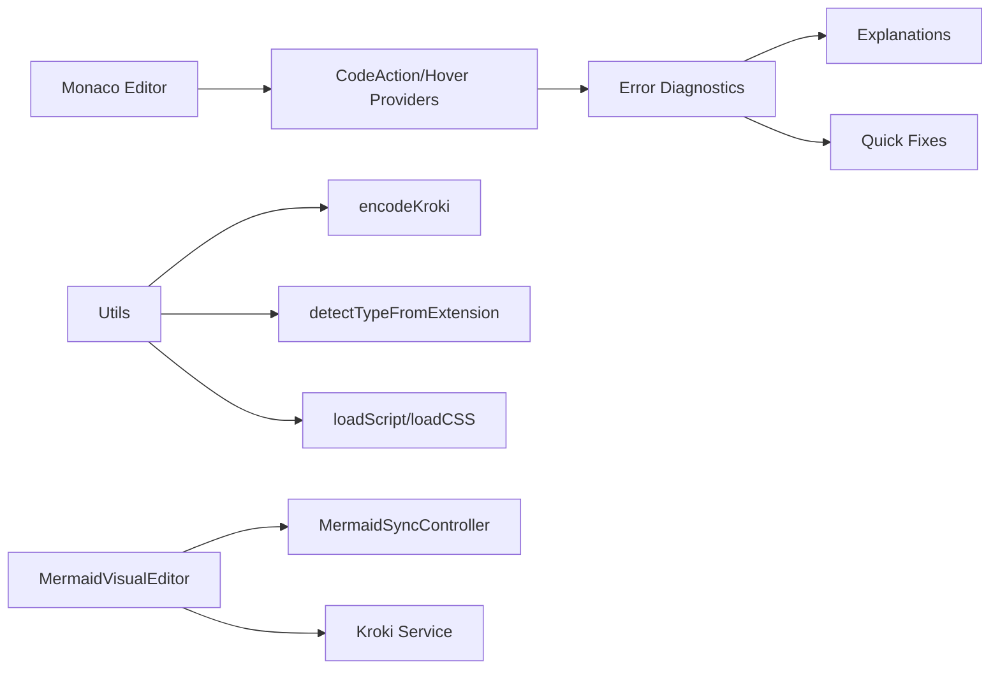
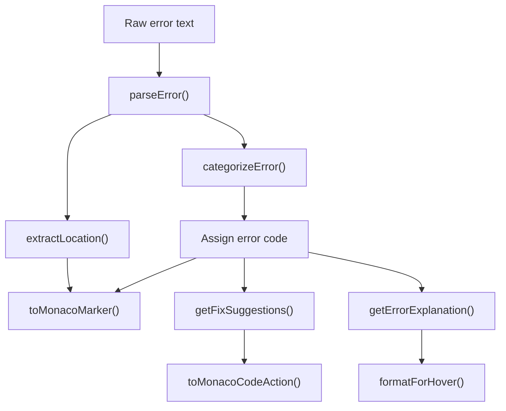

# Diagram Types and Formats

<cite>
**Referenced Files in This Document**
- [index.html](file://index.html)
- [config.js](file://js/config.js)
- [utils.js](file://js/utils.js)
- [BpmnVisualEditor.js](file://js/editors/bpmn/BpmnVisualEditor.js)
- [PlantUmlComponents.js](file://js/components/PlantUmlComponents.js)
- [MermaidSyncController.js](file://js/editors/mermaid/MermaidSyncController.js)
- [MermaidVisualEditor.js](file://js/editors/mermaid/index.js)
- [MermaidGenericEditor.js](file://js/editors/mermaid/MermaidGenericEditor.js)
- [MermaidFlowchartEditor.js](file://js/editors/mermaid/MermaidFlowchartEditor.js)
- [MermaidSequenceEditor.js](file://js/editors/mermaid/MermaidSequenceEditor.js)
- [MermaidDataEditors.js](file://js/editors/mermaid/MermaidDataEditors.js)
- [error-diagnostics/index.js](file://js/error-diagnostics/index.js)
- [error-diagnostics/explanations.js](file://js/error-diagnostics/explanations.js)
- [error-diagnostics/fixes.js](file://js/error-diagnostics/fixes.js)
</cite>

## Table of Contents
1. [Introduction](#introduction)
2. [Project Structure](#project-structure)
3. [Core Components](#core-components)
4. [Architecture Overview](#architecture-overview)
5. [Detailed Component Analysis](#detailed-component-analysis)
6. [Dependency Analysis](#dependency-analysis)
7. [Performance Considerations](#performance-considerations)
8. [Troubleshooting Guide](#troubleshooting-guide)
9. [Conclusion](#conclusion)

## Introduction
This document describes all supported diagram types and formats in the Universal Diagram Generator, along with their syntax, capabilities, configuration, and best practices. It also explains the declarative configuration system that registers new diagram types and manages language-specific settings.

## Project Structure
The application is a single-page React app with inline JSX and ES modules. Key areas:
- Configuration registry for diagram types, snippets, and templates
- Editor components for BPMN, PlantUML, and Mermaid
- Error diagnostics and quick-fix engine
- Monaco editor integration with language support and error providers

**Diagram sources**
- [index.html](file://index.html#L62-L520)
- [config.js](file://js/config.js#L1-L116)
- [utils.js](file://js/utils.js#L1-L177)
- [BpmnVisualEditor.js](file://js/editors/bpmn/BpmnVisualEditor.js#L1-L106)
- [MermaidVisualEditor.js](file://js/editors/mermaid/index.js#L1-L137)
- [MermaidGenericEditor.js](file://js/editors/mermaid/MermaidGenericEditor.js#L1-L101)
- [MermaidFlowchartEditor.js](file://js/editors/mermaid/MermaidFlowchartEditor.js#L1-L276)
- [MermaidSequenceEditor.js](file://js/editors/mermaid/MermaidSequenceEditor.js#L1-L110)
- [MermaidDataEditors.js](file://js/editors/mermaid/MermaidDataEditors.js#L1-L306)
- [PlantUmlComponents.js](file://js/components/PlantUmlComponents.js#L1-L249)
- [error-diagnostics/index.js](file://js/error-diagnostics/index.js#L1-L303)
- [error-diagnostics/explanations.js](file://js/error-diagnostics/explanations.js#L1-L302)
- [error-diagnostics/fixes.js](file://js/error-diagnostics/fixes.js#L1-L403)

**Section sources**
- [index.html](file://index.html#L62-L520)
- [config.js](file://js/config.js#L1-L116)

## Core Components
- Diagram registry: Defines supported formats, file extensions, editor language bindings, documentation links, and example content.
- Editor routing: Selects the appropriate editor based on detected diagram type.
- Visual editors: Specialized editors for BPMN, PlantUML, and Mermaid (flowcharts, sequences, timelines, Gantt, pie, mindmaps, journeys).
- Error diagnostics: Parses errors, extracts locations, categorizes issues, and provides quick fixes and explanations.

**Section sources**
- [config.js](file://js/config.js#L6-L116)
- [MermaidVisualEditor.js](file://js/editors/mermaid/index.js#L20-L121)
- [error-diagnostics/index.js](file://js/error-diagnostics/index.js#L13-L44)

## Architecture Overview
The system integrates Monaco editor with language-specific tokens, error providers, and quick fixes. Diagrams are rendered via Kroki service URLs. Visual editors synchronize with code via AST when applicable.

**Diagram sources**
- [MermaidVisualEditor.js](file://js/editors/mermaid/index.js#L24-L53)
- [MermaidSyncController.js](file://js/editors/mermaid/MermaidSyncController.js#L21-L37)
- [index.html](file://index.html#L796-L798)

## Detailed Component Analysis

### BPMN (Business Process Model and Notation)
- Purpose: Visual modeling of business processes with swimlanes, tasks, gateways, and flows.
- Editor: bpmn-js modeler with live XML export/import.
- Features:
  - Visual editing with drag-and-drop.
  - Real-time XML synchronization.
  - Error reporting via callbacks.
- Limitations:
  - Requires valid BPMN XML; malformed XML causes import errors.
- Best practices:
  - Keep namespaces and IDs consistent.
  - Validate against BPMN schema externally if needed.

**Diagram sources**
- [BpmnVisualEditor.js](file://js/editors/bpmn/BpmnVisualEditor.js#L19-L75)

**Section sources**
- [BpmnVisualEditor.js](file://js/editors/bpmn/BpmnVisualEditor.js#L14-L90)
- [config.js](file://js/config.js#L6-L57)

### Mermaid (Flowcharts, Sequences, Classes, States, ER, Gantt, Pie, Timelines, Journeys, Mindmaps, Git Graphs, Quadrant Charts)
- Purpose: Text-based diagrams with live preview and AST-driven editing.
- Registry:
  - Diagram types include flowchart, sequence, class, state, er, gantt, pie, timeline, journey, mindmap, gitgraph, quadrant, requirement, sankey, xychart, kanban, and c4.
- Editors:
  - Router selects editor by AST type.
  - Specialized editors: flowchart (node/edge list), sequence (participants/messages), data editors (timeline, gantt, pie, mindmap, journey).
  - Generic editor for unsupported types with AST property panel.
- AST synchronization:
  - Debounced parsing from code to AST.
  - Safe rendering from AST to code with loop prevention.
- Limitations:
  - Some diagram types lack visual editors; use code view.
  - Requires Mermaid AST library to be loaded.
- Best practices:
  - Start with diagram type declaration.
  - Use subgraphs and sections for complex diagrams.
  - Prefer Mermaid AST for bidirectional editing when available.

**Diagram sources**
- [MermaidVisualEditor.js](file://js/editors/mermaid/index.js#L20-L121)
- [MermaidGenericEditor.js](file://js/editors/mermaid/MermaidGenericEditor.js#L11-L97)
- [MermaidFlowchartEditor.js](file://js/editors/mermaid/MermaidFlowchartEditor.js#L10-L276)
- [MermaidSequenceEditor.js](file://js/editors/mermaid/MermaidSequenceEditor.js#L4-L109)
- [MermaidDataEditors.js](file://js/editors/mermaid/MermaidDataEditors.js#L6-L306)
- [MermaidSyncController.js](file://js/editors/mermaid/MermaidSyncController.js#L9-L92)

**Section sources**
- [MermaidVisualEditor.js](file://js/editors/mermaid/index.js#L20-L121)
- [MermaidGenericEditor.js](file://js/editors/mermaid/MermaidGenericEditor.js#L11-L97)
- [MermaidFlowchartEditor.js](file://js/editors/mermaid/MermaidFlowchartEditor.js#L10-L276)
- [MermaidSequenceEditor.js](file://js/editors/mermaid/MermaidSequenceEditor.js#L4-L109)
- [MermaidDataEditors.js](file://js/editors/mermaid/MermaidDataEditors.js#L6-L306)
- [MermaidSyncController.js](file://js/editors/mermaid/MermaidSyncController.js#L9-L92)

### PlantUML and C4-PlantUML
- Purpose: UML and architecture diagrams (sequences, classes, activities, states, components, deployments, ER, mindmaps, WBS).
- Features:
  - Snippet toolbar with icons and labels.
  - Template gallery with descriptions.
  - Interactive SVG preview with click/context actions.
  - Context menu supports adding notes, messages, activation toggles, and navigation.
- Limitations:
  - Requires @startuml/@enduml blocks.
  - Syntax-sensitive; missing start/end tags cause errors.
- Best practices:
  - Use templates as starting points.
  - Insert snippets for common constructs.
  - Leverage interactive preview to jump to code.

**Diagram sources**
- [PlantUmlComponents.js](file://js/components/PlantUmlComponents.js#L8-L95)
- [PlantUmlComponents.js](file://js/components/PlantUmlComponents.js#L153-L248)

**Section sources**
- [config.js](file://js/config.js#L118-L565)
- [PlantUmlComponents.js](file://js/components/PlantUmlComponents.js#L8-L95)
- [PlantUmlComponents.js](file://js/components/PlantUmlComponents.js#L153-L248)

### GraphViz DOT Language
- Purpose: Graph layouts using nodes and edges with attributes.
- Supported via registry; syntax similar to digraph/graph with attributes and edges.
- Best practices:
  - Close braces and brackets.
  - Use semicolons for statements.
  - Define ranks and styles explicitly for clarity.

**Section sources**
- [config.js](file://js/config.js#L104-L116)

### Excalidraw Freehand Drawing
- Purpose: Hand-drawn diagrams stored as JSON.
- Editor: JSON-based with example content.
- Best practices:
  - Keep JSON valid.
  - Use official Excalidraw schema.

**Section sources**
- [config.js](file://js/config.js#L82-L88)

### Structurizr DSL
- Purpose: Architectural diagrams using Structurizr DSL or JSON.
- Best practices:
  - Follow Structurizr DSL syntax.
  - Validate structure and relationships.

**Section sources**
- [config.js](file://js/config.js#L110-L111)

### Vega and Vega-Lite Visualizations
- Purpose: Declarative grammar of graphics (Vega) and high-level grammar (Vega-Lite).
- Best practices:
  - Validate JSON schema.
  - Use scales, axes, and marks appropriately.

**Section sources**
- [config.js](file://js/config.js#L112-L114)

### ERD Tools
- Purpose: Entity-relationship diagrams.
- Supported via registry; syntax similar to ER notation.
- Best practices:
  - Define primary keys and foreign keys clearly.
  - Use cardinalities consistently.

**Section sources**
- [config.js](file://js/config.js#L106)

### Other Supported Formats (Registry)
- ditaa, blockdiag, bytefield, nomnoml, pikchr, svgbob, wavedrom, wireviz.
- Each has associated extensions and language bindings for syntax highlighting.

**Section sources**
- [config.js](file://js/config.js#L103-L116)

## Dependency Analysis
- Monaco editor is extended with PlantUML and Mermaid language providers and error actions.
- Error diagnostics module parses raw errors, extracts locations, categorizes, and suggests fixes.
- Utilities provide compression for Kroki URLs, type detection, and resource loaders.

**Diagram sources**
- [index.html](file://index.html#L598-L727)
- [error-diagnostics/index.js](file://js/error-diagnostics/index.js#L13-L44)
- [error-diagnostics/explanations.js](file://js/error-diagnostics/explanations.js#L12-L229)
- [error-diagnostics/fixes.js](file://js/error-diagnostics/fixes.js#L11-L296)
- [utils.js](file://js/utils.js#L14-L41)
- [MermaidVisualEditor.js](file://js/editors/mermaid/index.js#L24-L53)
- [MermaidSyncController.js](file://js/editors/mermaid/MermaidSyncController.js#L9-L92)

**Section sources**
- [index.html](file://index.html#L598-L727)
- [error-diagnostics/index.js](file://js/error-diagnostics/index.js#L13-L44)
- [utils.js](file://js/utils.js#L14-L41)

## Performance Considerations
- Debounce AST parsing to avoid excessive re-renders.
- Revoke object URLs for previews to prevent memory leaks.
- Lazy-load external libraries (bpmn-js, Mermaid AST) to reduce initial bundle size.
- Use minimal diffs when updating code from visual changes.

[No sources needed since this section provides general guidance]

## Troubleshooting Guide
- Error parsing:
  - Extracts line/column from diagram-specific patterns.
  - Categorizes errors (missing brackets, arrows, unknown diagram types, XML errors).
- Quick fixes:
  - Provides automated edits for common issues (add start/end tags, close brackets, insert declarations).
- Hover explanations:
  - Offers human-readable explanations with examples and documentation links.
- Monaco integration:
  - Registers code actions and hover providers for mermaid, plantuml, and xml.

**Diagram sources**
- [error-diagnostics/index.js](file://js/error-diagnostics/index.js#L13-L276)
- [error-diagnostics/explanations.js](file://js/error-diagnostics/explanations.js#L237-L299)
- [error-diagnostics/fixes.js](file://js/error-diagnostics/fixes.js#L332-L366)

**Section sources**
- [error-diagnostics/index.js](file://js/error-diagnostics/index.js#L13-L276)
- [error-diagnostics/explanations.js](file://js/error-diagnostics/explanations.js#L12-L299)
- [error-diagnostics/fixes.js](file://js/error-diagnostics/fixes.js#L11-L366)

## Conclusion
The Universal Diagram Generator provides a unified interface for multiple diagram formats with robust configuration, powerful editors, and intelligent diagnostics. The declarative registry makes it straightforward to add new formats, while Monaco integration and AST-based synchronization deliver a smooth authoring experience.