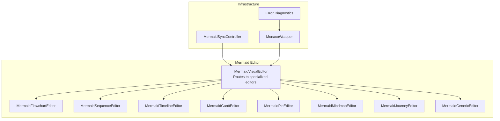
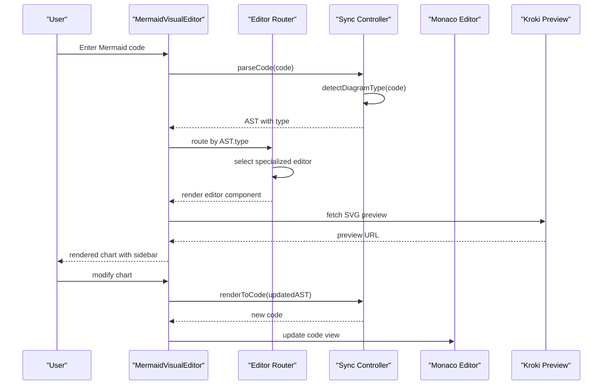
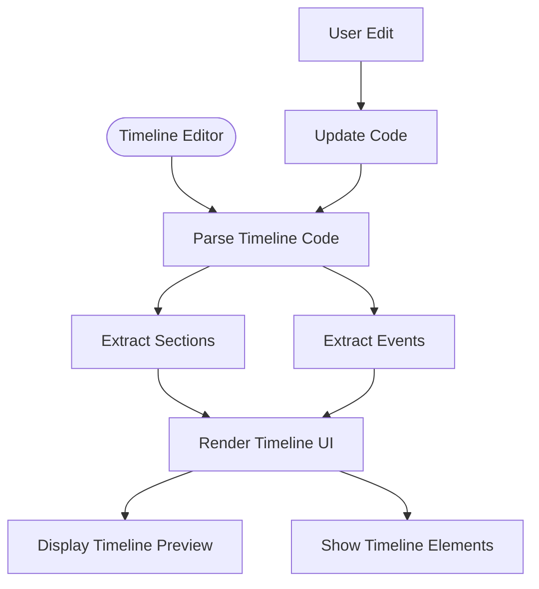
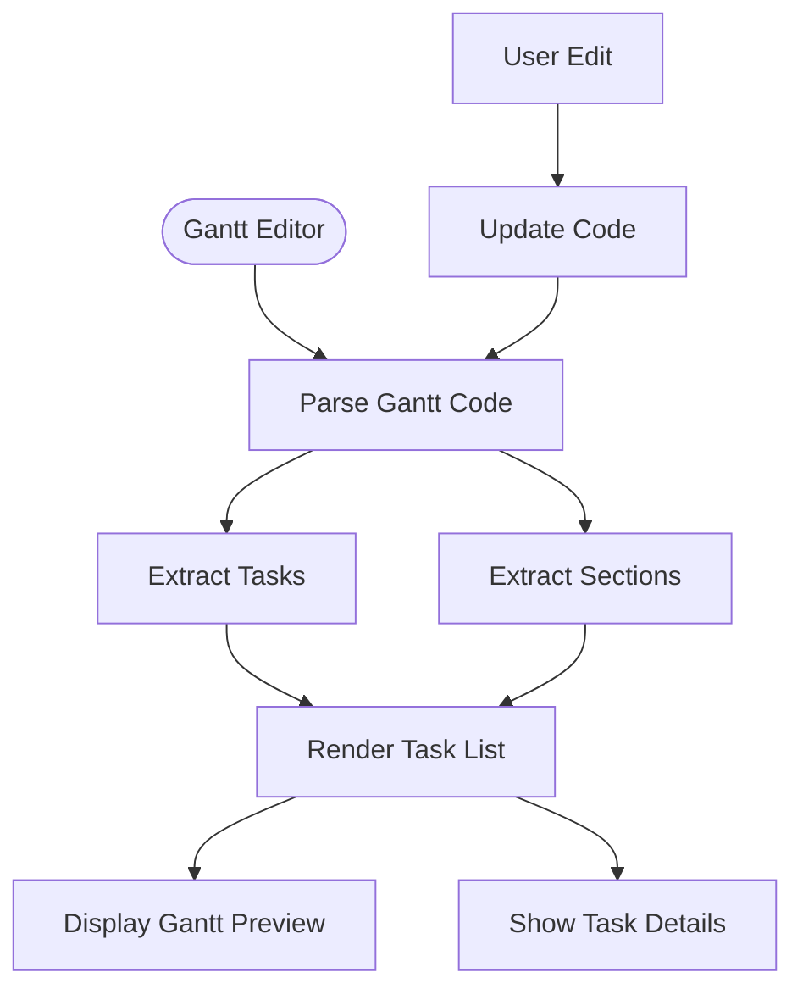
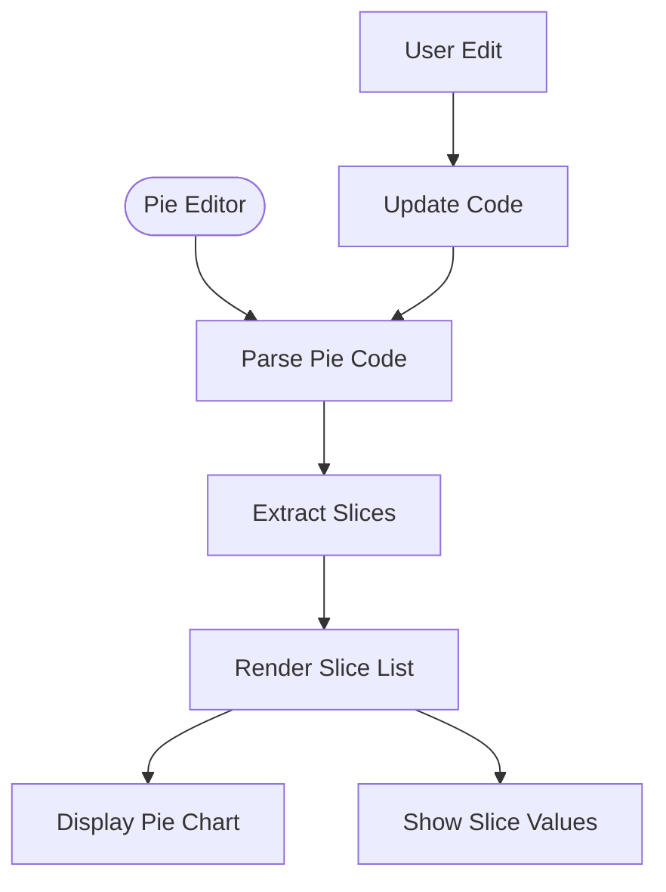
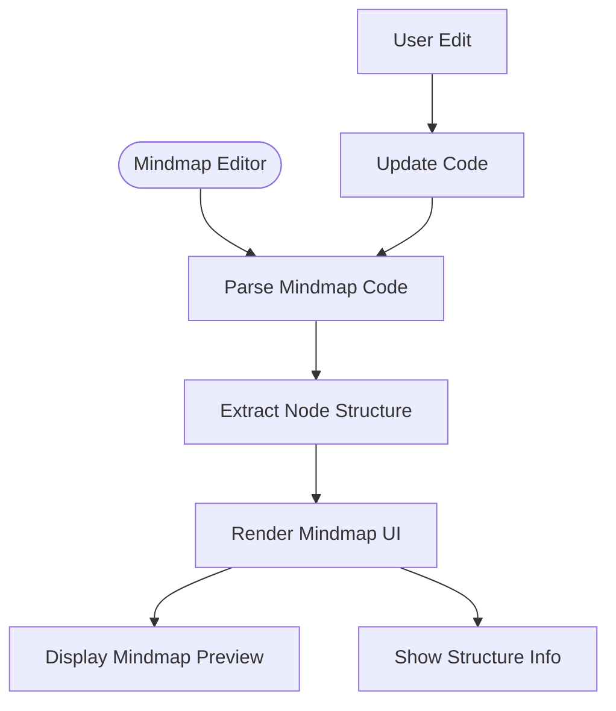
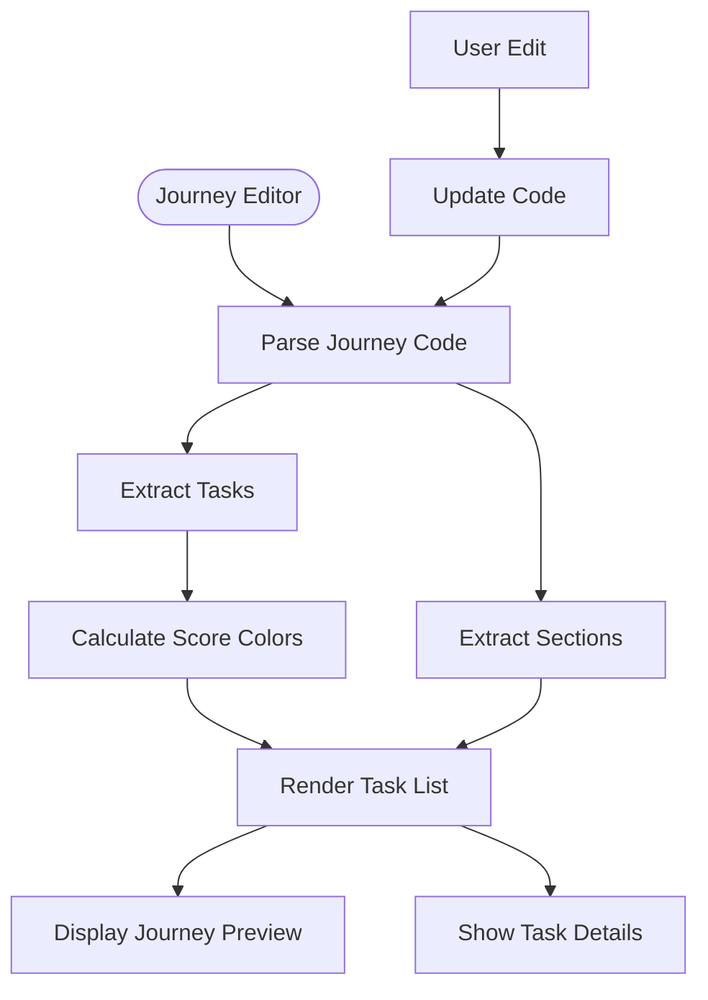
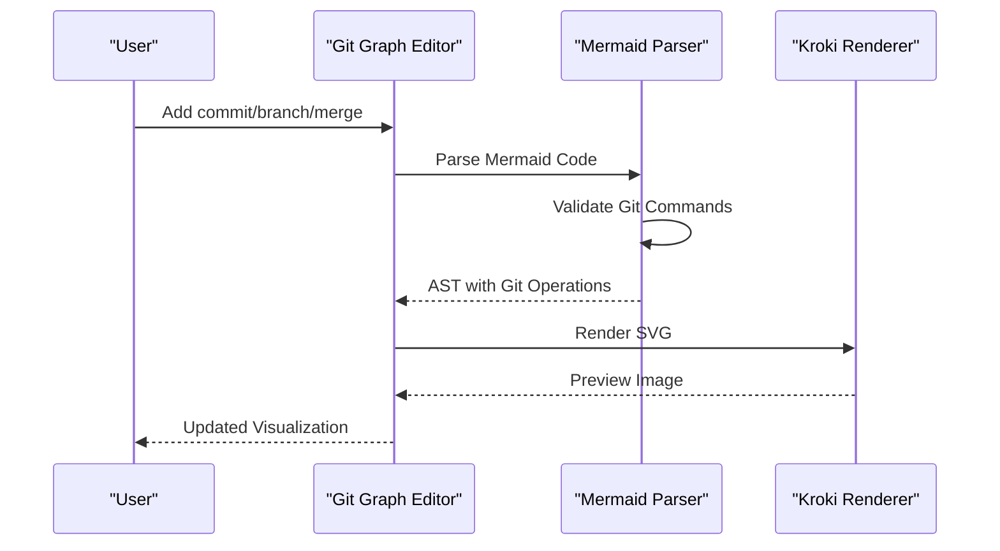
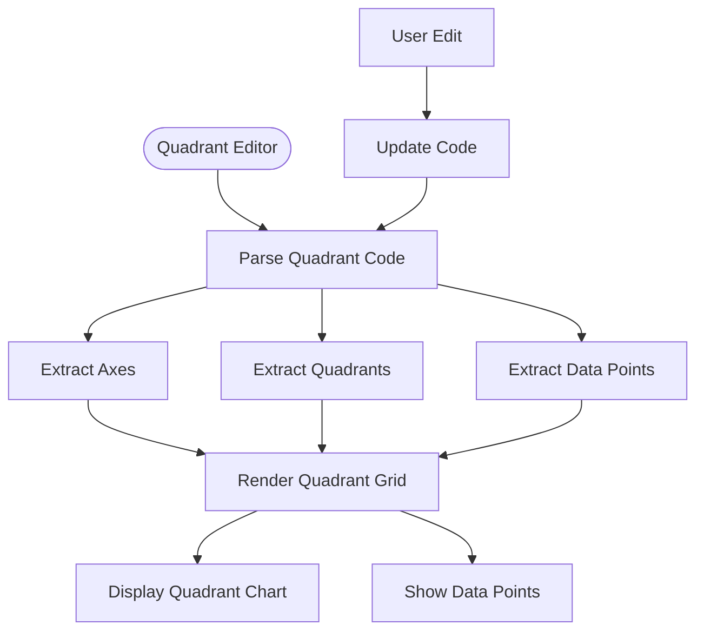
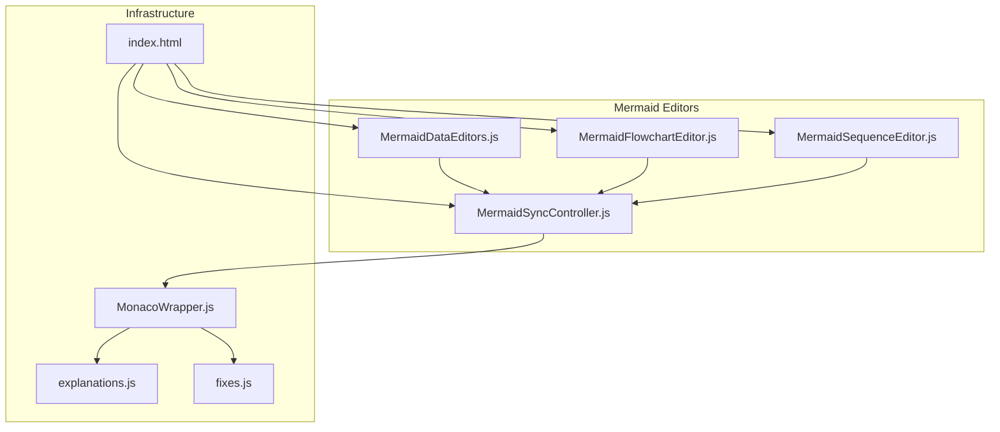

# Advanced Chart Types

<cite>
**Referenced Files in This Document**
- [index.html](file://index.html)
- [MermaidDataEditors.js](file://js/editors/mermaid/MermaidDataEditors.js)
- [MermaidFlowchartEditor.js](file://js/editors/mermaid/MermaidFlowchartEditor.js)
- [MermaidSequenceEditor.js](file://js/editors/mermaid/MermaidSequenceEditor.js)
- [MermaidSyncController.js](file://js/editors/mermaid/MermaidSyncController.js)
- [MonacoWrapper.js](file://js/components/MonacoWrapper.js)
- [explanations.js](file://js/error-diagnostics/explanations.js)
- [fixes.js](file://js/error-diagnostics/fixes.js)
</cite>

## Table of Contents
1. [Introduction](#introduction)
2. [Project Structure](#project-structure)
3. [Core Components](#core-components)
4. [Architecture Overview](#architecture-overview)
5. [Detailed Component Analysis](#detailed-component-analysis)
6. [Dependency Analysis](#dependency-analysis)
7. [Performance Considerations](#performance-considerations)
8. [Troubleshooting Guide](#troubleshooting-guide)
9. [Conclusion](#conclusion)

## Introduction
This document provides comprehensive guidance for advanced Mermaid chart types beyond the basic flowchart and sequence diagram editors. It covers specialized diagram formats including timelines, gantt charts, pie charts, mindmaps, user journeys, git graphs, quadrant charts, and other data visualization formats. The documentation explains syntax, use cases, practical examples, and integration patterns with the main Mermaid editor, along with synchronization behavior between code and visual views.

## Project Structure
The advanced chart type support is implemented through:
- A main Mermaid visual editor router that selects specialized editors based on AST type
- Specialized editors for timeline, gantt, pie, mindmap, and user journey charts
- A Mermaid sync controller for bi-directional synchronization between code and visual views
- Monaco editor integration with syntax highlighting and error diagnostics
- Template and snippet libraries for quick chart creation

**Diagram sources**
- [index.html](file://index.html#L1454-L1579)
- [MermaidDataEditors.js](file://js/editors/mermaid/MermaidDataEditors.js#L1-L306)
- [MermaidFlowchartEditor.js](file://js/editors/mermaid/MermaidFlowchartEditor.js#L1-L276)
- [MermaidSequenceEditor.js](file://js/editors/mermaid/MermaidSequenceEditor.js#L1-L110)
- [MermaidSyncController.js](file://js/editors/mermaid/MermaidSyncController.js#L1-L93)
- [MonacoWrapper.js](file://js/components/MonacoWrapper.js#L1-L426)

**Section sources**
- [index.html](file://index.html#L1454-L1579)
- [MermaidDataEditors.js](file://js/editors/mermaid/MermaidDataEditors.js#L1-L306)
- [MermaidFlowchartEditor.js](file://js/editors/mermaid/MermaidFlowchartEditor.js#L1-L276)
- [MermaidSequenceEditor.js](file://js/editors/mermaid/MermaidSequenceEditor.js#L1-L110)
- [MermaidSyncController.js](file://js/editors/mermaid/MermaidSyncController.js#L1-L93)
- [MonacoWrapper.js](file://js/components/MonacoWrapper.js#L1-L426)

## Core Components
The advanced chart type system consists of several key components:

### Specialized Chart Editors
- **Timeline Editor**: Parses timeline sections and periods, displays events chronologically
- **Gantt Editor**: Extracts tasks with start dates and durations, supports sections
- **Pie Editor**: Processes slice definitions with labels and values
- **Mindmap Editor**: Provides node addition interface for hierarchical structures
- **Journey Editor**: Handles user journey tasks with scoring and actor assignments

### Synchronization Controller
Manages bi-directional synchronization between code and visual editors with:
- Debounced parsing to prevent infinite loops
- Change source tracking to avoid feedback loops
- AST detection and rendering capabilities

### Monaco Integration
Enhanced editor with:
- Mermaid language registration and syntax highlighting
- Error provider integration for quick fixes and explanations
- Snippet insertion for rapid chart creation

**Section sources**
- [MermaidDataEditors.js](file://js/editors/mermaid/MermaidDataEditors.js#L7-L306)
- [MermaidSyncController.js](file://js/editors/mermaid/MermaidSyncController.js#L9-L93)
- [MonacoWrapper.js](file://js/components/MonacoWrapper.js#L246-L303)

## Architecture Overview
The advanced chart type architecture follows a modular routing pattern where the main editor determines which specialized editor to instantiate based on the detected diagram type.

**Diagram sources**
- [index.html](file://index.html#L1454-L1579)
- [MermaidSyncController.js](file://js/editors/mermaid/MermaidSyncController.js#L21-L58)

**Section sources**
- [index.html](file://index.html#L1454-L1579)
- [MermaidSyncController.js](file://js/editors/mermaid/MermaidSyncController.js#L9-L93)

## Detailed Component Analysis

### Timeline Charts
Timeline editors are designed for chronological event visualization with hierarchical sections.

**Diagram sources**
- [MermaidDataEditors.js](file://js/editors/mermaid/MermaidDataEditors.js#L8-L88)

**Section sources**
- [MermaidDataEditors.js](file://js/editors/mermaid/MermaidDataEditors.js#L7-L88)

### Gantt Charts
Gantt editors focus on project scheduling with task definitions and temporal relationships.

**Diagram sources**
- [MermaidDataEditors.js](file://js/editors/mermaid/MermaidDataEditors.js#L91-L151)

**Section sources**
- [MermaidDataEditors.js](file://js/editors/mermaid/MermaidDataEditors.js#L91-L151)

### Pie Charts
Pie chart editors handle categorical data visualization with labeled slices.

**Diagram sources**
- [MermaidDataEditors.js](file://js/editors/mermaid/MermaidDataEditors.js#L154-L203)

**Section sources**
- [MermaidDataEditors.js](file://js/editors/mermaid/MermaidDataEditors.js#L154-L203)

### Mindmap Charts
Mindmap editors provide hierarchical structure editing with indentation-based organization.

**Diagram sources**
- [MermaidDataEditors.js](file://js/editors/mermaid/MermaidDataEditors.js#L206-L234)

**Section sources**
- [MermaidDataEditors.js](file://js/editors/mermaid/MermaidDataEditors.js#L206-L234)

### User Journey Charts
Journey editors focus on user experience mapping with task scoring and actor assignments.

**Diagram sources**
- [MermaidDataEditors.js](file://js/editors/mermaid/MermaidDataEditors.js#L237-L305)

**Section sources**
- [MermaidDataEditors.js](file://js/editors/mermaid/MermaidDataEditors.js#L237-L305)

### Git Graphs
Git graph editors visualize version control history with commits, branches, and merges.

**Diagram sources**
- [index.html](file://index.html#L402-L419)

**Section sources**
- [index.html](file://index.html#L402-L419)

### Quadrant Charts
Quadrant charts provide priority matrix visualization with configurable axes and quadrants.

**Diagram sources**
- [index.html](file://index.html#L420-L433)

**Section sources**
- [index.html](file://index.html#L420-L433)

## Dependency Analysis
The advanced chart type system has well-defined dependencies and integration points:

**Diagram sources**
- [index.html](file://index.html#L1-L137)
- [MermaidDataEditors.js](file://js/editors/mermaid/MermaidDataEditors.js#L1-L14)
- [MermaidFlowchartEditor.js](file://js/editors/mermaid/MermaidFlowchartEditor.js#L1-L6)
- [MermaidSequenceEditor.js](file://js/editors/mermaid/MermaidSequenceEditor.js#L1-L3)
- [MermaidSyncController.js](file://js/editors/mermaid/MermaidSyncController.js#L1-L8)
- [MonacoWrapper.js](file://js/components/MonacoWrapper.js#L1-L8)
- [explanations.js](file://js/error-diagnostics/explanations.js#L1-L11)
- [fixes.js](file://js/error-diagnostics/fixes.js#L1-L31)

**Section sources**
- [index.html](file://index.html#L1-L137)
- [MermaidDataEditors.js](file://js/editors/mermaid/MermaidDataEditors.js#L1-L14)
- [MermaidFlowchartEditor.js](file://js/editors/mermaid/MermaidFlowchartEditor.js#L1-L6)
- [MermaidSequenceEditor.js](file://js/editors/mermaid/MermaidSequenceEditor.js#L1-L3)
- [MermaidSyncController.js](file://js/editors/mermaid/MermaidSyncController.js#L1-L8)
- [MonacoWrapper.js](file://js/components/MonacoWrapper.js#L1-L8)
- [explanations.js](file://js/error-diagnostics/explanations.js#L1-L11)
- [fixes.js](file://js/error-diagnostics/fixes.js#L1-L31)

## Performance Considerations
The advanced chart type system implements several performance optimizations:

- **Debounced Parsing**: The sync controller debounces AST parsing to prevent excessive re-renders during rapid code changes
- **Change Source Tracking**: Prevents infinite loops by tracking whether changes originate from code or visual modifications
- **Lazy Preview Loading**: Previews are fetched asynchronously and cached to minimize network requests
- **Selective Rendering**: Specialized editors only render relevant UI elements based on detected chart type
- **Memory Management**: Preview URLs are properly revoked to prevent memory leaks

**Section sources**
- [MermaidSyncController.js](file://js/editors/mermaid/MermaidSyncController.js#L21-L58)
- [index.html](file://index.html#L25-L60)

## Troubleshooting Guide
The system provides comprehensive error handling and diagnostics:

### Error Detection Patterns
The error diagnostics system recognizes common patterns across chart types:
- Missing closing brackets, parentheses, and braces
- Invalid arrow syntax in flowcharts
- Unknown diagram types or keywords
- Unmatched quotes and string terminators
- XML parsing errors for BPMN files

### Quick Fix Suggestions
Automated fix suggestions include:
- Adding missing closing characters based on expected tokens
- Inserting diagram type declarations for unknown diagrams
- Providing syntax examples for common errors
- Suggesting proper bracket pairing corrections

### Error Explanations
Human-readable explanations with examples help users understand and resolve issues quickly.

**Section sources**
- [explanations.js](file://js/error-diagnostics/explanations.js#L12-L229)
- [fixes.js](file://js/error-diagnostics/fixes.js#L33-L92)
- [MonacoWrapper.js](file://js/components/MonacoWrapper.js#L309-L423)

## Conclusion
The advanced chart type system provides comprehensive support for specialized Mermaid diagram formats through a modular architecture. The system offers:

- **Specialized Editors**: Tailored interfaces for timeline, gantt, pie, mindmap, and journey charts
- **Robust Synchronization**: Bidirectional code-visual synchronization with loop prevention
- **Enhanced Tooling**: Monaco integration with syntax highlighting, error diagnostics, and quick fixes
- **Performance Optimization**: Debounced parsing, lazy loading, and memory management
- **Extensible Architecture**: Easy integration of new chart types through the existing framework

The system successfully bridges the gap between code-based diagram authoring and visual editing, enabling users to create complex charts with intuitive interfaces while maintaining full control over the underlying Mermaid syntax.