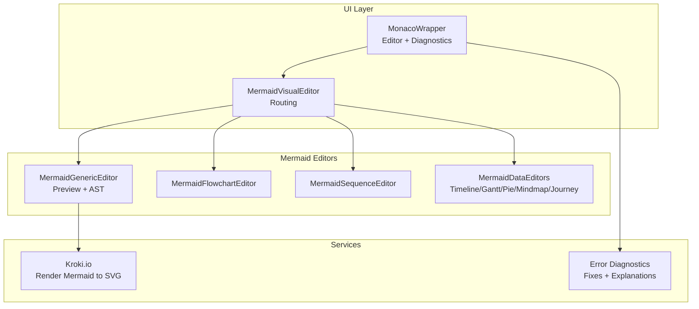
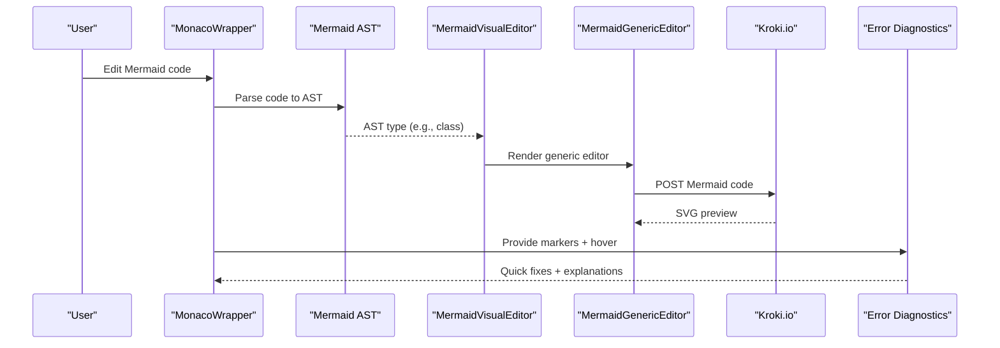
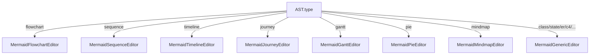
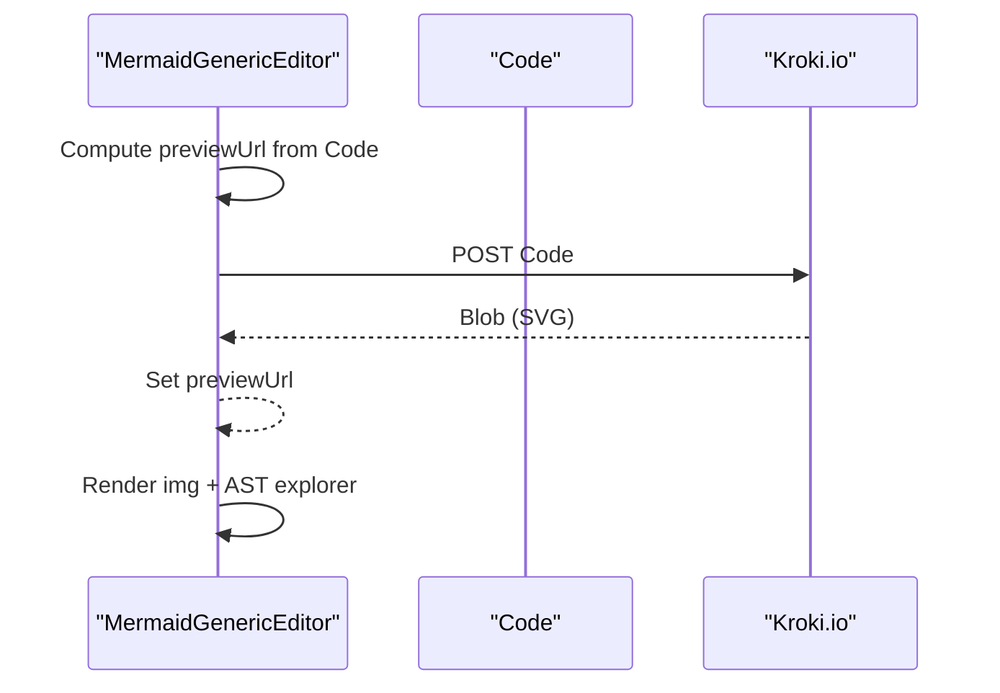
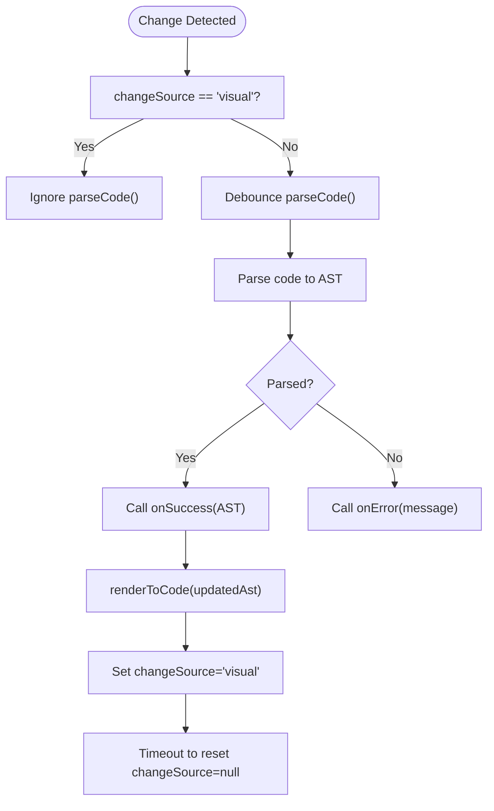
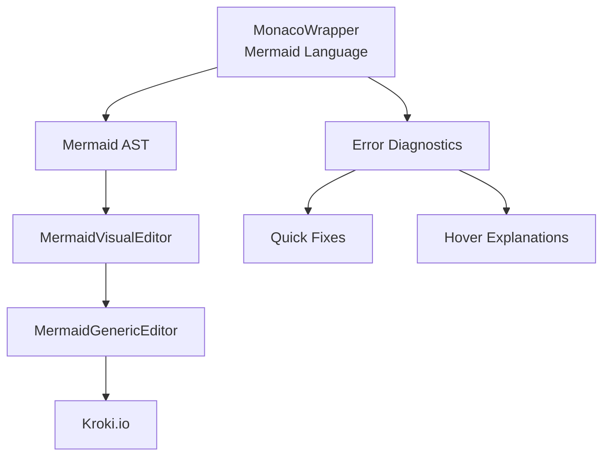

# Class Diagrams

<cite>
**Referenced Files in This Document**
- [index.html](file://index.html)
- [js/config.js](file://js/config.js)
- [js/components/MonacoWrapper.js](file://js/components/MonacoWrapper.js)
- [js/editors/mermaid/index.js](file://js/editors/mermaid/index.js)
- [js/editors/mermaid/MermaidGenericEditor.js](file://js/editors/mermaid/MermaidGenericEditor.js)
- [js/editors/mermaid/MermaidFlowchartEditor.js](file://js/editors/mermaid/MermaidFlowchartEditor.js)
- [js/editors/mermaid/MermaidSequenceEditor.js](file://js/editors/mermaid/MermaidSequenceEditor.js)
- [js/editors/mermaid/MermaidDataEditors.js](file://js/editors/mermaid/MermaidDataEditors.js)
- [js/editors/mermaid/MermaidSyncController.js](file://js/editors/mermaid/MermaidSyncController.js)
- [js/error-diagnostics/fixes.js](file://js/error-diagnostics/fixes.js)
- [js/error-diagnostics/explanations.js](file://js/error-diagnostics/explanations.js)
</cite>

## Table of Contents
1. [Introduction](#introduction)
2. [Project Structure](#project-structure)
3. [Core Components](#core-components)
4. [Architecture Overview](#architecture-overview)
5. [Detailed Component Analysis](#detailed-component-analysis)
6. [Dependency Analysis](#dependency-analysis)
7. [Performance Considerations](#performance-considerations)
8. [Troubleshooting Guide](#troubleshooting-guide)
9. [Conclusion](#conclusion)
10. [Appendices](#appendices)

## Introduction
This document explains how class diagrams are modeled and rendered within the application, focusing on Mermaid class diagrams. It covers class definitions, inheritance, associations, interfaces, abstract classes, enumerations, packages, and common modeling patterns. It also documents how the application integrates syntax highlighting, error diagnostics, and live preview for Mermaid class diagrams.

## Project Structure
The application is a browser-based diagram generator with integrated editors and diagnostics. For Mermaid class diagrams:
- The Monaco editor registers a Mermaid language provider with syntax highlighting and bracket/arrow recognition.
- The Mermaid visual editor routes to a generic editor for class diagrams and renders a live SVG preview via a remote service.
- Error diagnostics provide quick fixes and hover explanations tailored to Mermaid syntax.

**Diagram sources**
- [js/components/MonacoWrapper.js](file://js/components/MonacoWrapper.js#L247-L303)
- [js/editors/mermaid/index.js](file://js/editors/mermaid/index.js#L16-L121)
- [js/editors/mermaid/MermaidGenericEditor.js](file://js/editors/mermaid/MermaidGenericEditor.js#L11-L98)
- [js/editors/mermaid/MermaidFlowchartEditor.js](file://js/editors/mermaid/MermaidFlowchartEditor.js#L10-L276)
- [js/editors/mermaid/MermaidSequenceEditor.js](file://js/editors/mermaid/MermaidSequenceEditor.js#L4-L110)
- [js/editors/mermaid/MermaidDataEditors.js](file://js/editors/mermaid/MermaidDataEditors.js#L6-L306)

**Section sources**
- [js/components/MonacoWrapper.js](file://js/components/MonacoWrapper.js#L13-L169)
- [js/editors/mermaid/index.js](file://js/editors/mermaid/index.js#L16-L121)

## Core Components
- MonacoWrapper: Registers Mermaid language, syntax highlighting, brackets/arrows, and error providers (hover explanations and quick fixes).
- MermaidVisualEditor: Routes to the appropriate editor based on AST type; falls back to a generic editor for class diagrams.
- MermaidGenericEditor: Displays live preview and an AST explorer for any diagram type, including class diagrams.
- MermaidSyncController: Manages AST parsing and rendering to code to prevent sync loops between code and visual editors.
- Error diagnostics: Provides Mermaid-specific fixes and explanations for common syntax errors.

**Section sources**
- [js/components/MonacoWrapper.js](file://js/components/MonacoWrapper.js#L247-L303)
- [js/editors/mermaid/index.js](file://js/editors/mermaid/index.js#L16-L121)
- [js/editors/mermaid/MermaidGenericEditor.js](file://js/editors/mermaid/MermaidGenericEditor.js#L11-L98)
- [js/editors/mermaid/MermaidSyncController.js](file://js/editors/mermaid/MermaidSyncController.js#L9-L93)
- [js/error-diagnostics/fixes.js](file://js/error-diagnostics/fixes.js#L32-L92)
- [js/error-diagnostics/explanations.js](file://js/error-diagnostics/explanations.js#L12-L87)

## Architecture Overview
The Mermaid class diagram pipeline:
- User writes class diagram code in the Monaco editor.
- Monaco highlights Mermaid keywords, shapes, arrows, and labels.
- The Mermaid AST is parsed to route to the visual editor.
- The visual editor uses a generic renderer to display a live SVG preview via Kroki.
- Errors are diagnosed with quick fixes and hover explanations.

**Diagram sources**
- [js/components/MonacoWrapper.js](file://js/components/MonacoWrapper.js#L247-L303)
- [js/editors/mermaid/index.js](file://js/editors/mermaid/index.js#L77-L121)
- [js/editors/mermaid/MermaidGenericEditor.js](file://js/editors/mermaid/MermaidGenericEditor.js#L24-L53)
- [js/error-diagnostics/fixes.js](file://js/error-diagnostics/fixes.js#L32-L92)
- [js/error-diagnostics/explanations.js](file://js/error-diagnostics/explanations.js#L237-L271)

## Detailed Component Analysis

### Mermaid Language and Syntax Highlighting
Mermaid syntax highlighting recognizes diagram types, keywords, arrows, labels, and dates. It treats class-related keywords and classDiagram as diagram type keywords.

Key aspects:
- Keywords include diagram types and constructs like class, interface, state, subgraph, section, etc.
- Arrows are recognized for links between nodes/classes.
- Labels are highlighted as strings for node/class labels.
- Direction keywords (TB, TD, BT, RL, LR) are recognized.

**Section sources**
- [js/components/MonacoWrapper.js](file://js/components/MonacoWrapper.js#L250-L303)

### Mermaid Visual Editor Routing
The visual editor routes to diagram-specific editors based on AST type. For class diagrams, it falls back to the generic editor.

**Diagram sources**
- [js/editors/mermaid/index.js](file://js/editors/mermaid/index.js#L77-L121)

**Section sources**
- [js/editors/mermaid/index.js](file://js/editors/mermaid/index.js#L16-L121)

### Mermaid Generic Editor (Class Diagram Preview)
The generic editor displays a live preview and an AST explorer. It fetches an SVG from Kroki and shows the AST structure.

**Diagram sources**
- [js/editors/mermaid/MermaidGenericEditor.js](file://js/editors/mermaid/MermaidGenericEditor.js#L24-L53)
- [js/editors/mermaid/index.js](file://js/editors/mermaid/index.js#L34-L53)

**Section sources**
- [js/editors/mermaid/MermaidGenericEditor.js](file://js/editors/mermaid/MermaidGenericEditor.js#L11-L98)
- [js/editors/mermaid/index.js](file://js/editors/mermaid/index.js#L20-L61)

### Mermaid Sync Controller
Prevents infinite loops during bidirectional synchronization between code and visual editors. It debounces parsing and resets a change source flag after rendering.

**Diagram sources**
- [js/editors/mermaid/MermaidSyncController.js](file://js/editors/mermaid/MermaidSyncController.js#L21-L58)

**Section sources**
- [js/editors/mermaid/MermaidSyncController.js](file://js/editors/mermaid/MermaidSyncController.js#L9-L93)

### Error Diagnostics for Mermaid
Provides targeted fixes and explanations for common Mermaid errors, including missing diagram declarations, invalid arrows, and unmatched brackets.

Examples of supported patterns:
- Missing diagram type declaration (adds classDiagram or sequenceDiagram).
- Subgraph not closed (suggests adding end).
- Invalid arrow syntax (lists supported arrow forms).

**Section sources**
- [js/error-diagnostics/fixes.js](file://js/error-diagnostics/fixes.js#L32-L92)
- [js/error-diagnostics/explanations.js](file://js/error-diagnostics/explanations.js#L12-L87)

## Dependency Analysis
The Mermaid class diagram feature depends on:
- Monaco language registration for Mermaid.
- AST parsing to route to the visual editor.
- Generic editor for class diagrams.
- Kroki for SVG rendering.
- Error diagnostics for quick fixes and hover explanations.

**Diagram sources**
- [js/components/MonacoWrapper.js](file://js/components/MonacoWrapper.js#L247-L303)
- [js/editors/mermaid/index.js](file://js/editors/mermaid/index.js#L77-L121)
- [js/editors/mermaid/MermaidGenericEditor.js](file://js/editors/mermaid/MermaidGenericEditor.js#L24-L53)
- [js/error-diagnostics/fixes.js](file://js/error-diagnostics/fixes.js#L32-L92)
- [js/error-diagnostics/explanations.js](file://js/error-diagnostics/explanations.js#L237-L271)

**Section sources**
- [js/components/MonacoWrapper.js](file://js/components/MonacoWrapper.js#L247-L303)
- [js/editors/mermaid/index.js](file://js/editors/mermaid/index.js#L77-L121)
- [js/editors/mermaid/MermaidGenericEditor.js](file://js/editors/mermaid/MermaidGenericEditor.js#L24-L53)
- [js/error-diagnostics/fixes.js](file://js/error-diagnostics/fixes.js#L32-L92)
- [js/error-diagnostics/explanations.js](file://js/error-diagnostics/explanations.js#L237-L271)

## Performance Considerations
- Debouncing: The sync controller debounces AST parsing to reduce unnecessary re-renders.
- Preview caching: The generic editor revokes previous preview URLs to prevent memory leaks.
- Minimal re-rendering: The visual editor only updates preview on code changes and cleans up on unmount.

**Section sources**
- [js/editors/mermaid/MermaidSyncController.js](file://js/editors/mermaid/MermaidSyncController.js#L25-L38)
- [js/editors/mermaid/MermaidGenericEditor.js](file://js/editors/mermaid/MermaidGenericEditor.js#L41-L60)

## Troubleshooting Guide
Common class diagram issues and resolutions:
- Missing diagram declaration: Add classDiagram at the top.
- Invalid arrow syntax: Use supported arrow forms (e.g., -->, -.->, ==>).
- Unmatched brackets/braces/parentheses: Ensure all labels and shapes are properly closed.
- Unknown diagram type: Confirm the diagram type keyword is correct.

Quick fixes and hover explanations are provided automatically by the diagnostics system.

**Section sources**
- [js/error-diagnostics/fixes.js](file://js/error-diagnostics/fixes.js#L32-L92)
- [js/error-diagnostics/explanations.js](file://js/error-diagnostics/explanations.js#L12-L87)

## Conclusion
The application provides a robust environment for authoring Mermaid class diagrams with:
- Syntax highlighting tailored to Mermaid constructs.
- A visual editor that routes to a generic renderer for class diagrams.
- Live preview via Kroki and comprehensive error diagnostics with quick fixes and explanations.

## Appendices

### Class Modeling Patterns in Mermaid
- Class definitions: Use class with a body containing fields and methods.
- Interfaces: Use class with stereotype <<interface>>.
- Abstract classes: Use abstract class with {abstract} in the body.
- Enums: Use enum with values listed inside.
- Inheritance: Use --|> for extends.
- Implementation: Use ..|> for implements.
- Composition: Use *-- for composition.
- Aggregation: Use o-- for aggregation.
- Association: Use --> for association.
- Dependency: Use ..> for dependency.
- Packages: Use package {...} to group classes.
- Notes: Use note "..." as N to annotate classes.

These patterns are reflected in the configuration snippets and templates.

**Section sources**
- [js/config.js](file://js/config.js#L133-L146)
- [js/config.js](file://js/config.js#L228-L263)
- [index.html](file://index.html#L202-L209)

### Relationship Types and Notation
- Inheritance (generalization): ChildClass --|> ParentClass
- Implementation: Class ..|> Interface
- Composition: ClassA *-- ClassB
- Aggregation: ClassA o-- ClassB
- Association: ClassA --> ClassB
- Dependency: ClassA ..> ClassB

**Section sources**
- [index.html](file://index.html#L202-L209)
- [js/config.js](file://js/config.js#L133-L146)

### Styling Options and Layout Considerations
- Node shapes: Square brackets [label], parentheses (label), braces {label}, double-parentheses ((label)), brackets with parentheses [label], pipes |label|, and others.
- Arrow styles: -->, -.->, ==>, and labeled arrows with |text|.
- Direction keywords: TB, TD, BT, RL, LR for graph orientation.
- Comments: Use %% for single-line comments.

**Section sources**
- [js/components/MonacoWrapper.js](file://js/components/MonacoWrapper.js#L266-L290)
- [js/components/MonacoWrapper.js](file://js/components/MonacoWrapper.js#L292-L302)