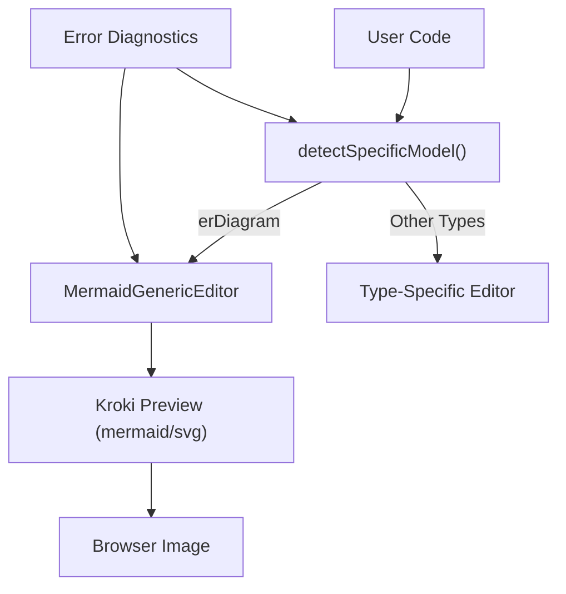
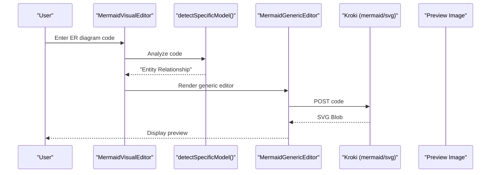
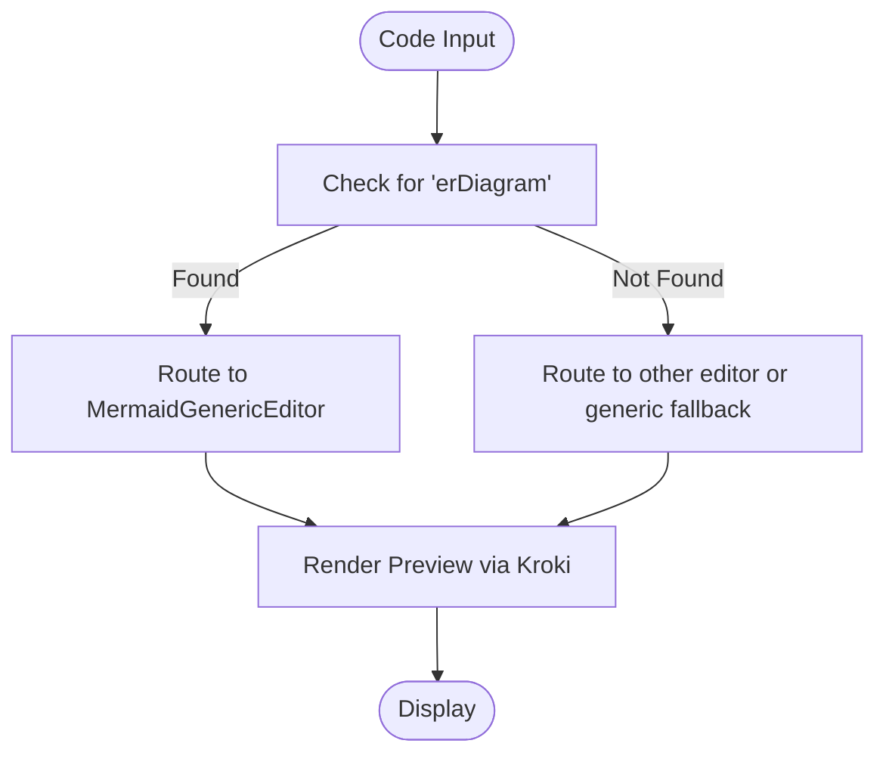
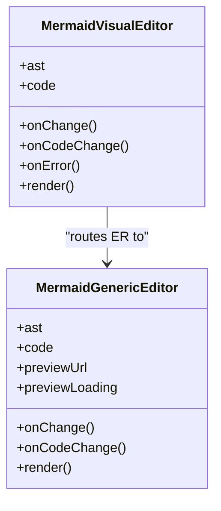
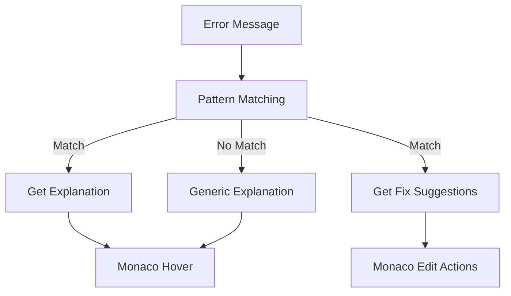
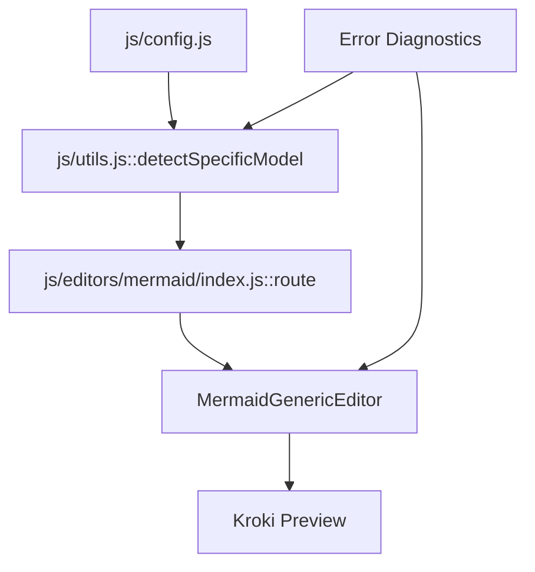

# Entity Relationship Diagrams

<cite>
**Referenced Files in This Document**
- [index.html](file://index.html)
- [config.js](file://js/config.js)
- [utils.js](file://js/utils.js)
- [MermaidGenericEditor.js](file://js/editors/mermaid/MermaidGenericEditor.js)
- [MermaidDataEditors.js](file://js/editors/mermaid/MermaidDataEditors.js)
- [MermaidFlowchartEditor.js](file://js/editors/mermaid/MermaidFlowchartEditor.js)
- [MermaidSequenceEditor.js](file://js/editors/mermaid/MermaidSequenceEditor.js)
- [MermaidSyncController.js](file://js/editors/mermaid/MermaidSyncController.js)
- [index.js](file://js/editors/mermaid/index.js)
- [explanations.js](file://js/error-diagnostics/explanations.js)
- [fixes.js](file://js/error-diagnostics/fixes.js)
</cite>

## Table of Contents
1. [Introduction](#introduction)
2. [Project Structure](#project-structure)
3. [Core Components](#core-components)
4. [Architecture Overview](#architecture-overview)
5. [Detailed Component Analysis](#detailed-component-analysis)
6. [Dependency Analysis](#dependency-analysis)
7. [Performance Considerations](#performance-considerations)
8. [Troubleshooting Guide](#troubleshooting-guide)
9. [Conclusion](#conclusion)
10. [Appendices](#appendices)

## Introduction
This document explains how Entity Relationship (ER) diagrams are supported and rendered within the Universal Diagram Generator. It focuses on the Mermaid ER diagram syntax, how the application detects ER diagrams, and how the visual editor routes to the generic editor for ER diagrams. It also documents the syntax for entity definitions, attribute types, primary and foreign keys, relationship cardinalities, and how the system handles ER-related errors and suggestions.

## Project Structure
The Universal Diagram Generator supports multiple diagram types. For Mermaid ER diagrams, the application:
- Detects ER diagram type from code
- Routes to the generic editor for ER diagrams
- Renders previews via Kroki
- Provides error diagnostics and fix suggestions

**Diagram sources**
- [index.js](file://js/editors/mermaid/index.js#L77-L116)
- [utils.js](file://js/utils.js#L49-L85)
- [index.html](file://index.html#L34-L53)

**Section sources**
- [index.html](file://index.html#L127-L145)
- [js/config.js](file://js/config.js#L58-L69)
- [js/utils.js](file://js/utils.js#L49-L85)
- [js/editors/mermaid/index.js](file://js/editors/mermaid/index.js#L77-L116)

## Core Components
- Diagram detection: The application identifies ER diagrams by scanning for the erDiagram declaration.
- Editor routing: ER diagrams are routed to the generic editor because there is no specialized ER editor.
- Preview rendering: The generic editor requests a live SVG preview from the Kroki service.
- Error diagnostics: The system provides explanations and fix suggestions for ER-related errors.

Key behaviors:
- ER diagram detection uses a regex against the code content.
- The Mermaid generic editor displays a live preview and an AST property panel.
- Error diagnostics map error patterns to human-readable explanations and suggested fixes.

**Section sources**
- [js/utils.js](file://js/utils.js#L53-L64)
- [js/editors/mermaid/index.js](file://js/editors/mermaid/index.js#L77-L116)
- [js/editors/mermaid/MermaidGenericEditor.js](file://js/editors/mermaid/MermaidGenericEditor.js#L11-L98)
- [js/error-diagnostics/explanations.js](file://js/error-diagnostics/explanations.js#L237-L271)
- [js/error-diagnostics/fixes.js](file://js/error-diagnostics/fixes.js#L611-L656)

## Architecture Overview
The ER diagram workflow integrates with the broader diagram generator architecture. The Mermaid ER diagram is treated as a class-like diagram and rendered using the generic editor.

**Diagram sources**
- [js/editors/mermaid/index.js](file://js/editors/mermaid/index.js#L20-L121)
- [js/utils.js](file://js/utils.js#L49-L85)
- [js/editors/mermaid/MermaidGenericEditor.js](file://js/editors/mermaid/MermaidGenericEditor.js#L11-L98)

## Detailed Component Analysis

### ER Diagram Detection and Routing
- Detection: The application checks for the erDiagram keyword to identify ER diagrams.
- Routing: ER diagrams are routed to the generic editor, which provides a live preview and an AST property panel.

**Diagram sources**
- [js/utils.js](file://js/utils.js#L53-L64)
- [js/editors/mermaid/index.js](file://js/editors/mermaid/index.js#L77-L116)

**Section sources**
- [js/utils.js](file://js/utils.js#L53-L64)
- [js/editors/mermaid/index.js](file://js/editors/mermaid/index.js#L77-L116)

### Mermaid ER Diagram Syntax and Semantics
The application supports ER diagrams in two forms:
- Mermaid ER syntax (erDiagram)
- PlantUML ER-like entity blocks

Mermaid ER syntax highlights:
- Entity definitions with attributes
- Relationship declarations with cardinality indicators
- Attribute types and key markers

PlantUML ER-like syntax highlights:
- entity blocks with attribute lists
- primary and foreign key markers
- relationship lines with roles and cardinalities

These examples demonstrate the supported syntax patterns for ER diagrams.

**Section sources**
- [index.html](file://index.html#L317-L335)
- [js/config.js](file://js/config.js#L441-L490)

### Mermaid Generic Editor for ER Diagrams
The generic editor provides:
- Live preview rendering
- AST property panel
- Basic property inspection

It is used for ER diagrams because there is no specialized ER editor.

**Diagram sources**
- [js/editors/mermaid/MermaidGenericEditor.js](file://js/editors/mermaid/MermaidGenericEditor.js#L11-L98)
- [js/editors/mermaid/index.js](file://js/editors/mermaid/index.js#L20-L121)

**Section sources**
- [js/editors/mermaid/MermaidGenericEditor.js](file://js/editors/mermaid/MermaidGenericEditor.js#L11-L98)
- [js/editors/mermaid/index.js](file://js/editors/mermaid/index.js#L77-L116)

### Error Diagnostics and Fix Suggestions for ER Diagrams
The system provides:
- Error explanations mapped to error codes
- Fix suggestions based on error patterns and extracted token information
- Token-to-character mapping for Mermaid parsers

Common ER-related error patterns:
- Missing diagram type declaration
- Unbalanced brackets or braces
- Invalid arrow/link syntax
- ERD-specific bracket issues

**Diagram sources**
- [js/error-diagnostics/explanations.js](file://js/error-diagnostics/explanations.js#L237-L271)
- [js/error-diagnostics/fixes.js](file://js/error-diagnostics/fixes.js#L611-L656)

**Section sources**
- [js/error-diagnostics/explanations.js](file://js/error-diagnostics/explanations.js#L12-L229)
- [js/error-diagnostics/fixes.js](file://js/error-diagnostics/fixes.js#L32-L510)

## Dependency Analysis
The ER diagram support depends on:
- Diagram type detection
- Editor routing
- Preview rendering
- Error diagnostics

**Diagram sources**
- [js/config.js](file://js/config.js#L58-L69)
- [js/utils.js](file://js/utils.js#L49-L85)
- [js/editors/mermaid/index.js](file://js/editors/mermaid/index.js#L77-L116)
- [js/editors/mermaid/MermaidGenericEditor.js](file://js/editors/mermaid/MermaidGenericEditor.js#L11-L98)

**Section sources**
- [js/config.js](file://js/config.js#L58-L69)
- [js/utils.js](file://js/utils.js#L49-L85)
- [js/editors/mermaid/index.js](file://js/editors/mermaid/index.js#L77-L116)
- [js/editors/mermaid/MermaidGenericEditor.js](file://js/editors/mermaid/MermaidGenericEditor.js#L11-L98)

## Performance Considerations
- Preview rendering is debounced to reduce network requests.
- The generic editor avoids heavy computations and focuses on live preview updates.
- Error diagnostics are computed only when errors occur.

[No sources needed since this section provides general guidance]

## Troubleshooting Guide
Common ER diagram issues and resolutions:
- Missing diagram type declaration: Add the erDiagram header.
- Unbalanced brackets/braces: Ensure all constructs are properly closed.
- Invalid arrow/link syntax: Use supported Mermaid arrow syntax.
- ERD-specific bracket issues: Ensure entity names and attribute lists are correctly bracketed.

Use the error explanations and fix suggestions for targeted guidance.

**Section sources**
- [js/error-diagnostics/explanations.js](file://js/error-diagnostics/explanations.js#L237-L271)
- [js/error-diagnostics/fixes.js](file://js/error-diagnostics/fixes.js#L611-L656)

## Conclusion
The Universal Diagram Generator supports ER diagrams by detecting the erDiagram type and rendering them via the generic editor with live preview. While there is no specialized ER editor, the system provides robust error diagnostics and fix suggestions to help users author correct ER diagrams. The documented syntax patterns and troubleshooting steps enable reliable ER modeling within the platform.

[No sources needed since this section summarizes without analyzing specific files]

## Appendices

### Appendix A: ER Diagram Syntax Patterns
- Mermaid ER syntax: entity definitions, attribute lists, and relationship declarations with cardinalities.
- PlantUML ER-like syntax: entity blocks with attribute lists, primary and foreign key markers, and relationships.

**Section sources**
- [index.html](file://index.html#L317-L335)
- [js/config.js](file://js/config.js#L441-L490)

### Appendix B: Relationship Lines and Multiplicity Indicators
- Relationship lines connect entities with roles and cardinalities.
- Multiplicity indicators reflect one-to-one, one-to-many, and many-to-many relationships.

**Section sources**
- [index.html](file://index.html#L217-L222)
- [js/config.js](file://js/config.js#L485-L487)