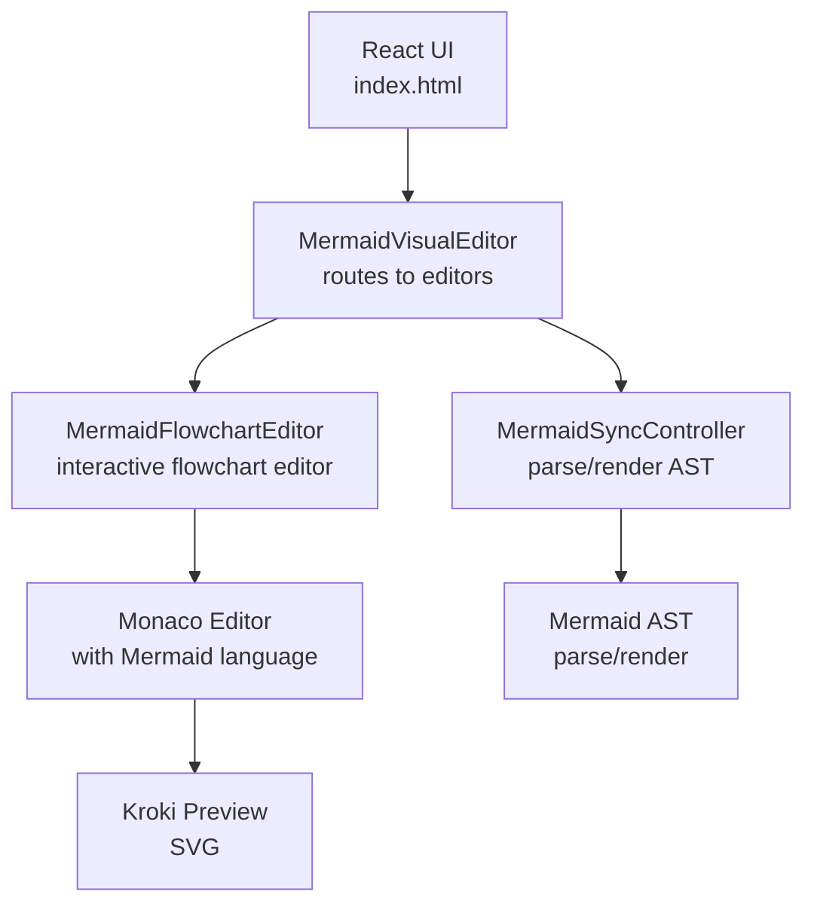
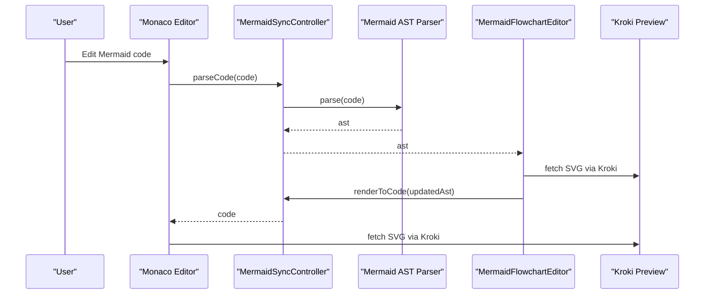
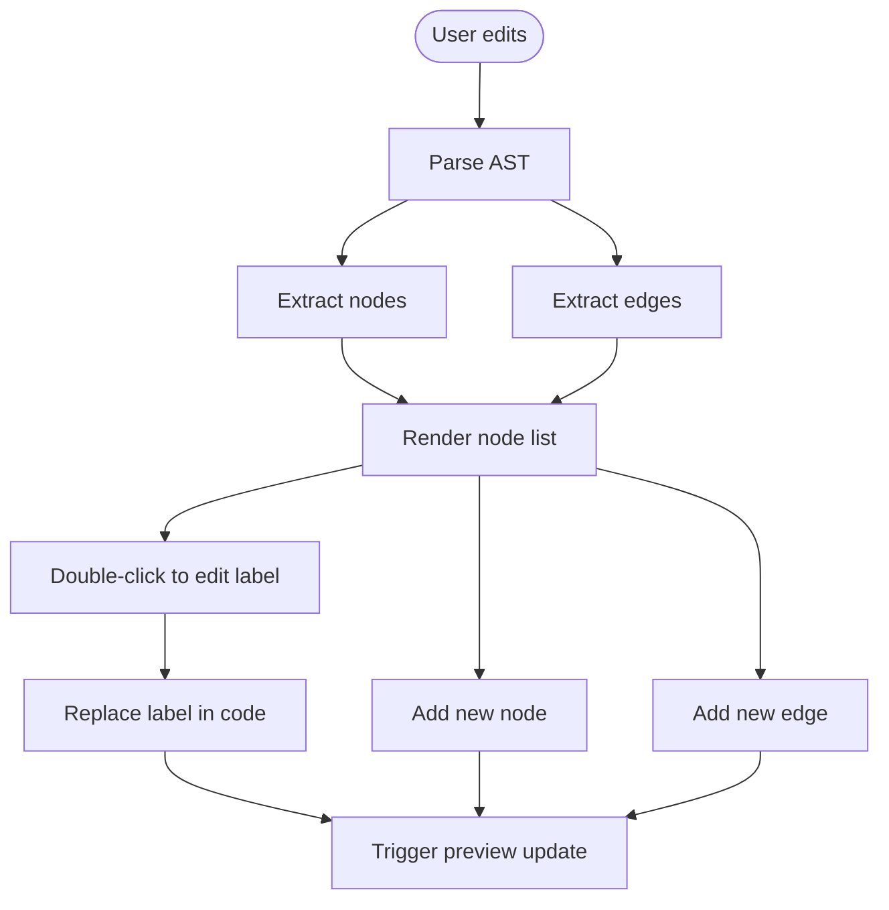
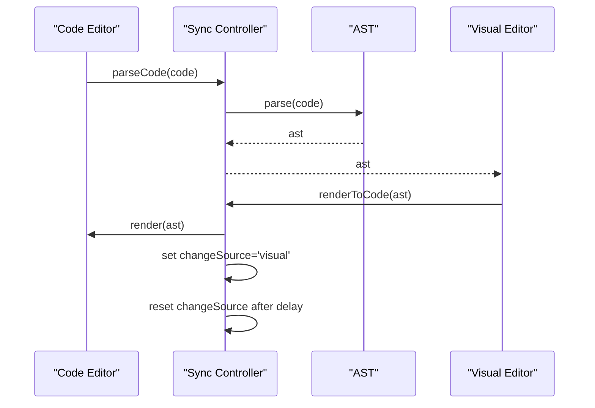
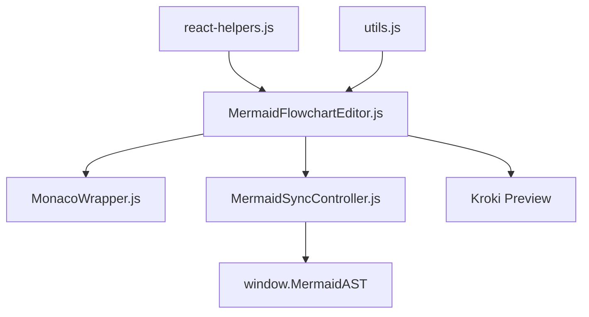

# Flowcharts and Flowchart Types

<cite>
**Referenced Files in This Document**
- [MermaidFlowchartEditor.js](file://js/editors/mermaid/MermaidFlowchartEditor.js)
- [MermaidSyncController.js](file://js/editors/mermaid/MermaidSyncController.js)
- [index.html](file://index.html)
- [explanations.js](file://js/error-diagnostics/explanations.js)
- [fixes.js](file://js/error-diagnostics/fixes.js)
- [MonacoWrapper.js](file://js/components/MonacoWrapper.js)
- [react-helpers.js](file://js/react-helpers.js)
- [utils.js](file://js/utils.js)
</cite>

## Table of Contents
1. [Introduction](#introduction)
2. [Project Structure](#project-structure)
3. [Core Components](#core-components)
4. [Architecture Overview](#architecture-overview)
5. [Detailed Component Analysis](#detailed-component-analysis)
6. [Dependency Analysis](#dependency-analysis)
7. [Performance Considerations](#performance-considerations)
8. [Troubleshooting Guide](#troubleshooting-guide)
9. [Conclusion](#conclusion)
10. [Appendices](#appendices)

## Introduction
This document explains the Mermaid flowchart support in the universal diagram generator, focusing on flowchart syntax, node shapes, connection types, directional options, and styling. It also covers the bi-directional synchronization system between code and visual editors, practical examples, best practices, and troubleshooting of common syntax errors.

## Project Structure
The Mermaid flowchart feature is implemented as a React-based visual editor integrated with a Mermaid AST parser and a live preview via the Kroki service. The key parts are:
- Visual editor for flowcharts with interactive node/edge lists
- Bi-directional synchronization controller to keep code and AST in sync
- Error diagnostics with explanations and fix suggestions
- Monaco editor integration with Mermaid language support

**Diagram sources**
- [index.html](file://index.html#L88-L137)
- [MermaidFlowchartEditor.js](file://js/editors/mermaid/MermaidFlowchartEditor.js#L10-L276)
- [MermaidSyncController.js](file://js/editors/mermaid/MermaidSyncController.js#L9-L93)

**Section sources**
- [index.html](file://index.html#L88-L137)
- [MermaidFlowchartEditor.js](file://js/editors/mermaid/MermaidFlowchartEditor.js#L10-L276)
- [MermaidSyncController.js](file://js/editors/mermaid/MermaidSyncController.js#L9-L93)

## Core Components
- MermaidFlowchartEditor: Parses AST to extract nodes and edges, renders an interactive panel, and edits node labels inline. It also adds new nodes and edges to the code.
- MermaidSyncController: Manages bi-directional synchronization between code and AST, debounces parsing, prevents loops, and detects diagram type.
- Error diagnostics: Provides human-readable explanations and suggested fixes for common Mermaid syntax errors.
- Monaco editor integration: Adds Mermaid language support, syntax highlighting, bracket matching, and direction keywords.

Key responsibilities:
- Flowchart editor: node/edge extraction, inline editing, adding elements, and preview display.
- Sync controller: parse code to AST, render AST back to code, detect diagram type, and guard against infinite loops.
- Diagnostics: explain errors and propose fixes for missing brackets, arrows, and other syntax issues.

**Section sources**
- [MermaidFlowchartEditor.js](file://js/editors/mermaid/MermaidFlowchartEditor.js#L10-L276)
- [MermaidSyncController.js](file://js/editors/mermaid/MermaidSyncController.js#L9-L93)
- [explanations.js](file://js/error-diagnostics/explanations.js#L12-L302)
- [fixes.js](file://js/error-diagnostics/fixes.js#L32-L92)
- [MonacoWrapper.js](file://js/components/MonacoWrapper.js#L271-L303)

## Architecture Overview
The system parses Mermaid code into an AST, routes to the appropriate editor based on AST type, and displays a live SVG preview via Kroki. Changes in the visual editor trigger AST rendering back to code, which updates the preview.

**Diagram sources**
- [MermaidSyncController.js](file://js/editors/mermaid/MermaidSyncController.js#L21-L58)
- [MermaidFlowchartEditor.js](file://js/editors/mermaid/MermaidFlowchartEditor.js#L18-L59)
- [index.html](file://index.html#L34-L53)

## Detailed Component Analysis

### Flowchart Editor
The flowchart editor extracts nodes and edges from the AST, maintains selection and inline editing state, and updates the code when labels change. It supports adding new nodes and edges and displays a live preview.

Key behaviors:
- Extract nodes and edges from AST (supports both Map and Array forms).
- Inline editing of node labels with multiple bracket types supported.
- Adding new nodes and edges appends code with proper formatting.
- Displays a preview image from Kroki.

**Diagram sources**
- [MermaidFlowchartEditor.js](file://js/editors/mermaid/MermaidFlowchartEditor.js#L18-L124)

**Section sources**
- [MermaidFlowchartEditor.js](file://js/editors/mermaid/MermaidFlowchartEditor.js#L10-L276)

### Bi-directional Synchronization Controller
The controller manages AST state and prevents infinite loops during synchronization. It debounces parsing, sets a change source flag, and resets it after rendering.

Highlights:
- Debounced parseCode to avoid frequent re-parsing.
- changeSource flag to block parsing when triggered by visual changes.
- renderToCode returns code from AST and resets changeSource asynchronously.
- detectType uses MermaidAST to infer diagram type.

**Diagram sources**
- [MermaidSyncController.js](file://js/editors/mermaid/MermaidSyncController.js#L21-L58)

**Section sources**
- [MermaidSyncController.js](file://js/editors/mermaid/MermaidSyncController.js#L9-L93)

### Error Diagnostics and Fixes
The system provides explanations for common Mermaid errors and suggests fixes. It maps error messages to explanations and patterns, and offers quick-fix actions for missing brackets, arrows, and other syntax issues.

Examples of covered errors:
- Missing closing bracket, parenthesis, or brace
- Invalid arrow syntax
- Unexpected token or unrecognized text
- Unknown diagram type

Fix suggestions include inserting the expected token or adding diagram declarations.

**Section sources**
- [explanations.js](file://js/error-diagnostics/explanations.js#L12-L302)
- [fixes.js](file://js/error-diagnostics/fixes.js#L32-L92)

### Monaco Editor Integration
Monaco is configured for Mermaid with:
- Syntax highlighting for diagram keywords and directions
- Bracket pairs and auto-closing
- Direction keywords (TB, TD, BT, RL, LR) highlighted as keywords
- Arrow operators recognized for flowchart links

These features improve readability and reduce syntax errors.

**Section sources**
- [MonacoWrapper.js](file://js/components/MonacoWrapper.js#L271-L303)

## Dependency Analysis
The flowchart feature depends on:
- React and JSX-like syntax via htm
- Mermaid AST parser for parsing and rendering
- Monaco editor for code editing and diagnostics
- Kroki service for SVG previews
- Utility functions for encoding and detection

**Diagram sources**
- [react-helpers.js](file://js/react-helpers.js#L4-L39)
- [utils.js](file://js/utils.js#L1-L177)
- [MermaidFlowchartEditor.js](file://js/editors/mermaid/MermaidFlowchartEditor.js#L4-L6)
- [MermaidSyncController.js](file://js/editors/mermaid/MermaidSyncController.js#L28-L32)
- [index.html](file://index.html#L34-L53)

**Section sources**
- [react-helpers.js](file://js/react-helpers.js#L4-L39)
- [utils.js](file://js/utils.js#L1-L177)
- [MermaidFlowchartEditor.js](file://js/editors/mermaid/MermaidFlowchartEditor.js#L4-L6)
- [MermaidSyncController.js](file://js/editors/mermaid/MermaidSyncController.js#L28-L32)
- [index.html](file://index.html#L34-L53)

## Performance Considerations
- Debouncing: The sync controller debounces parseCode to avoid excessive parsing during rapid edits.
- Change-source gating: changeSource prevents infinite loops when visual changes trigger code updates.
- Preview throttling: The preview fetch is delayed slightly to avoid frequent network requests.
- AST caching: The controller stores the last AST to minimize repeated parsing.

Best practices:
- Keep edits focused to reduce AST churn.
- Use subgraphs to organize complex flowcharts.
- Prefer concise node labels to improve readability.

[No sources needed since this section provides general guidance]

## Troubleshooting Guide
Common issues and resolutions:
- Missing closing bracket/parenthesis/brace: The diagnostics explain the problem and show correct syntax examples.
- Invalid arrow syntax: Suggestions include using standard, dotted, or thick arrows.
- Unexpected token or unrecognized text: Check for typos in keywords and ensure proper diagram type declaration.
- Unknown diagram type: Ensure the first line declares a valid diagram type.

Quick fixes:
- Insert the missing token at the error position.
- Add a diagram declaration at the top of the file.
- Close subgraphs and blocks properly.

**Section sources**
- [explanations.js](file://js/error-diagnostics/explanations.js#L12-L302)
- [fixes.js](file://js/error-diagnostics/fixes.js#L611-L656)

## Conclusion
The Mermaid flowchart support integrates a visual editor with AST-based synchronization, live previews, and robust error diagnostics. It provides a practical way to create and maintain flowcharts with clear feedback and helpful fixes for common syntax errors.

[No sources needed since this section summarizes without analyzing specific files]

## Appendices

### Flowchart Syntax and Node Shapes
- Node shapes: square brackets for rectangles, parentheses for rounded nodes, braces for diamonds, and specialized shapes like double circles and stadiums.
- Decision nodes: use braces to represent branching conditions.
- Subgraphs: group related nodes for clarity.

**Section sources**
- [index.html](file://index.html#L149-L227)
- [explanations.js](file://js/error-diagnostics/explanations.js#L14-L41)

### Connection Types and Directional Options
- Arrows: solid, dotted, and thick variants for different semantics.
- Direction keywords: TD (top-down), LR (left-right), TB (bottom-top), RL (right-left).
- Edge labels: text annotations on arrows.

**Section sources**
- [explanations.js](file://js/error-diagnostics/explanations.js#L42-L52)
- [MonacoWrapper.js](file://js/components/MonacoWrapper.js#L276-L276)
- [index.html](file://index.html#L229-L238)

### Practical Examples and Best Practices
- Use templates and snippets to bootstrap diagrams quickly.
- Keep node labels short and descriptive.
- Group related steps into subgraphs.
- Use direction keywords to control layout orientation.

**Section sources**
- [index.html](file://index.html#L229-L397)