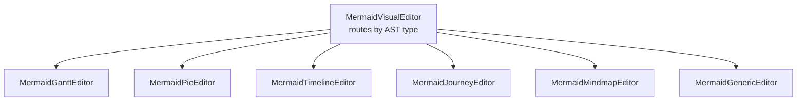
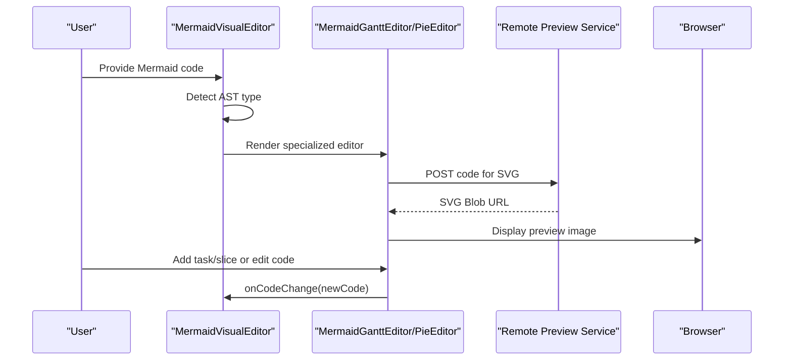
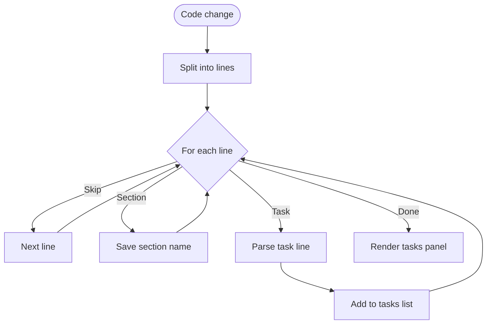
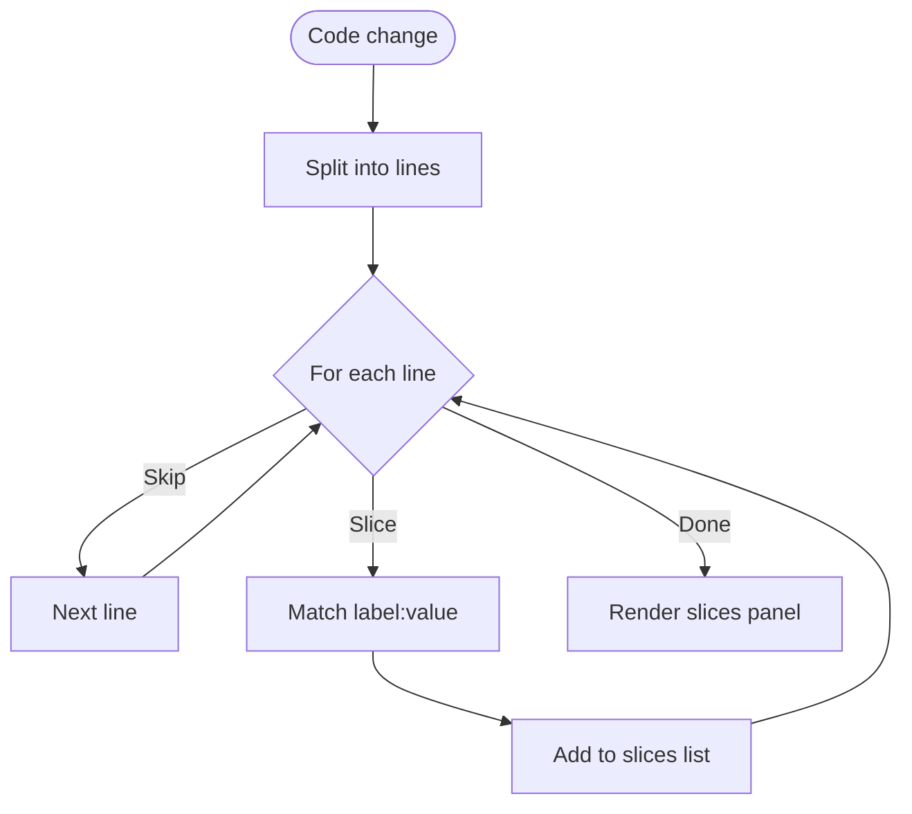
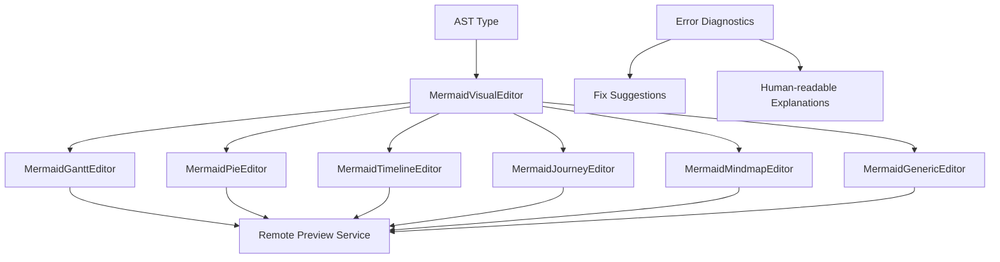

# Gantt Charts and Pie Charts

<cite>
**Referenced Files in This Document**
- [index.html](file://index.html)
- [MermaidDataEditors.js](file://js/editors/mermaid/MermaidDataEditors.js)
- [MermaidGenericEditor.js](file://js/editors/mermaid/MermaidGenericEditor.js)
- [MermaidVisualEditor.js](file://js/editors/mermaid/index.js)
- [explanations.js](file://js/error-diagnostics/explanations.js)
- [fixes.js](file://js/error-diagnostics/fixes.js)
</cite>

## Table of Contents
1. [Introduction](#introduction)
2. [Project Structure](#project-structure)
3. [Core Components](#core-components)
4. [Architecture Overview](#architecture-overview)
5. [Detailed Component Analysis](#detailed-component-analysis)
6. [Dependency Analysis](#dependency-analysis)
7. [Performance Considerations](#performance-considerations)
8. [Troubleshooting Guide](#troubleshooting-guide)
9. [Conclusion](#conclusion)
10. [Appendices](#appendices)

## Introduction
This document explains how Gantt charts and pie charts are supported in the Mermaid editor within this project. It covers:
- How Gantt charts represent tasks, milestones, and dependencies
- How pie charts represent data slices and totals
- How the visual editor routes to specialized editors for these chart types
- Practical examples and best practices for project planning and data visualization
- Differences from flowchart-based diagrams

## Project Structure
The Mermaid editor is composed of:
- A router that selects the appropriate editor based on the parsed AST type
- Specialized editors for data-oriented charts (Gantt, Pie, Timeline, Journey, Mindmap)
- A generic fallback editor for unsupported or unknown diagram types
- Error diagnostics and fix suggestions tailored to Mermaid syntax

**Diagram sources**
- [MermaidVisualEditor.js](file://js/editors/mermaid/index.js#L77-L117)
- [MermaidDataEditors.js](file://js/editors/mermaid/MermaidDataEditors.js#L90-L203)

**Section sources**
- [MermaidVisualEditor.js](file://js/editors/mermaid/index.js#L1-L137)
- [MermaidDataEditors.js](file://js/editors/mermaid/MermaidDataEditors.js#L1-L306)

## Core Components
- MermaidVisualEditor: Routes to the correct editor based on AST type. It handles live preview generation via a remote service and passes props to the selected editor.
- MermaidGanttEditor: Parses Gantt code to extract tasks and sections, and provides a UI to add new tasks.
- MermaidPieEditor: Parses pie slices and values, and provides a UI to add new slices.
- MermaidTimelineEditor, MermaidJourneyEditor, MermaidMindmapEditor: Additional editors for timeline, user journey, and mindmap.
- MermaidGenericEditor: Fallback editor that displays a live preview and an AST explorer.

Key behaviors:
- Live preview: The editor requests SVG rendering from a remote service and displays it in an img element.
- Code synchronization: Editors accept an onCodeChange callback to update the source code.
- AST-driven routing: The router inspects the AST type and chooses the appropriate editor.

**Section sources**
- [MermaidVisualEditor.js](file://js/editors/mermaid/index.js#L20-L121)
- [MermaidDataEditors.js](file://js/editors/mermaid/MermaidDataEditors.js#L90-L203)
- [MermaidGenericEditor.js](file://js/editors/mermaid/MermaidGenericEditor.js#L11-L98)

## Architecture Overview
The Mermaid editor pipeline:
- Parse Mermaid source into an AST
- Route to a specialized editor based on AST type
- Render live preview via a remote service
- Allow users to edit code or use editor-specific controls

**Diagram sources**
- [MermaidVisualEditor.js](file://js/editors/mermaid/index.js#L24-L53)
- [MermaidDataEditors.js](file://js/editors/mermaid/MermaidDataEditors.js#L118-L118)

## Detailed Component Analysis

### Gantt Chart Editor
Purpose:
- Visualize project schedules with tasks, milestones, and dependencies
- Provide quick-add controls to insert new tasks

How it works:
- Parses code to extract tasks and sections
- Filters out metadata lines (title, date formats, comments)
- Highlights tasks with their associated section
- Adds new tasks via onCodeChange

**Diagram sources**
- [MermaidDataEditors.js](file://js/editors/mermaid/MermaidDataEditors.js#L94-L116)

Key capabilities:
- Extract tasks and sections from Gantt code
- Add new tasks with a default placeholder
- Display live preview via remote service

Integration notes:
- Uses the same preview mechanism as other editors
- Works alongside other Mermaid diagram types

**Section sources**
- [MermaidDataEditors.js](file://js/editors/mermaid/MermaidDataEditors.js#L90-L151)

### Pie Chart Editor
Purpose:
- Visualize categorical data distributions as slices
- Provide quick-add controls to insert new slices

How it works:
- Parses code to extract labeled slices and numeric values
- Displays slice labels and values in a panel
- Adds new slices via onCodeChange

**Diagram sources**
- [MermaidDataEditors.js](file://js/editors/mermaid/MermaidDataEditors.js#L157-L169)

Key capabilities:
- Extract slices and values from pie code
- Add new slices with a default placeholder
- Display live preview via remote service

**Section sources**
- [MermaidDataEditors.js](file://js/editors/mermaid/MermaidDataEditors.js#L153-L203)

### Timeline Editor
Purpose:
- Visualize chronological events across periods and sections
- Provide quick-add controls to insert new sections and periods

How it works:
- Parses code to extract sections and periods
- Displays hierarchical structure in a panel
- Adds new sections and periods via onCodeChange

**Section sources**
- [MermaidDataEditors.js](file://js/editors/mermaid/MermaidDataEditors.js#L6-L88)

### Journey Editor
Purpose:
- Visualize user journey steps with scores and actors
- Provide quick-add controls to insert new tasks

How it works:
- Parses code to extract tasks, scores, and actors
- Displays tasks with color-coded scores
- Adds new tasks via onCodeChange

**Section sources**
- [MermaidDataEditors.js](file://js/editors/mermaid/MermaidDataEditors.js#L236-L305)

### Mindmap Editor
Purpose:
- Visualize hierarchical ideas and branches
- Provide quick-add controls to insert new nodes

How it works:
- Provides a simple interface to add nodes
- Encourages editing in code view for indentation-based structure

**Section sources**
- [MermaidDataEditors.js](file://js/editors/mermaid/MermaidDataEditors.js#L205-L234)

### Generic Editor
Purpose:
- Fallback for unsupported or unknown diagram types
- Display live preview and AST structure

How it works:
- Renders a live preview image
- Shows AST structure in a collapsible panel
- Provides guidance for advanced editing in code view

**Section sources**
- [MermaidGenericEditor.js](file://js/editors/mermaid/MermaidGenericEditor.js#L11-L98)

## Dependency Analysis
The Mermaid editor stack depends on:
- AST detection to route to the correct editor
- Remote preview service for SVG rendering
- Editor-specific parsers to extract structured data from code
- Error diagnostics for helpful explanations and fixes

**Diagram sources**
- [MermaidVisualEditor.js](file://js/editors/mermaid/index.js#L77-L117)
- [MermaidDataEditors.js](file://js/editors/mermaid/MermaidDataEditors.js#L90-L203)
- [explanations.js](file://js/error-diagnostics/explanations.js#L12-L229)
- [fixes.js](file://js/error-diagnostics/fixes.js#L32-L92)

**Section sources**
- [MermaidVisualEditor.js](file://js/editors/mermaid/index.js#L20-L121)
- [explanations.js](file://js/error-diagnostics/explanations.js#L12-L229)
- [fixes.js](file://js/error-diagnostics/fixes.js#L32-L92)

## Performance Considerations
- Preview throttling: The editor waits briefly before requesting a new preview to avoid excessive network calls.
- Minimal re-rendering: Editors rely on code change callbacks and simple state updates to keep UI responsive.
- Efficient parsing: Editors parse code only when the code changes, focusing on relevant lines.

[No sources needed since this section provides general guidance]

## Troubleshooting Guide
Common Mermaid errors and how to address them:
- Unknown diagram type: Ensure the diagram type declaration is present and correct.
- Missing closing brackets/parentheses/braces: Ensure all node shapes and blocks are properly closed.
- Invalid arrow syntax: Use supported arrow types for the diagram type.
- Unexpected tokens: Check for typos or misplaced characters.

Fix suggestions:
- Add missing diagram type declaration
- Close subgraphs with end
- Use supported arrow syntax

**Section sources**
- [explanations.js](file://js/error-diagnostics/explanations.js#L74-L87)
- [fixes.js](file://js/error-diagnostics/fixes.js#L34-L91)

## Conclusion
The Mermaid editor in this project provides specialized editors for Gantt charts and pie charts, enabling structured project planning and data visualization. By extracting tasks and slices from code, offering quick-add controls, and displaying live previews, the editors streamline authoring and iteration. The AST-driven router ensures the correct editor is used, while error diagnostics help resolve syntax issues quickly.

[No sources needed since this section summarizes without analyzing specific files]

## Appendices

### Syntax Differences from Flowchart-Based Diagrams
- Gantt charts focus on time-based scheduling with tasks, milestones, and dependencies, using section blocks and task definitions with identifiers and durations.
- Pie charts focus on categorical data with labeled slices and numeric values, using title and slice declarations.
- Flowchart-based diagrams emphasize node shapes and links, using arrows and branching logic.

**Section sources**
- [index.html](file://index.html#L223-L228)
- [index.html](file://index.html#L229-L232)
- [index.html](file://index.html#L336-L351)
- [index.html](file://index.html#L352-L359)

### Example Scenarios
- Project planning with Gantt: Define sections for Planning, Development, and Testing; add tasks with start dates and durations; use after to express dependencies.
- Data visualization with Pie: Define a title; add slices with labels and values; optionally enable data display.

**Section sources**
- [index.html](file://index.html#L336-L351)
- [index.html](file://index.html#L352-L359)

### Best Practices
- Keep task identifiers unique and meaningful
- Use consistent date formats and durations
- Group related tasks under sections
- Use clear labels and values for pie slices
- Leverage quick-add controls to iterate quickly

[No sources needed since this section provides general guidance]