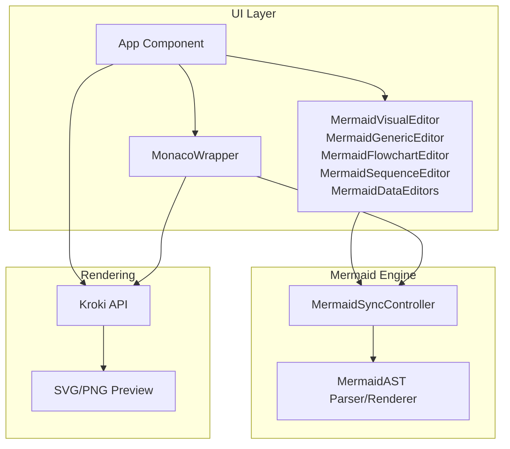
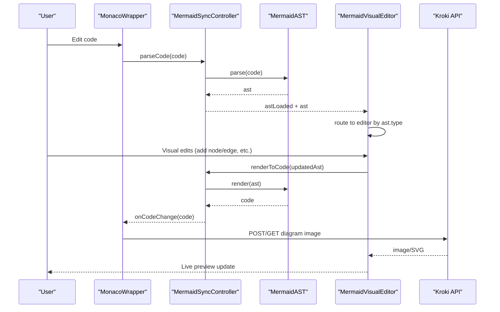
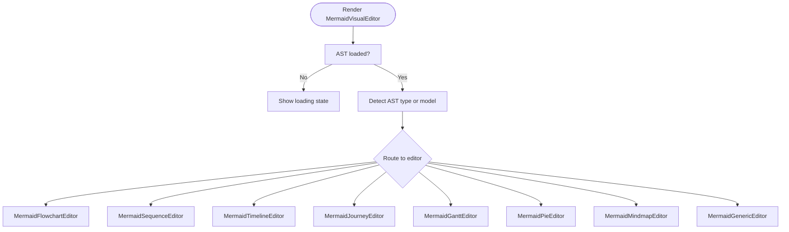
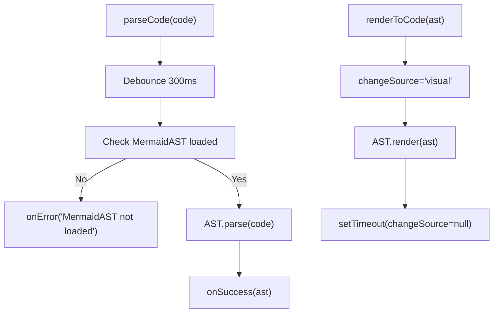
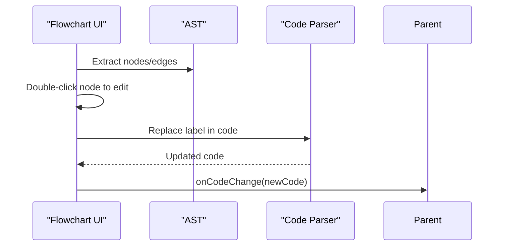
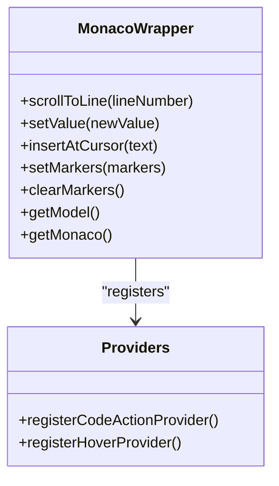
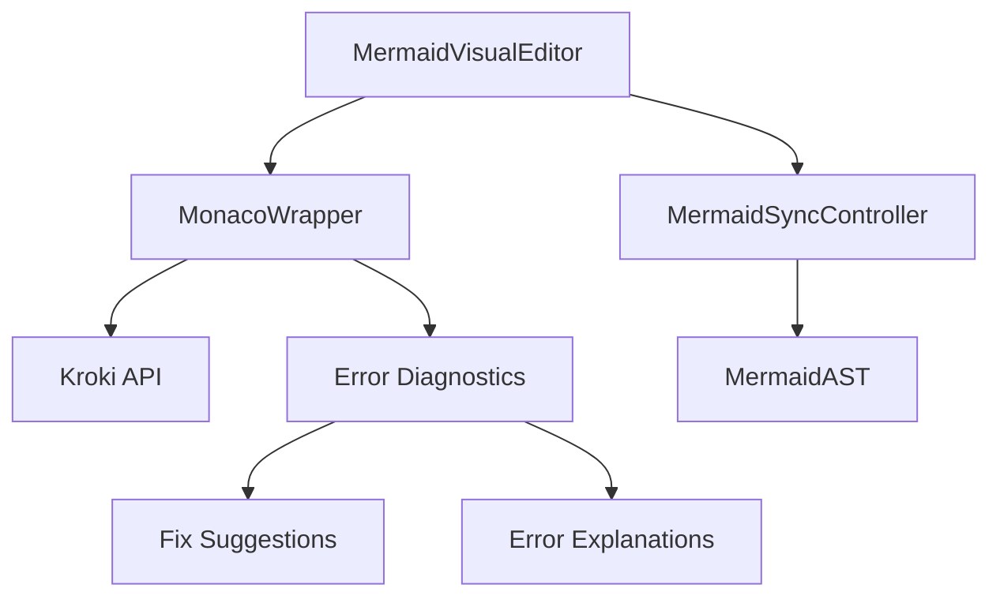

# Mermaid Diagrams

<cite>
**Referenced Files in This Document**
- [index.html](file://index.html)
- [MermaidVisualEditor.js](file://js/editors/mermaid/index.js)
- [MermaidSyncController.js](file://js/editors/mermaid/MermaidSyncController.js)
- [MermaidGenericEditor.js](file://js/editors/mermaid/MermaidGenericEditor.js)
- [MermaidFlowchartEditor.js](file://js/editors/mermaid/MermaidFlowchartEditor.js)
- [MermaidSequenceEditor.js](file://js/editors/mermaid/MermaidSequenceEditor.js)
- [MermaidDataEditors.js](file://js/editors/mermaid/MermaidDataEditors.js)
- [MonacoWrapper.js](file://js/components/MonacoWrapper.js)
- [explanations.js](file://js/error-diagnostics/explanations.js)
- [fixes.js](file://js/error-diagnostics/fixes.js)
- [config.js](file://js/config.js)
- [react-helpers.js](file://js/react-helpers.js)
</cite>

## Table of Contents
1. [Introduction](#introduction)
2. [Project Structure](#project-structure)
3. [Core Components](#core-components)
4. [Architecture Overview](#architecture-overview)
5. [Detailed Component Analysis](#detailed-component-analysis)
6. [Dependency Analysis](#dependency-analysis)
7. [Performance Considerations](#performance-considerations)
8. [Troubleshooting Guide](#troubleshooting-guide)
9. [Conclusion](#conclusion)
10. [Appendices](#appendices)

## Introduction
This document explains the Mermaid diagram support in the universal diagram generator. It covers all diagram types supported by the Mermaid editor: flowcharts, sequence diagrams, class diagrams, state diagrams, entity relationship diagrams, Gantt charts, pie charts, timelines, user journeys, mind maps, git graphs, and quadrant charts. It also documents Mermaid syntax, node types, connection styles, styling options, formatting capabilities, and the bi-directional synchronization system with AST processing, change detection mechanisms, and real-time preview updates. The visual editor features, template system, and integration with the Monaco Editor are included, along with practical examples, best practices, and troubleshooting common syntax errors.

## Project Structure
The Mermaid editor is implemented as a modular React-based system integrated with Monaco Editor and Kroki for rendering previews. The key parts are:
- Router component that selects the appropriate editor based on AST type
- Specialized editors for flowcharts, sequence diagrams, and data/chart types
- A generic fallback editor with live preview and AST explorer
- A synchronization controller that parses code to AST and renders AST back to code
- Monaco integration with language registration, error providers, and quick fixes
- Error diagnostics with explanations and automated fix suggestions
- Configuration for diagram types, templates, and snippets

**Diagram sources**
- [index.html](file://index.html#L1398-L1599)
- [MermaidVisualEditor.js](file://js/editors/mermaid/index.js#L20-L121)
- [MermaidSyncController.js](file://js/editors/mermaid/MermaidSyncController.js#L9-L92)
- [MonacoWrapper.js](file://js/components/MonacoWrapper.js#L13-L169)

**Section sources**
- [index.html](file://index.html#L1398-L1599)
- [MermaidVisualEditor.js](file://js/editors/mermaid/index.js#L20-L121)
- [MermaidSyncController.js](file://js/editors/mermaid/MermaidSyncController.js#L9-L92)
- [MonacoWrapper.js](file://js/components/MonacoWrapper.js#L13-L169)

## Core Components
- MermaidVisualEditor: Routes to diagram-specific editors based on AST type and manages live preview generation via Kroki.
- MermaidSyncController: Provides AST parsing, AST-to-code rendering, type detection, and prevents sync loops during bi-directional editing.
- MermaidGenericEditor: Fallback editor with live preview and AST explorer for unsupported diagram types.
- MermaidFlowchartEditor: Interactive node/edge editor for flowcharts with inline editing and add-node/add-edge actions.
- MermaidSequenceEditor: Editor for sequence diagrams with participant/message lists and add actions.
- MermaidDataEditors: Editors for timeline, gantt, pie, mindmap, and user journey with element extraction and add actions.
- MonacoWrapper: Integrates Monaco Editor with Mermaid language support, error providers, quick fixes, and hover explanations.
- Error Diagnostics: Parses errors, extracts locations, categorizes issues, and provides explanations and fix suggestions.
- Configuration: Defines diagram types, templates, and snippets for Mermaid and PlantUML.

**Section sources**
- [MermaidVisualEditor.js](file://js/editors/mermaid/index.js#L20-L121)
- [MermaidSyncController.js](file://js/editors/mermaid/MermaidSyncController.js#L9-L92)
- [MermaidGenericEditor.js](file://js/editors/mermaid/MermaidGenericEditor.js#L11-L101)
- [MermaidFlowchartEditor.js](file://js/editors/mermaid/MermaidFlowchartEditor.js#L10-L276)
- [MermaidSequenceEditor.js](file://js/editors/mermaid/MermaidSequenceEditor.js#L4-L110)
- [MermaidDataEditors.js](file://js/editors/mermaid/MermaidDataEditors.js#L6-L306)
- [MonacoWrapper.js](file://js/components/MonacoWrapper.js#L13-L169)
- [explanations.js](file://js/error-diagnostics/explanations.js#L12-L302)
- [fixes.js](file://js/error-diagnostics/fixes.js#L11-L403)
- [config.js](file://js/config.js#L58-L116)

## Architecture Overview
The Mermaid editor pipeline:
- Code input is processed by Monaco with Mermaid language support.
- For Mermaid diagrams, AST parsing occurs asynchronously via MermaidAST.
- The router selects a specialized editor based on AST type or detected model.
- Real-time preview is generated by sending code to the Kroki service.
- Bi-directional sync ensures changes in the visual editor do not trigger code parsing loops.

**Diagram sources**
- [MermaidSyncController.js](file://js/editors/mermaid/MermaidSyncController.js#L21-L58)
- [MermaidVisualEditor.js](file://js/editors/mermaid/index.js#L20-L121)
- [MonacoWrapper.js](file://js/components/MonacoWrapper.js#L13-L169)
- [index.html](file://index.html#L794-L808)

**Section sources**
- [MermaidSyncController.js](file://js/editors/mermaid/MermaidSyncController.js#L9-L92)
- [MermaidVisualEditor.js](file://js/editors/mermaid/index.js#L20-L121)
- [MonacoWrapper.js](file://js/components/MonacoWrapper.js#L13-L169)
- [index.html](file://index.html#L794-L808)

## Detailed Component Analysis

### MermaidVisualEditor
- Routes to specialized editors based on AST type (flowchart, sequence, timeline, journey, gantt, pie, mindmap) or falls back to the generic editor.
- Generates live preview URLs via Kroki and debounces requests to avoid excessive network usage.
- Displays loading states and cleans up preview URLs on unmount.

**Diagram sources**
- [MermaidVisualEditor.js](file://js/editors/mermaid/index.js#L20-L121)

**Section sources**
- [MermaidVisualEditor.js](file://js/editors/mermaid/index.js#L20-L121)
- [index.html](file://index.html#L821-L860)

### MermaidSyncController
- Prevents infinite loops by tracking change source and debouncing parse operations.
- Parses code to AST and renders AST back to code for visual editor changes.
- Detects diagram type from code and exposes load status.

**Diagram sources**
- [MermaidSyncController.js](file://js/editors/mermaid/MermaidSyncController.js#L21-L58)

**Section sources**
- [MermaidSyncController.js](file://js/editors/mermaid/MermaidSyncController.js#L9-L92)

### MermaidGenericEditor
- Provides a live preview pane and a properties panel showing diagram type and AST structure.
- Useful for unsupported diagram types or as a diagnostic tool.

**Section sources**
- [MermaidGenericEditor.js](file://js/editors/mermaid/MermaidGenericEditor.js#L11-L101)

### MermaidFlowchartEditor
- Extracts nodes and edges from AST and displays them in a list panel.
- Supports inline editing of node labels and adding new nodes/edges.
- Uses multiple bracket patterns to replace labels accurately.

**Diagram sources**
- [MermaidFlowchartEditor.js](file://js/editors/mermaid/MermaidFlowchartEditor.js#L18-L105)

**Section sources**
- [MermaidFlowchartEditor.js](file://js/editors/mermaid/MermaidFlowchartEditor.js#L10-L276)

### MermaidSequenceEditor
- Extracts participants and messages from AST and displays them in a list panel.
- Supports adding new participants and messages via code injection.

**Section sources**
- [MermaidSequenceEditor.js](file://js/editors/mermaid/MermaidSequenceEditor.js#L4-L110)

### MermaidDataEditors
- Timeline Editor: Parses sections and periods, supports adding sections and periods.
- Gantt Editor: Parses tasks and sections, supports adding tasks.
- Pie Editor: Parses slices, supports adding slices.
- Mindmap Editor: Adds nodes via code insertion.
- Journey Editor: Parses tasks with scores and actors, supports adding tasks.

**Section sources**
- [MermaidDataEditors.js](file://js/editors/mermaid/MermaidDataEditors.js#L6-L306)

### Monaco Integration
- Registers Mermaid language with syntax highlighting and bracket pairs.
- Provides code actions (quick fixes) and hover explanations for errors.
- Exposes imperative methods for scrolling to line, setting markers, inserting text, and getting the editor model.

**Diagram sources**
- [MonacoWrapper.js](file://js/components/MonacoWrapper.js#L21-L84)
- [MonacoWrapper.js](file://js/components/MonacoWrapper.js#L318-L423)

**Section sources**
- [MonacoWrapper.js](file://js/components/MonacoWrapper.js#L13-L169)
- [MonacoWrapper.js](file://js/components/MonacoWrapper.js#L318-L423)

### Error Diagnostics
- Parses error text to extract line/column, categorizes error codes, and generates fix suggestions.
- Converts parsed errors to Monaco markers and provides hover explanations with examples and links.

**Section sources**
- [explanations.js](file://js/error-diagnostics/explanations.js#L13-L302)
- [fixes.js](file://js/error-diagnostics/fixes.js#L11-L403)

### Configuration and Templates
- Defines Mermaid diagram types, extensions, and example code.
- Provides Mermaid snippets and templates for quick start.

**Section sources**
- [config.js](file://js/config.js#L58-L116)
- [index.html](file://index.html#L203-L371)

## Dependency Analysis
- MermaidVisualEditor depends on MonacoWrapper for code editing and MermaidSyncController for AST synchronization.
- MonacoWrapper depends on the Monaco Editor library and registers Mermaid language and error providers.
- Error diagnostics modules depend on error patterns and explanations to provide actionable feedback.
- The system integrates with Kroki for rendering previews.

**Diagram sources**
- [MermaidVisualEditor.js](file://js/editors/mermaid/index.js#L20-L121)
- [MermaidSyncController.js](file://js/editors/mermaid/MermaidSyncController.js#L9-L92)
- [MonacoWrapper.js](file://js/components/MonacoWrapper.js#L13-L169)
- [explanations.js](file://js/error-diagnostics/explanations.js#L13-L302)
- [fixes.js](file://js/error-diagnostics/fixes.js#L11-L403)

**Section sources**
- [MermaidVisualEditor.js](file://js/editors/mermaid/index.js#L20-L121)
- [MermaidSyncController.js](file://js/editors/mermaid/MermaidSyncController.js#L9-L92)
- [MonacoWrapper.js](file://js/components/MonacoWrapper.js#L13-L169)
- [explanations.js](file://js/error-diagnostics/explanations.js#L13-L302)
- [fixes.js](file://js/error-diagnostics/fixes.js#L11-L403)

## Performance Considerations
- Debouncing: AST parsing is debounced to reduce unnecessary computations.
- Preview throttling: Live preview requests are delayed to avoid excessive network calls.
- AST caching: The controller stores the last AST to minimize re-parsing.
- Efficient DOM updates: React components update only when relevant state changes.

[No sources needed since this section provides general guidance]

## Troubleshooting Guide
Common Mermaid syntax errors and their resolutions:
- Missing diagram type declaration: Add a valid diagram header (e.g., flowchart TD, sequenceDiagram).
- Missing closing brackets/parentheses/braces: Ensure all node labels and shapes are properly closed.
- Invalid arrow syntax: Use supported arrow types (e.g., -->, -.->, ==>, etc.).
- Unexpected tokens: Verify keywords and syntax are correct.
- Unrecognized text: Confirm diagram type and keywords are spelled correctly.
- Unknown diagram type: Ensure the diagram type declaration is valid.

Automated assistance:
- Quick fixes appear as code actions in Monaco.
- Hover explanations provide human-readable descriptions and examples.
- Error markers highlight problematic lines and columns.

**Section sources**
- [explanations.js](file://js/error-diagnostics/explanations.js#L14-L87)
- [fixes.js](file://js/error-diagnostics/fixes.js#L12-L109)
- [MonacoWrapper.js](file://js/components/MonacoWrapper.js#L318-L423)

## Conclusion
The Mermaid diagram support provides a robust, real-time editing experience with bi-directional synchronization, intelligent error diagnostics, and a rich set of specialized editors. The integration with Monaco and Kroki ensures accurate rendering and helpful developer feedback. The modular architecture allows easy extension to additional diagram types and editors.

[No sources needed since this section summarizes without analyzing specific files]

## Appendices

### Mermaid Syntax and Formatting Reference
- Flowcharts: Nodes with various shapes, edges with optional text, subgraphs, and directions.
- Sequence Diagrams: Participants, messages, activation boxes, loop/alt fragments.
- Class Diagrams: Classes, interfaces, inheritance, composition, aggregation, associations.
- State Diagrams: States, transitions, composite states, forks/joins.
- ER Diagrams: Entities, relationships, cardinalities.
- Gantt Charts: Sections, tasks with dates and durations.
- Pie Charts: Slices with labels and values.
- Timelines: Sections and periods with events.
- User Journeys: Tasks with scores and actors.
- Mindmaps: Root node and indented child nodes.
- Git Graphs: Commits, branches, checkouts, merges.
- Quadrant Charts: Axes and quadrants with labeled points.

Practical examples and templates are available in the configuration and templates sections.

**Section sources**
- [config.js](file://js/config.js#L58-L116)
- [index.html](file://index.html#L203-L371)