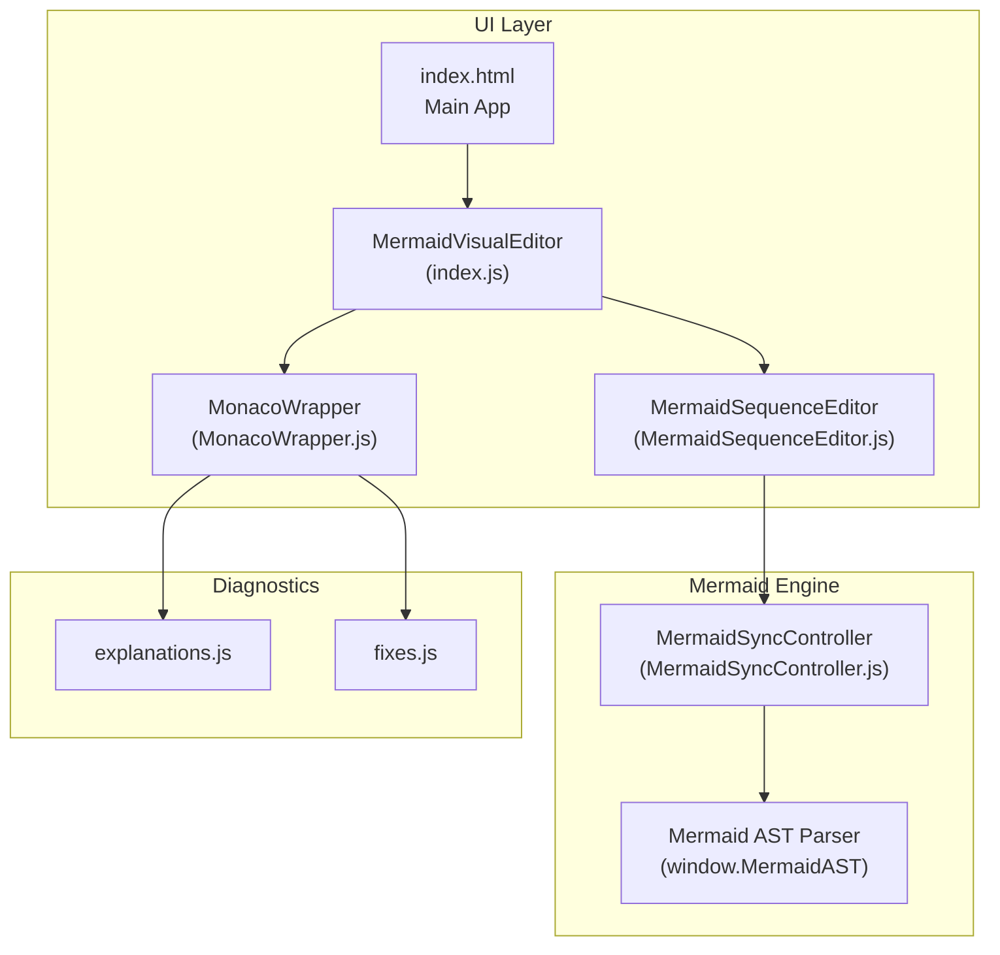
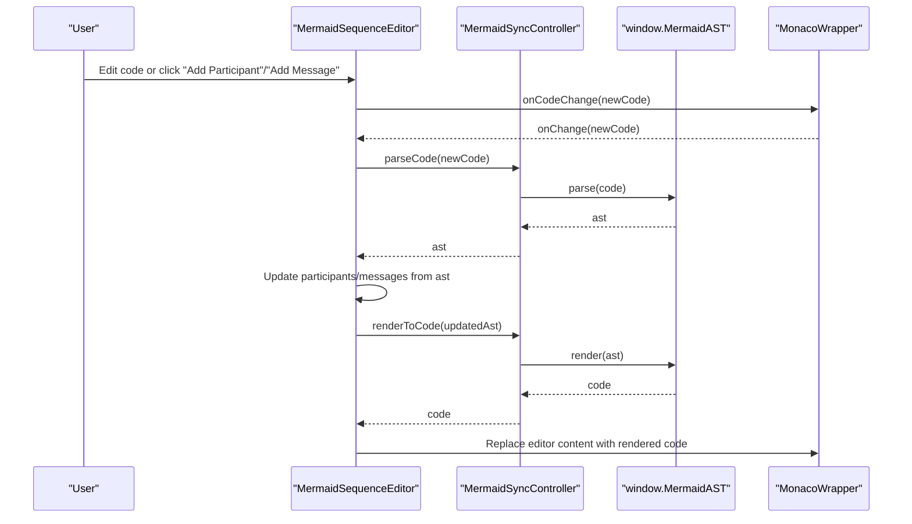
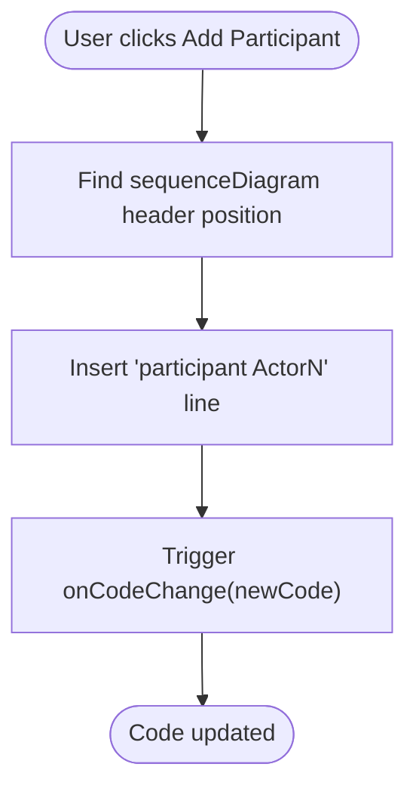
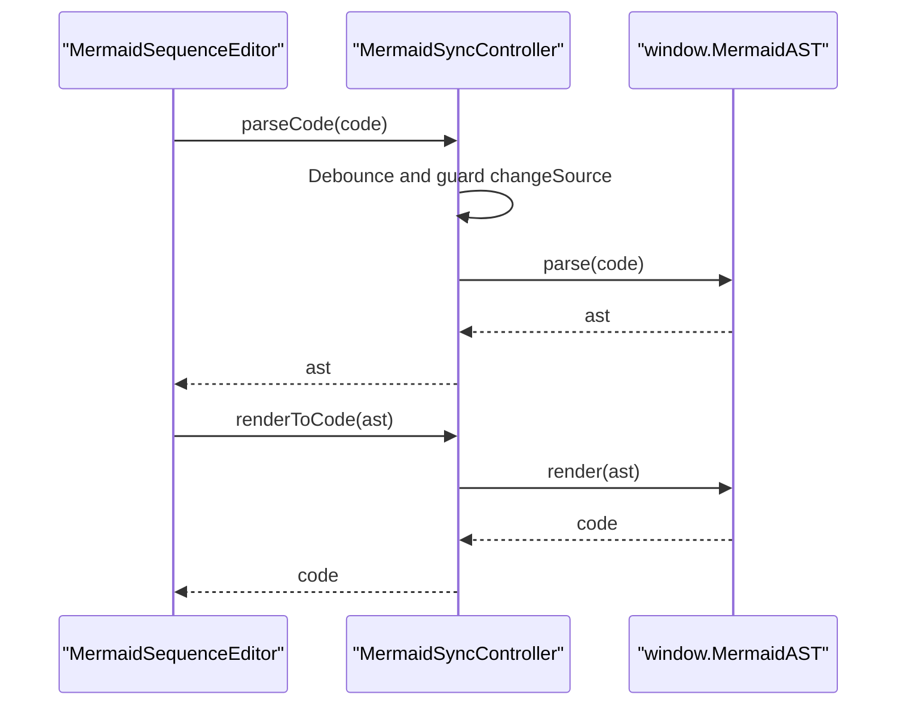
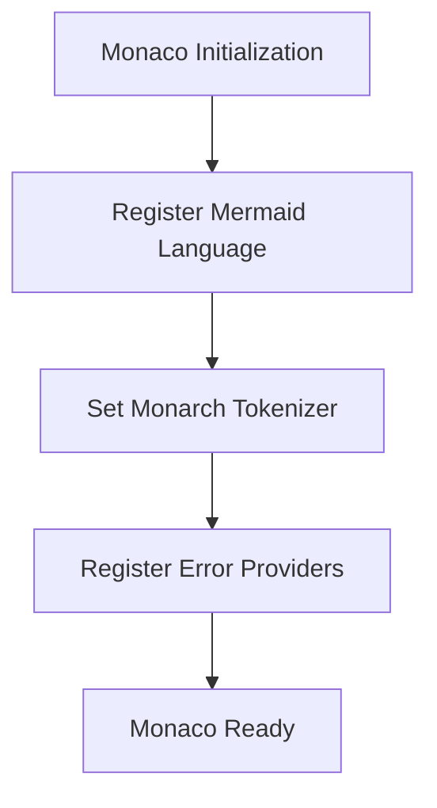
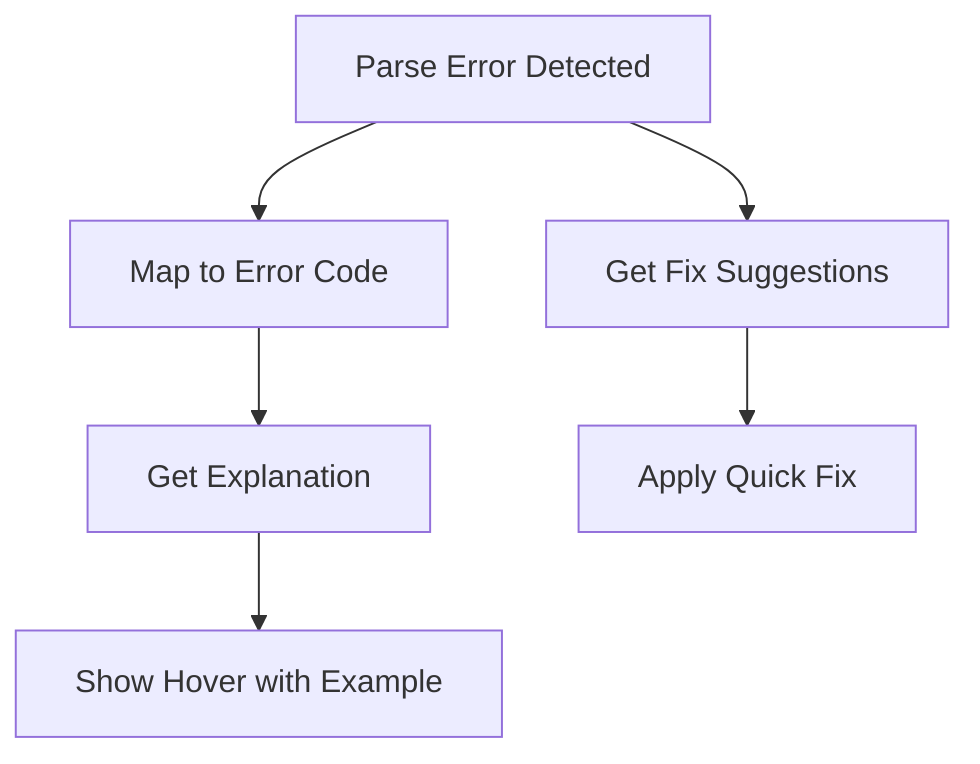
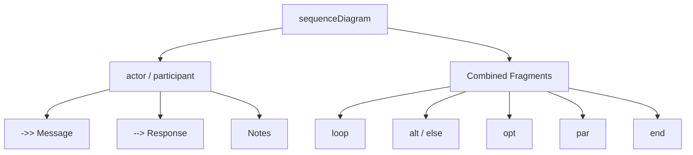
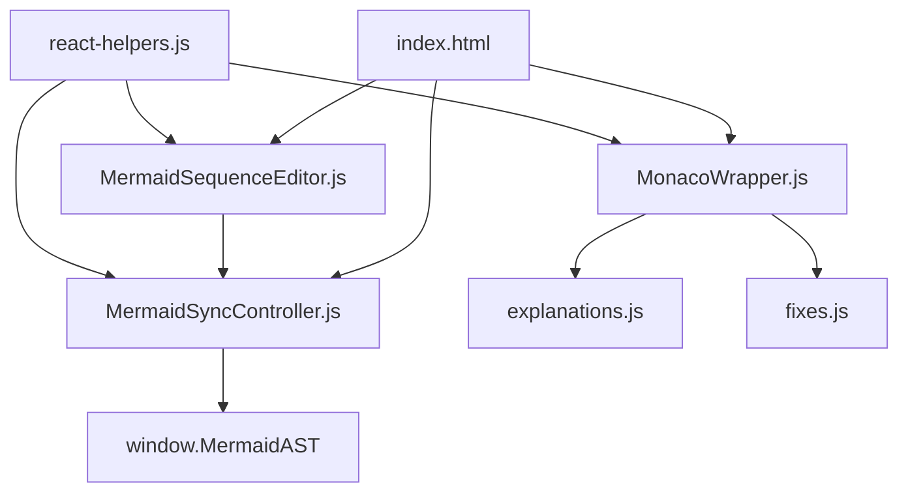

# Sequence Diagrams

<cite>
**Referenced Files in This Document**
- [MermaidSequenceEditor.js](file://js/editors/mermaid/MermaidSequenceEditor.js)
- [MermaidSyncController.js](file://js/editors/mermaid/MermaidSyncController.js)
- [index.js](file://js/editors/mermaid/index.js)
- [MonacoWrapper.js](file://js/components/MonacoWrapper.js)
- [explanations.js](file://js/error-diagnostics/explanations.js)
- [fixes.js](file://js/error-diagnostics/fixes.js)
- [react-helpers.js](file://js/react-helpers.js)
- [index.html](file://index.html)
- [MermaidGenericEditor.js](file://js/editors/mermaid/MermaidGenericEditor.js)
- [MermaidDataEditors.js](file://js/editors/mermaid/MermaidDataEditors.js)
- [MermaidFlowchartEditor.js](file://js/editors/mermaid/MermaidFlowchartEditor.js)
</cite>

## Table of Contents
1. [Introduction](#introduction)
2. [Project Structure](#project-structure)
3. [Core Components](#core-components)
4. [Architecture Overview](#architecture-overview)
5. [Detailed Component Analysis](#detailed-component-analysis)
6. [Dependency Analysis](#dependency-analysis)
7. [Performance Considerations](#performance-considerations)
8. [Troubleshooting Guide](#troubleshooting-guide)
9. [Conclusion](#conclusion)

## Introduction
This document explains how sequence diagrams are modeled and edited within the application. It focuses on the Mermaid sequence diagram editor, participant and message management, AST synchronization for real-time updates, and practical guidance for building robust sequence diagrams. It also covers advanced topics such as participant reuse, custom styling, and combined fragments (loop, alt, opt, par, etc.) as supported by the underlying Mermaid language.

## Project Structure
The sequence diagram feature spans several modules:
- Editor routing and preview generation
- Sequence-specific editor UI
- AST synchronization controller
- Monaco editor integration with Mermaid language support
- Error diagnostics and quick fixes
- Generic fallback editor for unsupported diagram types

**Diagram sources**
- [index.html](file://index.html#L2062-L2429)
- [index.js](file://js/editors/mermaid/index.js#L20-L121)
- [MermaidSequenceEditor.js](file://js/editors/mermaid/MermaidSequenceEditor.js#L4-L107)
- [MermaidSyncController.js](file://js/editors/mermaid/MermaidSyncController.js#L9-L92)
- [MonacoWrapper.js](file://js/components/MonacoWrapper.js#L13-L168)
- [explanations.js](file://js/error-diagnostics/explanations.js#L12-L301)
- [fixes.js](file://js/error-diagnostics/fixes.js#L32-L693)

**Section sources**
- [index.html](file://index.html#L2062-L2429)
- [index.js](file://js/editors/mermaid/index.js#L20-L121)

## Core Components
- Sequence Editor: Parses AST to present participants and messages, and supports adding new participants and messages directly in the code.
- AST Sync Controller: Prevents infinite loops during bidirectional synchronization, debounces parsing, and renders code from AST.
- Monaco Editor: Provides Mermaid language support, syntax highlighting, error markers, and quick fixes.
- Error Diagnostics: Offers explanations and automated fixes for common syntax errors.

Key responsibilities:
- Participants: Extracted from AST and displayed in the sidebar; new participants inserted via code insertion.
- Messages: Extracted from AST and shown with from/to actors and optional text; new messages appended to the code.
- Real-time updates: Code changes trigger AST parsing; AST changes trigger code rendering, with safeguards against loops.

**Section sources**
- [MermaidSequenceEditor.js](file://js/editors/mermaid/MermaidSequenceEditor.js#L4-L107)
- [MermaidSyncController.js](file://js/editors/mermaid/MermaidSyncController.js#L9-L92)
- [MonacoWrapper.js](file://js/components/MonacoWrapper.js#L247-L303)
- [explanations.js](file://js/error-diagnostics/explanations.js#L12-L301)
- [fixes.js](file://js/error-diagnostics/fixes.js#L32-L693)

## Architecture Overview
The sequence diagram workflow connects the UI, AST synchronization, and Mermaid engine:

**Diagram sources**
- [MermaidSequenceEditor.js](file://js/editors/mermaid/MermaidSequenceEditor.js#L4-L107)
- [MermaidSyncController.js](file://js/editors/mermaid/MermaidSyncController.js#L21-L58)
- [MonacoWrapper.js](file://js/components/MonacoWrapper.js#L134-L140)
- [index.html](file://index.html#L2101-L2106)

## Detailed Component Analysis

### Sequence Editor
The sequence editor extracts participants and messages from the AST and displays them in a sidebar. It also provides actions to add participants and messages by inserting new lines into the code.

- Participant extraction: Iterates over ast.participants and builds a label/id map.
- Message extraction: Iterates over ast.messages and builds from/to/text tuples.
- Adding participants: Inserts a participant line after the sequenceDiagram header.
- Adding messages: Appends a message line between the first two participants.

**Diagram sources**
- [MermaidSequenceEditor.js](file://js/editors/mermaid/MermaidSequenceEditor.js#L1774-L1778)

**Section sources**
- [MermaidSequenceEditor.js](file://js/editors/mermaid/MermaidSequenceEditor.js#L4-L107)

### AST Synchronization Controller
The controller manages bidirectional synchronization between code and AST:
- parseCode: Debounces parsing, prevents loops when triggered by visual changes, and parses code into AST.
- renderToCode: Renders AST back to code, sets a change source flag to prevent loops, and resets it asynchronously.
- get/setAst: Accessors for current AST state.
- detectType: Detects diagram type from code using the AST library.
- isLoaded: Checks availability of the AST library.

**Diagram sources**
- [MermaidSyncController.js](file://js/editors/mermaid/MermaidSyncController.js#L21-L58)

**Section sources**
- [MermaidSyncController.js](file://js/editors/mermaid/MermaidSyncController.js#L9-L92)

### Monaco Editor Integration
Monaco registers Mermaid language support with:
- Keywords: diagram types, node shapes, and control structures (e.g., participant, actor, loop, alt, opt, par, end).
- Tokenizer: Recognizes arrows, labels, strings, and comments.
- Error providers: Code actions and hover explanations for quick fixes and guidance.

**Diagram sources**
- [MonacoWrapper.js](file://js/components/MonacoWrapper.js#L247-L303)
- [MonacoWrapper.js](file://js/components/MonacoWrapper.js#L310-L423)

**Section sources**
- [MonacoWrapper.js](file://js/components/MonacoWrapper.js#L13-L168)
- [MonacoWrapper.js](file://js/components/MonacoWrapper.js#L247-L303)
- [MonacoWrapper.js](file://js/components/MonacoWrapper.js#L310-L423)

### Error Diagnostics
The system provides:
- Error explanations mapped by error codes with examples and links to documentation.
- Quick-fix suggestions generated from error patterns and token maps.
- Hover provider to display explanations inline.

**Diagram sources**
- [explanations.js](file://js/error-diagnostics/explanations.js#L237-L299)
- [fixes.js](file://js/error-diagnostics/fixes.js#L611-L656)

**Section sources**
- [explanations.js](file://js/error-diagnostics/explanations.js#L12-L301)
- [fixes.js](file://js/error-diagnostics/fixes.js#L32-L693)

### Conceptual Overview
Typical sequence diagram constructs supported by Mermaid include:
- Participants: actor, participant
- Messages: sync (->>), async (-->>), response (-->)
- Notes: Note over/from/to
- Combined fragments: loop, alt, else, opt, par, and end

These are reflected in the Mermaid language registration and the editor’s snippet collections.

[No sources needed since this diagram shows conceptual workflow, not actual code structure]

## Dependency Analysis
The sequence diagram feature depends on:
- Monaco editor for syntax highlighting and diagnostics
- Mermaid AST library for parsing and rendering
- React helpers for JSX-like syntax
- Index HTML orchestration for loading libraries and wiring components

**Diagram sources**
- [react-helpers.js](file://js/react-helpers.js#L1-L39)
- [MermaidSequenceEditor.js](file://js/editors/mermaid/MermaidSequenceEditor.js#L1-L10)
- [MermaidSyncController.js](file://js/editors/mermaid/MermaidSyncController.js#L1-L12)
- [MonacoWrapper.js](file://js/components/MonacoWrapper.js#L1-L12)
- [explanations.js](file://js/error-diagnostics/explanations.js#L1-L11)
- [fixes.js](file://js/error-diagnostics/fixes.js#L1-L6)
- [index.html](file://index.html#L53-L85)

**Section sources**
- [react-helpers.js](file://js/react-helpers.js#L1-L39)
- [index.html](file://index.html#L53-L85)

## Performance Considerations
- Debouncing: The AST parse operation is debounced to avoid excessive re-renders during rapid typing.
- Change-source gating: The controller prevents infinite loops by tracking whether the change originated from code or visual edits.
- Lazy loading: Libraries (Monaco, Mermaid AST, Excalidraw) are loaded dynamically to reduce initial bundle size.
- Preview throttling: Preview generation is delayed to minimize network requests.

[No sources needed since this section provides general guidance]

## Troubleshooting Guide
Common issues and resolutions:
- Missing diagram type: Ensure the first line declares a valid diagram type (e.g., sequenceDiagram).
- Unbalanced brackets/labels: Mermaid uses brackets/parentheses/braces for node shapes; ensure they are properly matched.
- Invalid arrow syntax: Use supported arrow types (e.g., ->>, -->, ---).
- Unexpected tokens: Check for typos or incomplete statements.
- Unknown diagram type: Confirm spelling and capitalization of diagram keywords.

Automated assistance:
- Quick fixes: Monaco provides code actions to insert missing declarations or correct syntax.
- Hover explanations: Hover over error markers to see human-readable explanations and examples.
- Error markers: Squiggly underlines highlight problematic areas with associated error codes.

**Section sources**
- [explanations.js](file://js/error-diagnostics/explanations.js#L12-L301)
- [fixes.js](file://js/error-diagnostics/fixes.js#L32-L693)
- [MonacoWrapper.js](file://js/components/MonacoWrapper.js#L310-L423)

## Conclusion
The sequence diagram feature integrates a Mermaid-aware editor with AST-driven synchronization, Monaco-powered diagnostics, and a streamlined UI for participants and messages. By leveraging combined fragments and robust error handling, it enables efficient modeling of object interactions with real-time feedback and safe bidirectional editing.