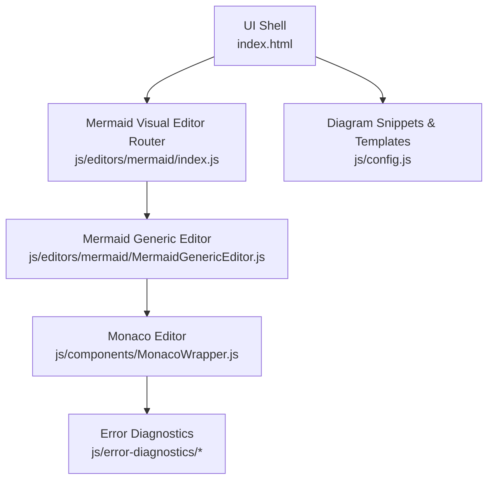
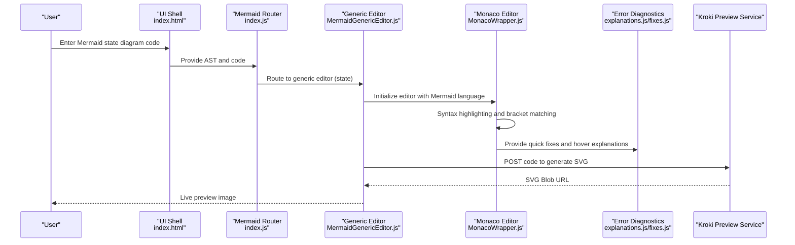
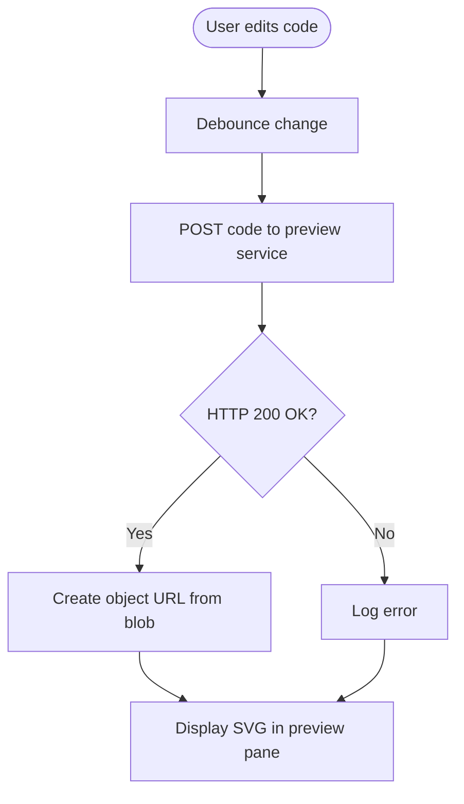
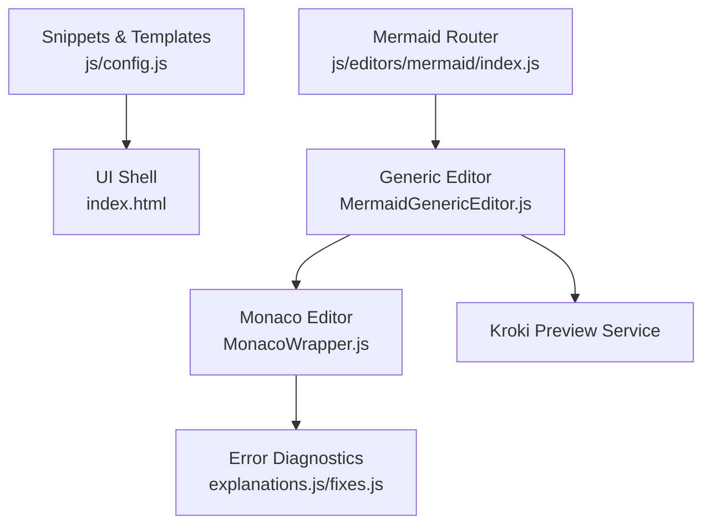

# State Diagrams

<cite>
**Referenced Files in This Document**
- [index.html](file://index.html)
- [js/config.js](file://js/config.js)
- [js/components/MonacoWrapper.js](file://js/components/MonacoWrapper.js)
- [js/editors/mermaid/index.js](file://js/editors/mermaid/index.js)
- [js/editors/mermaid/MermaidGenericEditor.js](file://js/editors/mermaid/MermaidGenericEditor.js)
- [js/error-diagnostics/explanations.js](file://js/error-diagnostics/explanations.js)
- [js/error-diagnostics/fixes.js](file://js/error-diagnostics/fixes.js)
</cite>

## Table of Contents
1. [Introduction](#introduction)
2. [Project Structure](#project-structure)
3. [Core Components](#core-components)
4. [Architecture Overview](#architecture-overview)
5. [Detailed Component Analysis](#detailed-component-analysis)
6. [Dependency Analysis](#dependency-analysis)
7. [Performance Considerations](#performance-considerations)
8. [Troubleshooting Guide](#troubleshooting-guide)
9. [Conclusion](#conclusion)
10. [Appendices](#appendices)

## Introduction
This document explains how state diagrams are supported and rendered within the application, focusing on the Mermaid state diagram syntax and the integrated development experience. It covers state definitions, transitions, composite states, and special state types such as fork, join, and history. It also documents initial and final states, transition conditions, entry/exit actions, internal transitions, and patterns for nested state hierarchies and concurrent states. Guidance is included for visualizing complex state behaviors and synchronizing with code mode.

## Project Structure
The state diagram capability is part of the Mermaid visual editor stack. The relevant components include:
- A Mermaid visual editor router that selects the appropriate editor based on AST type
- A generic Mermaid editor that renders live previews via a remote service and exposes an AST explorer
- Monaco editor integration with Mermaid language support and error diagnostics
- Configuration snippets and templates for state diagrams
- Error explanations and quick-fix suggestions tailored to Mermaid syntax

**Diagram sources**
- [js/editors/mermaid/index.js](file://js/editors/mermaid/index.js#L1-L137)
- [js/editors/mermaid/MermaidGenericEditor.js](file://js/editors/mermaid/MermaidGenericEditor.js#L1-L101)
- [js/components/MonacoWrapper.js](file://js/components/MonacoWrapper.js#L1-L426)
- [js/config.js](file://js/config.js#L1-L566)
- [js/error-diagnostics/explanations.js](file://js/error-diagnostics/explanations.js#L1-L302)
- [js/error-diagnostics/fixes.js](file://js/error-diagnostics/fixes.js#L1-L694)

**Section sources**
- [js/editors/mermaid/index.js](file://js/editors/mermaid/index.js#L1-L137)
- [js/editors/mermaid/MermaidGenericEditor.js](file://js/editors/mermaid/MermaidGenericEditor.js#L1-L101)
- [js/components/MonacoWrapper.js](file://js/components/MonacoWrapper.js#L1-L426)
- [js/config.js](file://js/config.js#L1-L566)

## Core Components
- Mermaid Visual Editor Router: Routes to diagram-specific editors based on AST type. For Mermaid state diagrams, the router falls back to the generic editor because state diagrams are grouped with other “class-like” diagrams.
- Mermaid Generic Editor: Provides live preview rendering via a remote service and displays an AST explorer panel. It also shows a placeholder for future visual editing capabilities.
- Monaco Editor Integration: Registers Mermaid language support, including syntax highlighting and bracket/label recognition. It also registers error providers for quick fixes and hover explanations.
- Error Diagnostics: Offers explanations and automated quick fixes for common Mermaid syntax issues, including bracket/label mismatches and arrow syntax problems.
- Configuration: Supplies Mermaid state diagram snippets and templates for quick insertion and examples.

Key responsibilities:
- Preview synchronization: The editor fetches a Mermaid SVG from a remote service and updates the preview URL on code changes.
- AST exploration: The generic editor surfaces the parsed AST structure for inspection.
- Language support: Monaco recognizes Mermaid keywords, labels, arrows, and edge labels, enabling accurate syntax highlighting and bracket matching.
- Error assistance: Quick fixes and hover explanations help resolve common state diagram syntax issues.

**Section sources**
- [js/editors/mermaid/index.js](file://js/editors/mermaid/index.js#L1-L137)
- [js/editors/mermaid/MermaidGenericEditor.js](file://js/editors/mermaid/MermaidGenericEditor.js#L1-L101)
- [js/components/MonacoWrapper.js](file://js/components/MonacoWrapper.js#L244-L303)
- [js/error-diagnostics/explanations.js](file://js/error-diagnostics/explanations.js#L1-L302)
- [js/error-diagnostics/fixes.js](file://js/error-diagnostics/fixes.js#L1-L694)
- [js/config.js](file://js/config.js#L166-L175)

## Architecture Overview
The state diagram workflow integrates code mode with visual preview and error assistance:

**Diagram sources**
- [js/editors/mermaid/index.js](file://js/editors/mermaid/index.js#L20-L60)
- [js/editors/mermaid/MermaidGenericEditor.js](file://js/editors/mermaid/MermaidGenericEditor.js#L11-L53)
- [js/components/MonacoWrapper.js](file://js/components/MonacoWrapper.js#L13-L168)
- [js/error-diagnostics/explanations.js](file://js/error-diagnostics/explanations.js#L237-L271)
- [js/error-diagnostics/fixes.js](file://js/error-diagnostics/fixes.js#L611-L655)

## Detailed Component Analysis

### State Diagram Syntax and Patterns
The repository includes Mermaid state diagram snippets and templates that demonstrate core constructs:
- Basic state definition and transitions
- Initial and final states
- Composite states with nested states
- Fork and join pseudo-states
- Notes attached to states

These snippets serve as canonical examples for building state machines in code mode.

**Section sources**
- [js/config.js](file://js/config.js#L166-L175)
- [index.html](file://index.html#L210-L216)

### Visual Representation and Live Preview
The generic editor renders a live preview by posting Mermaid code to a remote service and displaying the resulting SVG. The preview updates with a short delay to avoid excessive requests during rapid typing.

**Diagram sources**
- [js/editors/mermaid/index.js](file://js/editors/mermaid/index.js#L24-L53)
- [js/editors/mermaid/MermaidGenericEditor.js](file://js/editors/mermaid/MermaidGenericEditor.js#L35-L45)

**Section sources**
- [js/editors/mermaid/index.js](file://js/editors/mermaid/index.js#L24-L53)
- [js/editors/mermaid/MermaidGenericEditor.js](file://js/editors/mermaid/MermaidGenericEditor.js#L35-L45)

### Syntax Highlighting and Bracket Matching
Monaco’s Mermaid language provider recognizes:
- Keywords such as state, subgraph, and stateDiagram-v2
- Labels delimited by brackets, parentheses, braces, and pipes
- Arrows and edge labels
- Comments and strings

Bracket and label pairs are auto-closed and matched, aiding in constructing balanced state diagrams.

**Section sources**
- [js/components/MonacoWrapper.js](file://js/components/MonacoWrapper.js#L250-L302)

### Error Diagnostics and Quick Fixes
The editor provides:
- Hover explanations for errors with links to documentation
- Quick fixes for common issues like missing arrows, unmatched brackets, and missing diagram declarations
- Token-based suggestions derived from parser error metadata

These diagnostics improve the developer experience when writing complex state machines.

**Section sources**
- [js/error-diagnostics/explanations.js](file://js/error-diagnostics/explanations.js#L237-L271)
- [js/error-diagnostics/fixes.js](file://js/error-diagnostics/fixes.js#L611-L655)

### State Definitions and Transitions
- States are defined with labels and identifiers.
- Transitions connect states with optional events/conditions.
- Edge labels are supported via pipe-delimited syntax.

These constructs are highlighted and validated by Monaco’s language provider.

**Section sources**
- [js/components/MonacoWrapper.js](file://js/components/MonacoWrapper.js#L266-L283)
- [js/config.js](file://js/config.js#L166-L175)

### Composite States and Nested Hierarchies
- Composite states encapsulate nested states and internal transitions.
- The snippet demonstrates nested initial and final states inside a composite region.

This pattern enables hierarchical modeling of complex behaviors.

**Section sources**
- [js/config.js](file://js/config.js#L171-L171)

### Special State Types: Fork, Join, History
- Fork and join pseudo-states are supported via dedicated state declarations with stereotype markers.
- History pseudo-states are commonly used in Mermaid state diagrams to represent re-entry into composite regions; while not explicitly shown in the snippets, the syntax is compatible with Mermaid’s stateDiagram-v2.

**Section sources**
- [js/config.js](file://js/config.js#L172-L173)

### Initial and Final States
- Initial states are represented by a special marker and connect to the first state.
- Final states terminate the lifecycle of a state machine.

**Section sources**
- [js/config.js](file://js/config.js#L168-L169)

### Transition Conditions and Internal Transitions
- Transition conditions are expressed as edge labels.
- Internal transitions (self-loops) are supported by connecting a state to itself.

**Section sources**
- [js/config.js](file://js/config.js#L170-L170)

### Concurrent States and Synchronization
- Fork and join pseudo-states enable concurrency and synchronization points.
- The snippet for fork demonstrates the concept; join is similarly declared.

**Section sources**
- [js/config.js](file://js/config.js#L172-L173)

## Dependency Analysis
The state diagram feature depends on:
- Monaco editor for syntax highlighting and bracket matching
- Error diagnostics for quick fixes and hover explanations
- Remote preview service for SVG generation
- Configuration snippets/templates for guided authoring

**Diagram sources**
- [js/config.js](file://js/config.js#L166-L175)
- [js/editors/mermaid/index.js](file://js/editors/mermaid/index.js#L77-L116)
- [js/editors/mermaid/MermaidGenericEditor.js](file://js/editors/mermaid/MermaidGenericEditor.js#L11-L53)
- [js/components/MonacoWrapper.js](file://js/components/MonacoWrapper.js#L13-L168)
- [js/error-diagnostics/explanations.js](file://js/error-diagnostics/explanations.js#L237-L271)
- [js/error-diagnostics/fixes.js](file://js/error-diagnostics/fixes.js#L611-L655)

**Section sources**
- [js/editors/mermaid/index.js](file://js/editors/mermaid/index.js#L77-L116)
- [js/editors/mermaid/MermaidGenericEditor.js](file://js/editors/mermaid/MermaidGenericEditor.js#L11-L53)
- [js/components/MonacoWrapper.js](file://js/components/MonacoWrapper.js#L13-L168)
- [js/error-diagnostics/explanations.js](file://js/error-diagnostics/explanations.js#L237-L271)
- [js/error-diagnostics/fixes.js](file://js/error-diagnostics/fixes.js#L611-L655)
- [js/config.js](file://js/config.js#L166-L175)

## Performance Considerations
- Preview throttling: A debounce delay prevents excessive network requests when typing rapidly.
- Memory management: Preview URLs are revoked on unmount to prevent memory leaks.
- Monaco initialization: Language providers are registered once and reused across sessions.

**Section sources**
- [js/editors/mermaid/index.js](file://js/editors/mermaid/index.js#L51-L60)
- [js/editors/mermaid/MermaidGenericEditor.js](file://js/editors/mermaid/MermaidGenericEditor.js#L42-L44)

## Troubleshooting Guide
Common issues and resolutions:
- Missing diagram type declaration: Add a diagram type declaration at the top of the code.
- Unmatched brackets/labels: Ensure all labels and delimiters are properly closed.
- Invalid arrow syntax: Use supported arrow forms recognized by the language provider.
- Unexpected tokens: Verify keywords and syntax correctness.

Quick fixes and hover explanations are provided automatically.

**Section sources**
- [js/error-diagnostics/explanations.js](file://js/error-diagnostics/explanations.js#L237-L271)
- [js/error-diagnostics/fixes.js](file://js/error-diagnostics/fixes.js#L34-L91)

## Conclusion
The application provides a robust foundation for authoring Mermaid state diagrams:
- Code mode with syntax highlighting and bracket matching
- Live preview via a remote service
- Integrated error diagnostics with quick fixes and explanations
- Canonical snippets and templates for state diagram patterns

This combination enables developers to build complex state machines with confidence, leveraging both visual feedback and precise syntax guidance.

## Appendices

### Appendix A: State Diagram Snippet Index
- State definition and transition
- Initial and final states
- Composite state with nested states
- Fork and join pseudo-states
- Notes attached to states

**Section sources**
- [js/config.js](file://js/config.js#L166-L175)
- [index.html](file://index.html#L210-L216)