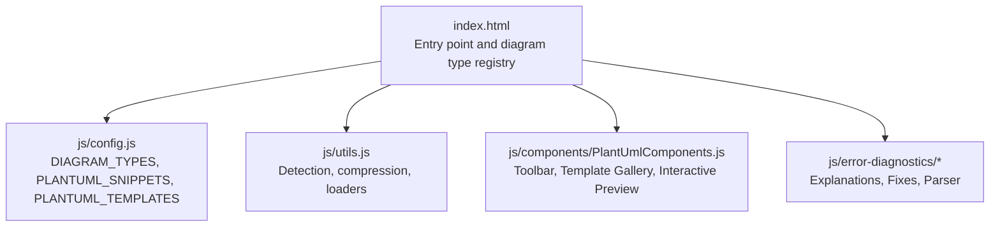
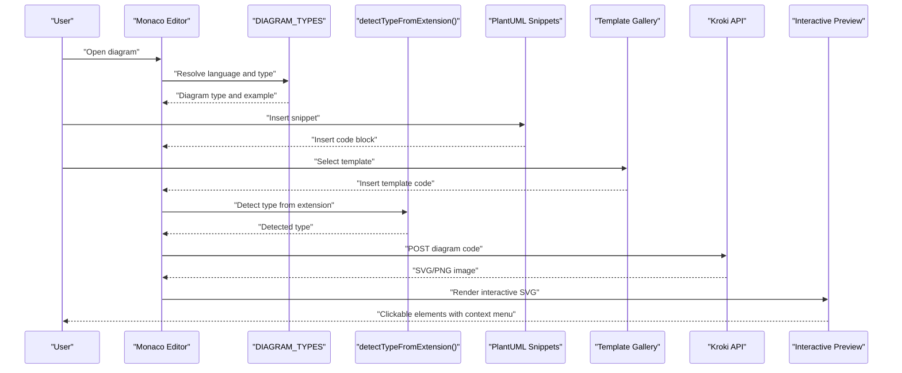
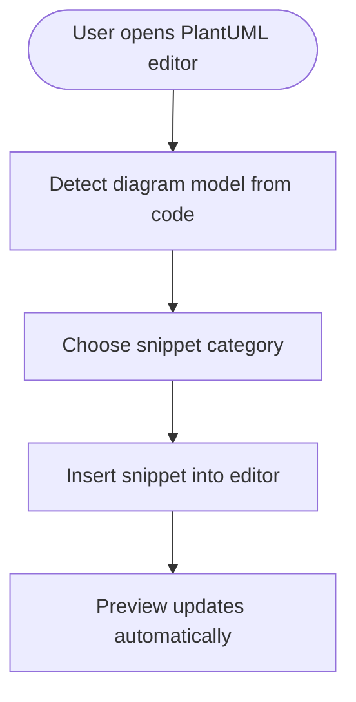
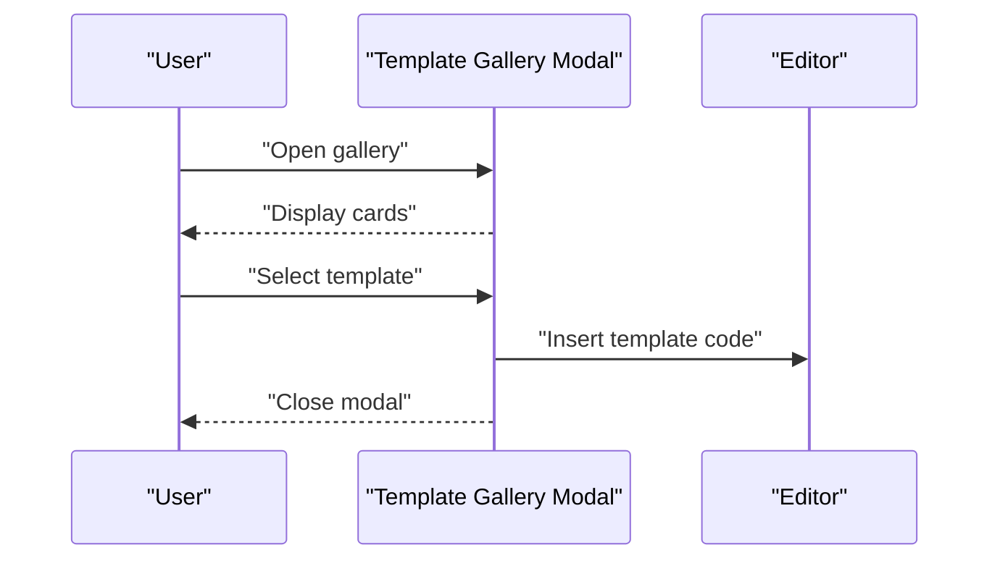
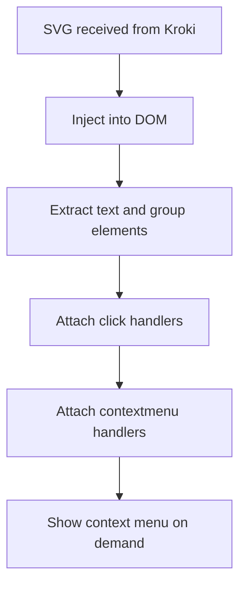
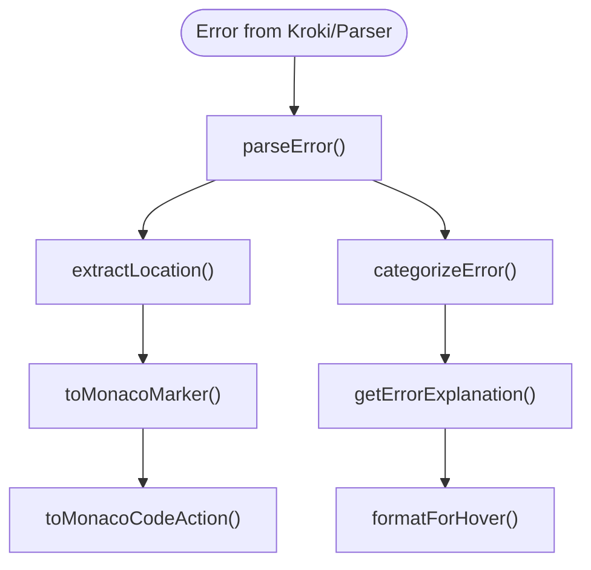
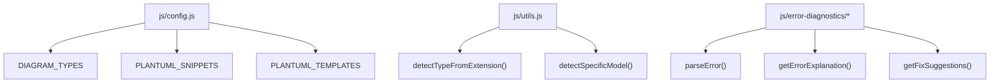

# PlantUML and C4 PlantUML

<cite>
**Referenced Files in This Document**
- [index.html](file://index.html)
- [config.js](file://js/config.js)
- [utils.js](file://js/utils.js)
- [PlantUmlComponents.js](file://js/components/PlantUmlComponents.js)
- [explanations.js](file://js/error-diagnostics/explanations.js)
- [fixes.js](file://js/error-diagnostics/fixes.js)
- [index.js](file://js/error-diagnostics/index.js)
</cite>

## Table of Contents
1. [Introduction](#introduction)
2. [Project Structure](#project-structure)
3. [Core Components](#core-components)
4. [Architecture Overview](#architecture-overview)
5. [Detailed Component Analysis](#detailed-component-analysis)
6. [Dependency Analysis](#dependency-analysis)
7. [Performance Considerations](#performance-considerations)
8. [Troubleshooting Guide](#troubleshooting-guide)
9. [Conclusion](#conclusion)

## Introduction
This document explains the PlantUML and C4 PlantUML diagram support in the Universal Diagram Generator. It covers fundamentals of PlantUML syntax, diagram declarations, comments, and language extensions; documents UML diagram types supported by PlantUML and C4 PlantUML; describes the snippet system and template gallery; and explains integration with the broader diagram ecosystem via Kroki. It also provides best practices, common patterns, and advanced features such as custom styling and external library inclusion.

## Project Structure
The application is a single-page React application with embedded JSX and dynamic module loading. Key areas related to PlantUML and C4 PlantUML:
- Configuration defines diagram types, PlantUML snippets, and PlantUML templates.
- Utilities provide compression and detection logic for diagram types and models.
- Components implement the PlantUML toolbar, template gallery, and interactive SVG preview.
- Error diagnostics provide explanations and quick fixes for common syntax errors.

**Diagram sources**
- [index.html](file://index.html#L70-L87)
- [config.js](file://js/config.js#L6-L116)
- [utils.js](file://js/utils.js#L35-L85)
- [PlantUmlComponents.js](file://js/components/PlantUmlComponents.js#L8-L95)
- [explanations.js](file://js/error-diagnostics/explanations.js#L12-L229)
- [fixes.js](file://js/error-diagnostics/fixes.js#L11-L296)
- [index.js](file://js/error-diagnostics/index.js#L13-L276)

**Section sources**
- [index.html](file://index.html#L70-L87)
- [config.js](file://js/config.js#L6-L116)

## Core Components
- Diagram type registry: Defines supported diagram types, file extensions, Monaco language modes, documentation links, and example code. PlantUML and C4 PlantUML are included with dedicated entries and examples.
- PlantUML snippets: A categorized collection of reusable blocks for rapid diagram authoring across multiple diagram families (Sequence, Class, Use Case, Activity, State, Component, ER, Deployment, WBS, etc.).
- PlantUML templates: Prebuilt examples for common diagram types to accelerate getting started.
- Detection utilities: Determine diagram type from file extension and infer specific diagram model from code content.
- Error diagnostics: Parse errors, extract locations, categorize issues, and provide explanations and quick fixes.

**Section sources**
- [config.js](file://js/config.js#L6-L116)
- [config.js](file://js/config.js#L118-L192)
- [config.js](file://js/config.js#L194-L565)
- [utils.js](file://js/utils.js#L35-L85)
- [explanations.js](file://js/error-diagnostics/explanations.js#L12-L229)
- [fixes.js](file://js/error-diagnostics/fixes.js#L11-L296)
- [index.js](file://js/error-diagnostics/index.js#L13-L276)

## Architecture Overview
The system integrates PlantUML and C4 PlantUML with a Monaco-based editor, a snippet toolbar, a template gallery, and an interactive preview. Errors are diagnosed and surfaced with actionable suggestions.

**Diagram sources**
- [index.html](file://index.html#L70-L87)
- [config.js](file://js/config.js#L6-L116)
- [utils.js](file://js/utils.js#L35-L85)
- [PlantUmlComponents.js](file://js/components/PlantUmlComponents.js#L8-L95)

## Detailed Component Analysis

### PlantUML Fundamentals
- Syntax structure: PlantUML diagrams begin with a diagram declaration and end with an end marker. Many diagram families share common constructs such as participants, classes, notes, and arrows.
- Diagram declarations: The system recognizes PlantUML diagram families by scanning the code for specific keywords and patterns.
- Commenting: Single-line comments are supported in PlantUML.
- Language extensions: PlantUML supports external library inclusion via directives, enabling advanced modeling such as C4 containers and contexts.

Key capabilities:
- Declaration detection for UML families (sequence, class, use case, activity, state, component, etc.).
- Template-driven scaffolding for common diagram types.
- Snippet-driven authoring for rapid prototyping.

**Section sources**
- [utils.js](file://js/utils.js#L49-L85)
- [config.js](file://js/config.js#L118-L192)
- [config.js](file://js/config.js#L194-L565)

### UML Diagram Types Supported by PlantUML
The snippet system and templates cover the following UML families:
- Sequence Diagram: Participants, messages, activation, notes, loops, and groups.
- Class Diagram: Classes, interfaces, enums, abstract classes, inheritance, composition, aggregation, association, dependency, packages, and notes.
- Use Case Diagram: Actors, use cases, rectangles, include/extend relationships, and notes.
- Activity Diagram: Start/stop, activities, decisions, loops, forks/joins, partitions, and notes.
- State Diagram: States, transitions, composite states, fork/join, and notes.
- Component Diagram: Components, interfaces, packages, databases, links, and notes.
- ER Diagram: Entities, relationships, keys, and cardinalities.
- Deployment Diagram: Nodes, clouds, and runtime environments.
- Mind Map: Hierarchical concept maps.
- Work Breakdown Structure: Hierarchical project breakdowns.

These are backed by categorized snippets and ready-to-use templates.

**Section sources**
- [config.js](file://js/config.js#L118-L192)
- [config.js](file://js/config.js#L194-L565)

### C4 PlantUML System Architecture Diagrams
C4 PlantUML templates provide:
- Context diagrams: Person, System, and relationships.
- Container diagrams: Containers, components, and technology stacks.
- Component diagrams: Internal component structure.
- Code-level views: Component and code-level modeling.

Templates demonstrate includes and relationship declarations typical of C4 modeling.

**Section sources**
- [config.js](file://js/config.js#L89-L102)
- [config.js](file://js/config.js#L194-L565)

### Snippet System
The snippet system organizes reusable blocks by diagram family:
- Expandable toolbar with “Show more” toggle.
- Quick insertion of participants, messages, classes, interfaces, arrows, notes, activations, loops, groups, and more.
- Automatic detection of the current diagram model to present relevant snippets.

**Diagram sources**
- [PlantUmlComponents.js](file://js/components/PlantUmlComponents.js#L8-L47)

**Section sources**
- [PlantUmlComponents.js](file://js/components/PlantUmlComponents.js#L8-L47)
- [config.js](file://js/config.js#L118-L192)

### Template Gallery
The template gallery offers:
- Grid of cards for common diagram types.
- One-click insertion of a complete diagram scaffold.
- Descriptions and icons for discoverability.

**Diagram sources**
- [PlantUmlComponents.js](file://js/components/PlantUmlComponents.js#L52-L95)

**Section sources**
- [PlantUmlComponents.js](file://js/components/PlantUmlComponents.js#L52-L95)
- [config.js](file://js/config.js#L194-L565)

### Interactive Preview and Context Menu
The interactive preview:
- Renders SVG from PlantUML via Kroki.
- Highlights clickable elements (text and groups).
- Provides a context menu with actions such as adding notes, messages, and navigating to definitions.

**Diagram sources**
- [PlantUmlComponents.js](file://js/components/PlantUmlComponents.js#L153-L248)

**Section sources**
- [PlantUmlComponents.js](file://js/components/PlantUmlComponents.js#L153-L248)

### Error Diagnostics and Quick Fixes
The error diagnostics pipeline:
- Parses raw error messages to extract line/column information.
- Categorizes errors and assigns codes.
- Provides human-readable explanations and quick-fix suggestions.
- Integrates with Monaco to show markers and offer code actions.

**Diagram sources**
- [index.js](file://js/error-diagnostics/index.js#L13-L276)
- [explanations.js](file://js/error-diagnostics/explanations.js#L237-L299)
- [fixes.js](file://js/error-diagnostics/fixes.js#L332-L366)

**Section sources**
- [index.js](file://js/error-diagnostics/index.js#L13-L276)
- [explanations.js](file://js/error-diagnostics/explanations.js#L12-L229)
- [fixes.js](file://js/error-diagnostics/fixes.js#L11-L296)

## Dependency Analysis
- Configuration-driven: The diagram type registry centralizes metadata for PlantUML and C4 PlantUML, including example code and documentation links.
- Detection-driven: Utilities infer diagram type from file extension and code content to route editors and snippets appropriately.
- Error diagnostics: Independent modules provide parsing, categorization, explanations, and fixes, decoupled from the editor UI.

**Diagram sources**
- [config.js](file://js/config.js#L6-L116)
- [utils.js](file://js/utils.js#L35-L85)
- [index.js](file://js/error-diagnostics/index.js#L13-L276)
- [explanations.js](file://js/error-diagnostics/explanations.js#L237-L299)
- [fixes.js](file://js/error-diagnostics/fixes.js#L332-L366)

**Section sources**
- [config.js](file://js/config.js#L6-L116)
- [utils.js](file://js/utils.js#L35-L85)
- [index.js](file://js/error-diagnostics/index.js#L13-L276)

## Performance Considerations
- Compression: Source code is compressed before sending to the Kroki service to reduce payload size.
- Debouncing: Parsing and preview generation are debounced to avoid excessive network requests during rapid edits.
- Lazy loading: External libraries (e.g., BPMN visual editor) are loaded on demand to minimize initial bundle size.

Practical tips:
- Keep diagram code concise to improve parsing and rendering performance.
- Use templates and snippets to avoid repetitive boilerplate.
- Prefer incremental edits to leverage debouncing and reduce re-renders.

**Section sources**
- [utils.js](file://js/utils.js#L14-L28)
- [index.js](file://js/editors/mermaid/index.js#L24-L53)

## Troubleshooting Guide
Common issues and resolutions:
- Missing PlantUML start/end markers: The diagnostics module detects missing declarations and suggests inserting the appropriate markers.
- Mismatched brackets/parentheses: The system highlights unmatched delimiters and provides quick fixes.
- Invalid arrow syntax: Suggestions guide users to correct arrow notation for sequence/class/activity/state diagrams.
- XML/BPMN parsing errors: For BPMN, the system detects unclosed tags and malformed XML and offers targeted guidance.

Quick actions:
- Use the context menu in the interactive preview to add notes, messages, and navigation targets.
- Apply Monaco quick fixes to auto-insert missing tokens or correct syntax.
- Consult hover explanations for detailed guidance and examples.

**Section sources**
- [explanations.js](file://js/error-diagnostics/explanations.js#L89-L131)
- [fixes.js](file://js/error-diagnostics/fixes.js#L111-L176)
- [index.js](file://js/error-diagnostics/index.js#L174-L235)
- [PlantUmlComponents.js](file://js/components/PlantUmlComponents.js#L100-L148)

## Conclusion
The Universal Diagram Generator provides robust support for PlantUML and C4 PlantUML through a curated snippet system, a rich template gallery, intelligent error diagnostics, and an interactive preview. By leveraging configuration-driven detection, compression, and modular diagnostics, it delivers a smooth authoring experience across UML and C4 architecture diagramming needs.