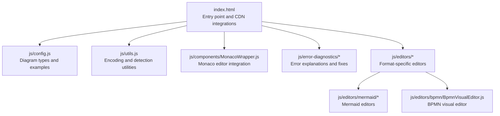
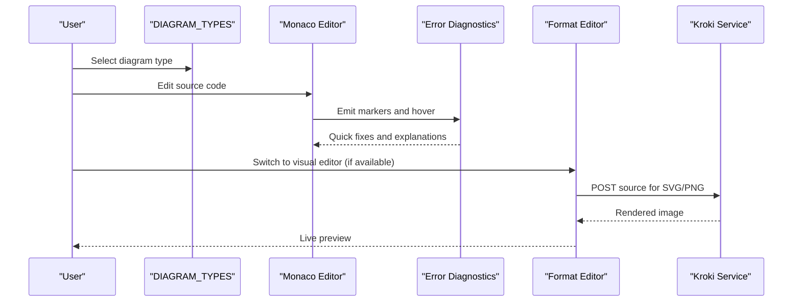
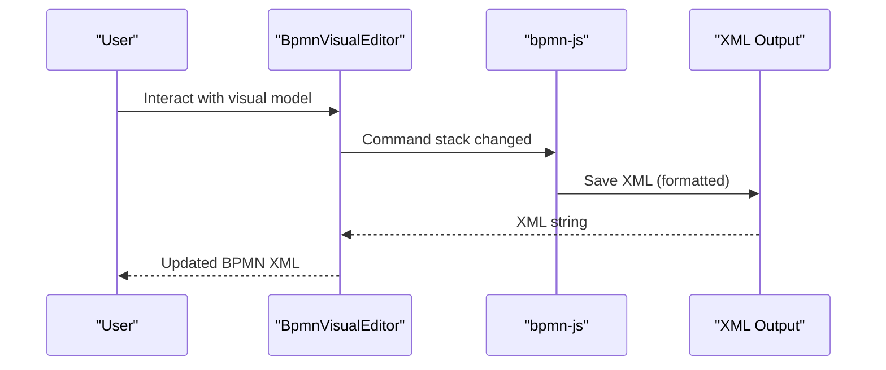
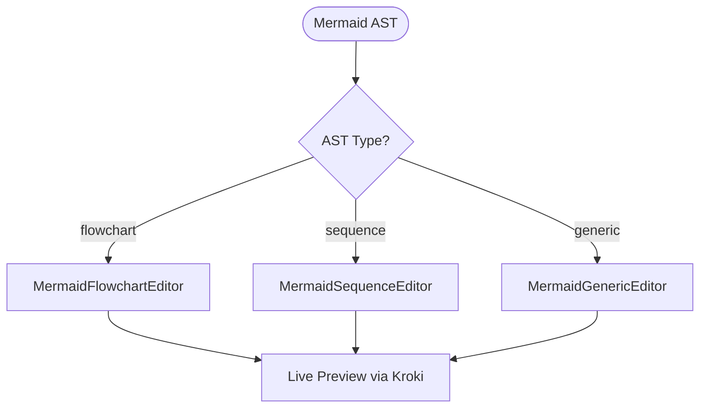
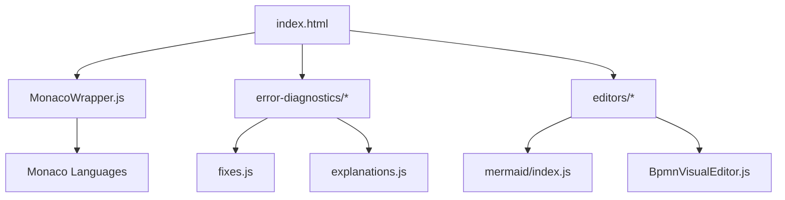
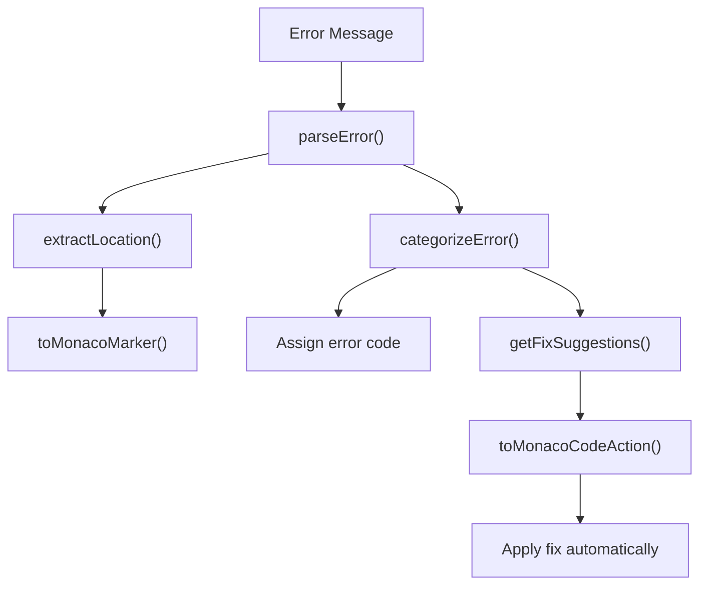

# Specialized Diagram Formats

<cite>
**Referenced Files in This Document**
- [index.html](file://index.html)
- [config.js](file://js/config.js)
- [utils.js](file://js/utils.js)
- [MonacoWrapper.js](file://js/components/MonacoWrapper.js)
- [PlantUmlComponents.js](file://js/components/PlantUmlComponents.js)
- [ui.js](file://js/components/ui.js)
- [explanations.js](file://js/error-diagnostics/explanations.js)
- [fixes.js](file://js/error-diagnostics/fixes.js)
- [error-diagnostics/index.js](file://js/error-diagnostics/index.js)
- [mermaid/index.js](file://js/editors/mermaid/index.js)
- [MermaidGenericEditor.js](file://js/editors/mermaid/MermaidGenericEditor.js)
- [MermaidFlowchartEditor.js](file://js/editors/mermaid/MermaidFlowchartEditor.js)
- [MermaidSequenceEditor.js](file://js/editors/mermaid/MermaidSequenceEditor.js)
- [BpmnVisualEditor.js](file://js/editors/bpmn/BpmnVisualEditor.js)
</cite>

## Table of Contents
1. [Introduction](#introduction)
2. [Project Structure](#project-structure)
3. [Core Components](#core-components)
4. [Architecture Overview](#architecture-overview)
5. [Detailed Component Analysis](#detailed-component-analysis)
6. [Dependency Analysis](#dependency-analysis)
7. [Performance Considerations](#performance-considerations)
8. [Troubleshooting Guide](#troubleshooting-guide)
9. [Conclusion](#conclusion)

## Introduction
This document explains the specialized diagram formats supported by the Universal Diagram Generator, focusing on GraphViz DOT language, Excalidraw freehand drawings, Structurizr DSL, Vega/Vega-Lite visualizations, ERD tools, and other niche formats. It covers syntax characteristics, use cases, integration approaches, and practical guidance for extending support to new formats. The system integrates with the Kroki universal rendering service and provides editor features such as syntax highlighting, error diagnostics, quick fixes, and visual editors for select formats.

## Project Structure
The application is a single-page React application with modular JavaScript components. Key areas:
- Configuration defines diagram types, extensions, and defaults
- Monaco editor integration provides syntax highlighting and diagnostics
- Error diagnostics engine offers explanations and quick fixes
- Format-specific editors enable interactive editing for supported formats
- CDN-based loading ensures lightweight runtime dependencies

**Diagram sources**
- [index.html](file://index.html#L62-L520)
- [config.js](file://js/config.js#L6-L116)
- [MonacoWrapper.js](file://js/components/MonacoWrapper.js#L13-L169)
- [error-diagnostics/index.js](file://js/error-diagnostics/index.js#L13-L44)
- [mermaid/index.js](file://js/editors/mermaid/index.js#L20-L121)
- [BpmnVisualEditor.js](file://js/editors/bpmn/BpmnVisualEditor.js#L14-L103)

**Section sources**
- [index.html](file://index.html#L62-L520)
- [config.js](file://js/config.js#L6-L116)

## Core Components
- Diagram type registry: Central configuration enumerating supported formats, extensions, Monaco language bindings, documentation links, and example content.
- Monaco editor integration: Registers custom languages and error providers for Mermaid and PlantUML, enabling syntax highlighting, diagnostics, and quick fixes.
- Error diagnostics: Parses error messages, extracts locations, categorizes errors, and provides actionable explanations and suggested fixes.
- Format-specific editors: Provide visual editing experiences for BPMN and Mermaid, with previews and AST-driven property panels.

**Section sources**
- [config.js](file://js/config.js#L6-L116)
- [MonacoWrapper.js](file://js/components/MonacoWrapper.js#L174-L303)
- [error-diagnostics/index.js](file://js/error-diagnostics/index.js#L13-L44)
- [BpmnVisualEditor.js](file://js/editors/bpmn/BpmnVisualEditor.js#L14-L103)

## Architecture Overview
The system orchestrates diagram rendering via the Kroki universal service. For formats with visual editors, the app generates live previews from source code. For others, it displays rendered images or relies on static previews.

**Diagram sources**
- [index.html](file://index.html#L70-L87)
- [MonacoWrapper.js](file://js/components/MonacoWrapper.js#L310-L423)
- [error-diagnostics/index.js](file://js/error-diagnostics/index.js#L13-L44)
- [mermaid/index.js](file://js/editors/mermaid/index.js#L32-L53)

## Detailed Component Analysis

### GraphViz DOT Language
- Purpose: Graph visualization using nodes, edges, and attributes with DOT syntax.
- Syntax highlights: Brackets for attributes, directed/undirected graphs, and statements ending with semicolons.
- Use cases: Network diagrams, dependency graphs, flow structures, and hierarchical layouts.
- Integration approach:
  - Monaco language registration supports DOT-like constructs.
  - Error diagnostics provide explanations for missing semicolons, unmatched brackets, and invalid graph types.
  - Rendering via Kroki service produces SVG/PNG previews.
- Best practices:
  - Ensure balanced brackets and braces.
  - Use digraph for directed graphs and graph for undirected graphs.
  - Quote attribute values and close XML-like tags in BPMN contexts.

**Section sources**
- [config.js](file://js/config.js#L106-L107)
- [MonacoWrapper.js](file://js/components/MonacoWrapper.js#L247-L303)
- [explanations.js](file://js/error-diagnostics/explanations.js#L133-L166)
- [fixes.js](file://js/error-diagnostics/fixes.js#L178-L238)

### Excalidraw Freehand Drawing
- Purpose: Freehand sketching and vector illustrations stored as JSON.
- Syntax highlights: JSON structure with elements array containing shapes, text, and metadata.
- Use cases: Rapid ideation, whiteboard-style diagrams, informal architecture sketches.
- Integration approach:
  - Monaco language binding treats it as JSON.
  - Example content demonstrates minimal element structure.
  - No dedicated visual editor; renders via Kroki.
- Best practices:
  - Keep element arrays organized.
  - Use consistent coordinate systems.
  - Export to PNG/SVG via Excalidraw tools for sharing.

**Section sources**
- [config.js](file://js/config.js#L82-L87)
- [MonacoWrapper.js](file://js/components/MonacoWrapper.js#L174-L242)

### Structurizr DSL
- Purpose: Software architecture modeling with Context, Containers, Components, and Dynamic views.
- Syntax highlights: DSL keywords, relationships, and structured blocks.
- Use cases: Enterprise architecture diagrams, system landscapes, and deployment views.
- Integration approach:
  - Monaco language binding treats it as JSON.
  - Example content demonstrates minimal structure.
  - Renders via Kroki; no dedicated visual editor.
- Best practices:
  - Define people, software systems, and containers clearly.
  - Use relationships to express interactions.
  - Keep views focused and avoid information overload.

**Section sources**
- [config.js](file://js/config.js#L110-L111)
- [MonacoWrapper.js](file://js/components/MonacoWrapper.js#L174-L242)

### Vega/Vega-Lite Visualizations
- Purpose: Declarative grammar for statistical graphics (Vega) and simplified schema (Vega-Lite).
- Syntax highlights: JSON-based specifications with data, marks, encodings, scales, and layouts.
- Use cases: Charts, histograms, scatter plots, interactive dashboards.
- Integration approach:
  - Monaco language binding treats as JSON.
  - Example content demonstrates minimal chart structure.
  - Renders via Kroki; no dedicated visual editor.
- Best practices:
  - Separate data from visualization logic.
  - Use scales and axes appropriately.
  - Validate encodings and ensure consistent data types.

**Section sources**
- [config.js](file://js/config.js#L112-L113)
- [MonacoWrapper.js](file://js/components/MonacoWrapper.js#L174-L242)

### ERD Tools
- Purpose: Entity-relationship diagrams for database design.
- Syntax highlights: Entities with attributes, primary keys, foreign keys, and relationships.
- Use cases: Database schema design, reverse engineering, documentation.
- Integration approach:
  - Supported via PlantUML ER diagrams in the PlantUML ecosystem.
  - Monaco language binding for PlantUML enables syntax highlighting.
  - Example content demonstrates entity and relationship syntax.
- Best practices:
  - Clearly mark primary and foreign keys.
  - Use consistent naming conventions.
  - Normalize to reduce redundancy.

**Section sources**
- [config.js](file://js/config.js#L106-L107)
- [MonacoWrapper.js](file://js/components/MonacoWrapper.js#L174-L242)

### BPMN (BPMN 2.0)
- Purpose: Business Process Model and Notation for workflow modeling.
- Syntax highlights: XML-based with namespaces, processes, tasks, and flows.
- Use cases: Business process documentation, compliance, automation.
- Integration approach:
  - Visual editor built with bpmn-js for drag-and-drop editing.
  - Real-time synchronization between visual model and XML.
  - Error handling for XML parsing issues.
- Best practices:
  - Use swimlanes for roles and responsibilities.
  - Keep processes executable and deterministic.
  - Validate against BPMN 2.0 standards.

**Diagram sources**
- [BpmnVisualEditor.js](file://js/editors/bpmn/BpmnVisualEditor.js#L42-L61)

**Section sources**
- [config.js](file://js/config.js#L7-L57)
- [BpmnVisualEditor.js](file://js/editors/bpmn/BpmnVisualEditor.js#L14-L103)

### Mermaid (Mermaid AST-based Editors)
- Purpose: Diagram types including flowcharts, sequence diagrams, class/state/ER charts, timelines, journeys, and more.
- Integration approach:
  - Monaco language registration for Mermaid keywords and syntax.
  - AST parsing and routing to specialized editors.
  - Live preview generation via Kroki.
- Specialized editors:
  - Flowchart editor: Node/edge list with inline editing and add controls.
  - Sequence editor: Participants/messages panel with add controls.
  - Generic editor: Preview plus AST property panel for unsupported types.
- Best practices:
  - Start with diagram type declarations.
  - Keep node/edge labels concise.
  - Use subgraphs and sections for complex diagrams.

**Diagram sources**
- [mermaid/index.js](file://js/editors/mermaid/index.js#L78-L121)
- [MermaidFlowchartEditor.js](file://js/editors/mermaid/MermaidFlowchartEditor.js#L10-L125)
- [MermaidSequenceEditor.js](file://js/editors/mermaid/MermaidSequenceEditor.js#L4-L51)
- [MermaidGenericEditor.js](file://js/editors/mermaid/MermaidGenericEditor.js#L11-L98)

**Section sources**
- [config.js](file://js/config.js#L58-L69)
- [MonacoWrapper.js](file://js/components/MonacoWrapper.js#L247-L303)
- [mermaid/index.js](file://js/editors/mermaid/index.js#L20-L121)
- [MermaidFlowchartEditor.js](file://js/editors/mermaid/MermaidFlowchartEditor.js#L10-L125)
- [MermaidSequenceEditor.js](file://js/editors/mermaid/MermaidSequenceEditor.js#L4-L51)
- [MermaidGenericEditor.js](file://js/editors/mermaid/MermaidGenericEditor.js#L11-L98)

### PlantUML (Templates and Snippets)
- Purpose: UML and related diagrams with templates and snippet libraries.
- Integration approach:
  - Monaco language registration for PlantUML keywords and syntax.
  - Template gallery and toolbar for quick insertion.
  - Interactive SVG preview with element navigation and context actions.
- Best practices:
  - Use templates as starting points.
  - Leverage snippets for common patterns.
  - Keep diagrams readable with consistent formatting.

**Section sources**
- [config.js](file://js/config.js#L118-L192)
- [MonacoWrapper.js](file://js/components/MonacoWrapper.js#L174-L242)
- [PlantUmlComponents.js](file://js/components/PlantUmlComponents.js#L8-L95)

## Dependency Analysis
The system relies on CDN-hosted libraries and modular JavaScript modules. Key dependencies:
- Monaco Editor for syntax highlighting and diagnostics
- bpmn-js for BPMN visual editing
- Mermaid AST for Mermaid parsing and rendering
- Kroki service for universal diagram rendering

**Diagram sources**
- [index.html](file://index.html#L18-L59)
- [MonacoWrapper.js](file://js/components/MonacoWrapper.js#L92-L151)
- [error-diagnostics/index.js](file://js/error-diagnostics/index.js#L13-L44)
- [mermaid/index.js](file://js/editors/mermaid/index.js#L4-L14)
- [BpmnVisualEditor.js](file://js/editors/bpmn/BpmnVisualEditor.js#L19-L75)

**Section sources**
- [index.html](file://index.html#L18-L59)
- [MonacoWrapper.js](file://js/components/MonacoWrapper.js#L92-L151)
- [error-diagnostics/index.js](file://js/error-diagnostics/index.js#L13-L44)

## Performance Considerations
- Debouncing: Mermaid AST parsing is debounced to avoid excessive re-renders during editing.
- Lazy loading: External libraries are loaded on demand to minimize initial payload.
- Preview caching: Generated preview URLs are revoked on unmount to prevent memory leaks.
- Compression: Source code is compressed before sending to the Kroki service to reduce payload size.

**Section sources**
- [utils.js](file://js/utils.js#L166-L177)
- [mermaid/index.js](file://js/editors/mermaid/index.js#L51-L60)

## Troubleshooting Guide
- Error parsing: Extracts line/column information and assigns error codes for targeted fixes.
- Quick fixes: Provides automated suggestions for common issues (missing brackets, arrows, start/end tags).
- Hover explanations: Displays human-readable explanations with examples and documentation links.
- Common scenarios:
  - Missing @startuml/@enduml in PlantUML
  - Unmatched brackets/parentheses in Mermaid/GraphViz
  - XML parsing errors in BPMN
  - Missing diagram type declaration in Mermaid

**Diagram sources**
- [error-diagnostics/index.js](file://js/error-diagnostics/index.js#L13-L44)
- [error-diagnostics/index.js](file://js/error-diagnostics/index.js#L52-L145)
- [error-diagnostics/index.js](file://js/error-diagnostics/index.js#L153-L254)
- [error-diagnostics/index.js](file://js/error-diagnostics/index.js#L261-L298)
- [fixes.js](file://js/error-diagnostics/fixes.js#L332-L366)
- [explanations.js](file://js/error-diagnostics/explanations.js#L237-L271)

**Section sources**
- [error-diagnostics/index.js](file://js/error-diagnostics/index.js#L13-L44)
- [fixes.js](file://js/error-diagnostics/fixes.js#L332-L366)
- [explanations.js](file://js/error-diagnostics/explanations.js#L237-L271)

## Conclusion
The Universal Diagram Generator provides a robust foundation for multiple diagram formats through a declarative configuration system, Monaco editor integration, and error diagnostics. Specialized editors enhance productivity for BPMN and Mermaid, while other formats benefit from Kroki rendering and syntax-aware editing. Extending support involves registering new diagram types, adding Monaco language configurations, and integrating error diagnostics and optional visual editors.