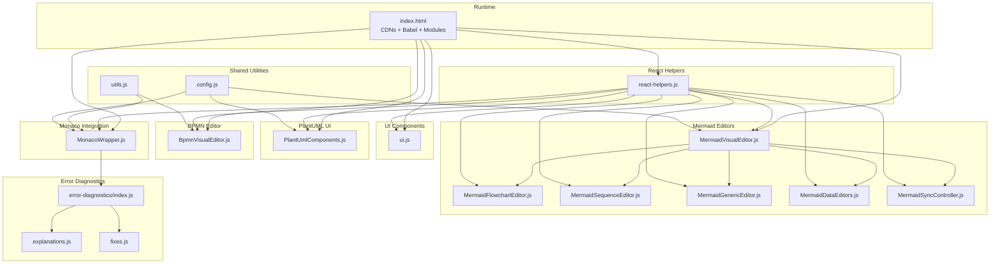
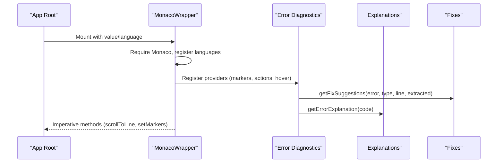
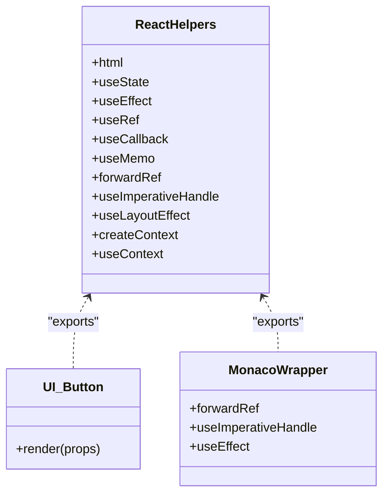
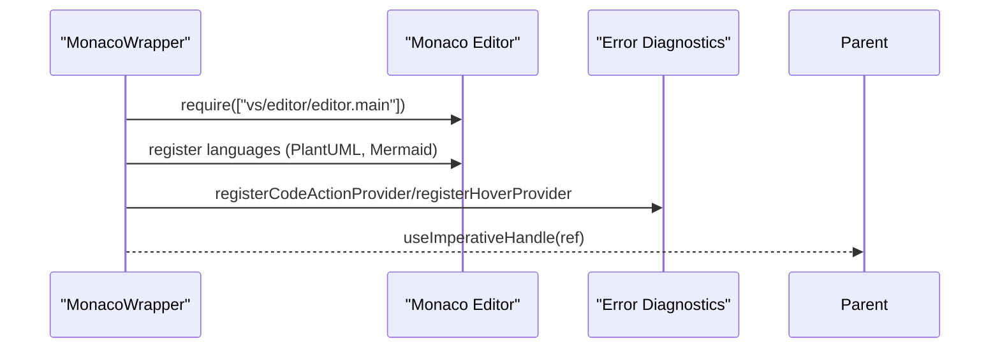
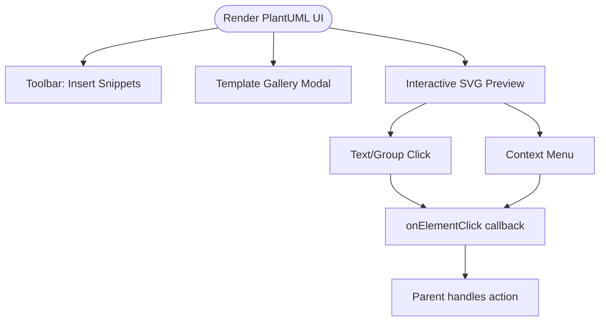
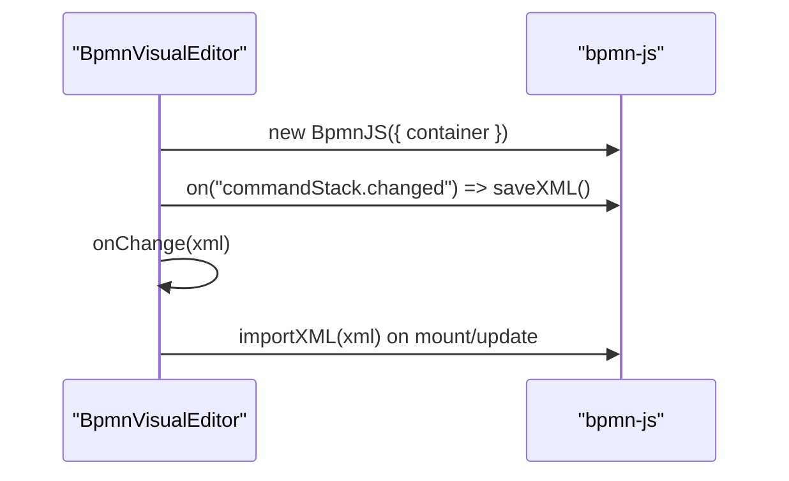
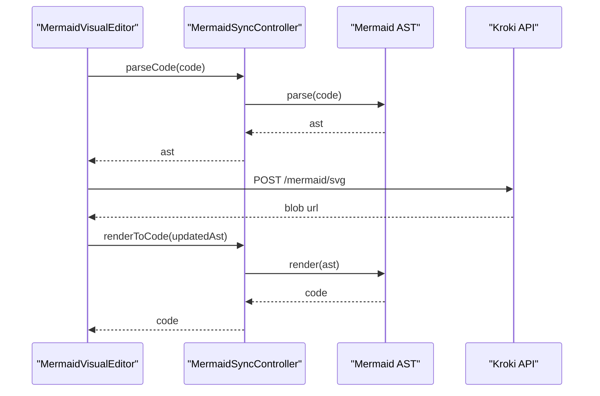
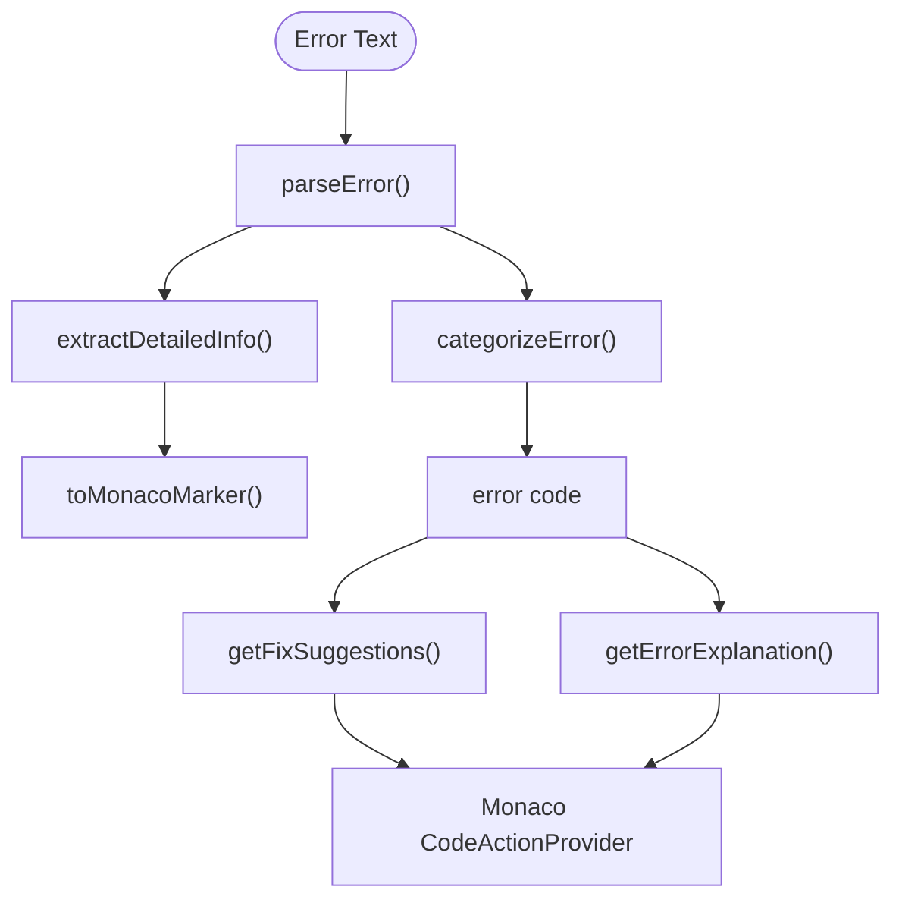
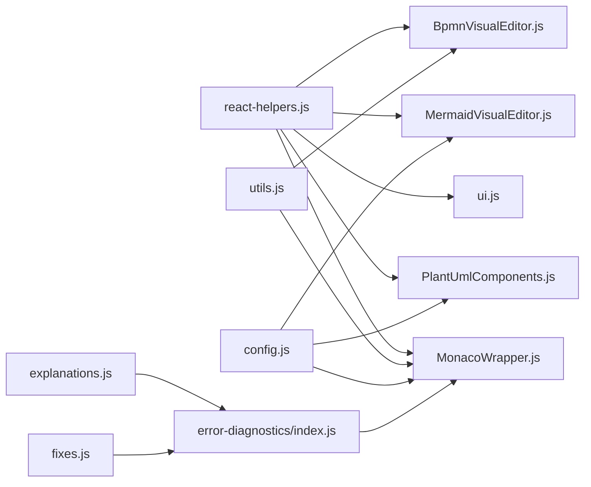

# Component Architecture

<cite>
**Referenced Files in This Document**
- [index.html](file://index.html)
- [react-helpers.js](file://js/react-helpers.js)
- [utils.js](file://js/utils.js)
- [config.js](file://js/config.js)
- [ui.js](file://js/components/ui.js)
- [MonacoWrapper.js](file://js/components/MonacoWrapper.js)
- [PlantUmlComponents.js](file://js/components/PlantUmlComponents.js)
- [BpmnVisualEditor.js](file://js/editors/bpmn/BpmnVisualEditor.js)
- [MermaidVisualEditor.js](file://js/editors/mermaid/index.js)
- [MermaidFlowchartEditor.js](file://js/editors/mermaid/MermaidFlowchartEditor.js)
- [MermaidSequenceEditor.js](file://js/editors/mermaid/MermaidSequenceEditor.js)
- [MermaidGenericEditor.js](file://js/editors/mermaid/MermaidGenericEditor.js)
- [MermaidDataEditors.js](file://js/editors/mermaid/MermaidDataEditors.js)
- [MermaidSyncController.js](file://js/editors/mermaid/MermaidSyncController.js)
- [explanations.js](file://js/error-diagnostics/explanations.js)
- [fixes.js](file://js/error-diagnostics/fixes.js)
- [index.js](file://js/error-diagnostics/index.js)
</cite>

## Table of Contents
1. [Introduction](#introduction)
2. [Project Structure](#project-structure)
3. [Core Components](#core-components)
4. [Architecture Overview](#architecture-overview)
5. [Detailed Component Analysis](#detailed-component-analysis)
6. [Dependency Analysis](#dependency-analysis)
7. [Performance Considerations](#performance-considerations)
8. [Troubleshooting Guide](#troubleshooting-guide)
9. [Conclusion](#conclusion)
10. [Appendices](#appendices)

## Introduction
This document describes the React component system and integration patterns used to build a multi-diagram editor supporting Mermaid, PlantUML, BPMN, and other diagram types. It covers component composition patterns (higher-order components, custom hooks, and state management), React helpers for DOM manipulation and lifecycle management, component communication (props, context, and event propagation), integrations with external libraries (Monaco Editor, bpmn-js, Mermaid AST), lifecycle management and memory optimization, reusability patterns, and performance and debugging strategies.

## Project Structure
The application is a single-page app that embeds React components and integrates external diagramming libraries. The structure emphasizes:
- Shared React helpers and utilities
- Reusable UI components
- **Custom Hooks** for state management and logic encapsulation
- Editor-specific components for each diagram type
- Error diagnostics and fix suggestion systems
- Configuration-driven diagram type metadata

**Diagram sources**
- [index.html](file://index.html#L1-L120)
- [react-helpers.js](file://js/react-helpers.js#L1-L39)
- [utils.js](file://js/utils.js#L1-L177)
- [config.js](file://js/config.js#L1-L120)
- [ui.js](file://js/components/ui.js#L1-L175)
- [MonacoWrapper.js](file://js/components/MonacoWrapper.js#L1-L169)
- [PlantUmlComponents.js](file://js/components/PlantUmlComponents.js#L1-L249)
- [BpmnVisualEditor.js](file://js/editors/bpmn/BpmnVisualEditor.js#L1-L106)
- [MermaidVisualEditor.js](file://js/editors/mermaid/index.js#L1-L137)
- [MermaidFlowchartEditor.js](file://js/editors/mermaid/MermaidFlowchartEditor.js#L1-L276)
- [MermaidSequenceEditor.js](file://js/editors/mermaid/MermaidSequenceEditor.js#L1-L110)
- [MermaidGenericEditor.js](file://js/editors/mermaid/MermaidGenericEditor.js#L1-L101)
- [MermaidDataEditors.js](file://js/editors/mermaid/MermaidDataEditors.js#L1-L306)
- [MermaidSyncController.js](file://js/editors/mermaid/MermaidSyncController.js#L1-L93)
- [index.js](file://js/error-diagnostics/index.js#L1-L120)

**Section sources**
- [index.html](file://index.html#L1-L120)
- [react-helpers.js](file://js/react-helpers.js#L1-L39)

## Core Components
- React helpers: Provides a unified React API surface and JSX-like templating via htm, exposing hooks and refs for component construction.
- Shared UI components: Reusable Button, StatusBadge, Loader, EmptyState, SectionHeader, EditableText.
- Monaco wrapper: A forwardRef-enabled editor that registers diagram-specific languages, error providers, and exposes imperative methods for scrolling, inserting text, and setting markers.
- PlantUML UI: Toolbar, template gallery, context menu, and interactive SVG preview with click and context actions.
- BPMN visual editor: Loads bpmn-js, manages XML import/export, and synchronizes changes back to the code editor.
- Mermaid editors: A router that selects a specialized editor based on AST type (flowchart, sequence, data charts), plus a generic editor and a sync controller for AST/code bidirectional synchronization.

**Section sources**
- [react-helpers.js](file://js/react-helpers.js#L1-L39)
- [ui.js](file://js/components/ui.js#L1-L175)
- [MonacoWrapper.js](file://js/components/MonacoWrapper.js#L1-L169)
- [PlantUmlComponents.js](file://js/components/PlantUmlComponents.js#L1-L249)
- [BpmnVisualEditor.js](file://js/editors/bpmn/BpmnVisualEditor.js#L1-L106)
- [MermaidVisualEditor.js](file://js/editors/mermaid/index.js#L1-L137)
- [MermaidFlowchartEditor.js](file://js/editors/mermaid/MermaidFlowchartEditor.js#L1-L276)
- [MermaidSequenceEditor.js](file://js/editors/mermaid/MermaidSequenceEditor.js#L1-L110)
- [MermaidGenericEditor.js](file://js/editors/mermaid/MermaidGenericEditor.js#L1-L101)
- [MermaidDataEditors.js](file://js/editors/mermaid/MermaidDataEditors.js#L1-L306)
- [MermaidSyncController.js](file://js/editors/mermaid/MermaidSyncController.js#L1-L93)

### Custom Hooks (State Management)
To avoid the "God Component" anti-pattern in `App.jsx`, logic is extracted into domain-specific hooks:
- `useDiagramState`: Manages core state (text, diagram type, view mode), file I/O, and Mermaid AST sync.
- `useRemoteRenderer`: Encapsulates Kroki interactions, loading states, stats, and error markers.
- `useAutoLayout`: Handles BPMN auto-layout logic, missing DI detection, and dialogs.
- `useCopilot`: Manages AI Copilot visibility and code application logic.

**Source Files**
- [useDiagramState.js](file://js/hooks/useDiagramState.js)
- [useRemoteRenderer.js](file://js/hooks/useRemoteRenderer.js)
- [useAutoLayout.js](file://js/hooks/useAutoLayout.js)
- [useCopilot.js](file://js/hooks/useCopilot.js)

## Architecture Overview
The system composes React components with external libraries:
- Monaco Editor is initialized asynchronously and registers diagram-specific languages and error providers.
- bpmn-js is dynamically loaded and integrated into a container for visual editing.
- Mermaid AST is loaded as an ES module and used to parse/render Mermaid diagrams.
- Error diagnostics module parses raw errors, extracts structured positions, and generates quick fixes and hover explanations.

**Diagram sources**
- [MonacoWrapper.js](file://js/components/MonacoWrapper.js#L90-L169)
- [index.js](file://js/error-diagnostics/index.js#L1-L120)
- [explanations.js](file://js/error-diagnostics/explanations.js#L1-L120)
- [fixes.js](file://js/error-diagnostics/fixes.js#L1-L120)

## Detailed Component Analysis

### React Helpers and Composition Patterns
- Composition via JSX-like syntax using htm bound to React.createElement.
- Hooks used: useState, useEffect, useRef, useCallback, useMemo, forwardRef, useImperativeHandle, useLayoutEffect, createContext, useContext.
- Higher-order composition: Components accept props and render dynamic content; imperative methods are exposed via forwardRef/useImperativeHandle for parent-child orchestration.

**Diagram sources**
- [react-helpers.js](file://js/react-helpers.js#L1-L39)
- [ui.js](file://js/components/ui.js#L1-L175)
- [MonacoWrapper.js](file://js/components/MonacoWrapper.js#L1-L169)

**Section sources**
- [react-helpers.js](file://js/react-helpers.js#L1-L39)
- [ui.js](file://js/components/ui.js#L1-L175)

### Monaco Editor Integration
Key behaviors:
- AMD loader configuration for Monaco.
- Registers PlantUML and Mermaid Monarch grammars.
- Registers code action provider and hover provider for quick fixes and explanations.
- Exposes imperative methods: scrollToLine, setValue, insertAtCursor, setMarkers, clearMarkers, getModel, getMonaco.

**Diagram sources**
- [MonacoWrapper.js](file://js/components/MonacoWrapper.js#L90-L169)
- [index.js](file://js/error-diagnostics/index.js#L889-L982)

**Section sources**
- [MonacoWrapper.js](file://js/components/MonacoWrapper.js#L1-L169)
- [index.js](file://js/error-diagnostics/index.js#L889-L982)

### PlantUML UI Components
- Toolbar: Renders diagram-specific snippets and toggles expand/collapse.
- Template gallery: Modal with template cards to insert prebuilt diagrams.
- Context menu: Handles clicks and context menus on interactive SVG elements.
- Interactive SVG preview: Injects SVG content, attaches event listeners to text and groups, supports click and context actions.

**Diagram sources**
- [PlantUmlComponents.js](file://js/components/PlantUmlComponents.js#L1-L249)

**Section sources**
- [PlantUmlComponents.js](file://js/components/PlantUmlComponents.js#L1-L249)

### BPMN Visual Editor
- Dynamically loads bpmn-js CSS and library.
- Creates a modeler instance, listens to command stack changes, and exports XML to synchronize with the code editor.
- Imports initial XML and handles errors during import.

**Diagram sources**
- [BpmnVisualEditor.js](file://js/editors/bpmn/BpmnVisualEditor.js#L14-L90)

**Section sources**
- [BpmnVisualEditor.js](file://js/editors/bpmn/BpmnVisualEditor.js#L1-L106)

### Mermaid Editors and AST Synchronization
- Router selects editor by AST type (flowchart, sequence, data charts) or falls back to generic editor.
- Preview generation via Kroki API with debounced fetch and URL revocation for memory safety.
- MermaidSyncController manages AST state, prevents sync loops, and renders code from AST.

**Diagram sources**
- [MermaidVisualEditor.js](file://js/editors/mermaid/index.js#L20-L121)
- [MermaidSyncController.js](file://js/editors/mermaid/MermaidSyncController.js#L9-L92)

**Section sources**
- [MermaidVisualEditor.js](file://js/editors/mermaid/index.js#L1-L137)
- [MermaidFlowchartEditor.js](file://js/editors/mermaid/MermaidFlowchartEditor.js#L1-L276)
- [MermaidSequenceEditor.js](file://js/editors/mermaid/MermaidSequenceEditor.js#L1-L110)
- [MermaidGenericEditor.js](file://js/editors/mermaid/MermaidGenericEditor.js#L1-L101)
- [MermaidDataEditors.js](file://js/editors/mermaid/MermaidDataEditors.js#L1-L306)
- [MermaidSyncController.js](file://js/editors/mermaid/MermaidSyncController.js#L1-L93)

### Error Diagnostics and Quick Fixes
- Parses raw error text, extracts line/column/expected/found/near, and categorizes errors.
- Generates Monaco markers and code actions for quick fixes.
- Provides hover explanations with examples and documentation links.

**Diagram sources**
- [index.js](file://js/error-diagnostics/index.js#L27-L153)
- [fixes.js](file://js/error-diagnostics/fixes.js#L611-L656)
- [explanations.js](file://js/error-diagnostics/explanations.js#L237-L271)

**Section sources**
- [index.js](file://js/error-diagnostics/index.js#L1-L120)
- [fixes.js](file://js/error-diagnostics/fixes.js#L1-L120)
- [explanations.js](file://js/error-diagnostics/explanations.js#L1-L120)

## Dependency Analysis
- External libraries:
  - Monaco Editor (AMD loader, languages, providers)
  - bpmn-js (CSS + library)
  - Mermaid AST (ES module)
  - Pako (compression)
  - Font Awesome (icons)
  - Tailwind (utility classes)
- Internal dependencies:
  - react-helpers.js provides shared React APIs and JSX-like syntax.
  - utils.js provides shared utilities (loadScript, loadCSS, debounce, encodeKroki).
  - config.js centralizes diagram type metadata and snippets/templates.

**Diagram sources**
- [react-helpers.js](file://js/react-helpers.js#L1-L39)
- [utils.js](file://js/utils.js#L1-L177)
- [config.js](file://js/config.js#L1-L120)
- [MonacoWrapper.js](file://js/components/MonacoWrapper.js#L1-L169)
- [PlantUmlComponents.js](file://js/components/PlantUmlComponents.js#L1-L249)
- [BpmnVisualEditor.js](file://js/editors/bpmn/BpmnVisualEditor.js#L1-L106)
- [MermaidVisualEditor.js](file://js/editors/mermaid/index.js#L1-L137)
- [index.js](file://js/error-diagnostics/index.js#L1-L120)
- [explanations.js](file://js/error-diagnostics/explanations.js#L1-L120)
- [fixes.js](file://js/error-diagnostics/fixes.js#L1-L120)

**Section sources**
- [react-helpers.js](file://js/react-helpers.js#L1-L39)
- [utils.js](file://js/utils.js#L1-L177)
- [config.js](file://js/config.js#L1-L120)

## Performance Considerations
- Debouncing: The error diagnostics module debounces AST parsing to avoid excessive re-renders.
- Memory optimization:
  - Monaco editor disposes on unmount.
  - URL.revokeObjectURL for preview images to prevent memory leaks.
  - Debounced fetch for Mermaid previews.
- Lazy loading:
  - External scripts and CSS are loaded conditionally and deduplicated.
- Rendering:
  - Component-specific editors only render relevant panels (e.g., node/edge lists for flowcharts).
  - Debounced AST parsing prevents frequent re-parses during typing.

[No sources needed since this section provides general guidance]

## Troubleshooting Guide
- Monaco error providers:
  - Ensure providers are registered once and only when Monaco is available.
  - Use setMarkers/clearMarkers to reflect live diagnostics.
- BPMN import/export:
  - Validate XML before import; handle errors via onError callbacks.
  - Ensure bpmn-js CSS is loaded prior to initializing the modeler.
- Mermaid AST sync:
  - Prevent loops by checking changeSource flag.
  - Use renderToCode to update code after visual edits.
- Error parsing:
  - Use parseError to extract structured positions and generate quick fixes.
  - Fallback explanations and fixes are available if module fails to load.

**Section sources**
- [MonacoWrapper.js](file://js/components/MonacoWrapper.js#L90-L169)
- [BpmnVisualEditor.js](file://js/editors/bpmn/BpmnVisualEditor.js#L14-L90)
- [MermaidSyncController.js](file://js/editors/mermaid/MermaidSyncController.js#L9-L92)
- [index.js](file://js/error-diagnostics/index.js#L27-L153)

## Conclusion
The component architecture combines lightweight React helpers with robust integrations against Monaco, bpmn-js, and Mermaid AST. It emphasizes composability, declarative UI, and reactive synchronization between code and visual editors. Error diagnostics and quick fixes improve developer experience, while lifecycle and memory management keep the app responsive and efficient.

[No sources needed since this section summarizes without analyzing specific files]

## Appendices

### Component Communication Patterns
- Props: Components receive data and callbacks (e.g., onChange, onError).
- Imperative handles: Parents call methods on child refs (e.g., MonacoWrapper.scrollToLine).
- Event propagation: Clicks and context menus propagate to parent handlers for navigation and actions.

**Section sources**
- [MonacoWrapper.js](file://js/components/MonacoWrapper.js#L20-L84)
- [PlantUmlComponents.js](file://js/components/PlantUmlComponents.js#L150-L249)

### Extension Points and Reusability
- Shared UI components promote consistent UX across editors.
- Config-driven diagram metadata enables adding new diagram types with minimal code.
- Modular error diagnostics and fix suggestions enable extending support for new diagram types.

**Section sources**
- [ui.js](file://js/components/ui.js#L1-L175)
- [config.js](file://js/config.js#L1-L120)
- [fixes.js](file://js/error-diagnostics/fixes.js#L1-L120)