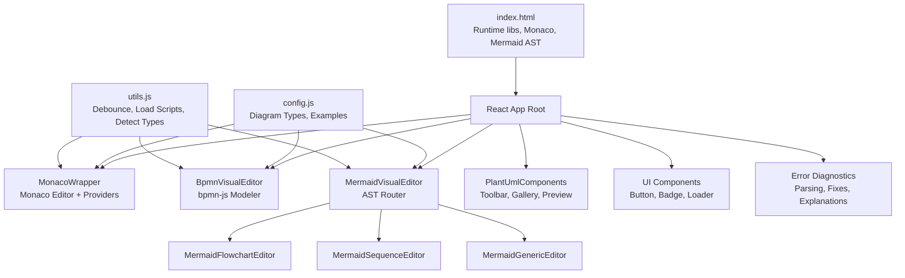
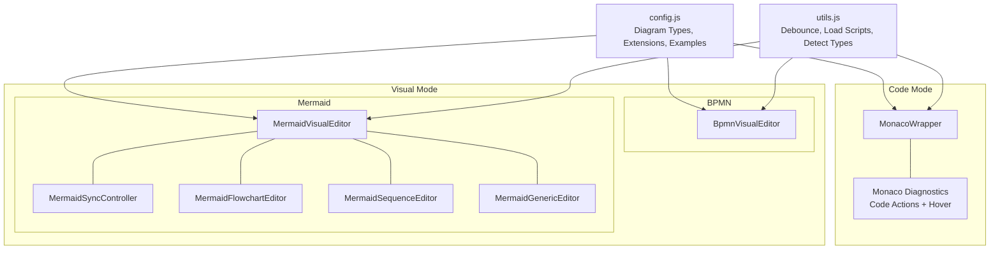
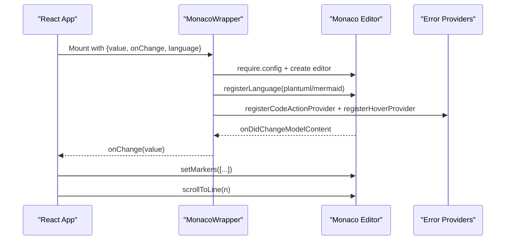
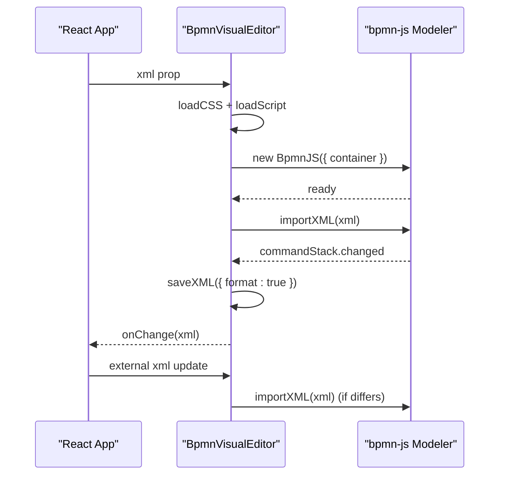
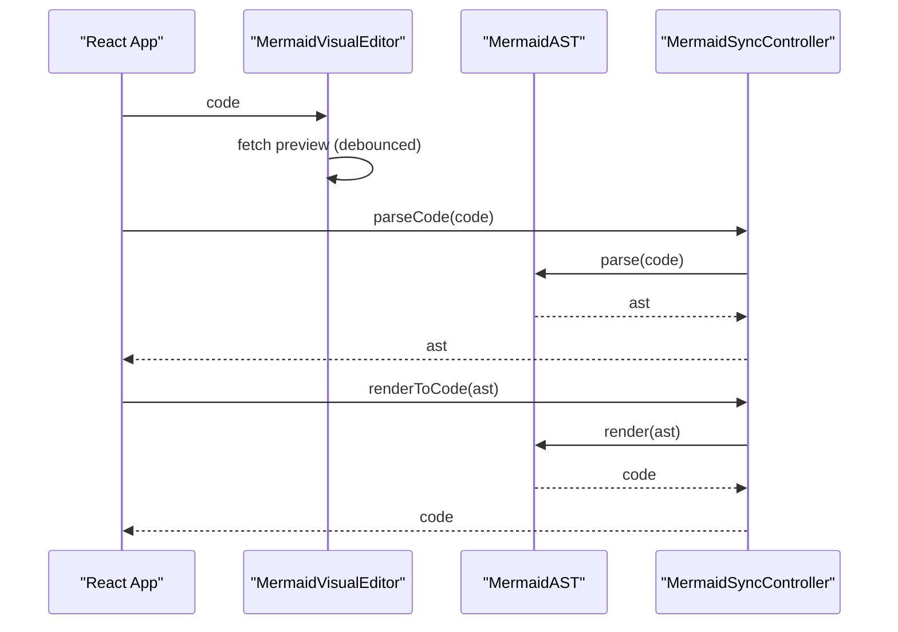
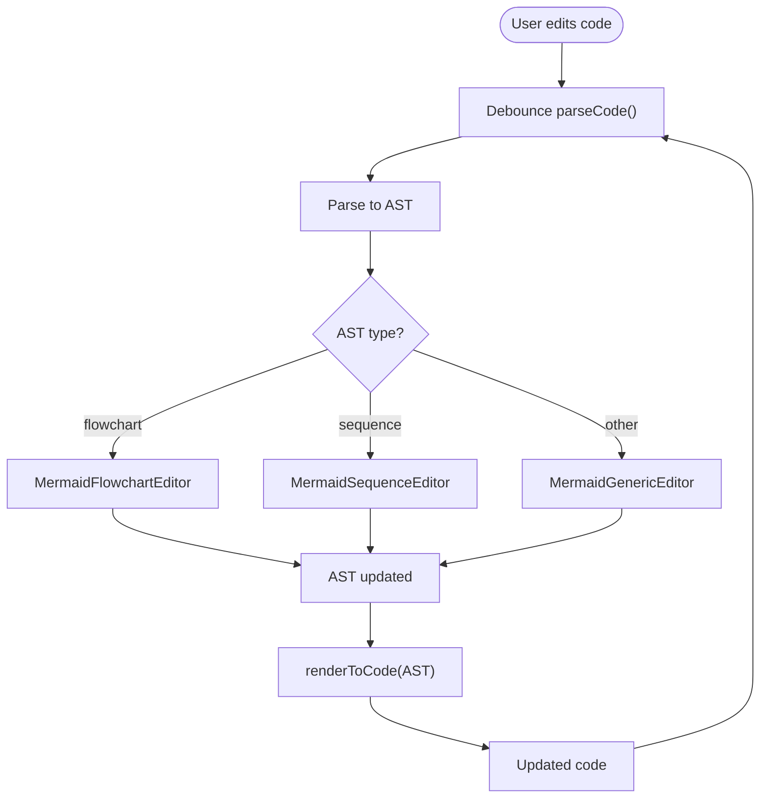
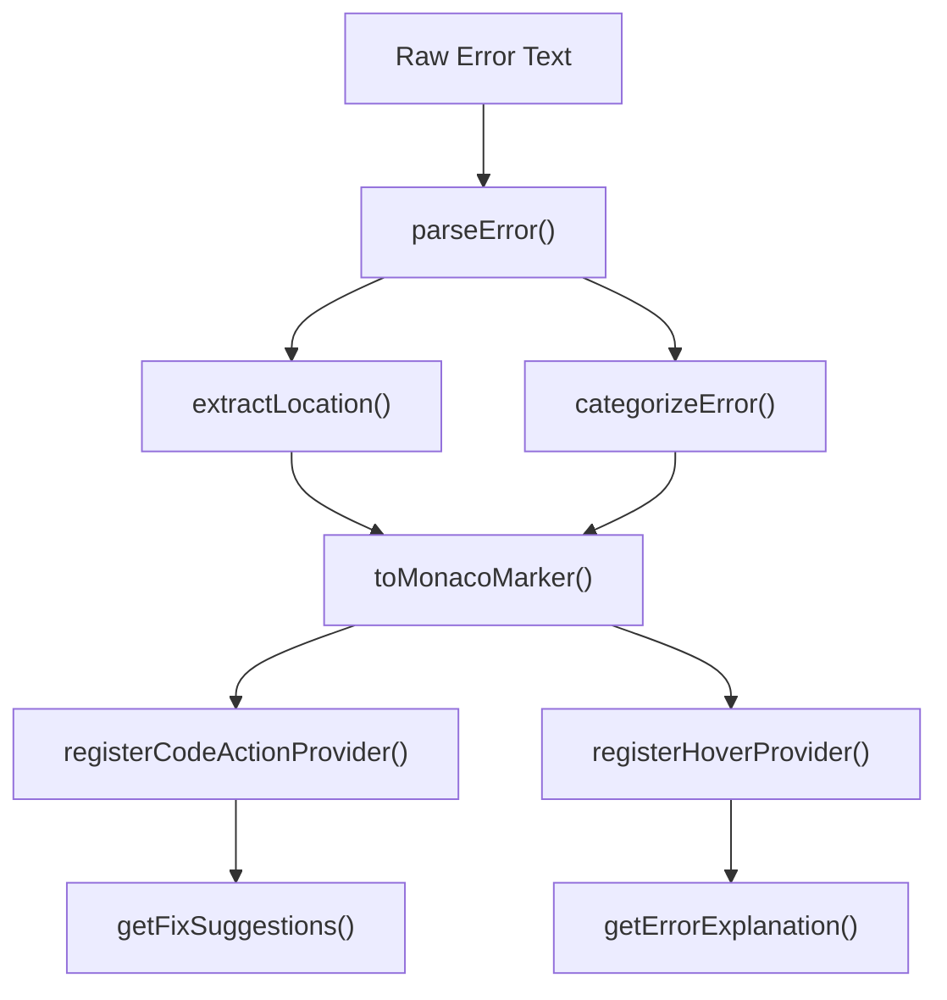
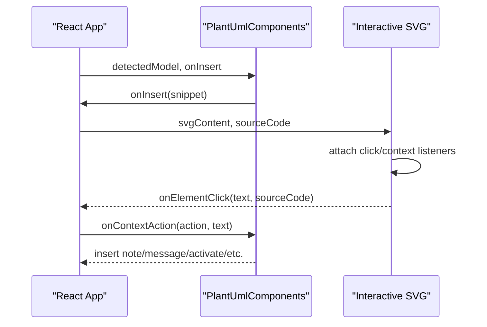
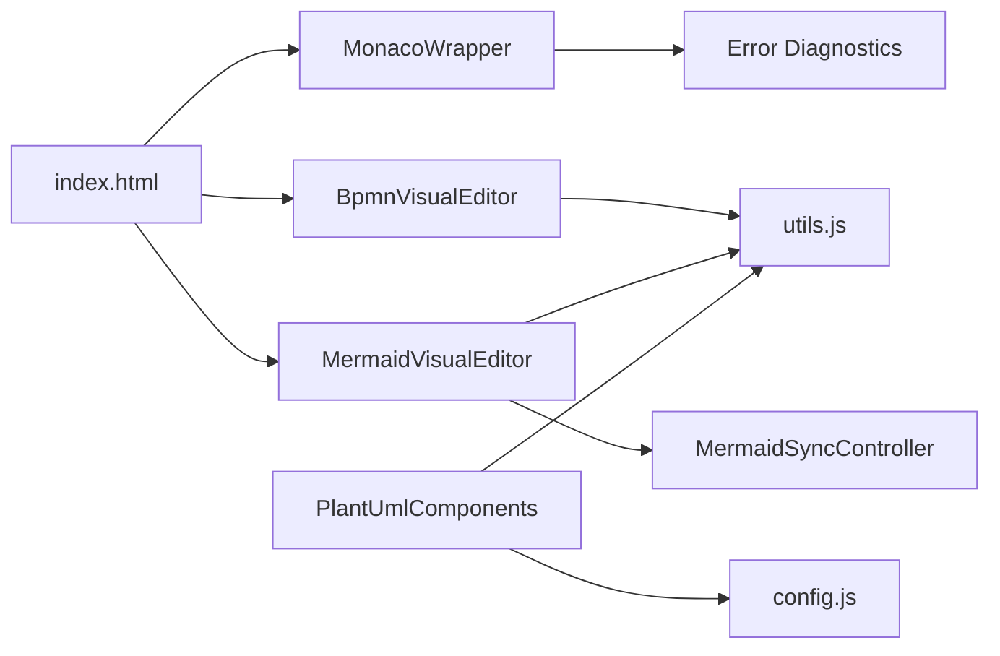

# Editor Architecture

<cite>
**Referenced Files in This Document**
- [index.html](file://index.html)
- [js/config.js](file://js/config.js)
- [js/react-helpers.js](file://js/react-helpers.js)
- [js/utils.js](file://js/utils.js)
- [js/components/MonacoWrapper.js](file://js/components/MonacoWrapper.js)
- [js/components/PlantUmlComponents.js](file://js/components/PlantUmlComponents.js)
- [js/components/ui.js](file://js/components/ui.js)
- [js/editors/bpmn/BpmnVisualEditor.js](file://js/editors/bpmn/BpmnVisualEditor.js)
- [js/editors/mermaid/index.js](file://js/editors/mermaid/index.js)
- [js/editors/mermaid/MermaidSyncController.js](file://js/editors/mermaid/MermaidSyncController.js)
- [js/editors/mermaid/MermaidFlowchartEditor.js](file://js/editors/mermaid/MermaidFlowchartEditor.js)
- [js/editors/mermaid/MermaidSequenceEditor.js](file://js/editors/mermaid/MermaidSequenceEditor.js)
- [js/error-diagnostics/index.js](file://js/error-diagnostics/index.js)
- [js/error-diagnostics/explanations.js](file://js/error-diagnostics/explanations.js)
- [js/error-diagnostics/fixes.js](file://js/error-diagnostics/fixes.js)
</cite>

## Table of Contents
1. [Introduction](#introduction)
2. [Project Structure](#project-structure)
3. [Core Components](#core-components)
4. [Architecture Overview](#architecture-overview)
5. [Detailed Component Analysis](#detailed-component-analysis)
6. [Dependency Analysis](#dependency-analysis)
7. [Performance Considerations](#performance-considerations)
8. [Troubleshooting Guide](#troubleshooting-guide)
9. [Conclusion](#conclusion)

## Introduction
This document explains the editor architecture and component system used to support multiple diagramming formats. It covers:
- Monaco Editor integration with syntax highlighting, diagnostics, quick fixes, and custom language support
- Visual editors for BPMN (bpmn-js) and Mermaid (AST-based synchronization)
- Bi-directional synchronization between code and visual modes, change detection, debouncing, and state management
- React integration patterns and extension points for custom editors

## Project Structure
The project is organized around modular components and editors:
- Root HTML initializes runtime libraries and mounts the React app
- Configuration defines supported diagram types, examples, and language mappings
- React helpers enable JSX-like syntax without a build step
- Utilities provide shared functions for compression, detection, and debouncing
- Components encapsulate Monaco integration, PlantUML tooling, and UI primitives
- Editors implement visual editing for BPMN and Mermaid with AST-driven synchronization

**Diagram sources**
- [index.html](file://index.html#L1-L120)
- [js/config.js](file://js/config.js#L1-L116)
- [js/react-helpers.js](file://js/react-helpers.js#L1-L39)
- [js/utils.js](file://js/utils.js#L1-L177)
- [js/components/MonacoWrapper.js](file://js/components/MonacoWrapper.js#L1-L169)
- [js/components/PlantUmlComponents.js](file://js/components/PlantUmlComponents.js#L1-L249)
- [js/components/ui.js](file://js/components/ui.js#L1-L175)
- [js/editors/bpmn/BpmnVisualEditor.js](file://js/editors/bpmn/BpmnVisualEditor.js#L1-L106)
- [js/editors/mermaid/index.js](file://js/editors/mermaid/index.js#L1-L137)
- [js/editors/mermaid/MermaidFlowchartEditor.js](file://js/editors/mermaid/MermaidFlowchartEditor.js#L1-L276)
- [js/editors/mermaid/MermaidSequenceEditor.js](file://js/editors/mermaid/MermaidSequenceEditor.js#L1-L110)
- [js/error-diagnostics/index.js](file://js/error-diagnostics/index.js#L1-L303)
- [js/error-diagnostics/explanations.js](file://js/error-diagnostics/explanations.js#L1-L302)
- [js/error-diagnostics/fixes.js](file://js/error-diagnostics/fixes.js#L1-L403)

**Section sources**
- [index.html](file://index.html#L1-L120)
- [js/config.js](file://js/config.js#L1-L116)

## Core Components
- MonacoWrapper: A React-forwardRef component that initializes Monaco, registers custom languages (Mermaid, PlantUML), and exposes imperative methods for scrolling, setting/clearing markers, inserting text, and retrieving the editor/model. It integrates error providers for hover explanations and quick fixes.
- BpmnVisualEditor: A React component that lazily loads bpmn-js, creates a modeler, listens to command stack changes to export formatted XML, and synchronizes external XML updates.
- MermaidVisualEditor: A router component that generates a live SVG preview via Kroki and routes to diagram-specific editors based on AST type. It also exposes a sync controller for AST/code bidirectional synchronization.
- PlantUmlComponents: Toolbar, template gallery, interactive SVG preview, and context menus for PlantUML editing.
- UI Components: Reusable Button, StatusBadge, Loader, EmptyState, SectionHeader, and EditableText.
- Error Diagnostics: Parser for extracting structured error info, fix suggestions, and hover explanations for Monaco.

**Section sources**
- [js/components/MonacoWrapper.js](file://js/components/MonacoWrapper.js#L1-L169)
- [js/editors/bpmn/BpmnVisualEditor.js](file://js/editors/bpmn/BpmnVisualEditor.js#L1-L106)
- [js/editors/mermaid/index.js](file://js/editors/mermaid/index.js#L1-L137)
- [js/components/PlantUmlComponents.js](file://js/components/PlantUmlComponents.js#L1-L249)
- [js/components/ui.js](file://js/components/ui.js#L1-L175)
- [js/error-diagnostics/index.js](file://js/error-diagnostics/index.js#L1-L303)

## Architecture Overview
The system supports three major editing modes:
- Code mode: powered by Monaco with custom languages and diagnostics
- Visual mode (BPMN): bpmn-js modeler with XML export/import
- Visual mode (Mermaid): AST-based synchronization with live preview

**Diagram sources**
- [js/components/MonacoWrapper.js](file://js/components/MonacoWrapper.js#L1-L169)
- [js/editors/bpmn/BpmnVisualEditor.js](file://js/editors/bpmn/BpmnVisualEditor.js#L1-L106)
- [js/editors/mermaid/index.js](file://js/editors/mermaid/index.js#L1-L137)
- [js/editors/mermaid/MermaidSyncController.js](file://js/editors/mermaid/MermaidSyncController.js#L1-L93)
- [js/editors/mermaid/MermaidFlowchartEditor.js](file://js/editors/mermaid/MermaidFlowchartEditor.js#L1-L276)
- [js/editors/mermaid/MermaidSequenceEditor.js](file://js/editors/mermaid/MermaidSequenceEditor.js#L1-L110)
- [js/config.js](file://js/config.js#L1-L116)
- [js/utils.js](file://js/utils.js#L1-L177)

## Detailed Component Analysis

### Monaco Editor Integration
MonacoWrapper integrates Monaco Editor with:
- Custom language registration for PlantUML and Mermaid using Monarch tokens providers
- Error provider registration for code actions and hover explanations
- Imperative methods for editor control and diagnostics
- Debounced change handling and cursor position callbacks

**Diagram sources**
- [js/components/MonacoWrapper.js](file://js/components/MonacoWrapper.js#L92-L151)
- [js/components/MonacoWrapper.js](file://js/components/MonacoWrapper.js#L309-L423)

Key implementation highlights:
- Language registration and configuration for PlantUML and Mermaid
- Error providers for quick fixes and hover explanations
- Exposed imperative methods for markers, scrolling, and text insertion
- Cursor change callback and editor model access

**Section sources**
- [js/components/MonacoWrapper.js](file://js/components/MonacoWrapper.js#L1-L169)
- [js/components/MonacoWrapper.js](file://js/components/MonacoWrapper.js#L171-L303)
- [js/components/MonacoWrapper.js](file://js/components/MonacoWrapper.js#L305-L423)

### Visual Editor: BPMN (bpmn-js)
The BPMN visual editor:
- Lazily loads bpmn-js CSS and library
- Creates a modeler instance bound to a DOM container
- Listens to command stack changes to export formatted XML and notify parent
- Imports external XML updates safely and handles errors

**Diagram sources**
- [js/editors/bpmn/BpmnVisualEditor.js](file://js/editors/bpmn/BpmnVisualEditor.js#L19-L75)
- [js/editors/bpmn/BpmnVisualEditor.js](file://js/editors/bpmn/BpmnVisualEditor.js#L77-L90)

**Section sources**
- [js/editors/bpmn/BpmnVisualEditor.js](file://js/editors/bpmn/BpmnVisualEditor.js#L1-L106)

### Visual Editor: Mermaid (AST-based Synchronization)
The Mermaid visual editor:
- Generates a live SVG preview via Kroki with debounced fetch
- Routes to diagram-specific editors based on AST type
- Provides a sync controller to parse code to AST and render AST back to code with debouncing and loop prevention

**Diagram sources**
- [js/editors/mermaid/index.js](file://js/editors/mermaid/index.js#L24-L60)
- [js/editors/mermaid/MermaidSyncController.js](file://js/editors/mermaid/MermaidSyncController.js#L9-L92)

Mermaid editors:
- Flowchart editor: lists nodes/edges, supports inline editing, adds nodes/edges by modifying code
- Sequence editor: lists participants/messages, supports adding participants/messages by modifying code

**Diagram sources**
- [js/editors/mermaid/index.js](file://js/editors/mermaid/index.js#L77-L121)
- [js/editors/mermaid/MermaidFlowchartEditor.js](file://js/editors/mermaid/MermaidFlowchartEditor.js#L10-L117)
- [js/editors/mermaid/MermaidSequenceEditor.js](file://js/editors/mermaid/MermaidSequenceEditor.js#L4-L50)
- [js/editors/mermaid/MermaidSyncController.js](file://js/editors/mermaid/MermaidSyncController.js#L21-L58)

**Section sources**
- [js/editors/mermaid/index.js](file://js/editors/mermaid/index.js#L1-L137)
- [js/editors/mermaid/MermaidSyncController.js](file://js/editors/mermaid/MermaidSyncController.js#L1-L93)
- [js/editors/mermaid/MermaidFlowchartEditor.js](file://js/editors/mermaid/MermaidFlowchartEditor.js#L1-L276)
- [js/editors/mermaid/MermaidSequenceEditor.js](file://js/editors/mermaid/MermaidSequenceEditor.js#L1-L110)

### Error Diagnostics and Quick Fixes
The error diagnostics pipeline:
- Parses raw error text to extract line/column and categorize the error
- Converts to Monaco marker format
- Provides quick fixes and hover explanations tailored per diagram type

**Diagram sources**
- [js/error-diagnostics/index.js](file://js/error-diagnostics/index.js#L13-L44)
- [js/error-diagnostics/index.js](file://js/error-diagnostics/index.js#L52-L145)
- [js/error-diagnostics/index.js](file://js/error-diagnostics/index.js#L153-L254)
- [js/error-diagnostics/index.js](file://js/error-diagnostics/index.js#L261-L276)
- [js/error-diagnostics/explanations.js](file://js/error-diagnostics/explanations.js#L12-L302)
- [js/error-diagnostics/fixes.js](file://js/error-diagnostics/fixes.js#L11-L403)

**Section sources**
- [js/error-diagnostics/index.js](file://js/error-diagnostics/index.js#L1-L303)
- [js/error-diagnostics/explanations.js](file://js/error-diagnostics/explanations.js#L1-L302)
- [js/error-diagnostics/fixes.js](file://js/error-diagnostics/fixes.js#L1-L403)

### PlantUML Tooling and Preview
PlantUMLComponents provide:
- Snippet toolbar with dynamic expansion
- Template gallery modal
- Interactive SVG preview with click/context actions
- Context menu for adding notes, messages, activation/deactivation, and navigation

**Diagram sources**
- [js/components/PlantUmlComponents.js](file://js/components/PlantUmlComponents.js#L8-L47)
- [js/components/PlantUmlComponents.js](file://js/components/PlantUmlComponents.js#L153-L248)

**Section sources**
- [js/components/PlantUmlComponents.js](file://js/components/PlantUmlComponents.js#L1-L249)

### React Integration and Extension Points
- React helpers: htm binding for JSX-like syntax and re-export of hooks
- UI components: reusable primitives for buttons, badges, loaders, and editable text
- Extension points:
  - Add new diagram types via config.js (language mapping, examples, extensions)
  - Extend MonacoWrapper with new languages and providers
  - Add new Mermaid editors by extending the router and implementing AST-aware UI
  - Integrate new visual editors by implementing import/export XML/AST and change detection

**Section sources**
- [js/react-helpers.js](file://js/react-helpers.js#L1-L39)
- [js/components/ui.js](file://js/components/ui.js#L1-L175)
- [js/config.js](file://js/config.js#L1-L116)

## Dependency Analysis
- Runtime libraries: Monaco, Mermaid AST, bpmn-js, Pako, Tailwind, Font Awesome
- Internal dependencies:
  - MonacoWrapper depends on error diagnostics and React helpers
  - BpmnVisualEditor depends on utils for script loading and CSS injection
  - MermaidVisualEditor depends on utils for debouncing and on MermaidAST for parsing/rendering
  - PlantUmlComponents depend on config for snippets/templates and on utils for script loading

**Diagram sources**
- [index.html](file://index.html#L1-L120)
- [js/components/MonacoWrapper.js](file://js/components/MonacoWrapper.js#L1-L169)
- [js/editors/bpmn/BpmnVisualEditor.js](file://js/editors/bpmn/BpmnVisualEditor.js#L1-L106)
- [js/editors/mermaid/index.js](file://js/editors/mermaid/index.js#L1-L137)
- [js/editors/mermaid/MermaidSyncController.js](file://js/editors/mermaid/MermaidSyncController.js#L1-L93)
- [js/components/PlantUmlComponents.js](file://js/components/PlantUmlComponents.js#L1-L249)
- [js/config.js](file://js/config.js#L1-L116)
- [js/utils.js](file://js/utils.js#L1-L177)

**Section sources**
- [index.html](file://index.html#L1-L120)
- [js/utils.js](file://js/utils.js#L1-L177)

## Performance Considerations
- Debouncing:
  - Mermaid parse/render uses a 300ms debounce to avoid excessive AST computations
  - Mermaid preview generation uses a 500ms debounce plus a short cleanup timer to prevent race conditions
  - General debounce utility is available for throttling expensive operations
- Lazy loading:
  - bpmn-js and Mermaid AST are loaded on demand to reduce initial bundle size
  - Monaco AMD loader is configured to minimize startup overhead
- Memory management:
  - Preview URLs are revoked on unmount to prevent memory leaks
  - Editor instances are disposed on component unmount

**Section sources**
- [js/editors/mermaid/MermaidSyncController.js](file://js/editors/mermaid/MermaidSyncController.js#L25-L37)
- [js/editors/mermaid/index.js](file://js/editors/mermaid/index.js#L50-L53)
- [js/utils.js](file://js/utils.js#L166-L176)

## Troubleshooting Guide
Common issues and resolutions:
- Monaco fails to initialize:
  - Ensure Monaco AMD loader is available and paths are configured
  - Confirm that language registration runs before editor creation
- Error markers not appearing:
  - Verify that markers are attached to the editor model and use the correct owner
  - Check that error parsing extracts line/column correctly
- BPMN visual editor not loading:
  - Confirm CSS and script URLs are reachable and define is temporarily removed to avoid AMD conflicts
  - Ensure XML is valid and import errors are handled gracefully
- Mermaid AST not loaded:
  - Wait for the Mermaid AST module to be injected globally before attempting parse/render
  - Use the sync controller’s isLoaded guard
- PlantUML preview not interactive:
  - Ensure SVG content is injected and click/context listeners are attached
  - Verify that element extraction targets text nodes and groups with IDs

**Section sources**
- [js/components/MonacoWrapper.js](file://js/components/MonacoWrapper.js#L96-L148)
- [js/error-diagnostics/index.js](file://js/error-diagnostics/index.js#L261-L276)
- [js/editors/bpmn/BpmnVisualEditor.js](file://js/editors/bpmn/BpmnVisualEditor.js#L26-L67)
- [js/editors/mermaid/MermaidSyncController.js](file://js/editors/mermaid/MermaidSyncController.js#L88-L91)
- [js/components/PlantUmlComponents.js](file://js/components/PlantUmlComponents.js#L158-L213)

## Conclusion
The editor architecture combines Monaco’s powerful code editing with dedicated visual editors for BPMN and Mermaid. It emphasizes:
- Extensible language support and diagnostics
- Robust visual editing with AST-based synchronization and real-time previews
- React-friendly component patterns and lazy-loading for performance
- Clear extension points for new diagram types and editors