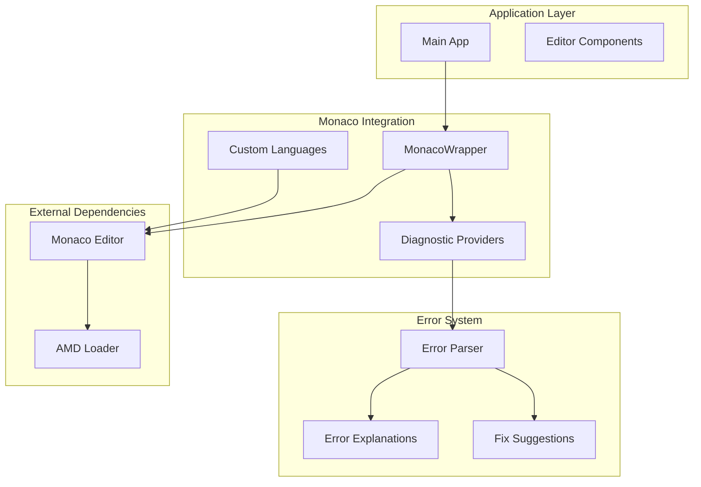
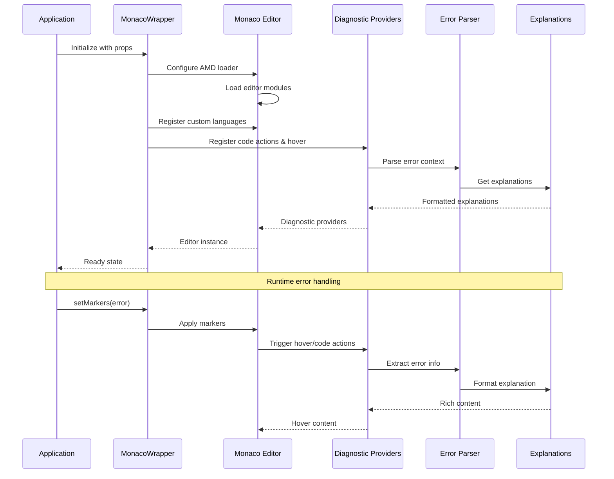
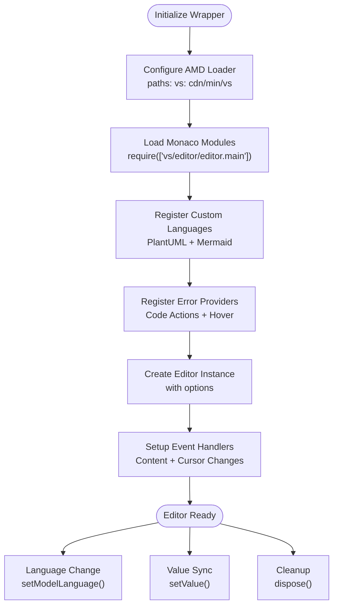
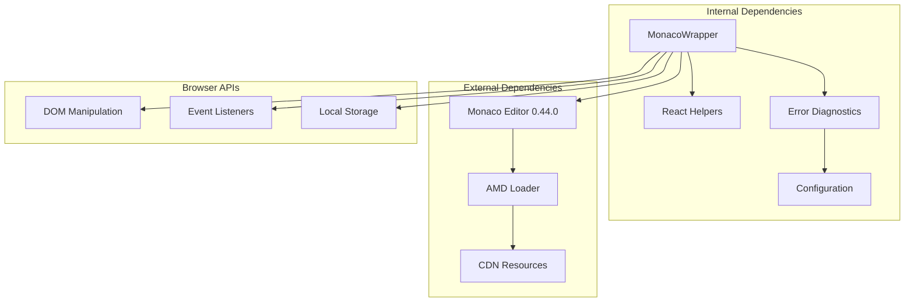

# Monaco Editor Integration

<cite>
**Referenced Files in This Document**
- [MonacoWrapper.js](file://js/components/MonacoWrapper.js)
- [index.html](file://index.html)
- [config.js](file://js/config.js)
- [explanations.js](file://js/error-diagnostics/explanations.js)
- [fixes.js](file://js/error-diagnostics/fixes.js)
- [index.js](file://js/error-diagnostics/index.js)
- [PlantUmlComponents.js](file://js/components/PlantUmlComponents.js)
- [MermaidGenericEditor.js](file://js/editors/mermaid/MermaidGenericEditor.js)
- [BpmnVisualEditor.js](file://js/editors/bpmn/BpmnVisualEditor.js)
- [react-helpers.js](file://js/react-helpers.js)
</cite>

## Table of Contents
1. [Introduction](#introduction)
2. [Project Structure](#project-structure)
3. [Core Components](#core-components)
4. [Architecture Overview](#architecture-overview)
5. [Detailed Component Analysis](#detailed-component-analysis)
6. [Dependency Analysis](#dependency-analysis)
7. [Performance Considerations](#performance-considerations)
8. [Troubleshooting Guide](#troubleshooting-guide)
9. [Conclusion](#conclusion)

## Introduction
This document provides comprehensive documentation for the Monaco Editor integration and wrapper component used in the Universal Diagram Generator. The integration focuses on advanced code editing features for PlantUML and Mermaid languages, including syntax highlighting, error markers with squiggly underlines, diagnostic providers, custom language registration, bracket matching, auto-closing pairs, and comment configurations. It also covers the error detection system with code action providers for quick fixes, hover providers for contextual explanations, marker management, editor lifecycle including AMD loader configuration, initialization patterns, cleanup procedures, and exposed imperative methods for parent components.

## Project Structure
The Monaco Editor integration is implemented as a React wrapper component that integrates with the Monaco Editor library. The project structure organizes the integration into several key areas:

- **MonacoWrapper**: Core wrapper component that manages Monaco Editor lifecycle and exposes imperative methods
- **Language Registration**: Custom language providers for PlantUML and Mermaid with Monarch tokens
- **Error Diagnostics**: Comprehensive error parsing, explanations, and fix suggestions
- **Configuration**: Diagram type definitions and language mappings
- **Integration**: Seamless integration with the main application and other editors

**Diagram sources**
- [MonacoWrapper.js](file://js/components/MonacoWrapper.js#L1-L426)
- [index.html](file://index.html#L598-L727)
- [config.js](file://js/config.js#L6-L116)

**Section sources**
- [MonacoWrapper.js](file://js/components/MonacoWrapper.js#L1-L426)
- [index.html](file://index.html#L598-L727)

## Core Components

### MonacoWrapper Component
The MonacoWrapper serves as the central integration point for Monaco Editor, providing:

- **AMD Loader Configuration**: Configures Monaco's AMD loader for dynamic module loading
- **Language Registration**: Registers custom PlantUML and Mermaid languages with Monarch tokens
- **Editor Lifecycle Management**: Handles initialization, updates, and cleanup
- **Imperative Methods**: Exposes methods for parent components to control the editor
- **Error Provider Registration**: Sets up code actions and hover providers for diagnostics

Key features include:
- Automatic language switching based on diagram type
- Real-time content synchronization
- Cursor position tracking
- Theme customization support
- Minimap integration with configurable scaling

**Section sources**
- [MonacoWrapper.js](file://js/components/MonacoWrapper.js#L13-L169)
- [MonacoWrapper.js](file://js/components/MonacoWrapper.js#L92-L151)

### Custom Language Registration
The integration registers two custom languages with sophisticated syntax highlighting:

#### PlantUML Language Configuration
- **Monarch Tokens Provider**: Comprehensive tokenization for PlantUML syntax
- **Keywords**: Complete vocabulary including UML diagram elements, control structures, and directives
- **Comments**: Line comments with single quote and block comments with slash-quote syntax
- **Brackets**: Matching for curly braces, square brackets, parentheses, and angle brackets
- **Auto-closing Pairs**: Intelligent pairing for quotes, brackets, and stereotype delimiters
- **String Handling**: Multi-line string support with escape sequences

#### Mermaid Language Configuration
- **Monarch Tokens Provider**: Specialized tokenization for Mermaid syntax
- **Diagram Types**: Recognition of flowcharts, sequence diagrams, class diagrams, and specialized charts
- **Comments**: Line comments with double percent signs
- **Brackets**: Extensive bracket support including nested structures and label delimiters
- **Auto-closing Pairs**: Comprehensive pairing for various bracket types and pipe delimiters
- **String Handling**: Label and edge label support with bracket delimiters

**Section sources**
- [MonacoWrapper.js](file://js/components/MonacoWrapper.js#L174-L242)
- [MonacoWrapper.js](file://js/components/MonacoWrapper.js#L247-L303)

### Error Detection and Diagnostics System
The error system provides comprehensive error handling with:

- **Error Parsing**: Structured error extraction with line/column information
- **Category Classification**: Error categorization by type and severity
- **Quick Fix Suggestions**: Automated fix proposals with Monaco-compatible edits
- **Contextual Explanations**: Detailed explanations with examples and documentation links
- **Hover Integration**: Rich hover tooltips with error details
- **Marker Management**: Squiggly underline markers with precise positioning

**Section sources**
- [index.js](file://js/error-diagnostics/index.js#L13-L44)
- [index.js](file://js/error-diagnostics/index.js#L261-L276)

## Architecture Overview

The Monaco Editor integration follows a layered architecture with clear separation of concerns:

**Diagram sources**
- [MonacoWrapper.js](file://js/components/MonacoWrapper.js#L92-L151)
- [index.js](file://js/error-diagnostics/index.js#L13-L44)

The architecture ensures:
- **Modular Design**: Clear separation between editor management and error handling
- **Extensible Language Support**: Easy addition of new diagram languages
- **Performance Optimization**: Lazy loading and efficient update mechanisms
- **Developer Experience**: Rich error feedback and automated fixes

## Detailed Component Analysis

### MonacoWrapper Implementation

#### Editor Lifecycle Management
The wrapper implements a robust lifecycle with multiple initialization phases:

1. **AMD Loader Configuration**: Sets up Monaco's AMD loader with CDN paths
2. **Language Registration**: Registers custom languages with Monarch tokens
3. **Provider Registration**: Sets up error detection and quick fix providers
4. **Editor Creation**: Initializes the Monaco editor with configured options
5. **Event Handling**: Manages content changes, cursor movements, and cleanup

**Diagram sources**
- [MonacoWrapper.js](file://js/components/MonacoWrapper.js#L92-L151)

#### Imperative Methods for Parent Components
The wrapper exposes a comprehensive set of imperative methods:

- **scrollToLine(lineNumber)**: Centers the editor on a specific line and highlights it
- **setValue(newValue)**: Updates editor content safely
- **insertAtCursor(text)**: Inserts text at the current cursor position
- **setMarkers(markers)**: Applies error markers with squiggly underlines
- **clearMarkers()**: Removes all error markers
- **getModel()**: Returns the underlying Monaco model
- **getMonaco()**: Returns the Monaco instance

These methods enable parent components to programmatically control the editor state and integrate with the error detection system.

**Section sources**
- [MonacoWrapper.js](file://js/components/MonacoWrapper.js#L21-L84)

### Language Configuration Details

#### PlantUML Language Configuration
The PlantUML language configuration provides comprehensive syntax highlighting:

**Keywords Coverage**:
- UML diagram elements: participant, actor, class, interface, state, note
- Control structures: if/then/else, while, loop, alt/opt/par
- Diagram types: sequence, flowchart, class, state, activity, usecase
- Stereotypes and annotations: <<interface>>, <<enumeration>>
- Layout and formatting: skinparam, hide/show/remove

**Token Categories**:
- **Directives**: [@startuml, @enduml, @include, @define]
- **Comments**: Single-line ('), Block comments (/' ... '/)
- **Strings**: Quoted literals with escape sequences
- **Colors**: Hex color codes and named colors
- **Arrows**: Communication arrows and activation/deactivation markers
- **Identifiers**: Class names, package names, and member identifiers

**Bracket Matching and Auto-closing**:
- Curly braces for blocks and groups
- Square brackets for arrays and collections
- Parentheses for method calls and expressions
- Angle brackets for stereotypes
- Double quotes for strings

**Section sources**
- [MonacoWrapper.js](file://js/components/MonacoWrapper.js#L182-L242)

#### Mermaid Language Configuration
The Mermaid language configuration supports multiple diagram types:

**Diagram Type Recognition**:
- Flow-based: flowchart, graph
- Behavioral: sequenceDiagram, stateDiagram
- Data/Charts: gantt, pie, mindmap, timeline, journey
- Structural: classDiagram, erDiagram
- Specialized: gitGraph, quadrantChart, sankey

**Advanced Syntax Features**:
- **Subgraphs**: Nested grouping with title support
- **Edge Labels**: Text annotations on connections
- **Date Formatting**: ISO date patterns for timelines
- **Multi-line Strings**: Bracket-delimited labels
- **Direction Keywords**: TB, TD, BT, RL, LR

**Section sources**
- [MonacoWrapper.js](file://js/components/MonacoWrapper.js#L255-L303)

### Error Detection and Quick Fix System

#### Error Parsing and Categorization
The error system implements sophisticated parsing with:

**Location Extraction Patterns**:
- **Mermaid**: "Parse error on line X", "Syntax error at line X column Y"
- **PlantUML**: "ERROR line X", "Syntax Error: line X", "(X,Y)" coordinates
- **GraphViz**: "syntax error in line X", "Error: <stdin>:X:"
- **BPMN/XML**: "line X, column Y", "at line X:Y", "Line: X, Column: Y"

**Error Categories**:
- **Missing Brackets/Parentheses/Braces**: Structural syntax errors
- **Diagram Type Errors**: Unknown or missing diagram declarations
- **Arrow Syntax Issues**: Invalid connection syntax
- **Keyword Validation**: Unknown or misplaced keywords
- **Duplicate Definitions**: Redefinition of elements
- **XML Parsing Errors**: Malformed XML structure

**Section sources**
- [index.js](file://js/error-diagnostics/index.js#L52-L145)
- [index.js](file://js/error-diagnostics/index.js#L153-L254)

#### Quick Fix Suggestions
The system provides intelligent automated fixes:

**Mermaid Specific Fixes**:
- Adding missing diagram type declarations
- Inserting missing closing brackets/parentheses
- Providing arrow syntax alternatives
- Completing subgraph closures

**PlantUML Specific Fixes**:
- Adding missing @startuml/@enduml tags
- Correcting arrow syntax variations
- Fixing participant declarations
- Adding missing colons in messages

**Section sources**
- [fixes.js](file://js/error-diagnostics/fixes.js#L12-L109)
- [fixes.js](file://js/error-diagnostics/fixes.js#L111-L176)

### Diagnostic Providers Implementation

#### Code Action Provider
The code action provider enables quick fixes through Monaco's diagnostic system:

**Provider Registration**: Registered for mermaid, plantuml, and xml languages
**Context Awareness**: Analyzes markers in the current range
**Smart Fix Selection**: Filters fixes based on error type and position
**Monaco-Compatible Edits**: Generates proper Monaco edit objects

**Section sources**
- [MonacoWrapper.js](file://js/components/MonacoWrapper.js#L318-L391)

#### Hover Provider
The hover provider delivers contextual help:

**Position-Based Detection**: Finds relevant markers at cursor position
**Rich Content Formatting**: Markdown-compatible explanations
**Example Code**: Practical code examples for error resolution
**Documentation Links**: Direct links to official documentation

**Section sources**
- [MonacoWrapper.js](file://js/components/MonacoWrapper.js#L394-L422)

## Dependency Analysis

The Monaco Editor integration has minimal external dependencies while maintaining rich functionality:

**Diagram sources**
- [MonacoWrapper.js](file://js/components/MonacoWrapper.js#L5-L8)
- [index.html](file://index.html#L18-L19)

### External Dependencies
- **Monaco Editor**: Version 0.44.0 loaded from CDN
- **AMD Loader**: Dynamic module loading for Monaco
- **React**: ES modules via CDN with htm for JSX
- **Font Awesome**: Icons for UI components

### Internal Dependencies
- **React Helpers**: ES module compatibility layer
- **Configuration**: Diagram type definitions and language mappings
- **Error Diagnostics**: Parsing, explanations, and fix suggestions
- **Component Utilities**: Shared UI components and helpers

**Section sources**
- [react-helpers.js](file://js/react-helpers.js#L1-L39)
- [config.js](file://js/config.js#L6-L116)

## Performance Considerations

The Monaco Editor integration implements several performance optimizations:

### Lazy Loading and Initialization
- **AMD Loader Configuration**: Monaco modules loaded on-demand
- **Conditional Language Registration**: Languages only registered when needed
- **Deferred Provider Registration**: Error providers initialized once
- **Efficient Value Synchronization**: Only updates when content differs

### Memory Management
- **Proper Cleanup**: Editor disposal on component unmount
- **Resource Cleanup**: Preview URL revocation and event listener removal
- **Reference Management**: Proper useRef usage for editor instances
- **Event Handler Cleanup**: Removal of Monaco event listeners

### Rendering Optimizations
- **Minimap Scaling**: Configurable minimap scale (0.75) for performance
- **Automatic Layout**: Monaco's built-in layout management
- **Selective Updates**: Only language/model changes trigger reconfiguration
- **Debounced Operations**: Efficient handling of rapid content changes

## Troubleshooting Guide

### Common Issues and Solutions

#### Monaco Editor Not Loading
**Symptoms**: Blank editor or loading errors
**Causes**: CDN connectivity issues, AMD loader conflicts
**Solutions**:
- Verify CDN accessibility for Monaco resources
- Check for existing AMD loader conflicts
- Ensure proper script loading order

#### Language Registration Failures
**Symptoms**: Syntax highlighting not working
**Causes**: Language already registered, token provider errors
**Solutions**:
- Check for existing language registrations
- Validate Monarch token patterns
- Ensure proper language configuration objects

#### Error Provider Not Working
**Symptoms**: No quick fixes or hover information
**Causes**: Provider registration timing issues
**Solutions**:
- Verify provider registration occurs after Monaco initialization
- Check language IDs match between registration and usage
- Ensure proper Monaco instance availability

#### Marker Positioning Issues
**Symptoms**: Error markers not appearing at correct locations
**Causes**: Line/column calculation errors, end-of-file markers
**Solutions**:
- Validate error line/column extraction patterns
- Handle special end-of-file marker (99999) cases
- Ensure proper Monaco Range creation

**Section sources**
- [MonacoWrapper.js](file://js/components/MonacoWrapper.js#L338-L349)
- [index.js](file://js/error-diagnostics/index.js#L428-L449)

### Debugging Techniques

#### Console Logging
Enable detailed logging for:
- Monaco initialization phases
- Language registration success/failure
- Error provider registration status
- Event handler execution

#### Developer Tools
Use browser developer tools to:
- Inspect Monaco editor instance
- Monitor Monaco model changes
- Debug event handler execution
- Analyze memory usage patterns

#### Error Analysis
Implement systematic error analysis:
- Parse error text patterns
- Extract location information
- Categorize error types
- Generate appropriate fixes

## Conclusion

The Monaco Editor integration provides a robust foundation for advanced diagram code editing with comprehensive language support, intelligent error detection, and seamless integration with the broader Universal Diagram Generator ecosystem. The implementation demonstrates best practices in:

- **Modular Architecture**: Clear separation of concerns between editor management and error handling
- **Performance Optimization**: Efficient loading, memory management, and rendering
- **Developer Experience**: Rich error feedback, automated fixes, and contextual help
- **Extensibility**: Easy addition of new diagram languages and error types

The integration successfully balances functionality with performance, providing a smooth editing experience while maintaining clean code organization and maintainable architecture. The comprehensive error detection system significantly improves user productivity by providing immediate feedback and automated solutions for common syntax errors.

Future enhancements could include:
- Additional diagram language support
- Advanced refactoring capabilities
- Enhanced collaborative editing features
- Customizable theme support
- Integration with external validation services