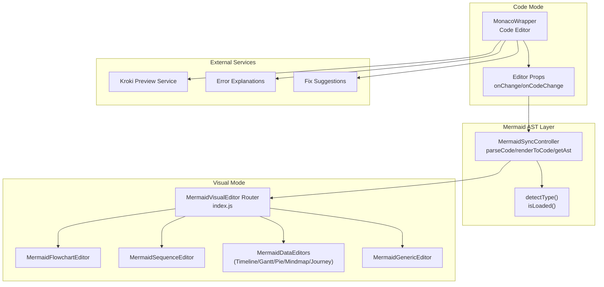
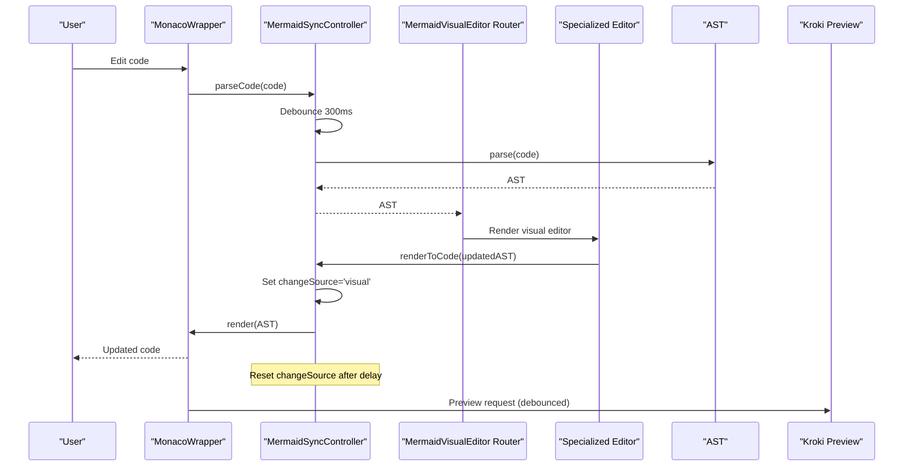
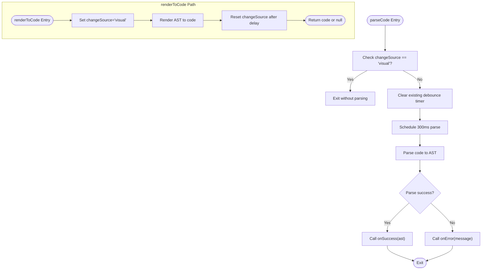
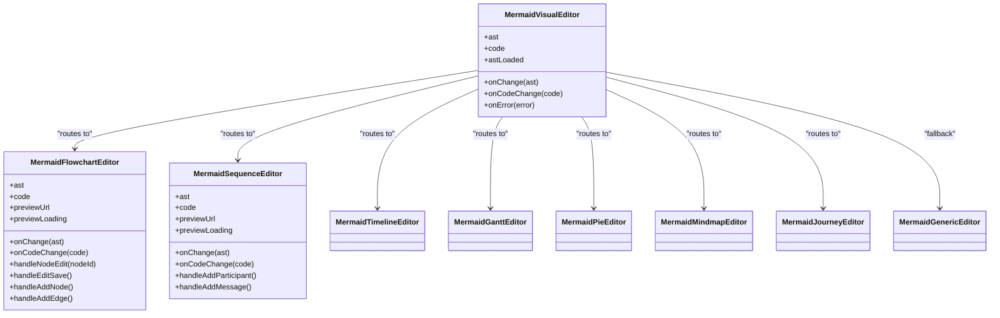
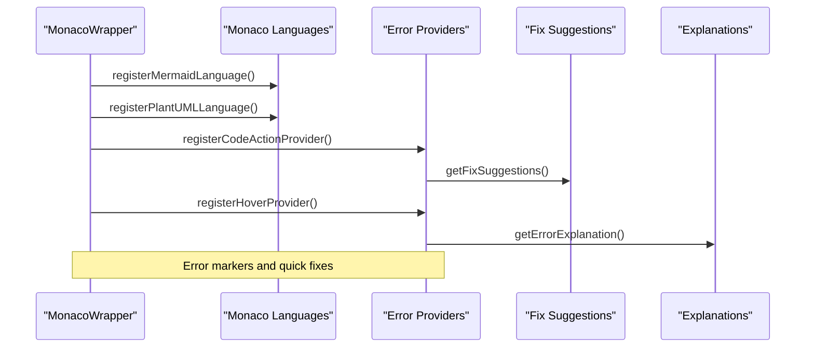
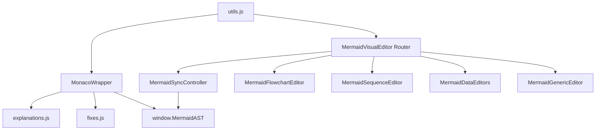

# Synchronization Mechanisms

<cite>
**Referenced Files in This Document**
- [MermaidSyncController.js](file://js/editors/mermaid/MermaidSyncController.js)
- [index.js](file://js/editors/mermaid/index.js)
- [MermaidGenericEditor.js](file://js/editors/mermaid/MermaidGenericEditor.js)
- [MermaidFlowchartEditor.js](file://js/editors/mermaid/MermaidFlowchartEditor.js)
- [MermaidSequenceEditor.js](file://js/editors/mermaid/MermaidSequenceEditor.js)
- [MermaidDataEditors.js](file://js/editors/mermaid/MermaidDataEditors.js)
- [MonacoWrapper.js](file://js/components/MonacoWrapper.js)
- [explanations.js](file://js/error-diagnostics/explanations.js)
- [fixes.js](file://js/error-diagnostics/fixes.js)
- [react-helpers.js](file://js/react-helpers.js)
- [utils.js](file://js/utils.js)
- [index.html](file://index.html)
</cite>

## Table of Contents
1. [Introduction](#introduction)
2. [Project Structure](#project-structure)
3. [Core Components](#core-components)
4. [Architecture Overview](#architecture-overview)
5. [Detailed Component Analysis](#detailed-component-analysis)
6. [Dependency Analysis](#dependency-analysis)
7. [Performance Considerations](#performance-considerations)
8. [Troubleshooting Guide](#troubleshooting-guide)
9. [Conclusion](#conclusion)

## Introduction
This document explains the bi-directional synchronization mechanisms between code and visual editing modes for Mermaid diagrams. It covers the Mermaid AST processing system, the synchronization controller architecture with debouncing and state management, event-driven update patterns, change propagation, and performance optimizations. It also documents the synchronization lifecycle, pause/resume behavior, and cleanup procedures, along with examples of synchronization triggers, state preservation during mode switching, and handling of complex diagram structures.

## Project Structure
The synchronization system spans several modules:
- A Mermaid AST processing controller that parses code into an AST and renders AST back to code.
- A Mermaid visual editor router that selects the appropriate specialized editor based on AST type.
- Specialized editors for flowcharts, sequences, and data charts that operate in visual mode.
- A Monaco-based code editor with syntax highlighting, diagnostics, and quick fixes.
- Error diagnostics and fix suggestion systems integrated with Monaco.
- Utilities for debouncing, encoding, and diagram type detection.

**Diagram sources**
- [MermaidSyncController.js](file://js/editors/mermaid/MermaidSyncController.js#L9-L92)
- [index.js](file://js/editors/mermaid/index.js#L20-L121)
- [MermaidFlowchartEditor.js](file://js/editors/mermaid/MermaidFlowchartEditor.js#L10-L276)
- [MermaidSequenceEditor.js](file://js/editors/mermaid/MermaidSequenceEditor.js#L4-L110)
- [MermaidDataEditors.js](file://js/editors/mermaid/MermaidDataEditors.js#L6-L306)
- [MermaidGenericEditor.js](file://js/editors/mermaid/MermaidGenericEditor.js#L11-L101)
- [MonacoWrapper.js](file://js/components/MonacoWrapper.js#L13-L169)
- [explanations.js](file://js/error-diagnostics/explanations.js#L12-L302)
- [fixes.js](file://js/error-diagnostics/fixes.js#L11-L403)

**Section sources**
- [MermaidSyncController.js](file://js/editors/mermaid/MermaidSyncController.js#L1-L93)
- [index.js](file://js/editors/mermaid/index.js#L1-L137)
- [MermaidGenericEditor.js](file://js/editors/mermaid/MermaidGenericEditor.js#L1-L101)
- [MermaidFlowchartEditor.js](file://js/editors/mermaid/MermaidFlowchartEditor.js#L1-L276)
- [MermaidSequenceEditor.js](file://js/editors/mermaid/MermaidSequenceEditor.js#L1-L110)
- [MermaidDataEditors.js](file://js/editors/mermaid/MermaidDataEditors.js#L1-L306)
- [MonacoWrapper.js](file://js/components/MonacoWrapper.js#L1-L426)
- [explanations.js](file://js/error-diagnostics/explanations.js#L1-L302)
- [fixes.js](file://js/error-diagnostics/fixes.js#L1-L403)
- [react-helpers.js](file://js/react-helpers.js#L1-L39)
- [utils.js](file://js/utils.js#L1-L177)
- [index.html](file://index.html#L531-L557)

## Core Components
- MermaidSyncController: Central controller for AST parsing, rendering, and preventing sync loops.
- MermaidVisualEditor Router: Routes to specialized editors based on AST type and diagram model.
- Specialized Visual Editors: Flowchart, Sequence, and Data editors that transform AST back to code.
- MonacoWrapper: Code editor with language registration, diagnostics, and quick fixes.
- Error Diagnostics: Explanations and fix suggestions for common syntax errors.
- Utilities: Debounce, encoding, and diagram type detection helpers.

Key responsibilities:
- Parse code to AST (Code → Visual).
- Render AST to code (Visual → Code).
- Debounce rapid changes to avoid infinite loops.
- Detect diagram type and AST readiness.
- Provide visual editors for supported diagram types.
- Integrate Monaco diagnostics and quick fixes.

**Section sources**
- [MermaidSyncController.js](file://js/editors/mermaid/MermaidSyncController.js#L9-L92)
- [index.js](file://js/editors/mermaid/index.js#L20-L121)
- [MermaidFlowchartEditor.js](file://js/editors/mermaid/MermaidFlowchartEditor.js#L10-L276)
- [MermaidSequenceEditor.js](file://js/editors/mermaid/MermaidSequenceEditor.js#L4-L110)
- [MermaidDataEditors.js](file://js/editors/mermaid/MermaidDataEditors.js#L6-L306)
- [MermaidGenericEditor.js](file://js/editors/mermaid/MermaidGenericEditor.js#L11-L101)
- [MonacoWrapper.js](file://js/components/MonacoWrapper.js#L13-L169)
- [explanations.js](file://js/error-diagnostics/explanations.js#L12-L302)
- [fixes.js](file://js/error-diagnostics/fixes.js#L11-L403)
- [utils.js](file://js/utils.js#L14-L177)

## Architecture Overview
The synchronization architecture implements a strict loop prevention mechanism and debounced updates:
- Code changes trigger AST parsing with a debounce timer.
- Visual changes set a change source flag to block code parsing until the next cycle.
- AST rendering to code resets the change source asynchronously.
- The visual editor router selects the appropriate specialized editor based on AST type.
- Monaco diagnostics and quick fixes improve error handling and recovery.

**Diagram sources**
- [MermaidSyncController.js](file://js/editors/mermaid/MermaidSyncController.js#L21-L58)
- [index.js](file://js/editors/mermaid/index.js#L20-L121)
- [MermaidFlowchartEditor.js](file://js/editors/mermaid/MermaidFlowchartEditor.js#L1013-L1031)
- [MermaidSequenceEditor.js](file://js/editors/mermaid/MermaidSequenceEditor.js#L45-L50)
- [MermaidDataEditors.js](file://js/editors/mermaid/MermaidDataEditors.js#L118-L119)
- [MonacoWrapper.js](file://js/components/MonacoWrapper.js#L134-L140)

## Detailed Component Analysis

### Mermaid AST Processing and Synchronization Controller
The controller encapsulates:
- State: current AST, change source indicator, debounce timer.
- Methods:
  - parseCode(code, onSuccess, onError): Debounced AST parse; prevents re-entry when triggered by visual changes.
  - renderToCode(updatedAst): Renders AST to code; sets changeSource to 'visual' and resets after a short delay.
  - getAst/setAst: Accessors for AST state.
  - detectType(code): Detects diagram type from code.
  - isLoaded(): Checks availability of MermaidAST library.

Debouncing and loop prevention:
- parseCode clears any pending debounce and schedules a 300ms parse.
- renderToCode sets changeSource to 'visual' and clears it after 50ms to allow subsequent code changes.
- parseCode checks changeSource to skip parsing when triggered by visual changes.

Change detection and type detection:
- detectType uses MermaidAST.detectDiagramType when available.
- isLoaded guards against parsing before MermaidAST is ready.

**Diagram sources**
- [MermaidSyncController.js](file://js/editors/mermaid/MermaidSyncController.js#L21-L58)

**Section sources**
- [MermaidSyncController.js](file://js/editors/mermaid/MermaidSyncController.js#L9-L92)

### Visual Editor Router and Specialized Editors
The router selects the appropriate editor based on AST type:
- Flowchart: MermaidFlowchartEditor
- Sequence: MermaidSequenceEditor
- Data/Charts: Timeline, Gantt, Pie, Mindmap, Journey editors
- Others: MermaidGenericEditor (fallback)

Each specialized editor:
- Parses AST to extract nodes/edges/participants/messages.
- Provides inline editing capabilities (e.g., node label editing).
- Generates new code via targeted string replacements or append operations.
- Triggers onCodeChange to propagate changes back to the controller.

**Diagram sources**
- [index.js](file://js/editors/mermaid/index.js#L20-L121)
- [MermaidFlowchartEditor.js](file://js/editors/mermaid/MermaidFlowchartEditor.js#L10-L276)
- [MermaidSequenceEditor.js](file://js/editors/mermaid/MermaidSequenceEditor.js#L4-L110)
- [MermaidDataEditors.js](file://js/editors/mermaid/MermaidDataEditors.js#L6-L306)
- [MermaidGenericEditor.js](file://js/editors/mermaid/MermaidGenericEditor.js#L11-L101)

**Section sources**
- [index.js](file://js/editors/mermaid/index.js#L20-L121)
- [MermaidFlowchartEditor.js](file://js/editors/mermaid/MermaidFlowchartEditor.js#L10-L276)
- [MermaidSequenceEditor.js](file://js/editors/mermaid/MermaidSequenceEditor.js#L4-L110)
- [MermaidDataEditors.js](file://js/editors/mermaid/MermaidDataEditors.js#L6-L306)
- [MermaidGenericEditor.js](file://js/editors/mermaid/MermaidGenericEditor.js#L11-L101)

### Code Editor Integration (Monaco)
MonacoWrapper integrates:
- Language registration for Mermaid and PlantUML.
- Error providers for code actions and hover explanations.
- Marker management for syntax errors.
- Cursor position tracking and navigation.

Monaco diagnostics:
- Code action provider suggests fixes for common errors.
- Hover provider displays explanations for error markers.
- Quick fixes are applied with Monaco edits or manual instructions.

**Diagram sources**
- [MonacoWrapper.js](file://js/components/MonacoWrapper.js#L13-L169)
- [MonacoWrapper.js](file://js/components/MonacoWrapper.js#L310-L423)
- [fixes.js](file://js/error-diagnostics/fixes.js#L332-L366)
- [explanations.js](file://js/error-diagnostics/explanations.js#L237-L271)

**Section sources**
- [MonacoWrapper.js](file://js/components/MonacoWrapper.js#L13-L169)
- [MonacoWrapper.js](file://js/components/MonacoWrapper.js#L310-L423)
- [fixes.js](file://js/error-diagnostics/fixes.js#L11-L403)
- [explanations.js](file://js/error-diagnostics/explanations.js#L12-L302)

### Error Diagnostics and Quick Fixes
Error diagnostics provide:
- Human-readable explanations mapped to error codes.
- Pattern-based matching for generic error messages.
- Quick fix suggestions with Monaco-compatible edits.

Integration:
- Monaco registers code actions and hover providers.
- Fix suggestions are applied either automatically (with Monaco edits) or manually.

**Section sources**
- [explanations.js](file://js/error-diagnostics/explanations.js#L12-L302)
- [fixes.js](file://js/error-diagnostics/fixes.js#L11-L403)
- [MonacoWrapper.js](file://js/components/MonacoWrapper.js#L310-L423)

## Dependency Analysis
The synchronization system exhibits the following dependencies:
- MermaidSyncController depends on window.MermaidAST for parsing and rendering.
- MermaidVisualEditor Router depends on AST type detection and MermaidAST availability.
- Specialized editors depend on AST structure and code transformations.
- MonacoWrapper depends on Monaco editor APIs and error diagnostics modules.
- Utilities provide debounce, encoding, and diagram type detection.

**Diagram sources**
- [MermaidSyncController.js](file://js/editors/mermaid/MermaidSyncController.js#L28-L32)
- [index.js](file://js/editors/mermaid/index.js#L78-L117)
- [MermaidFlowchartEditor.js](file://js/editors/mermaid/MermaidFlowchartEditor.js#L1013-L1031)
- [MermaidSequenceEditor.js](file://js/editors/mermaid/MermaidSequenceEditor.js#L45-L50)
- [MermaidDataEditors.js](file://js/editors/mermaid/MermaidDataEditors.js#L118-L119)
- [MermaidGenericEditor.js](file://js/editors/mermaid/MermaidGenericEditor.js#L11-L101)
- [MonacoWrapper.js](file://js/components/MonacoWrapper.js#L13-L169)
- [explanations.js](file://js/error-diagnostics/explanations.js#L12-L302)
- [fixes.js](file://js/error-diagnostics/fixes.js#L11-L403)
- [utils.js](file://js/utils.js#L14-L177)

**Section sources**
- [MermaidSyncController.js](file://js/editors/mermaid/MermaidSyncController.js#L28-L32)
- [index.js](file://js/editors/mermaid/index.js#L78-L117)
- [MermaidFlowchartEditor.js](file://js/editors/mermaid/MermaidFlowchartEditor.js#L1013-L1031)
- [MermaidSequenceEditor.js](file://js/editors/mermaid/MermaidSequenceEditor.js#L45-L50)
- [MermaidDataEditors.js](file://js/editors/mermaid/MermaidDataEditors.js#L118-L119)
- [MermaidGenericEditor.js](file://js/editors/mermaid/MermaidGenericEditor.js#L11-L101)
- [MonacoWrapper.js](file://js/components/MonacoWrapper.js#L13-L169)
- [explanations.js](file://js/error-diagnostics/explanations.js#L12-L302)
- [fixes.js](file://js/error-diagnostics/fixes.js#L11-L403)
- [utils.js](file://js/utils.js#L14-L177)

## Performance Considerations
- Debouncing: Both parseCode and preview generation use timeouts to reduce redundant work.
- Change source gating: Prevents infinite loops by blocking code parsing when triggered by visual changes.
- Lazy loading: Mermaid AST is loaded asynchronously; the visual editor shows a loading state until ready.
- Efficient rendering: Specialized editors transform only the necessary parts of the code (e.g., replacing node labels).
- Memory management: Preview URLs are revoked on unmount to prevent memory leaks.

[No sources needed since this section provides general guidance]

## Troubleshooting Guide
Common synchronization issues and debugging techniques:
- Infinite sync loops: Occur when visual changes trigger code parsing and vice versa. The changeSource flag prevents this; ensure renderToCode is called from visual editors and that changeSource is reset.
- AST not loaded: parseCode checks MermaidAST availability; ensure the Mermaid AST module is loaded before parsing.
- Slow updates: Debounce timers smooth out rapid changes; adjust delays if needed.
- Error markers: Monaco markers highlight syntax errors; use hover explanations and quick fixes to resolve issues.
- Preview not updating: Verify debounce timing and that the code is valid for the selected diagram type.

**Section sources**
- [MermaidSyncController.js](file://js/editors/mermaid/MermaidSyncController.js#L21-L58)
- [MonacoWrapper.js](file://js/components/MonacoWrapper.js#L59-L75)
- [MonacoWrapper.js](file://js/components/MonacoWrapper.js#L394-L421)
- [explanations.js](file://js/error-diagnostics/explanations.js#L237-L271)
- [fixes.js](file://js/error-diagnostics/fixes.js#L332-L366)

## Conclusion
The synchronization system provides robust bi-directional editing for Mermaid diagrams:
- A controlled loop prevention mechanism using changeSource gating and debouncing.
- A modular visual editor router with specialized editors for different diagram types.
- Integrated Monaco diagnostics and quick fixes for improved developer experience.
- Efficient change propagation and performance optimizations.

This architecture ensures reliable synchronization, predictable state transitions, and a responsive editing experience across complex diagram structures.