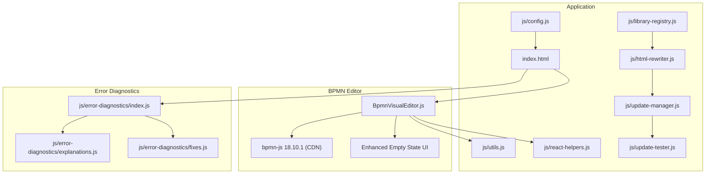
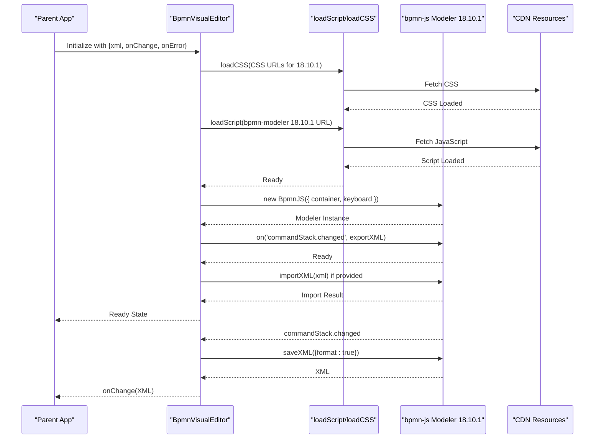
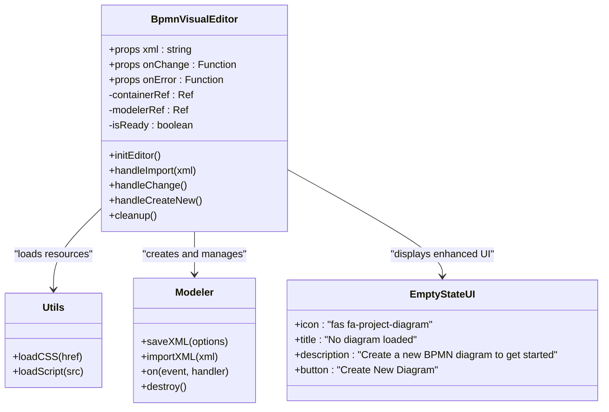
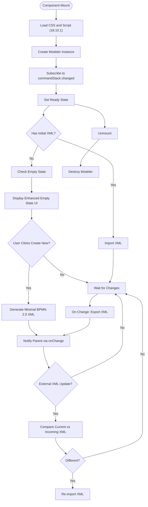
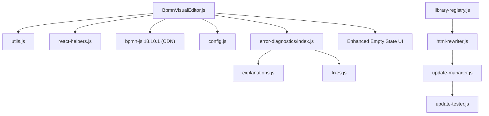

# BPMN Visual Editor

<cite>
**Referenced Files in This Document**
- [BpmnVisualEditor.js](file://js/editors/bpmn/BpmnVisualEditor.js)
- [index.html](file://index.html)
- [config.js](file://js/config.js)
- [react-helpers.js](file://js/react-helpers.js)
- [utils.js](file://js/utils.js)
- [index.js](file://js/error-diagnostics/index.js)
- [explanations.js](file://js/error-diagnostics/explanations.js)
- [fixes.js](file://js/error-diagnostics/fixes.js)
- [library-registry.js](file://js/library-registry.js)
- [html-rewriter.js](file://js/html-rewriter.js)
- [update-manager.js](file://js/update-manager.js)
- [update-tester.js](file://js/update-tester.js)
</cite>

## Update Summary
**Changes Made**
- Updated BPMN-JS version from 16.4.0 to 18.10.1 with enhanced empty state handling
- Enhanced empty state UI with improved visual feedback and "Create New Diagram" functionality
- Added comprehensive library version management and update infrastructure
- Improved error handling and validation for BPMN-JS upgrades

## Table of Contents
1. [Introduction](#introduction)
2. [Project Structure](#project-structure)
3. [Core Components](#core-components)
4. [Architecture Overview](#architecture-overview)
5. [Detailed Component Analysis](#detailed-component-analysis)
6. [Dependency Analysis](#dependency-analysis)
7. [Performance Considerations](#performance-considerations)
8. [Troubleshooting Guide](#troubleshooting-guide)
9. [Conclusion](#conclusion)

## Introduction
This document provides comprehensive documentation for the BPMN visual editor implementation using the bpmn-js library. The editor enables interactive BPMN diagram creation and editing through a visual interface, with seamless synchronization between the visual model and XML code representation. It integrates with a broader diagramming platform that supports multiple diagram types, offering a unified editing experience with error diagnostics and quick-fix suggestions.

The BPMN visual editor is built as a React component that dynamically loads bpmn-js resources from a CDN, initializes a modeler instance, and manages the lifecycle of the visual editor including initialization, rendering, change detection, XML import/export, error handling, and cleanup. The implementation has been upgraded to bpmn-js version 18.10.1 with enhanced empty state handling and improved modeler functionality.

## Project Structure
The BPMN visual editor resides within a larger diagramming application. The relevant structure for BPMN editing includes:
- Visual editor component: js/editors/bpmn/BpmnVisualEditor.js
- Application entry and configuration: index.html
- Shared utilities for loading scripts and CSS: js/utils.js
- React helpers for JSX-like syntax: js/react-helpers.js
- Diagram configuration and examples: js/config.js
- Error diagnostics and fix suggestions: js/error-diagnostics/*
- Library version management: js/library-registry.js
- HTML rewriter for version updates: js/html-rewriter.js
- Update manager infrastructure: js/update-manager.js
- Version testing framework: js/update-tester.js

**Diagram sources**
- [BpmnVisualEditor.js](file://js/editors/bpmn/BpmnVisualEditor.js#L1-L139)
- [index.html](file://index.html#L1-L2239)
- [utils.js](file://js/utils.js#L1-L177)
- [react-helpers.js](file://js/react-helpers.js#L1-L39)
- [config.js](file://js/config.js#L1-L566)
- [index.js](file://js/error-diagnostics/index.js#L1-L846)
- [explanations.js](file://js/error-diagnostics/explanations.js#L1-L302)
- [fixes.js](file://js/error-diagnostics/fixes.js#L1-L694)
- [library-registry.js](file://js/library-registry.js#L167-L200)
- [html-rewriter.js](file://js/html-rewriter.js#L25-L51)
- [update-manager.js](file://js/update-manager.js#L1-L200)
- [update-tester.js](file://js/update-tester.js#L184-L219)

**Section sources**
- [BpmnVisualEditor.js](file://js/editors/bpmn/BpmnVisualEditor.js#L1-L139)
- [index.html](file://index.html#L1-L2239)
- [utils.js](file://js/utils.js#L1-L177)
- [react-helpers.js](file://js/react-helpers.js#L1-L39)
- [config.js](file://js/config.js#L1-L566)

## Core Components
The BPMN visual editor is implemented as a React functional component that encapsulates the initialization, lifecycle, and synchronization logic with bpmn-js. Key responsibilities include:
- Loading bpmn-js CSS and JavaScript from CDN (version 18.10.1)
- Creating and configuring the bpmn-js modeler instance
- Listening to command stack changes to export XML back to the parent component
- Managing loading states and displaying enhanced empty state UI
- Handling external XML updates and re-importing when necessary
- Cleaning up the modeler instance on component unmount
- Providing "Create New Diagram" functionality with minimal valid BPMN 2.0 XML

The component exposes three props:
- xml: Initial BPMN XML content to import
- onChange: Callback invoked whenever the diagram changes, receiving the exported XML
- onError: Callback invoked on initialization or import errors

**Updated** Enhanced empty state handling with improved visual feedback and user interaction

Initialization flow:
- Load CSS assets for diagram rendering and BPMN fonts (version 18.10.1)
- Dynamically load bpmn-js if not already present
- Create a modeler instance bound to a DOM container
- Subscribe to commandStack.changed events to export XML
- Import initial XML if provided
- Set ready state and handle external XML updates

Change detection and synchronization:
- On commandStack.changed, export formatted XML and notify parent via onChange
- On external XML updates, compare current XML with incoming XML and re-import if needed

Cleanup:
- Destroy the modeler instance when the component unmounts to free resources

**Section sources**
- [BpmnVisualEditor.js](file://js/editors/bpmn/BpmnVisualEditor.js#L14-L139)

## Architecture Overview
The BPMN visual editor architecture centers on a React component that orchestrates bpmn-js resources and state management. The component maintains a modeler instance and coordinates with the parent application through callbacks for XML import/export and error reporting. The architecture now includes enhanced empty state handling and improved modeler functionality.

**Diagram sources**
- [BpmnVisualEditor.js](file://js/editors/bpmn/BpmnVisualEditor.js#L19-L67)
- [utils.js](file://js/utils.js#L116-L146)

## Detailed Component Analysis

### BpmnVisualEditor Component
The BpmnVisualEditor component is a React functional component that manages the lifecycle of the bpmn-js visual editor. It handles dynamic resource loading, modeler instantiation, change synchronization, and error propagation. The component now includes enhanced empty state handling with improved user experience.

Key implementation patterns:
- Dynamic resource loading: Uses loadCSS and loadScript utilities to fetch bpmn-js assets from CDN (version 18.10.1)
- Modeler creation: Initializes bpmn-js with a container and keyboard binding configuration
- Change detection: Subscribes to commandStack.changed to export XML and notify parent
- External synchronization: Compares current XML with incoming XML and re-imports when necessary
- Enhanced empty state: Displays a centered empty state UI with "Create New Diagram" button
- Loading state: Displays a centered loader overlay until the editor is ready
- Cleanup: Destroys the modeler instance on unmount

**Updated** Enhanced empty state handling with improved visual feedback and user interaction

**Diagram sources**
- [BpmnVisualEditor.js](file://js/editors/bpmn/BpmnVisualEditor.js#L14-L139)
- [utils.js](file://js/utils.js#L116-L146)

**Section sources**
- [BpmnVisualEditor.js](file://js/editors/bpmn/BpmnVisualEditor.js#L14-L139)
- [utils.js](file://js/utils.js#L116-L146)

### Enhanced Empty State Handling
The BPMN visual editor now features enhanced empty state handling that provides users with clear guidance and easy access to create new diagrams. When no XML content is provided, the component displays a centered empty state UI with:

- **Visual Icon**: A project diagram icon (fa-project-diagram) indicating the empty state
- **Clear Title**: "No diagram loaded" messaging
- **Helpful Description**: "Create a new BPMN diagram to get started"
- **Action Button**: "Create New Diagram" button with plus icon and hover effects
- **Responsive Design**: Centered layout with appropriate spacing and typography

The empty state includes a click handler that generates minimal valid BPMN 2.0 XML containing:
- A complete BPMN 2.0 definitions element
- A process element with isExecutable="false"
- A startEvent element
- Proper BPMN namespace declarations
- Basic diagram structure with bounds

**Updated** Enhanced empty state handling with improved user experience and "Create New Diagram" functionality

### Drag-and-Drop and Element Manipulation
The bpmn-js modeler (version 18.10.1) provides built-in drag-and-drop capabilities for moving elements and connecting them with sequence flows. Users can:
- Select and move BPMN elements (tasks, events, gateways)
- Connect elements using the modeling tools
- Modify element properties through the property panel integrated with bpmn-js

The modeler instance listens to command stack changes, enabling undo/redo operations and maintaining a history of modifications.

### Keyboard Shortcuts Configuration
The modeler is configured with keyboard binding to the window object, allowing global keyboard shortcuts for actions like:
- Undo/Redo
- Copy/Paste
- Selection and manipulation commands

These shortcuts integrate with the browser's keyboard input, providing a native editing experience.

### Command Stack Integration
The component subscribes to the commandStack.changed event to capture all modeling operations. On each change:
- The modeler exports the current diagram as formatted XML
- The parent component receives the updated XML via the onChange callback
- This ensures bidirectional synchronization between the visual editor and the code mode

### XML Import/Export Workflow
Import:
- On initialization, if an xml prop is provided, the component attempts to import the XML into the modeler
- Errors during import are caught and reported via the onError callback

Export:
- On commandStack.changed, the component saves the current diagram as XML with formatting
- The formatted XML is sent to the parent component through onChange

External Updates:
- When the xml prop changes externally, the component compares the current XML with the incoming XML
- If they differ, it re-imports the new XML into the modeler

**Diagram sources**
- [BpmnVisualEditor.js](file://js/editors/bpmn/BpmnVisualEditor.js#L19-L90)

**Section sources**
- [BpmnVisualEditor.js](file://js/editors/bpmn/BpmnVisualEditor.js#L19-L90)

### Property Panel Integration
The bpmn-js modeler (version 18.10.1) includes a property panel that displays and allows editing of selected element properties. This panel integrates seamlessly with the visual editor, enabling:
- Editing element names and descriptions
- Modifying element attributes (e.g., task name, event conditions)
- Adjusting sequence flow labels and properties

**Updated** Enhanced property panel integration with improved modeler functionality

### Validation Constraints
The modeler enforces BPMN schema compliance during import and modeling operations. Validation includes:
- Ensuring all required BPMN elements are properly defined
- Verifying correct element relationships and connections
- Maintaining valid XML structure during export

**Updated** Enhanced validation with improved modeler functionality

### Custom BPMN Diagram Workflows
The visual editor supports custom BPMN workflows by:
- Allowing users to create custom processes with start/end events, tasks, and sequence flows
- Enabling swimlane layouts through collaboration elements
- Supporting complex branching and merging with gateways

**Updated** Enhanced workflow support with improved modeler capabilities

## Dependency Analysis
The BPMN visual editor depends on several modules and external resources:
- bpmn-js library (CDN version 18.10.1): Provides the visual modeling capabilities
- React and JSX runtime: Enables component-based architecture
- Shared utilities: Handle dynamic resource loading and CSS injection
- Error diagnostics: Integrated for error parsing and fix suggestions
- Library registry: Manages version information and update infrastructure
- HTML rewriter: Handles version replacement in HTML content
- Update manager: Orchestrates library update workflow
- Update tester: Tests library compatibility and functionality

**Updated** Enhanced dependency management with comprehensive version control infrastructure

**Diagram sources**
- [BpmnVisualEditor.js](file://js/editors/bpmn/BpmnVisualEditor.js#L1-L139)
- [utils.js](file://js/utils.js#L1-L177)
- [react-helpers.js](file://js/react-helpers.js#L1-L39)
- [config.js](file://js/config.js#L1-L566)
- [index.js](file://js/error-diagnostics/index.js#L1-L846)
- [explanations.js](file://js/error-diagnostics/explanations.js#L1-L302)
- [fixes.js](file://js/error-diagnostics/fixes.js#L1-L694)
- [library-registry.js](file://js/library-registry.js#L167-L200)
- [html-rewriter.js](file://js/html-rewriter.js#L25-L51)
- [update-manager.js](file://js/update-manager.js#L1-L200)
- [update-tester.js](file://js/update-tester.js#L184-L219)

**Section sources**
- [BpmnVisualEditor.js](file://js/editors/bpmn/BpmnVisualEditor.js#L1-L139)
- [utils.js](file://js/utils.js#L1-L177)
- [react-helpers.js](file://js/react-helpers.js#L1-L39)
- [config.js](file://js/config.js#L1-L566)
- [index.js](file://js/error-diagnostics/index.js#L1-L846)

## Performance Considerations
- Resource loading: The editor dynamically loads CSS and JavaScript from CDN (version 18.10.1). Network latency can impact initialization time. Consider preloading resources or caching strategies for improved performance.
- Memory management: The modeler instance is destroyed on component unmount to prevent memory leaks. Ensure proper cleanup in complex applications with frequent editor mounts/unmounts.
- Change frequency: Frequent command stack changes trigger XML exports. Debouncing or throttling can reduce unnecessary re-renders in the parent component.
- Rendering: Large BPMN diagrams may impact rendering performance. Consider optimizing diagram complexity or using lazy loading for very large models.
- Empty state optimization: The enhanced empty state UI is lightweight and only rendered when no XML content is present, minimizing performance impact.

**Updated** Enhanced performance considerations with improved empty state handling

## Troubleshooting Guide
Common issues and resolutions:
- Initialization failures: If the editor fails to load bpmn-js resources (version 18.10.1), check network connectivity and CDN availability. The onError callback receives a descriptive error message.
- Import errors: XML import failures typically indicate malformed BPMN XML. Use the error diagnostics to identify the problematic element or tag.
- Change detection delays: If XML updates seem delayed, verify that commandStack.changed events are firing and that the onChange callback is properly implemented.
- Keyboard shortcuts not working: Ensure the modeler is bound to the window object and that no other components intercept keyboard events.
- Empty state issues: If the empty state UI doesn't display correctly, verify that the component renders when xml prop is falsy and that the empty state button triggers the handleCreateNew function.

**Updated** Enhanced troubleshooting with empty state and version-specific issues

Integration with error diagnostics:
- The application includes comprehensive error parsing and fix suggestion systems. When BPMN errors occur, the system extracts line/column information and provides actionable suggestions for corrections.

**Updated** Enhanced error diagnostics integration with improved modeler functionality

## Conclusion
The BPMN visual editor provides a robust, React-based solution for creating and editing BPMN diagrams using the bpmn-js library (version 18.10.1). Its architecture emphasizes dynamic resource loading, seamless XML synchronization, and comprehensive error handling. By leveraging the modeler's command stack and property panel, users can efficiently build complex BPMN workflows while maintaining bidirectional synchronization with the underlying XML representation. The integration with error diagnostics enhances the editing experience by providing immediate feedback and automated fixes for common syntax issues.

**Updated** Enhanced conclusion reflecting the BPMN-JS version upgrade and improved empty state handling

The implementation now includes comprehensive library version management infrastructure, allowing for systematic updates and compatibility testing of bpmn-js and other dependencies. The enhanced empty state UI provides users with clear guidance and easy access to create new diagrams, significantly improving the user experience for first-time users and those starting fresh projects.