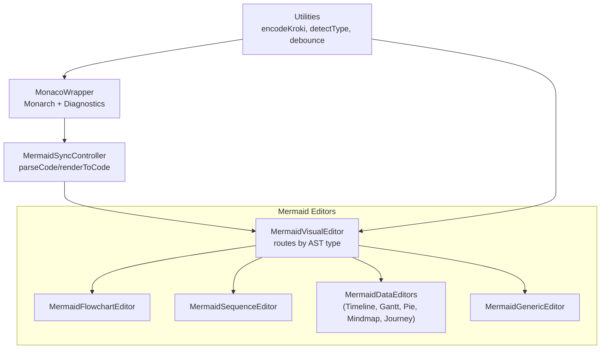
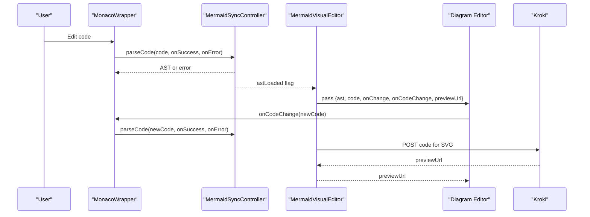
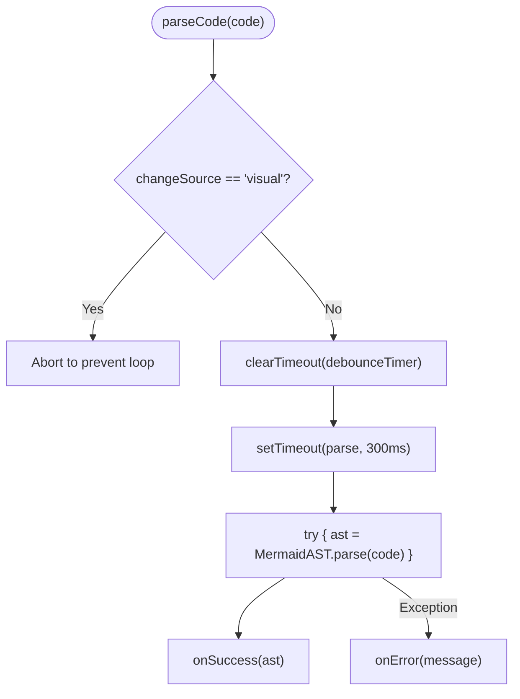
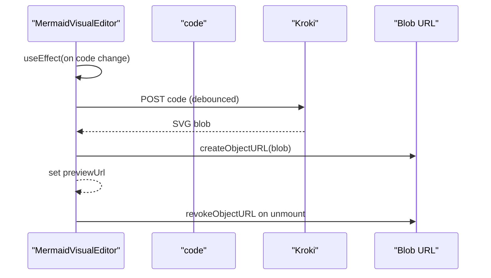
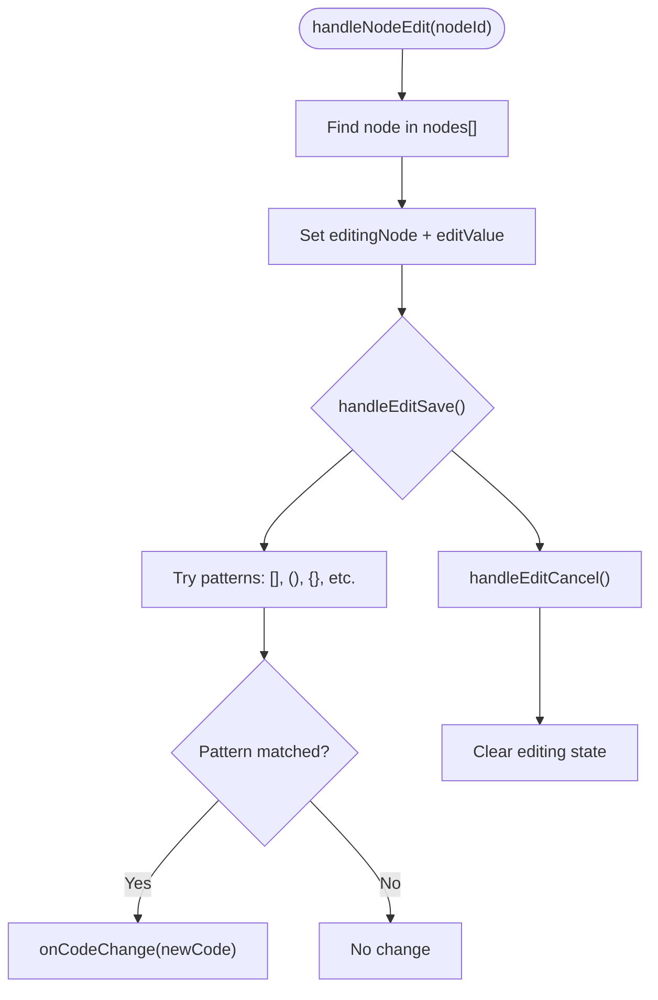
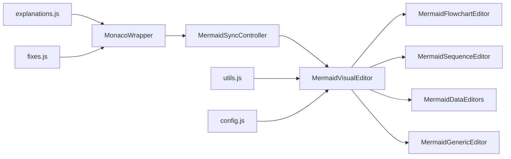

# Mermaid Visual Editor

<cite>
**Referenced Files in This Document**
- [MermaidSyncController.js](file://js/editors/mermaid/MermaidSyncController.js)
- [MermaidGenericEditor.js](file://js/editors/mermaid/MermaidGenericEditor.js)
- [index.js](file://js/editors/mermaid/index.js)
- [MermaidFlowchartEditor.js](file://js/editors/mermaid/MermaidFlowchartEditor.js)
- [MermaidSequenceEditor.js](file://js/editors/mermaid/MermaidSequenceEditor.js)
- [MermaidDataEditors.js](file://js/editors/mermaid/MermaidDataEditors.js)
- [MonacoWrapper.js](file://js/components/MonacoWrapper.js)
- [index.html](file://index.html)
- [utils.js](file://js/utils.js)
- [config.js](file://js/config.js)
- [explanations.js](file://js/error-diagnostics/explanations.js)
- [fixes.js](file://js/error-diagnostics/fixes.js)
- [react-helpers.js](file://js/react-helpers.js)
</cite>

## Table of Contents
1. [Introduction](#introduction)
2. [Project Structure](#project-structure)
3. [Core Components](#core-components)
4. [Architecture Overview](#architecture-overview)
5. [Detailed Component Analysis](#detailed-component-analysis)
6. [Dependency Analysis](#dependency-analysis)
7. [Performance Considerations](#performance-considerations)
8. [Troubleshooting Guide](#troubleshooting-guide)
9. [Conclusion](#conclusion)

## Introduction
This document describes the Mermaid visual editor system with AST-based synchronization. It explains how the MermaidSyncController manages bidirectional synchronization between code and visuals, how the generic editor framework supports multiple Mermaid diagram types, and how editors orchestrate node creation, manipulation, and real-time preview generation. It also covers debounce mechanisms, lifecycle management, error prevention strategies, and integration with the Monaco code editor.

## Project Structure
The Mermaid visual editor is organized as a modular React-based system:
- A MermaidSyncController provides AST parsing, rendering, and change-source tracking to prevent sync loops.
- A router component selects the appropriate editor based on AST type.
- Specialized editors implement node/edge lists, inline editing, and toolbar actions.
- A generic editor displays live previews and AST property panels for unsupported diagram types.
- MonacoWrapper integrates Monaco with Mermaid/PlantUML syntax and error diagnostics.
- Utilities and configuration support encoding, type detection, and debounce.

**Diagram sources**
- [index.js](file://js/editors/mermaid/index.js#L20-L121)
- [MermaidSyncController.js](file://js/editors/mermaid/MermaidSyncController.js#L9-L92)
- [MermaidFlowchartEditor.js](file://js/editors/mermaid/MermaidFlowchartEditor.js#L10-L276)
- [MermaidSequenceEditor.js](file://js/editors/mermaid/MermaidSequenceEditor.js#L4-L110)
- [MermaidDataEditors.js](file://js/editors/mermaid/MermaidDataEditors.js#L6-L306)
- [MermaidGenericEditor.js](file://js/editors/mermaid/MermaidGenericEditor.js#L11-L101)
- [MonacoWrapper.js](file://js/components/MonacoWrapper.js#L13-L169)
- [utils.js](file://js/utils.js#L14-L177)

**Section sources**
- [index.js](file://js/editors/mermaid/index.js#L20-L121)
- [MermaidSyncController.js](file://js/editors/mermaid/MermaidSyncController.js#L9-L92)
- [MermaidFlowchartEditor.js](file://js/editors/mermaid/MermaidFlowchartEditor.js#L10-L276)
- [MermaidSequenceEditor.js](file://js/editors/mermaid/MermaidSequenceEditor.js#L4-L110)
- [MermaidDataEditors.js](file://js/editors/mermaid/MermaidDataEditors.js#L6-L306)
- [MermaidGenericEditor.js](file://js/editors/mermaid/MermaidGenericEditor.js#L11-L101)
- [MonacoWrapper.js](file://js/components/MonacoWrapper.js#L13-L169)
- [utils.js](file://js/utils.js#L14-L177)

## Core Components
- MermaidSyncController: Central AST manager with parseCode, renderToCode, AST getters, type detection, and loop prevention via changeSource tracking and debouncing.
- MermaidVisualEditor: Router that generates previews via Kroki, routes to specialized editors, and handles loading states.
- MermaidFlowchartEditor: Node/edge list with inline editing, adding nodes/edges, and updating code via onCodeChange.
- MermaidSequenceEditor: Participants/messages list with adding participants/messages and preview display.
- MermaidDataEditors: Editors for timeline, gantt, pie, mindmap, and journey with code insertion helpers.
- MermaidGenericEditor: Live preview plus AST property panel for unsupported diagram types.
- MonacoWrapper: Monaco integration with Mermaid/PlantUML Monarch tokens, error providers, and quick fixes.

**Section sources**
- [MermaidSyncController.js](file://js/editors/mermaid/MermaidSyncController.js#L9-L92)
- [index.js](file://js/editors/mermaid/index.js#L20-L121)
- [MermaidFlowchartEditor.js](file://js/editors/mermaid/MermaidFlowchartEditor.js#L10-L276)
- [MermaidSequenceEditor.js](file://js/editors/mermaid/MermaidSequenceEditor.js#L4-L110)
- [MermaidDataEditors.js](file://js/editors/mermaid/MermaidDataEditors.js#L6-L306)
- [MermaidGenericEditor.js](file://js/editors/mermaid/MermaidGenericEditor.js#L11-L101)
- [MonacoWrapper.js](file://js/components/MonacoWrapper.js#L13-L169)

## Architecture Overview
The system uses a reactive architecture:
- Monaco emits onChange events; the controller parses code to AST and detects diagram type.
- Specialized editors consume AST to populate node/edge/participant lists and update code via onCodeChange.
- The router renders a live SVG preview by posting code to the Kroki service.
- Debounce prevents excessive re-renders; changeSource guards against infinite loops during visual-to-code synchronization.

**Diagram sources**
- [MermaidSyncController.js](file://js/editors/mermaid/MermaidSyncController.js#L21-L58)
- [index.js](file://js/editors/mermaid/index.js#L25-L53)
- [MonacoWrapper.js](file://js/components/MonacoWrapper.js#L134-L140)

## Detailed Component Analysis

### MermaidSyncController
Responsibilities:
- Parse code to AST with debouncing and loop prevention.
- Render AST back to code with changeSource tracking.
- Detect diagram type via MermaidAST.
- Expose AST getter/setter and loading state.

Change detection and loop prevention:
- changeSource tracks whether the last change originated from code or visual.
- Debounce timer ensures rapid successive edits coalesce into a single parse.

**Diagram sources**
- [MermaidSyncController.js](file://js/editors/mermaid/MermaidSyncController.js#L21-L38)

**Section sources**
- [MermaidSyncController.js](file://js/editors/mermaid/MermaidSyncController.js#L9-L92)

### Mermaid Visual Editor Router
Responsibilities:
- Generate preview URLs from code via Kroki with debounced fetch.
- Route to specialized editors based on AST type.
- Manage loading state while MermaidAST loads.
- Provide shared props to editors.

Preview generation:
- Debounced fetch to avoid frequent network calls.
- Blob URL revocation to prevent memory leaks.

**Diagram sources**
- [index.js](file://js/editors/mermaid/index.js#L25-L60)

**Section sources**
- [index.js](file://js/editors/mermaid/index.js#L20-L121)

### MermaidFlowchartEditor
Responsibilities:
- Extract nodes and edges from AST for interactive lists.
- Inline editing of node labels with pattern-based replacement.
- Add nodes and edges by appending code via onCodeChange.

Node editing workflow:
- Find node by ID, compute all bracket variants, locate exact occurrence, replace, and notify parent.

**Diagram sources**
- [MermaidFlowchartEditor.js](file://js/editors/mermaid/MermaidFlowchartEditor.js#L62-L110)

**Section sources**
- [MermaidFlowchartEditor.js](file://js/editors/mermaid/MermaidFlowchartEditor.js#L10-L276)

### MermaidSequenceEditor
Responsibilities:
- Extract participants and messages from AST.
- Add participants/messages by inserting lines into code.

**Section sources**
- [MermaidSequenceEditor.js](file://js/editors/mermaid/MermaidSequenceEditor.js#L4-L110)

### MermaidDataEditors
Responsibilities:
- Timeline: extract sections and periods; add section/period.
- Gantt: extract tasks; add task.
- Pie: extract slices; add slice.
- Mindmap: add node; guide editing via indentation.
- Journey: extract tasks with scores and actors; add task.

**Section sources**
- [MermaidDataEditors.js](file://js/editors/mermaid/MermaidDataEditors.js#L6-L306)

### MermaidGenericEditor
Responsibilities:
- Display live preview and AST property panel.
- Inform users about upcoming visual editing support.

**Section sources**
- [MermaidGenericEditor.js](file://js/editors/mermaid/MermaidGenericEditor.js#L11-L101)

### Monaco Integration
Responsibilities:
- Register Mermaid and PlantUML Monarch tokens.
- Provide error diagnostics: hover explanations and quick fixes.
- Expose imperative methods: scrollToLine, setValue, insertAtCursor, setMarkers, clearMarkers.

Error diagnostics:
- Code action provider suggests fixes mapped to error codes.
- Hover provider surfaces human-readable explanations.

**Section sources**
- [MonacoWrapper.js](file://js/components/MonacoWrapper.js#L13-L169)
- [explanations.js](file://js/error-diagnostics/explanations.js#L12-L87)
- [fixes.js](file://js/error-diagnostics/fixes.js#L32-L92)

## Dependency Analysis
Key dependencies and relationships:
- MermaidVisualEditor depends on MermaidSyncController for AST and type detection.
- Editors depend on code passed down by the router and call onCodeChange to propagate changes.
- MonacoWrapper depends on MermaidAST for parsing and on error-diagnostics for markers and fixes.
- Utilities support encoding, type detection, and debounce.

**Diagram sources**
- [index.js](file://js/editors/mermaid/index.js#L20-L121)
- [MermaidSyncController.js](file://js/editors/mermaid/MermaidSyncController.js#L9-L92)
- [MonacoWrapper.js](file://js/components/MonacoWrapper.js#L13-L169)
- [utils.js](file://js/utils.js#L14-L177)
- [config.js](file://js/config.js#L6-L116)
- [explanations.js](file://js/error-diagnostics/explanations.js#L12-L87)
- [fixes.js](file://js/error-diagnostics/fixes.js#L32-L92)

**Section sources**
- [index.js](file://js/editors/mermaid/index.js#L20-L121)
- [MermaidSyncController.js](file://js/editors/mermaid/MermaidSyncController.js#L9-L92)
- [MonacoWrapper.js](file://js/components/MonacoWrapper.js#L13-L169)
- [utils.js](file://js/utils.js#L14-L177)
- [config.js](file://js/config.js#L6-L116)
- [explanations.js](file://js/error-diagnostics/explanations.js#L12-L87)
- [fixes.js](file://js/error-diagnostics/fixes.js#L32-L92)

## Performance Considerations
- Debounce parsing: The controller debounces parseCode to reduce CPU usage during rapid edits.
- Debounced preview: The router debounces preview requests to Kroki to limit network overhead.
- Efficient rendering: Editors update code incrementally rather than reconstructing entire diagrams.
- Memory management: Blob URLs are revoked on unmount to prevent memory leaks.

[No sources needed since this section provides general guidance]

## Troubleshooting Guide
Common issues and resolutions:
- Infinite sync loops: Ensure changeSource is respected in renderToCode and parseCode.
- Missing MermaidAST: Check that the Mermaid AST module is loaded before parsing.
- Invalid Mermaid syntax: Use Monaco’s quick fixes and hover explanations to identify missing brackets, arrows, or diagram declarations.
- Slow responsiveness: Verify debounce timers are configured appropriately and not overridden by excessive re-renders.

Integration tips:
- Use MonacoWrapper’s setMarkers to surface errors directly in the editor.
- Leverage getFixSuggestions and getErrorExplanation for contextual help.
- Ensure diagram type detection matches the AST type to route to the correct editor.

**Section sources**
- [MermaidSyncController.js](file://js/editors/mermaid/MermaidSyncController.js#L21-L58)
- [MonacoWrapper.js](file://js/components/MonacoWrapper.js#L59-L84)
- [explanations.js](file://js/error-diagnostics/explanations.js#L12-L87)
- [fixes.js](file://js/error-diagnostics/fixes.js#L32-L92)

## Conclusion
The Mermaid visual editor system combines AST-based synchronization, a flexible editor router, and robust Monaco integration to deliver a seamless authoring experience. The MermaidSyncController safeguards against sync loops and optimizes performance via debouncing. The router and specialized editors enable intuitive construction and modification of diagrams, while Monaco’s diagnostics improve error prevention and resolution. Together, these components support a wide range of Mermaid diagram types with a consistent, maintainable architecture.