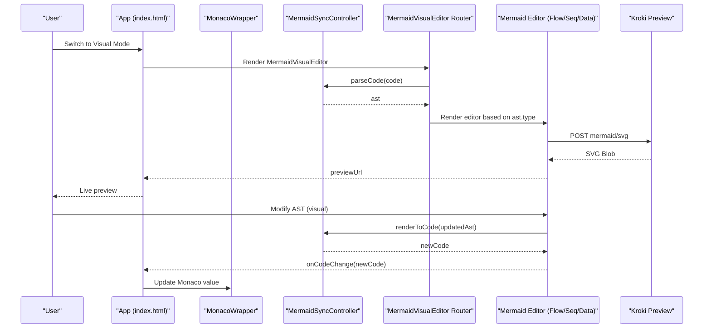
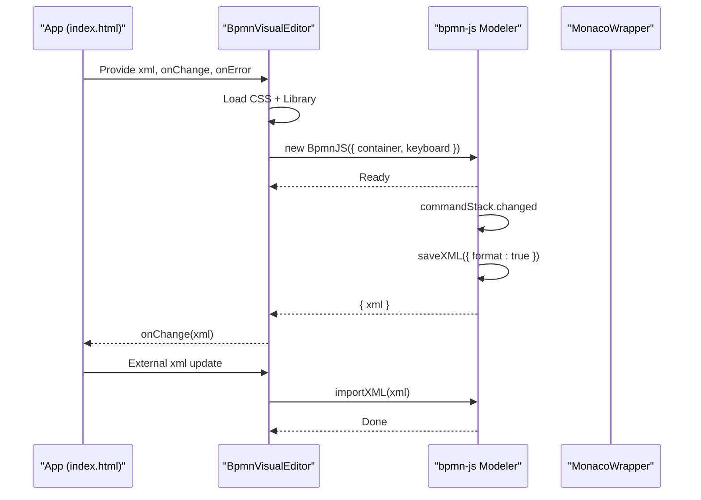
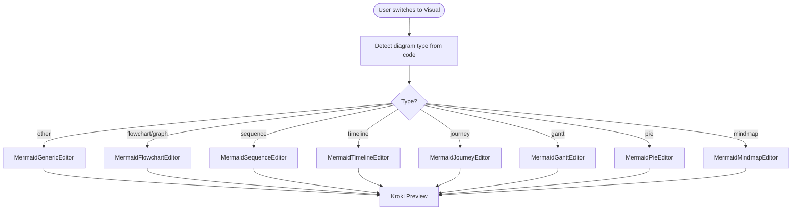
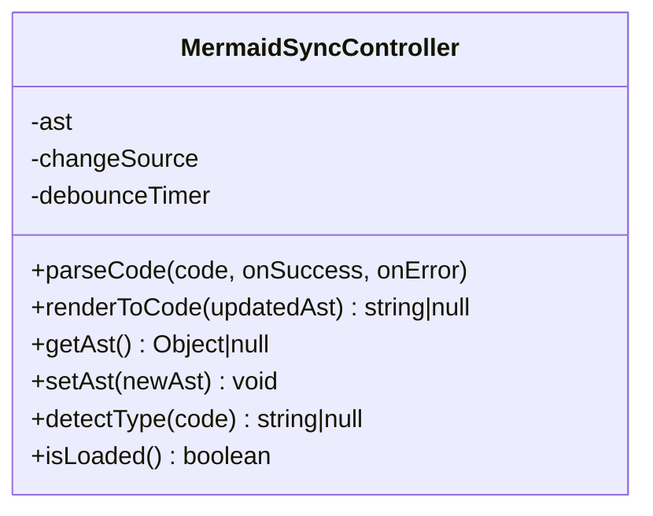
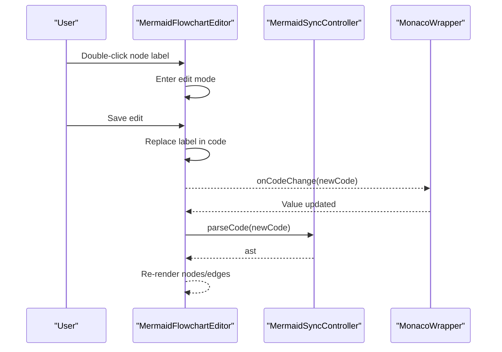
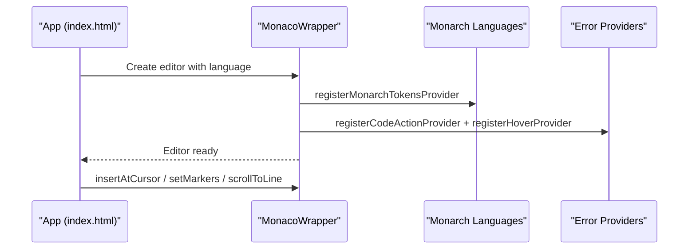
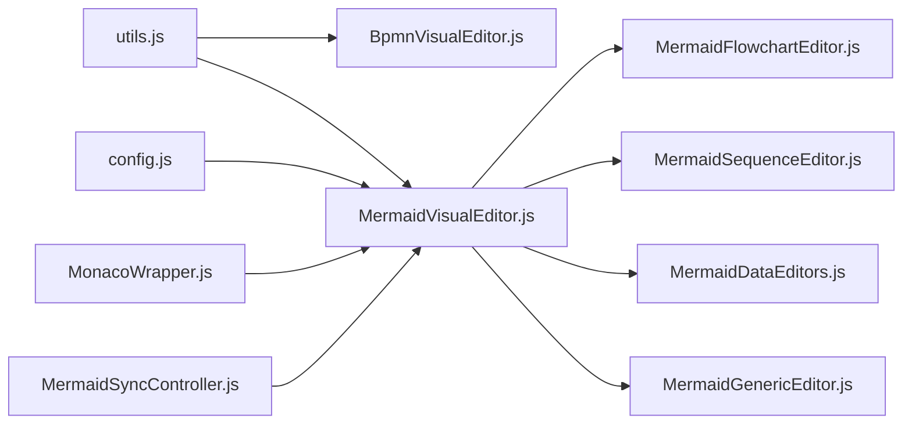

# Visual Editors

<cite>
**Referenced Files in This Document**
- [index.html](file://index.html)
- [BpmnVisualEditor.js](file://js/editors/bpmn/BpmnVisualEditor.js)
- [MermaidVisualEditor.js](file://js/editors/mermaid/index.js)
- [MermaidSyncController.js](file://js/editors/mermaid/MermaidSyncController.js)
- [MermaidGenericEditor.js](file://js/editors/mermaid/MermaidGenericEditor.js)
- [MermaidFlowchartEditor.js](file://js/editors/mermaid/MermaidFlowchartEditor.js)
- [MermaidSequenceEditor.js](file://js/editors/mermaid/MermaidSequenceEditor.js)
- [MermaidDataEditors.js](file://js/editors/mermaid/MermaidDataEditors.js)
- [MonacoWrapper.js](file://js/components/MonacoWrapper.js)
- [utils.js](file://js/utils.js)
- [config.js](file://js/config.js)
</cite>

## Table of Contents
1. [Introduction](#introduction)
2. [Project Structure](#project-structure)
3. [Core Components](#core-components)
4. [Architecture Overview](#architecture-overview)
5. [Detailed Component Analysis](#detailed-component-analysis)
6. [Dependency Analysis](#dependency-analysis)
7. [Performance Considerations](#performance-considerations)
8. [Troubleshooting Guide](#troubleshooting-guide)
9. [Conclusion](#conclusion)

## Introduction
This document explains the visual editor implementations for BPMN and Mermaid within the Universal Diagram Editor. It covers:
- BPMN visual editing powered by bpmn-js, including drag-and-drop, element manipulation, properties panel integration, and validation constraints.
- Mermaid visual editing with AST-based synchronization, node/edge creation/modification, connection management, and real-time preview generation.
- Lifecycle management: initialization, event handling, state persistence, and cleanup.
- Differences between visual and code editing modes and how they integrate with the code editor.

## Project Structure
The visual editors are integrated into a single-page application with:
- A code editor (Monaco) for text-based editing.
- A visual editor for BPMN and Mermaid.
- A preview pane for rendered diagrams.
- A toolbar and template gallery for diagram snippets and templates.

```mermaid
graph TB
subgraph "UI Shell"
App["App (index.html)"]
Header["Header Controls"]
ViewToggle["View Mode Toggle<br/>Code / Visual"]
end
subgraph "Code Editing"
Monaco["MonacoWrapper (Monaco Editor)"]
Toolbar["Diagram Toolbars<br/>PlantUML / Mermaid"]
Templates["Template Gallery Modal"]
end
subgraph "Visual Editing"
BPMN["BpmnVisualEditor (bpmn-js)"]
MermaidRouter["MermaidVisualEditor Router"]
MermaidGeneric["MermaidGenericEditor"]
MermaidFlow["MermaidFlowchartEditor"]
MermaidSeq["MermaidSequenceEditor"]
MermaidData["MermaidDataEditors (Timeline/Gantt/Pie/Mindmap/Journey)"]
end
subgraph "Preview"
Preview["Preview Panel"]
end
App --> Header
App --> ViewToggle
ViewToggle --> Monaco
ViewToggle --> BPMN
ViewToggle --> MermaidRouter
Monaco --> Preview
MermaidRouter --> MermaidGeneric
MermaidRouter --> MermaidFlow
MermaidRouter --> MermaidSeq
MermaidRouter --> MermaidData
MermaidGeneric --> Preview
MermaidFlow --> Preview
MermaidSeq --> Preview
MermaidData --> Preview
BPMN --> Preview
```

**Diagram sources**
- [index.html](file://index.html#L1398-L1751)
- [BpmnVisualEditor.js](file://js/editors/bpmn/BpmnVisualEditor.js#L1-L106)
- [MermaidVisualEditor.js](file://js/editors/mermaid/index.js#L1-L137)
- [MermaidGenericEditor.js](file://js/editors/mermaid/MermaidGenericEditor.js#L1-L101)
- [MermaidFlowchartEditor.js](file://js/editors/mermaid/MermaidFlowchartEditor.js#L1-L276)
- [MermaidSequenceEditor.js](file://js/editors/mermaid/MermaidSequenceEditor.js#L1-L110)
- [MermaidDataEditors.js](file://js/editors/mermaid/MermaidDataEditors.js#L1-L306)

**Section sources**
- [index.html](file://index.html#L1398-L1751)

## Core Components
- BpmnVisualEditor: Loads bpmn-js, initializes the modeler, listens for changes, and synchronizes XML back to the code editor. Handles initial import and external updates.
- MermaidVisualEditor: Routes to diagram-specific editors based on AST type and manages live preview generation via Kroki.
- MermaidSyncController: Provides AST parsing, rendering back to code, and prevents sync loops between visual and code editors.
- Mermaid editors: Specialized editors for flowcharts, sequences, timelines, Gantt, pie charts, mindmaps, and journeys.
- MonacoWrapper: Integrates Monaco Editor with custom language support, error diagnostics, quick fixes, and hover explanations.

**Section sources**
- [BpmnVisualEditor.js](file://js/editors/bpmn/BpmnVisualEditor.js#L1-L106)
- [MermaidVisualEditor.js](file://js/editors/mermaid/index.js#L1-L137)
- [MermaidSyncController.js](file://js/editors/mermaid/MermaidSyncController.js#L1-L93)
- [MermaidGenericEditor.js](file://js/editors/mermaid/MermaidGenericEditor.js#L1-L101)
- [MermaidFlowchartEditor.js](file://js/editors/mermaid/MermaidFlowchartEditor.js#L1-L276)
- [MermaidSequenceEditor.js](file://js/editors/mermaid/MermaidSequenceEditor.js#L1-L110)
- [MermaidDataEditors.js](file://js/editors/mermaid/MermaidDataEditors.js#L1-L306)
- [MonacoWrapper.js](file://js/components/MonacoWrapper.js#L1-L426)

## Architecture Overview
The application supports two editing modes:
- Code mode: Uses Monaco editor with syntax highlighting and diagnostics.
- Visual mode: Uses bpmn-js for BPMN and Mermaid-specific editors for Mermaid.



**Diagram sources**
- [index.html](file://index.html#L1725-L1744)
- [MermaidVisualEditor.js](file://js/editors/mermaid/index.js#L20-L121)
- [MermaidSyncController.js](file://js/editors/mermaid/MermaidSyncController.js#L9-L92)
- [MermaidFlowchartEditor.js](file://js/editors/mermaid/MermaidFlowchartEditor.js#L10-L117)
- [MermaidSequenceEditor.js](file://js/editors/mermaid/MermaidSequenceEditor.js#L4-L51)

## Detailed Component Analysis

### BPMN Visual Editor (bpmn-js)
- Initialization: Dynamically loads bpmn-js CSS and library, creates a modeler instance bound to a DOM container, and sets keyboard options.
- Change synchronization: Subscribes to command stack changes and exports formatted XML to notify the code editor.
- Error handling: Catches and reports import/export errors via the onError callback.
- External updates: Imports XML from the code editor when it changes, avoiding redundant imports.
- Cleanup: Destroys the modeler instance on component unmount.



**Diagram sources**
- [BpmnVisualEditor.js](file://js/editors/bpmn/BpmnVisualEditor.js#L19-L90)

**Section sources**
- [BpmnVisualEditor.js](file://js/editors/bpmn/BpmnVisualEditor.js#L1-L106)

### Mermaid Visual Editor (AST-based synchronization)
- Routing: Routes to diagram-specific editors based on AST type (flowchart, sequence, timeline, journey, gantt, pie, mindmap) or falls back to the generic editor.
- Live preview: Generates SVG previews via Kroki with debounced requests and proper cleanup of object URLs.
- AST synchronization: Uses a controller to parse code into AST and render AST back to code, with loop prevention and debounce.



**Diagram sources**
- [MermaidVisualEditor.js](file://js/editors/mermaid/index.js#L77-L121)

**Section sources**
- [MermaidVisualEditor.js](file://js/editors/mermaid/index.js#L1-L137)

### MermaidSyncController
- Purpose: Centralizes AST parsing and rendering to prevent infinite sync loops and to debounce rapid changes.
- Methods:
  - parseCode: Debounces parsing and sets AST when MermaidAST is available.
  - renderToCode: Marks change source as visual, renders AST to code, and resets source after a short delay.
  - getAst/setAst: Accessors for AST state.
  - detectType: Detects diagram type from code using MermaidAST.
  - isLoaded: Checks availability of MermaidAST.



**Diagram sources**
- [MermaidSyncController.js](file://js/editors/mermaid/MermaidSyncController.js#L9-L92)

**Section sources**
- [MermaidSyncController.js](file://js/editors/mermaid/MermaidSyncController.js#L1-L93)

### Mermaid Flowchart Editor
- Parses AST to extract nodes and edges.
- Inline editing of node labels with pattern-based replacement.
- Adds new nodes and edges by appending code lines.
- Real-time preview via Kroki.



**Diagram sources**
- [MermaidFlowchartEditor.js](file://js/editors/mermaid/MermaidFlowchartEditor.js#L62-L117)

**Section sources**
- [MermaidFlowchartEditor.js](file://js/editors/mermaid/MermaidFlowchartEditor.js#L1-L276)

### Mermaid Sequence Editor
- Extracts participants and messages from AST.
- Adds participants and messages by inserting lines into the code.
- Displays preview and element lists.

**Section sources**
- [MermaidSequenceEditor.js](file://js/editors/mermaid/MermaidSequenceEditor.js#L1-L110)

### Mermaid Data Editors (Timeline, Gantt, Pie, Mindmap, Journey)
- Timeline: Adds sections and periods; displays hierarchical structure.
- Gantt: Adds tasks with sections; shows task details.
- Pie: Adds slices; shows labels and values.
- Mindmap: Adds nodes; encourages indentation-based structure in code.
- Journey: Adds tasks with scores and actors; color-coded by score.

**Section sources**
- [MermaidDataEditors.js](file://js/editors/mermaid/MermaidDataEditors.js#L1-L306)

### Mermaid Generic Editor
- Displays live preview and an AST explorer panel.
- Useful when a specialized editor is not available.

**Section sources**
- [MermaidGenericEditor.js](file://js/editors/mermaid/MermaidGenericEditor.js#L1-L101)

### MonacoWrapper Integration
- Registers PlantUML and Mermaid Monarch grammars.
- Provides error diagnostics, quick fixes, and hover explanations.
- Exposes imperative methods for scrolling to line, setting markers, inserting text, and getting the editor model.



**Diagram sources**
- [MonacoWrapper.js](file://js/components/MonacoWrapper.js#L100-L151)

**Section sources**
- [MonacoWrapper.js](file://js/components/MonacoWrapper.js#L1-L426)

## Dependency Analysis
- External libraries:
  - bpmn-js for BPMN editing.
  - MermaidAST for Mermaid AST parsing and rendering.
  - Monaco Editor for code editing and diagnostics.
  - Kroki for diagram preview generation.
- Internal dependencies:
  - MermaidVisualEditor routes to specialized editors based on AST type.
  - MermaidSyncController mediates between visual and code editors.
  - Utilities for loading scripts/CSS and escaping regex.



**Diagram sources**
- [utils.js](file://js/utils.js#L116-L146)
- [config.js](file://js/config.js#L1-L116)
- [MonacoWrapper.js](file://js/components/MonacoWrapper.js#L1-L426)
- [BpmnVisualEditor.js](file://js/editors/bpmn/BpmnVisualEditor.js#L1-L106)
- [MermaidVisualEditor.js](file://js/editors/mermaid/index.js#L1-L137)
- [MermaidSyncController.js](file://js/editors/mermaid/MermaidSyncController.js#L1-L93)
- [MermaidFlowchartEditor.js](file://js/editors/mermaid/MermaidFlowchartEditor.js#L1-L276)
- [MermaidSequenceEditor.js](file://js/editors/mermaid/MermaidSequenceEditor.js#L1-L110)
- [MermaidDataEditors.js](file://js/editors/mermaid/MermaidDataEditors.js#L1-L306)
- [MermaidGenericEditor.js](file://js/editors/mermaid/MermaidGenericEditor.js#L1-L101)

**Section sources**
- [utils.js](file://js/utils.js#L116-L146)
- [config.js](file://js/config.js#L1-L116)

## Performance Considerations
- Debouncing: Mermaid AST parsing is debounced to avoid excessive re-renders during rapid typing.
- Preview throttling: Visual preview requests are delayed to reduce network load.
- Memory management: Object URLs for previews are revoked on unmount to prevent memory leaks.
- Lazy loading: Libraries like bpmn-js and MermaidAST are loaded dynamically to minimize initial bundle size.

[No sources needed since this section provides general guidance]

## Troubleshooting Guide
- BPMN import/export errors: Errors are caught and reported via the onError callback. Ensure valid BPMN XML is provided.
- Mermaid AST not loaded: The MermaidSyncController checks for MermaidAST availability and defers parsing until it is ready.
- Monaco diagnostics: Quick fixes and hover explanations are provided for syntax errors. Use the lightbulb actions and hover tooltips to resolve issues.
- Preview failures: Errors are captured and displayed in the preview panel. Use the “Go to line” action to jump to the problematic line.

**Section sources**
- [BpmnVisualEditor.js](file://js/editors/bpmn/BpmnVisualEditor.js#L63-L66)
- [MermaidSyncController.js](file://js/editors/mermaid/MermaidSyncController.js#L28-L37)
- [MonacoWrapper.js](file://js/components/MonacoWrapper.js#L318-L423)

## Conclusion
The visual editors provide a seamless dual-mode editing experience:
- Code mode offers robust syntax highlighting, diagnostics, and quick fixes.
- Visual mode delivers intuitive manipulation for BPMN and Mermaid diagrams with real-time preview and AST-based synchronization.
The architecture cleanly separates concerns, enabling future enhancements such as additional Mermaid diagram types and improved BPMN modeling capabilities.