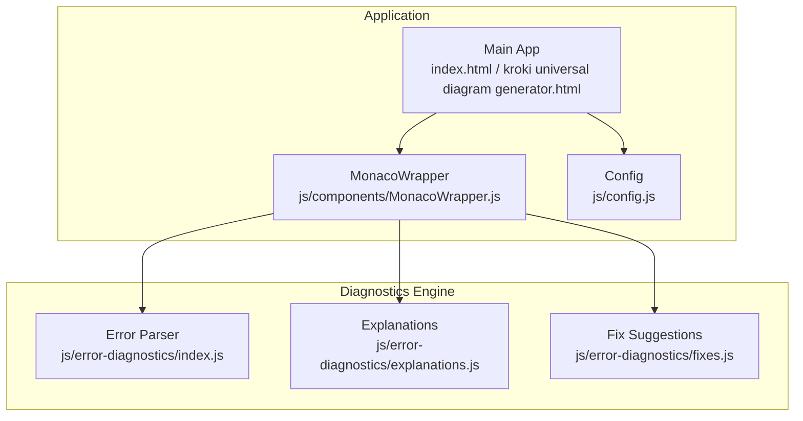
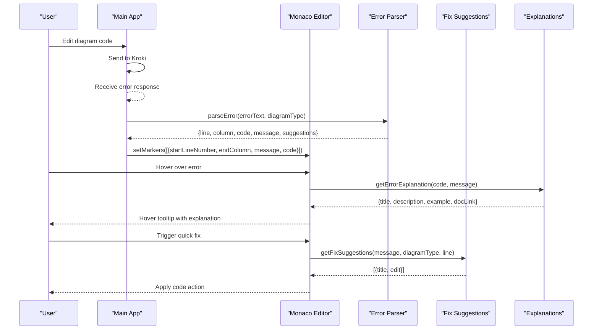
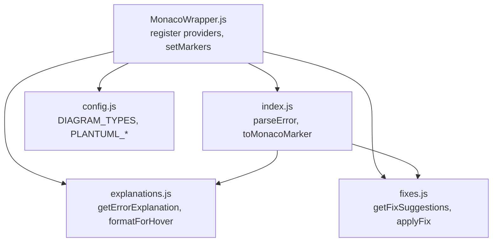

# Error Detection and Diagnostics

<cite>
**Referenced Files in This Document**
- [index.html](file://index.html)
- [kroki universal diagram generator.html](file://kroki universal diagram generator.html)
- [js/error-diagnostics/index.js](file://js/error-diagnostics/index.js)
- [js/error-diagnostics/explanations.js](file://js/error-diagnostics/explanations.js)
- [js/error-diagnostics/fixes.js](file://js/error-diagnostics/fixes.js)
- [js/components/MonacoWrapper.js](file://js/components/MonacoWrapper.js)
- [js/components/PlantUmlComponents.js](file://js/components/PlantUmlComponents.js)
- [js/config.js](file://js/config.js)
</cite>

## Table of Contents
1. [Introduction](#introduction)
2. [Project Structure](#project-structure)
3. [Core Components](#core-components)
4. [Architecture Overview](#architecture-overview)
5. [Detailed Component Analysis](#detailed-component-analysis)
6. [Dependency Analysis](#dependency-analysis)
7. [Performance Considerations](#performance-considerations)
8. [Troubleshooting Guide](#troubleshooting-guide)
9. [Conclusion](#conclusion)

## Introduction
This document describes the error detection and diagnostic system used to identify, classify, explain, and resolve syntax errors across multiple diagram languages (Mermaid, PlantUML, BPMN/XML, GraphViz, and others). It covers:
- Error classification and codes for syntax errors, missing brackets, PlantUML end tag issues, unexpected tokens, and format-specific problems
- Human-readable explanations with contextual help and example corrections
- Automated fix suggestions and quick fixes for common syntax errors
- Integration with Monaco Editor for inline error markers, hover providers, and code action providers
- Error parsing algorithms, diagnostic extraction, and user feedback mechanisms

## Project Structure
The error detection system spans several modules:
- Error parsing and classification: js/error-diagnostics/index.js
- Error explanations and hover formatting: js/error-diagnostics/explanations.js
- Fix suggestions and automated corrections: js/error-diagnostics/fixes.js
- Monaco Editor integration: js/components/MonacoWrapper.js
- Diagram configuration and templates: js/config.js
- Legacy integration points in the main HTML app: index.html and kroki universal diagram generator.html

**Diagram sources**
- [index.html](file://index.html#L1-L200)
- [kroki universal diagram generator.html](file://kroki universal diagram generator.html#L1-L200)
- [js/components/MonacoWrapper.js](file://js/components/MonacoWrapper.js#L1-L169)
- [js/error-diagnostics/index.js](file://js/error-diagnostics/index.js#L1-L44)
- [js/error-diagnostics/explanations.js](file://js/error-diagnostics/explanations.js#L1-L302)
- [js/error-diagnostics/fixes.js](file://js/error-diagnostics/fixes.js#L1-L403)
- [js/config.js](file://js/config.js#L1-L116)

**Section sources**
- [index.html](file://index.html#L1-L200)
- [kroki universal diagram generator.html](file://kroki universal diagram generator.html#L1-L200)
- [js/error-diagnostics/index.js](file://js/error-diagnostics/index.js#L1-L44)
- [js/error-diagnostics/explanations.js](file://js/error-diagnostics/explanations.js#L1-L302)
- [js/error-diagnostics/fixes.js](file://js/error-diagnostics/fixes.js#L1-L403)
- [js/components/MonacoWrapper.js](file://js/components/MonacoWrapper.js#L1-L169)
- [js/config.js](file://js/config.js#L1-L116)

## Core Components
- Error Parser: Extracts line/column from raw error messages and assigns error codes based on diagram type and content patterns.
- Explanations: Provides human-readable descriptions, examples, and documentation links for each error code.
- Fix Suggestions: Generates quick-fix actions and automated edits for common syntax issues.
- Monaco Integration: Registers code action providers and hover providers, converts parsed errors to Monaco markers, and applies decorations.

Key capabilities:
- Diagram-aware parsing with type-specific patterns for Mermaid, PlantUML, GraphViz, BPMN/XML, and generic fallbacks
- Error code taxonomy aligned with diagram types (e.g., mermaid-missing-bracket, plantuml-missing-end)
- Inline error markers and squiggly underlines in Monaco
- Hover provider with formatted explanations
- Quick fixes via code actions

**Section sources**
- [js/error-diagnostics/index.js](file://js/error-diagnostics/index.js#L13-L44)
- [js/error-diagnostics/explanations.js](file://js/error-diagnostics/explanations.js#L12-L229)
- [js/error-diagnostics/fixes.js](file://js/error-diagnostics/fixes.js#L11-L296)
- [js/components/MonacoWrapper.js](file://js/components/MonacoWrapper.js#L309-L423)

## Architecture Overview
The system integrates error detection into the diagram editing workflow. When a diagram fails to render, the application parses the error, maps it to a structured diagnostic, and displays inline markers in Monaco. Users can hover for explanations and apply quick fixes.

**Diagram sources**
- [js/error-diagnostics/index.js](file://js/error-diagnostics/index.js#L13-L44)
- [js/error-diagnostics/explanations.js](file://js/error-diagnostics/explanations.js#L237-L271)
- [js/error-diagnostics/fixes.js](file://js/error-diagnostics/fixes.js#L332-L366)
- [js/components/MonacoWrapper.js](file://js/components/MonacoWrapper.js#L309-L423)
- [kroki universal diagram generator.html](file://kroki universal diagram generator.html#L3282-L3315)

## Detailed Component Analysis

### Error Classification and Codes
The system classifies errors by matching patterns against the raw error text and assigns codes prefixed by the diagram type (e.g., mermaid-, plantuml-, graphviz-, bpmn-, c4plantuml-, generic-). Categories include:
- Missing closing brackets/parentheses/braces
- PlantUML missing start/end tags
- Invalid arrow syntax
- Unexpected tokens and unrecognized text
- Unknown diagram type
- XML parsing errors and unclosed tags
- Generic syntax errors

Examples of mapped codes:
- mermaid-missing-bracket, mermaid-missing-paren, mermaid-missing-brace
- plantuml-missing-start, plantuml-missing-end
- mermaid-invalid-arrow, plantuml-invalid-arrow
- mermaid-unexpected-token, mermaid-unrecognized-text, mermaid-unknown-diagram
- graphviz-missing-bracket, graphviz-missing-brace, graphviz-syntax-error
- bpmn-xml-error, bpmn-unclosed-tag
- c4plantuml-missing-bracket
- generic-syntax-error, generic-missing-bracket, generic-missing-paren, generic-missing-brace

**Section sources**
- [js/error-diagnostics/index.js](file://js/error-diagnostics/index.js#L153-L254)
- [js/error-diagnostics/explanations.js](file://js/error-diagnostics/explanations.js#L12-L229)

### Error Explanation System
The explanations module provides:
- Title, description, and example for each error code
- Pattern-based fallback matching when exact code is not found
- Formatting for Monaco hover tooltips

Hover content includes:
- Bold title
- Description
- Example code block
- Optional documentation link

**Section sources**
- [js/error-diagnostics/explanations.js](file://js/error-diagnostics/explanations.js#L12-L229)
- [js/error-diagnostics/explanations.js](file://js/error-diagnostics/explanations.js#L237-L271)
- [js/error-diagnostics/explanations.js](file://js/error-diagnostics/explanations.js#L278-L299)

### Automated Fix Suggestions
Fix suggestions are generated from patterns in error messages and diagram type. They include:
- Preferred vs non-preferred actions
- Edit ranges and text for Monaco to apply automatically
- Special handling for end-of-file inserts (line 99999)

Supported fixes include:
- Adding diagram type declarations for Mermaid
- Adding closing brackets/parentheses/braces
- Adding @startuml/@enduml for PlantUML/C4-PlantUML
- Adding semicolons and braces for GraphViz
- Adding closing XML tags for BPMN/XML
- Providing informational suggestions when auto-fix is not possible

**Section sources**
- [js/error-diagnostics/fixes.js](file://js/error-diagnostics/fixes.js#L11-L296)
- [js/error-diagnostics/fixes.js](file://js/error-diagnostics/fixes.js#L332-L366)
- [js/error-diagnostics/fixes.js](file://js/error-diagnostics/fixes.js#L374-L400)

### Monaco Editor Integration
The Monaco integration registers:
- Code Action Providers: offer quick fixes for markers
- Hover Providers: show explanations on hover
- Marker conversion: transforms parsed errors into Monaco markers
- Decorations: highlight the error line and gutter

Key behaviors:
- Converts parsed error info to Monaco marker format with severity and code
- Creates code actions with Monaco Range and edit text
- Formats explanations for hover display
- Supports end-of-file insertions for fixes targeting EOF

**Section sources**
- [js/components/MonacoWrapper.js](file://js/components/MonacoWrapper.js#L309-L423)
- [js/error-diagnostics/index.js](file://js/error-diagnostics/index.js#L261-L276)

### Error Parsing Algorithms
The parser performs two primary tasks:
- Location extraction: identifies line and column numbers using diagram-specific and generic patterns
- Categorization: assigns error codes by matching patterns against the error text

Location extraction patterns:
- Mermaid: parse error on line X, syntax error at line X column Y, lexical error on line X
- PlantUML: ERROR line X, Syntax Error: line X, line X:, (X,Y)
- GraphViz: syntax error in line X near 'token', <stdin>:X:, line X:
- BPMN/XML: line X, column Y; at line X:Y; Line: X, Column: Y
- Generic fallback: line X, X:Y, error X:, (X:Y), X:Y:

Categorization patterns:
- Missing/closing brackets/parentheses/braces
- PlantUML missing @startuml/@enduml
- Invalid arrow syntax
- Unexpected tokens and unrecognized text
- Unknown diagram type
- XML parsing errors and unclosed tags
- Generic syntax error fallback

**Section sources**
- [js/error-diagnostics/index.js](file://js/error-diagnostics/index.js#L52-L145)
- [js/error-diagnostics/index.js](file://js/error-diagnostics/index.js#L153-L254)

### Diagnostic Information Extraction and User Feedback
The main application extracts diagnostics during rendering failures:
- Parses error text to locate the problematic line and column
- Assigns a code based on content patterns
- Sets Monaco markers for inline error display
- Provides a “Jump to Error” action to scroll to the error line

User feedback mechanisms:
- Inline markers with squiggly underlines
- Hover tooltips with explanations and examples
- Quick fixes via lightbulb actions
- Error line navigation

**Section sources**
- [kroki universal diagram generator.html](file://kroki universal diagram generator.html#L825-L877)
- [kroki universal diagram generator.html](file://kroki universal diagram generator.html#L3282-L3315)
- [index.html](file://index.html#L1491-L1518)

### Integration with Diagram Types and Templates
The system recognizes multiple diagram types and maps them to Monaco languages:
- Mermaid: mermaid
- PlantUML/C4-PlantUML: plantuml
- BPMN/XML: xml
- GraphViz: plaintext
- Others: plaintext/json/yaml depending on configuration

Template galleries and snippet toolbars provide pre-built code to reduce syntax errors.

**Section sources**
- [js/config.js](file://js/config.js#L6-L116)
- [js/components/PlantUmlComponents.js](file://js/components/PlantUmlComponents.js#L1-L95)

## Dependency Analysis
The error diagnostics engine depends on:
- Monaco Editor APIs for markers, code actions, and hover providers
- Diagram configuration for language mapping and templates
- Internal parsers and suggestion engines

**Diagram sources**
- [js/error-diagnostics/index.js](file://js/error-diagnostics/index.js#L1-L44)
- [js/error-diagnostics/explanations.js](file://js/error-diagnostics/explanations.js#L1-L302)
- [js/error-diagnostics/fixes.js](file://js/error-diagnostics/fixes.js#L1-L403)
- [js/components/MonacoWrapper.js](file://js/components/MonacoWrapper.js#L1-L169)
- [js/config.js](file://js/config.js#L1-L116)

**Section sources**
- [js/error-diagnostics/index.js](file://js/error-diagnostics/index.js#L1-L44)
- [js/error-diagnostics/explanations.js](file://js/error-diagnostics/explanations.js#L1-L302)
- [js/error-diagnostics/fixes.js](file://js/error-diagnostics/fixes.js#L1-L403)
- [js/components/MonacoWrapper.js](file://js/components/MonacoWrapper.js#L1-L169)
- [js/config.js](file://js/config.js#L1-L116)

## Performance Considerations
- Regex-based parsing is efficient for typical error messages; keep patterns minimal and specific to avoid backtracking.
- Limit the number of quick fixes offered per marker to reduce hover/action clutter.
- Avoid heavy computations in hover providers; explanations are cached by code.
- Use Monaco’s built-in marker management to minimize DOM updates.

## Troubleshooting Guide
Common issues and resolutions:
- Missing closing bracket/paren/brace
  - Symptom: Syntax error near closing delimiter
  - Resolution: Add the missing closing delimiter; quick fix available for Mermaid/PlantUML
- Missing @startuml/@enduml
  - Symptom: Missing start/end tag error
  - Resolution: Add @startuml at the beginning and @enduml at the end; quick fix available
- Invalid arrow syntax
  - Symptom: Invalid arrow or unknown link type
  - Resolution: Use supported arrow syntax; quick fix suggests alternatives
- Unexpected token or unrecognized text
  - Symptom: Parser encountered unexpected word or character
  - Resolution: Check for typos or incomplete statements; review diagram type declaration
- XML parsing error or unclosed tag (BPMN/XML)
  - Symptom: Malformed XML or missing closing tag
  - Resolution: Ensure all tags are properly closed and attributes are quoted; quick fix adds closing tag
- Generic syntax error
  - Symptom: Broad syntax error without specifics
  - Resolution: Review the indicated line for unmatched delimiters, keywords, or formatting issues

Practical steps:
- Use the “Jump to Error” button to navigate to the error line
- Hover over the error marker to see a contextual explanation and example
- Click the lightbulb to apply a quick fix when available
- Verify diagram type declaration at the top of the code for Mermaid

**Section sources**
- [js/error-diagnostics/explanations.js](file://js/error-diagnostics/explanations.js#L12-L229)
- [js/error-diagnostics/fixes.js](file://js/error-diagnostics/fixes.js#L11-L296)
- [kroki universal diagram generator.html](file://kroki universal diagram generator.html#L3387-L3396)

## Conclusion
The error detection and diagnostic system provides robust, diagram-aware error handling with clear classifications, actionable explanations, and automated fixes. Its integration with Monaco Editor delivers immediate, contextual feedback to improve the authoring experience across Mermaid, PlantUML, BPMN/XML, GraphViz, and other supported formats.