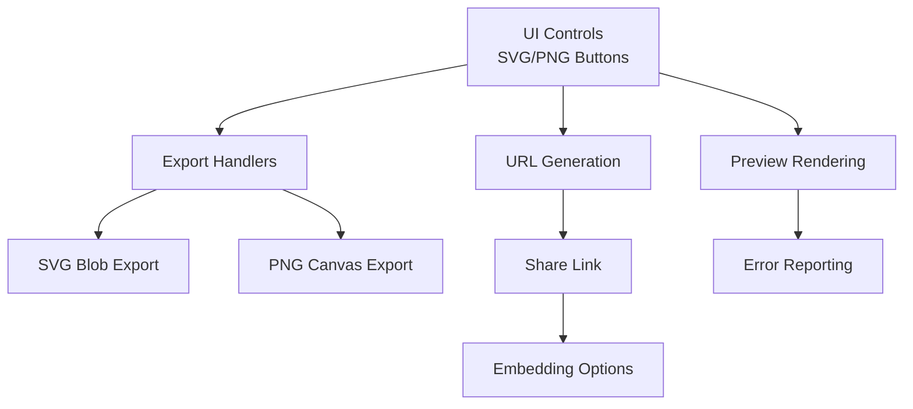
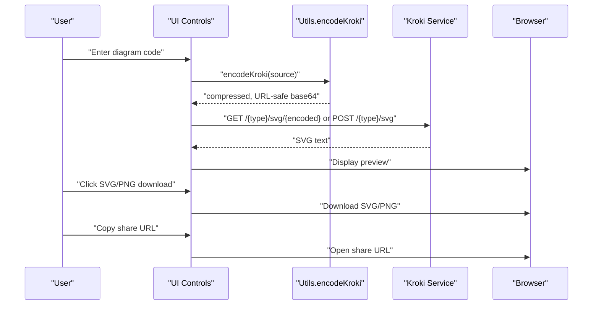
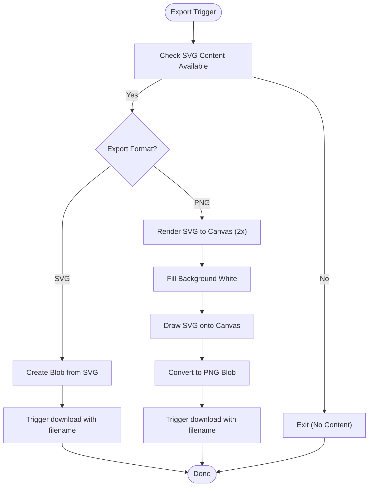
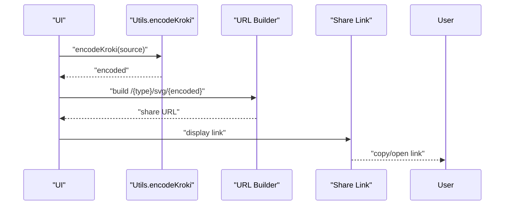
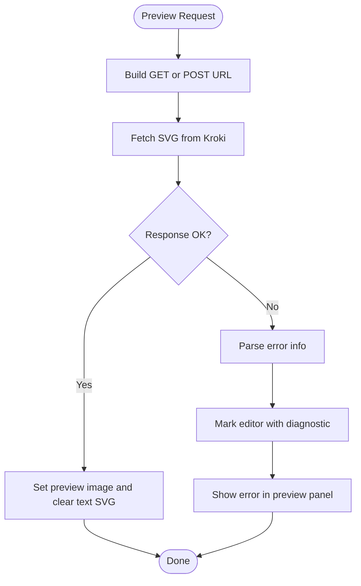
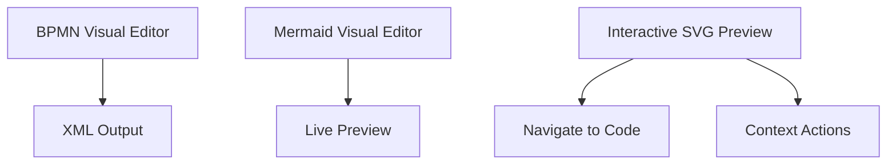
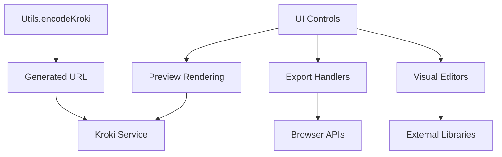

# Export and Sharing

<cite>
**Referenced Files in This Document**
- [index.html](file://index.html)
- [js/config.js](file://js/config.js)
- [js/utils.js](file://js/utils.js)
- [js/components/PlantUmlComponents.js](file://js/components/PlantUmlComponents.js)
</cite>

## Table of Contents
1. [Introduction](#introduction)
2. [Project Structure](#project-structure)
3. [Core Components](#core-components)
4. [Architecture Overview](#architecture-overview)
5. [Detailed Component Analysis](#detailed-component-analysis)
6. [Dependency Analysis](#dependency-analysis)
7. [Performance Considerations](#performance-considerations)
8. [Troubleshooting Guide](#troubleshooting-guide)
9. [Conclusion](#conclusion)
10. [Appendices](#appendices)

## Introduction
This document explains the export and sharing functionality of the universal diagram generator. It covers supported export formats (PNG and SVG), the export pipeline (including compression and quality), URL sharing and state preservation, embedding options for web integration, and collaboration-related features such as interactive previews and navigation from visuals to code. It also provides practical workflows, performance tips, and accessibility considerations.

## Project Structure
The application is a single-page React-like application embedded in a single HTML file. Key areas relevant to export and sharing:
- Export controls and handlers for SVG/PNG downloads
- URL generation and sharing via the Kroki service
- Preview rendering and error reporting
- Visual editors for BPMN and Mermaid
- Utilities for compression and type detection

**Diagram sources**
- [index.html](file://index.html#L1600-L1759)
- [index.html](file://index.html#L1561-L1598)
- [index.html](file://index.html#L1444-L1522)

**Section sources**
- [index.html](file://index.html#L1600-L1759)

## Core Components
- Export handlers for SVG and PNG downloads
- URL generation using Kroki with compression
- Preview rendering and error diagnostics
- Visual editors for BPMN and Mermaid
- Utility functions for compression and type detection

Key responsibilities:
- Export handlers convert SVG content to downloadable files.
- URL generation encodes diagram source using compression and constructs a shareable URL.
- Preview rendering fetches SVG from the Kroki service and displays it.
- Visual editors enable design-driven editing and live previews.

**Section sources**
- [index.html](file://index.html#L1561-L1598)
- [index.html](file://index.html#L1444-L1522)
- [js/utils.js](file://js/utils.js#L14-L28)

## Architecture Overview
The export and sharing pipeline integrates user interface controls, compression utilities, and the Kroki service to produce shareable URLs and downloadable assets.

**Diagram sources**
- [index.html](file://index.html#L1444-L1522)
- [js/utils.js](file://js/utils.js#L14-L28)

## Detailed Component Analysis

### Export Pipeline: SVG and PNG
- SVG export: Creates a Blob from the SVG content and triggers a download with a filename derived from the diagram type.
- PNG export: Renders the SVG into an offscreen canvas at a higher resolution for quality, fills the background white, draws the image, and converts to a PNG Blob for download.

**Diagram sources**
- [index.html](file://index.html#L1561-L1598)

**Section sources**
- [index.html](file://index.html#L1561-L1598)

### URL Encoding and Sharing
- Compression: The diagram source is compressed using a deflate algorithm and then base64-encoded with URL-safe characters.
- URL construction: The encoded string is appended to the Kroki base URL along with the diagram type to form a shareable GET URL. If the URL would exceed a threshold, the system falls back to a POST request to the service endpoint with the raw source.
- Share link: When using GET, a link to the generated URL is shown in the preview header for easy copying and sharing.

**Diagram sources**
- [index.html](file://index.html#L1444-L1522)
- [js/utils.js](file://js/utils.js#L14-L28)

**Section sources**
- [index.html](file://index.html#L1444-L1522)
- [js/utils.js](file://js/utils.js#L14-L28)

### Preview Rendering and Error Handling
- Preview rendering: The application fetches SVG from the Kroki service either via GET or POST depending on URL length. It sets the preview image and clears text-based SVG content upon success.
- Error handling: Parsing errors are captured, mapped to line/column positions, and highlighted in the editor. Error messages are displayed in the preview panel with a link to jump to the problematic line.

**Diagram sources**
- [index.html](file://index.html#L1473-L1518)

**Section sources**
- [index.html](file://index.html#L1473-L1518)

### Visual Editors and Collaboration Features
- BPMN visual editor: Provides a visual modeling experience with real-time XML updates and a loading overlay while resources are fetched.
- Mermaid visual editor: Generates a temporary preview via POST to the Mermaid endpoint and debounces requests to improve responsiveness.
- Interactive PlantUML preview: Allows clicking on diagram elements to navigate to the corresponding code and right-click context menus for quick actions.

**Diagram sources**
- [index.html](file://index.html#L729-L784)
- [index.html](file://index.html#L786-L808)
- [js/components/PlantUmlComponents.js](file://js/components/PlantUmlComponents.js#L153-L248)

**Section sources**
- [index.html](file://index.html#L729-L784)
- [index.html](file://index.html#L786-L808)
- [js/components/PlantUmlComponents.js](file://js/components/PlantUmlComponents.js#L153-L248)

### File Format Detection and Conversion
- Type detection: Determines the diagram type from file extensions to set the appropriate editor and language mode.
- Conversion capability: The application primarily renders SVG from source code via the Kroki service. There is no client-side conversion between formats; exports are produced from the current SVG content.

**Section sources**
- [js/utils.js](file://js/utils.js#L35-L41)
- [js/config.js](file://js/config.js#L6-L116)

## Dependency Analysis
- Export handlers depend on SVG content availability and the browser’s Blob and canvas APIs.
- URL generation depends on the compression utility and the Kroki base URL constant.
- Preview rendering depends on the Mermaid AST loader and the Kroki service endpoints.
- Visual editors depend on external libraries for BPMN and Mermaid rendering.

**Diagram sources**
- [js/utils.js](file://js/utils.js#L14-L28)
- [index.html](file://index.html#L1444-L1522)
- [index.html](file://index.html#L729-L784)

**Section sources**
- [js/utils.js](file://js/utils.js#L14-L28)
- [index.html](file://index.html#L1444-L1522)

## Performance Considerations
- PNG export resolution: The canvas is scaled up by a factor to improve perceived quality. Adjust the multiplier to balance quality and file size.
- Compression: The compression level is set to maximum to reduce URL length and improve sharing performance.
- Debouncing: Preview fetching is debounced to avoid excessive network requests during rapid edits.
- POST fallback: When URLs become too long, the system switches to POST to avoid exceeding limits.

Practical tips:
- Prefer SVG for scalable assets and smaller file sizes.
- Use PNG when a rasterized image is required (e.g., presentation slides).
- Keep diagram source concise to minimize compression overhead and URL length.

**Section sources**
- [index.html](file://index.html#L1573-L1598)
- [js/utils.js](file://js/utils.js#L18-L23)
- [index.html](file://index.html#L1473-L1522)

## Troubleshooting Guide
Common issues and resolutions:
- Rendering errors: Errors are parsed to extract line and column numbers and marked in the editor. Use the “Go to line” link to fix syntax.
- Large URLs: If the URL exceeds the limit, the system automatically switches to POST; ensure the backend supports POST to the service endpoint.
- Missing external resources: Visual editors rely on external libraries; ensure network access and that resources load successfully.

**Section sources**
- [index.html](file://index.html#L1495-L1518)
- [index.html](file://index.html#L1476-L1484)

## Conclusion
The export and sharing system centers on efficient compression, robust preview rendering, and flexible export formats. Users can share diagrams via short, state-preserving URLs and download high-quality assets. Visual editors enhance collaboration by enabling design-driven editing and direct navigation between visuals and code.

## Appendices

### Practical Export Workflows
- Export a diagram as SVG:
  - Enter or paste diagram code.
  - Click the SVG download button to save the current preview.
- Export a diagram as PNG:
  - Enter or paste diagram code.
  - Click the PNG download button to save a rasterized version at increased resolution.
- Share a diagram:
  - Copy the generated share URL from the preview header.
  - Open the URL in another browser or embed it in documentation.

### Embedding Options
- Static embedding: Use the share URL to embed the rendered SVG in an iframe or image tag.
- Dynamic embedding: Integrate the preview rendering logic into your own application by calling the same endpoints used by the application.

### Accessibility Considerations
- Ensure images have descriptive alt attributes when embedding.
- Provide fallback text for diagrams when images are not available.
- Use semantic markup and ARIA roles where applicable in host pages.

[No sources needed since this section provides general guidance]