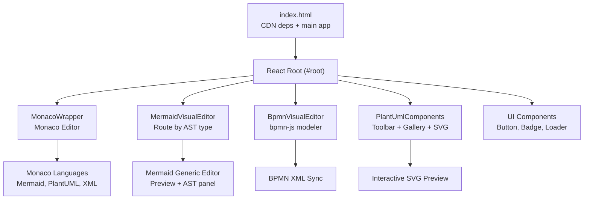
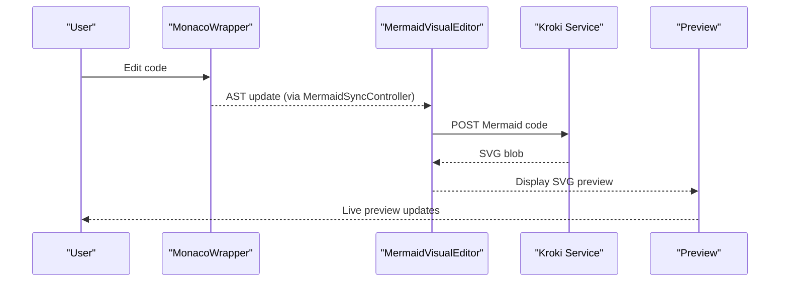
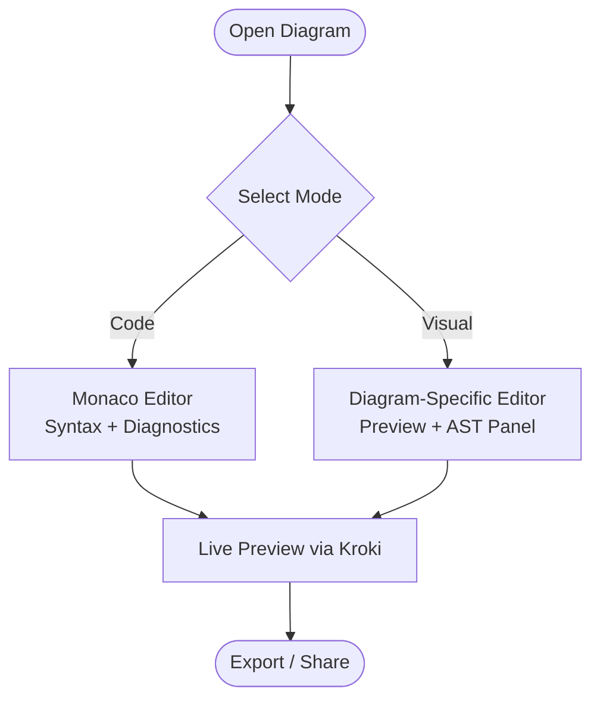
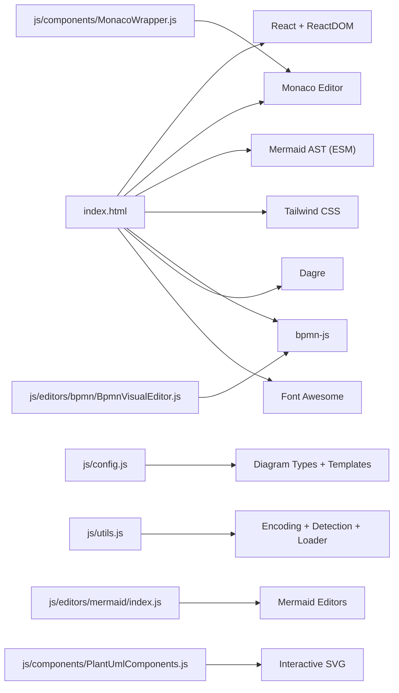

# Getting Started

<cite>
**Referenced Files in This Document**
- [index.html](file://index.html)
- [kroki universal diagram generator.html](file://kroki universal diagram generator.html)
- [js/config.js](file://js/config.js)
- [js/utils.js](file://js/utils.js)
- [js/react-helpers.js](file://js/react-helpers.js)
- [js/components/ui.js](file://js/components/ui.js)
- [js/components/MonacoWrapper.js](file://js/components/MonacoWrapper.js)
- [js/components/PlantUmlComponents.js](file://js/components/PlantUmlComponents.js)
- [js/editors/bpmn/BpmnVisualEditor.js](file://js/editors/bpmn/BpmnVisualEditor.js)
- [js/editors/mermaid/index.js](file://js/editors/mermaid/index.js)
- [js/editors/mermaid/MermaidGenericEditor.js](file://js/editors/mermaid/MermaidGenericEditor.js)
- [js/editors/mermaid/MermaidSyncController.js](file://js/editors/mermaid/MermaidSyncController.js)
- [js/error-diagnostics/index.js](file://js/error-diagnostics/index.js)
- [styles.css](file://styles.css)
</cite>

## Table of Contents
1. [Introduction](#introduction)
2. [Project Structure](#project-structure)
3. [Core Components](#core-components)
4. [Architecture Overview](#architecture-overview)
5. [Detailed Component Analysis](#detailed-component-analysis)
6. [Dependency Analysis](#dependency-analysis)
7. [Performance Considerations](#performance-considerations)
8. [Troubleshooting Guide](#troubleshooting-guide)
9. [Conclusion](#conclusion)
10. [Appendices](#appendices)

## Introduction
Welcome to the Universal Diagram Generator. This single-page application lets you create diagrams in multiple formats (BPMN, Mermaid, PlantUML, and more) using a dual-mode editing experience: code and visual. It integrates CDN-hosted libraries for React, Monaco Editor, Mermaid AST, and BPMN visual editing, and renders previews via the Kroki service.

Key capabilities:
- Choose a diagram type and start editing in either code or visual mode
- Use templates and snippet toolbars to accelerate creation
- See live previews and receive contextual error diagnostics
- Export and share your diagrams

## Project Structure
The application is a single HTML page that bootstraps a React app and mounts it into a root element. It loads all dependencies from CDNs and defines diagram types, templates, and editors in a modular way.

**Diagram sources**
- [index.html](file://index.html#L1-L120)
- [js/components/MonacoWrapper.js](file://js/components/MonacoWrapper.js#L1-L170)
- [js/editors/mermaid/index.js](file://js/editors/mermaid/index.js#L1-L137)
- [js/editors/bpmn/BpmnVisualEditor.js](file://js/editors/bpmn/BpmnVisualEditor.js#L1-L106)
- [js/components/PlantUmlComponents.js](file://js/components/PlantUmlComponents.js#L1-L249)
- [js/components/ui.js](file://js/components/ui.js#L1-L175)

**Section sources**
- [index.html](file://index.html#L1-L120)

## Core Components
- Diagram type registry and templates: centralized configuration for supported diagram types, file extensions, default examples, and template galleries.
- Monaco editor wrapper: provides syntax highlighting, error diagnostics, quick fixes, and hover explanations for Mermaid, PlantUML, and BPMN.
- Mermaid visual editor: routes to diagram-specific editors based on AST type and provides a generic fallback with live preview and AST explorer.
- BPMN visual editor: integrates bpmn-js for visual editing and syncs XML back to code.
- PlantUML components: snippet toolbar, template gallery, and interactive SVG preview with context menus.
- UI primitives: reusable buttons, badges, loaders, empty states, and editable text.

**Section sources**
- [js/config.js](file://js/config.js#L1-L116)
- [js/components/MonacoWrapper.js](file://js/components/MonacoWrapper.js#L1-L170)
- [js/editors/mermaid/index.js](file://js/editors/mermaid/index.js#L1-L137)
- [js/editors/bpmn/BpmnVisualEditor.js](file://js/editors/bpmn/BpmnVisualEditor.js#L1-L106)
- [js/components/PlantUmlComponents.js](file://js/components/PlantUmlComponents.js#L1-L249)
- [js/components/ui.js](file://js/components/ui.js#L1-L175)

## Architecture Overview
The app initializes React and mounts the root component. The main layout splits into:
- Left: Code editor (Monaco) for Mermaid/PlantUML/BPMN
- Center: Live preview (SVG via Kroki) or visual editor (BPMN)
- Right: Diagram-specific panels (Mermaid AST explorer, PlantUML template gallery)

**Diagram sources**
- [js/components/MonacoWrapper.js](file://js/components/MonacoWrapper.js#L1-L170)
- [js/editors/mermaid/index.js](file://js/editors/mermaid/index.js#L20-L60)
- [js/editors/mermaid/MermaidSyncController.js](file://js/editors/mermaid/MermaidSyncController.js#L9-L93)

## Detailed Component Analysis

### Installation and Setup (Local Development)
- The application is a single-page app that runs directly from an HTML file. It does not require a build step.
- Dependencies are loaded from CDNs:
  - React and ReactDOM
  - Babel (for JSX)
  - Monaco Editor
  - Mermaid AST (ES module)
  - Tailwind CSS
  - Other libraries (bpmn-js, dagre, font-awesome)
- To run locally:
  - Save the HTML file to your machine
  - Open it in a modern browser
  - The app will dynamically load all required scripts and styles

Notes:
- Some features rely on external services (e.g., Mermaid AST and Kroki preview). Ensure network access is available.
- The app uses ES modules for some components; ensure your browser supports them.

**Section sources**
- [index.html](file://index.html#L1-L60)
- [kroki universal diagram generator.html](file://kroki universal diagram generator.html#L1-L60)

### First Diagram Tutorial: Selecting a Type and Creating Your First Diagram
Step-by-step for beginners:
1. Choose a diagram type from the type registry:
   - Types include BPMN, Mermaid, PlantUML, and many others.
   - Each type has associated file extensions and default examples.
2. Start with a template:
   - Use the PlantUML template gallery to pick a ready-made diagram.
   - Or paste a Mermaid example from the type registry.
3. Dual-mode editing:
   - Code mode: edit the diagram source directly in Monaco.
   - Visual mode: for BPMN, use the bpmn-js visual editor; for Mermaid, the AST-driven visual editor routes to diagram-specific editors.
4. Live preview:
   - The app sends Mermaid code to the Kroki service to render an SVG preview.
   - For PlantUML, the interactive SVG preview highlights elements and supports context menus.
5. Basic editing:
   - Use the snippet toolbar to insert common blocks (e.g., participants, arrows, notes).
   - Use the template gallery to apply complete structures quickly.

Next steps:
- Explore Mermaid diagram types (flowchart, sequence, class, state, ER, Gantt, pie, mindmap, journey, gitgraph).
- Learn PlantUML diagram families (sequence, class, activity, state, component, use case, deployment, ER, WBS).
- Try BPMN visual editing for process flows.

**Section sources**
- [js/config.js](file://js/config.js#L6-L116)
- [js/components/PlantUmlComponents.js](file://js/components/PlantUmlComponents.js#L52-L95)
- [js/editors/mermaid/index.js](file://js/editors/mermaid/index.js#L20-L121)

### Dual-Mode Editing: Code and Visual Modes
- Code mode (Monaco):
  - Syntax highlighting for Mermaid, PlantUML, and BPMN (XML).
  - Error diagnostics with quick fixes and hover explanations.
  - Cursor-based navigation and line highlighting for errors.
- Visual mode:
  - BPMN: bpmn-js modeler with real-time XML sync.
  - Mermaid: AST-based routing to specialized editors; fallback to generic editor with AST explorer.
  - PlantUML: interactive SVG preview with click-to-navigate and context menus.

**Diagram sources**
- [js/components/MonacoWrapper.js](file://js/components/MonacoWrapper.js#L1-L170)
- [js/editors/mermaid/index.js](file://js/editors/mermaid/index.js#L20-L121)
- [js/editors/bpmn/BpmnVisualEditor.js](file://js/editors/bpmn/BpmnVisualEditor.js#L14-L90)

**Section sources**
- [js/components/MonacoWrapper.js](file://js/components/MonacoWrapper.js#L1-L170)
- [js/editors/bpmn/BpmnVisualEditor.js](file://js/editors/bpmn/BpmnVisualEditor.js#L14-L90)
- [js/editors/mermaid/index.js](file://js/editors/mermaid/index.js#L20-L121)

### Creating Your First Diagram: Step-by-Step

#### BPMN
- Steps:
  1. Select BPMN type.
  2. Paste the default BPMN example from the type registry.
  3. Switch to Visual mode to edit with bpmn-js.
  4. The visual editor syncs XML back to code automatically.
- Tips:
  - Use the palette to add elements.
  - The editor highlights errors and validates structure.

**Section sources**
- [js/config.js](file://js/config.js#L13-L56)
- [js/editors/bpmn/BpmnVisualEditor.js](file://js/editors/bpmn/BpmnVisualEditor.js#L14-L90)

#### Mermaid Flowchart
- Steps:
  1. Select Mermaid type.
  2. Paste a flowchart example from the type registry.
  3. The Mermaid visual editor detects the diagram type and shows a flowchart editor.
  4. Live preview updates as you type.
- Tips:
  - Use the snippet toolbar for nodes, decisions, and arrows.
  - The AST explorer shows the internal representation.

**Section sources**
- [js/config.js](file://js/config.js#L58-L68)
- [js/editors/mermaid/index.js](file://js/editors/mermaid/index.js#L77-L121)
- [js/editors/mermaid/MermaidGenericEditor.js](file://js/editors/mermaid/MermaidGenericEditor.js#L11-L98)

#### PlantUML Sequence Diagram
- Steps:
  1. Select PlantUML type.
  2. Open the template gallery and choose a sequence diagram template.
  3. Switch to Visual mode to interact with the SVG preview.
  4. Right-click on elements to add notes, messages, or navigate to definitions.
- Tips:
  - Use the snippet toolbar to insert participants, arrows, and activation/deactivation.
  - The interactive preview highlights clickable elements.

**Section sources**
- [js/config.js](file://js/config.js#L70-L80)
- [js/components/PlantUmlComponents.js](file://js/components/PlantUmlComponents.js#L8-L47)
- [js/components/PlantUmlComponents.js](file://js/components/PlantUmlComponents.js#L153-L249)

### Navigation, Toolbars, and Export
- Navigation:
  - Use the Monaco editor’s cursor and line numbers to jump to errors.
  - In PlantUML visual mode, click on SVG elements to navigate to the corresponding code.
- Toolbars:
  - PlantUML snippet toolbar: insert common blocks quickly.
  - Template gallery: choose a complete diagram structure.
- Export:
  - The app renders SVG previews via Kroki. You can copy the SVG or take a screenshot.
  - For BPMN, the visual editor exports XML that you can save or share.

**Section sources**
- [js/components/MonacoWrapper.js](file://js/components/MonacoWrapper.js#L20-L84)
- [js/components/PlantUmlComponents.js](file://js/components/PlantUmlComponents.js#L52-L95)
- [js/editors/mermaid/index.js](file://js/editors/mermaid/index.js#L32-L53)

### Browser Compatibility and Initial Configuration
- Browser compatibility:
  - Requires modern browsers with support for ES modules, fetch, and DOM APIs.
  - Monaco Editor and bpmn-js are loaded dynamically from CDNs.
- Initial configuration:
  - Diagram types and defaults are defined centrally.
  - The app registers language configurations and error providers for Monaco.
  - Tailwind CSS is configured via CDN with custom colors and fonts.

**Section sources**
- [index.html](file://index.html#L1-L60)
- [js/config.js](file://js/config.js#L1-L116)
- [js/components/MonacoWrapper.js](file://js/components/MonacoWrapper.js#L174-L303)

## Dependency Analysis
The application relies on CDN-hosted libraries and modular JavaScript modules.

**Diagram sources**
- [index.html](file://index.html#L8-L31)
- [js/config.js](file://js/config.js#L1-L116)
- [js/utils.js](file://js/utils.js#L1-L177)
- [js/components/MonacoWrapper.js](file://js/components/MonacoWrapper.js#L1-L170)
- [js/editors/mermaid/index.js](file://js/editors/mermaid/index.js#L1-L137)
- [js/editors/bpmn/BpmnVisualEditor.js](file://js/editors/bpmn/BpmnVisualEditor.js#L1-L106)
- [js/components/PlantUmlComponents.js](file://js/components/PlantUmlComponents.js#L1-L249)

**Section sources**
- [index.html](file://index.html#L8-L31)
- [js/utils.js](file://js/utils.js#L116-L146)

## Performance Considerations
- Monaco Editor:
  - Uses minimap and folding to reduce redraw overhead.
  - Debounces content changes to avoid excessive re-renders.
- Mermaid preview:
  - Debounces preview generation to limit network requests.
  - Revokes object URLs to prevent memory leaks.
- Visual editors:
  - bpmn-js modeler is lazy-loaded and destroyed on unmount.
- Network:
  - Uses compression for diagram source payloads to Kroki.

[No sources needed since this section provides general guidance]

## Troubleshooting Guide
Common issues and resolutions:
- Monaco editor not loading:
  - Ensure the Monaco AMD loader path is correct and the CDN is reachable.
  - Confirm that the editor container is present in the DOM.
- Mermaid AST not available:
  - The Mermaid AST library is loaded as an ES module. Wait for the “mermaid-ast-loaded” event before editing.
  - If the visual editor shows a loading state, reload the page.
- PlantUML preview not updating:
  - Verify the SVG preview container is present and the interactive SVG component is mounted.
  - Right-click on elements to trigger context actions.
- Error diagnostics not appearing:
  - Ensure error providers are registered for the active language.
  - Check that the Monaco model markers are being set.

**Section sources**
- [js/components/MonacoWrapper.js](file://js/components/MonacoWrapper.js#L310-L423)
- [js/editors/mermaid/index.js](file://js/editors/mermaid/index.js#L24-L53)
- [js/components/PlantUmlComponents.js](file://js/components/PlantUmlComponents.js#L153-L249)

## Conclusion
You now have everything needed to start creating diagrams with the Universal Diagram Generator. Choose a type, use templates and snippets, toggle between code and visual modes, and leverage live previews and error diagnostics. Explore advanced features like BPMN visual editing, Mermaid AST exploration, and PlantUML interactive SVG to deepen your workflow.

[No sources needed since this section summarizes without analyzing specific files]

## Appendices

### Appendix A: Supported Diagram Types and Extensions
- BPMN: .bpmn, .xml
- Mermaid: .mmd, .mermaid
- PlantUML: .puml, .plantuml, .wsd
- Others include C4 PlantUML, Excalidraw, Ditaa, BlockDiag, Bytefield, ERD, GraphViz, Nomnoml, Pikchr, Structurizr, Svgbob, Vega, Vega-Lite, Wavedrom, Wireviz

**Section sources**
- [js/config.js](file://js/config.js#L6-L116)

### Appendix B: Key Utilities and Helpers
- Encoding for Kroki: compresses and base64-url-encodes diagram source.
- Type detection: infers diagram type from file extension and content.
- Script/CSS loaders: dynamic AMD-compatible script loading and CSS injection.
- Debounce: throttles expensive operations.

**Section sources**
- [js/utils.js](file://js/utils.js#L14-L41)
- [js/utils.js](file://js/utils.js#L116-L146)
- [js/utils.js](file://js/utils.js#L166-L177)

### Appendix C: Styles and Theming
- Tailwind CSS is configured via CDN with custom colors and fonts.
- Monaco-specific overrides and interactive SVG preview styles are included.
- Component-specific styles for modals, toolbars, and overlays.

**Section sources**
- [index.html](file://index.html#L32-L48)
- [styles.css](file://styles.css#L1-L370)