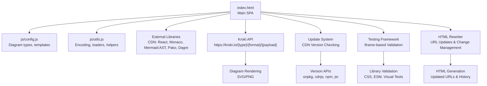
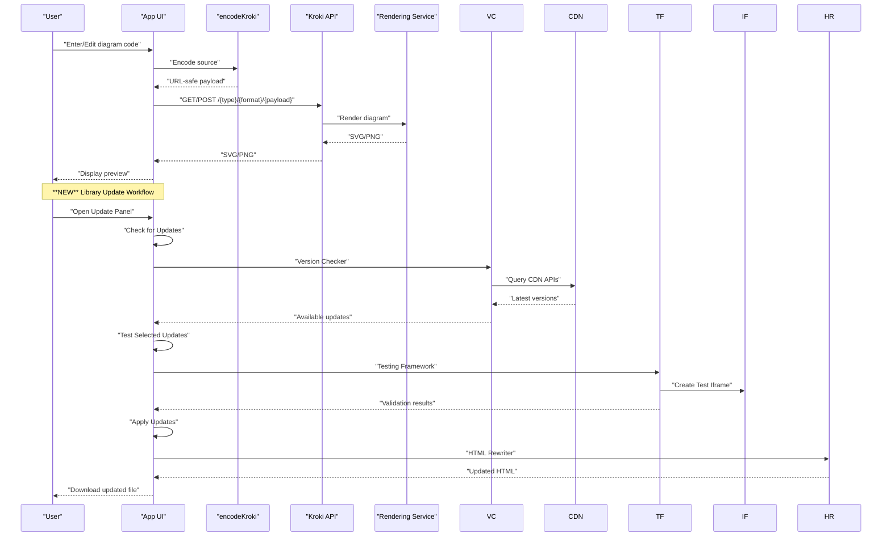
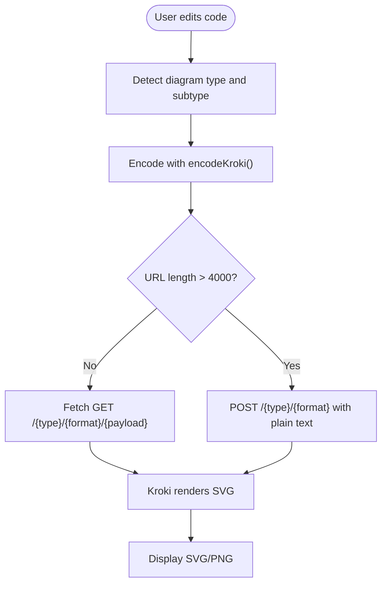
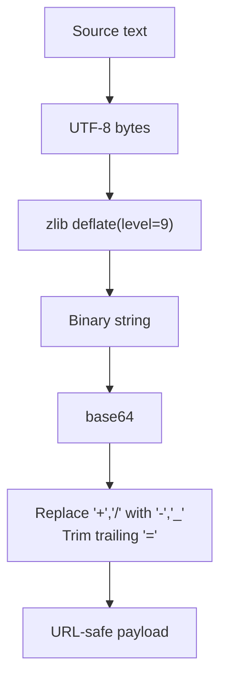
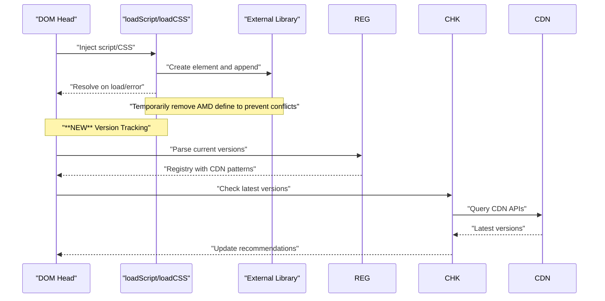
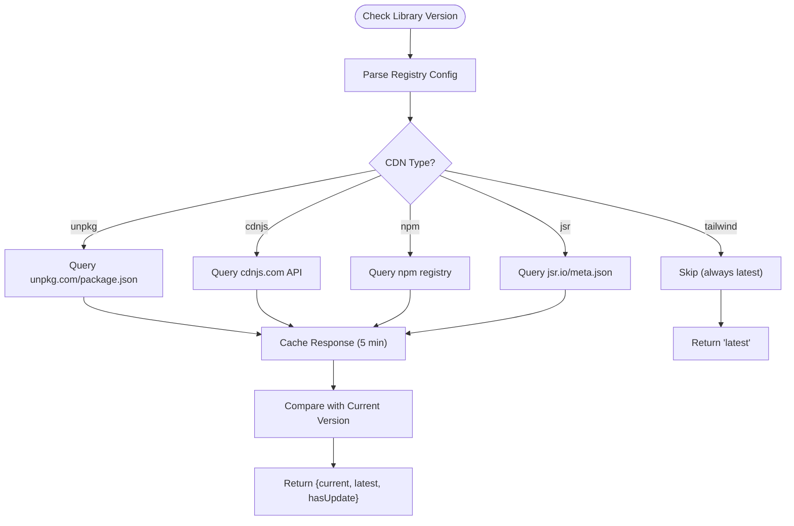
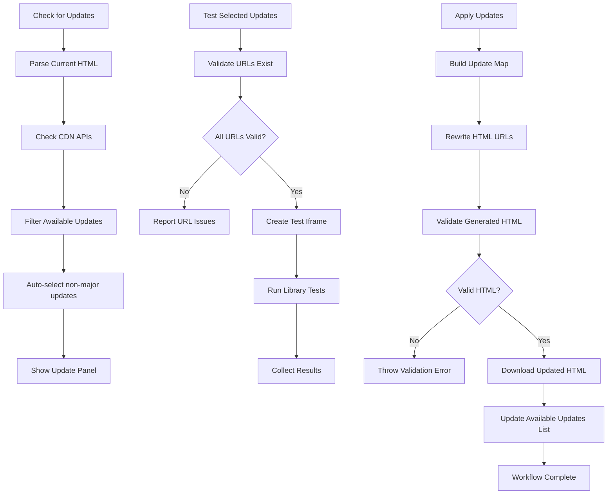
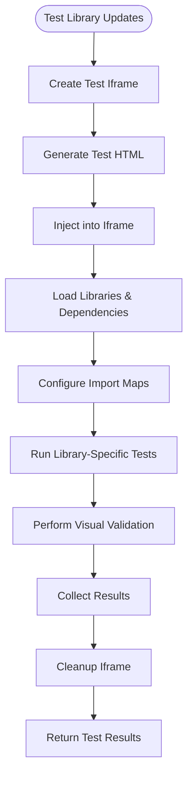
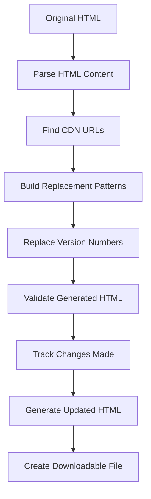
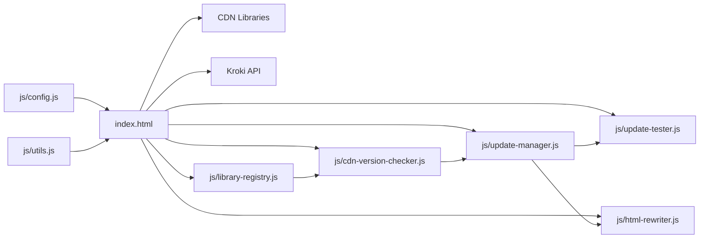

# Integration and API

<cite>
**Referenced Files in This Document**
- [index.html](file://index.html)
- [js/config.js](file://js/config.js)
- [js/utils.js](file://js/utils.js)
- [js/cdn-version-checker.js](file://js/cdn-version-checker.js)
- [js/update-manager.js](file://js/update-manager.js)
- [js/library-registry.js](file://js/library-registry.js)
- [js/update-tester.js](file://js/update-tester.js)
- [js/html-rewriter.js](file://js/html-rewriter.js)
</cite>

## Update Summary
**Changes Made**
- Added comprehensive documentation for the new CDN version checking system
- Documented the automated library update management capabilities
- Enhanced external library integration patterns with version tracking
- Added detailed coverage of the update workflow orchestration
- Included iframe-based testing framework for library validation
- Documented HTML rewriting and change management systems

## Table of Contents
1. [Introduction](#introduction)
2. [Project Structure](#project-structure)
3. [Core Components](#core-components)
4. [Architecture Overview](#architecture-overview)
5. [Detailed Component Analysis](#detailed-component-analysis)
6. [Dependency Analysis](#dependency-analysis)
7. [Performance Considerations](#performance-considerations)
8. [Troubleshooting Guide](#troubleshooting-guide)
9. [Conclusion](#conclusion)
10. [Appendices](#appendices)

## Introduction
This document explains the integration and API functionality for the Kroki Universal Diagram Generator. It covers:
- External rendering service usage via the Kroki API
- URL encoding and compression techniques using Pako for zlib compression and base64 URL-safe transformations
- Error handling strategies and diagnostic tools
- Performance optimization approaches
- External library integration patterns (CDN loading, version management, conflict resolution, lazy loading)
- **NEW**: Automated CDN version checking system with library update management
- **NEW**: Comprehensive iframe-based testing framework for validating library updates
- **NEW**: HTML rewriting and change management capabilities
- Practical examples for custom integrations, service configuration, and troubleshooting

## Project Structure
The application is a single-page web app that:
- Loads libraries via CDNs (React, Monaco Editor, Mermaid AST, Dagre, Pako)
- Defines diagram types and templates in configuration modules
- Implements utility functions for encoding and resource loading
- Renders diagrams by calling the Kroki API and displaying SVG/PNG outputs
- **NEW**: Manages external library versions through automated checking and updates
- **NEW**: Validates library updates through comprehensive testing framework
- **NEW**: Rewrites HTML with updated library URLs and maintains change history



**Diagram sources**
- [index.html](file://index.html#L1-L60)
- [js/config.js](file://js/config.js#L1-L116)
- [js/utils.js](file://js/utils.js#L1-L28)
- [js/cdn-version-checker.js](file://js/cdn-version-checker.js#L1-L270)
- [js/update-manager.js](file://js/update-manager.js#L1-L343)
- [js/update-tester.js](file://js/update-tester.js#L1-L505)
- [js/html-rewriter.js](file://js/html-rewriter.js#L1-L274)

**Section sources**
- [index.html](file://index.html#L1-L60)
- [js/config.js](file://js/config.js#L1-L116)
- [js/utils.js](file://js/utils.js#L1-L28)

## Core Components
- Diagram type registry and templates: centralized in configuration modules
- Encoding pipeline: text → UTF-8 bytes → zlib deflate → base64 → URL-safe transform
- External resource loader: dynamic script/CSS injection with AMD conflict handling
- Error diagnostics: parsing, categorization, and Monaco integration
- Preview generation: GET vs POST depending on payload size; SVG/PNG download
- **NEW**: CDN version checker: automated library version detection across multiple CDNs
- **NEW**: Update manager: orchestrates the complete library update workflow
- **NEW**: Testing framework: comprehensive validation of library updates in isolated environments
- **NEW**: HTML rewriter: safe modification of library URLs with validation and change tracking

Key implementation references:
- Encoding and compression: [encodeKroki](file://js/utils.js#L14-L28)
- Diagram types and templates: [DIAGRAM_TYPES](file://js/config.js#L6-L116)
- External loader helpers: [loadScript](file://js/utils.js#L116-L146), [loadCSS](file://js/utils.js#L152-L158)
- Error parsing and Monaco providers: [parseErrorInfo](file://index.html#L826-L877), [registerErrorProviders](file://index.html#L974-L1049)
- **NEW**: Version checking: [checkLibraryVersion](file://js/cdn-version-checker.js#L141-L182)
- **NEW**: Update management: [updateManager](file://js/update-manager.js#L23-L335)
- **NEW**: Testing framework: [testLibraryUpdates](file://js/update-tester.js#L398-L444)
- **NEW**: HTML rewriting: [updateLibraryUrls](file://js/html-rewriter.js#L66-L99)

**Section sources**
- [js/utils.js](file://js/utils.js#L14-L28)
- [js/config.js](file://js/config.js#L6-L116)
- [js/utils.js](file://js/utils.js#L116-L158)
- [index.html](file://index.html#L826-L877)
- [index.html](file://index.html#L974-L1049)
- [js/cdn-version-checker.js](file://js/cdn-version-checker.js#L141-L182)
- [js/update-manager.js](file://js/update-manager.js#L23-L335)
- [js/update-tester.js](file://js/update-tester.js#L398-L444)
- [js/html-rewriter.js](file://js/html-rewriter.js#L66-L99)

## Architecture Overview
The runtime integrates external services and libraries as follows:
- Libraries are loaded from CDNs; Monaco Editor and Mermaid AST are essential for editing and preview
- Diagram source code is encoded using zlib compression and base64 URL-safe encoding
- Rendering requests are sent to the Kroki API endpoint; GET is used when URL length is acceptable, otherwise POST is used
- Errors are parsed and surfaced to the UI with Monaco markers and explanations
- **NEW**: Version checking system queries multiple CDN APIs to detect available updates
- **NEW**: Update manager coordinates the complete workflow from detection to application
- **NEW**: Testing framework validates updates in isolated iframe environments
- **NEW**: HTML rewriter safely modifies library URLs and maintains change history



**Diagram sources**
- [js/utils.js](file://js/utils.js#L14-L28)
- [index.html](file://index.html#L1444-L1522)
- [js/cdn-version-checker.js](file://js/cdn-version-checker.js#L141-L182)
- [js/update-manager.js](file://js/update-manager.js#L63-L98)
- [js/update-tester.js](file://js/update-tester.js#L398-L444)
- [js/html-rewriter.js](file://js/html-rewriter.js#L66-L99)

**Section sources**
- [js/utils.js](file://js/utils.js#L14-L28)
- [index.html](file://index.html#L1444-L1522)
- [js/cdn-version-checker.js](file://js/cdn-version-checker.js#L141-L182)
- [js/update-manager.js](file://js/update-manager.js#L63-L98)
- [js/update-tester.js](file://js/update-tester.js#L398-L444)
- [js/html-rewriter.js](file://js/html-rewriter.js#L66-L99)

## Detailed Component Analysis

### Kroki API Integration
- Endpoint: https://kroki.io/{type}/{format}/{payload} for GET requests
- Fallback: POST to https://kroki.io/{type}/{format} with plain text body when URL exceeds limits
- Formats supported: svg (and implicitly png via conversion utilities)
- Diagram types: bpmn, mermaid, plantuml, excalidraw, c4plantuml, ditaa, blockdiag, bytefield, erd, graphviz, nomnoml, pikchr, structurizr, svgbob, vega, vegalite, wavedrom, wireviz



**Diagram sources**
- [index.html](file://index.html#L1444-L1522)
- [js/utils.js](file://js/utils.js#L14-L28)

**Section sources**
- [index.html](file://index.html#L1444-L1522)
- [js/utils.js](file://js/utils.js#L14-L28)

### URL Encoding and Compression (Pako + Base64 + URL-Safe)
The encoding pipeline ensures compact URLs and safe transmission:
- Convert text to UTF-8 bytes
- Compress with zlib deflate (level 9)
- Encode to base64
- Replace unsafe characters with URL-safe alternatives



**Diagram sources**
- [js/utils.js](file://js/utils.js#L14-L28)

**Section sources**
- [js/utils.js](file://js/utils.js#L14-L28)

### External Library Integration Patterns
- CDN loading: libraries are included via CDN links in the HTML head
- Version management: libraries are pinned to specific versions (e.g., React 18, Monaco 0.44.0, Pako 2.1.0)
- Conflict resolution: temporary removal of AMD define during script load to avoid conflicts
- Lazy loading: scripts and CSS are injected dynamically when needed (e.g., BPMN visual editor)
- **NEW**: Automated version tracking: central registry with CDN-specific URL patterns and version parsing
- **NEW**: Update coordination: synchronized version updates across related libraries (e.g., React + ReactDOM)



**Diagram sources**
- [js/utils.js](file://js/utils.js#L116-L146)
- [js/utils.js](file://js/utils.js#L152-L158)
- [index.html](file://index.html#L1190-L1272)
- [js/library-registry.js](file://js/library-registry.js#L15-L228)
- [js/cdn-version-checker.js](file://js/cdn-version-checker.js#L141-L182)

**Section sources**
- [js/utils.js](file://js/utils.js#L116-L146)
- [js/utils.js](file://js/utils.js#L152-L158)
- [index.html](file://index.html#L1190-L1272)
- [js/library-registry.js](file://js/library-registry.js#L15-L228)
- [js/cdn-version-checker.js](file://js/cdn-version-checker.js#L141-L182)

### CDN Version Checking System
**NEW**: The system automatically detects available updates for all CDN-hosted libraries:
- Multi-CDN support: unpkg.com, cdnjs.com, npm registry, jsr.io
- Intelligent caching: 5-minute TTL for API responses to minimize network calls
- Version comparison: semantic version comparison with major version detection
- Changelog integration: automatic links to library release notes
- Skip logic: certain libraries (like latest-tagged packages) are excluded from checking



**Diagram sources**
- [js/cdn-version-checker.js](file://js/cdn-version-checker.js#L141-L182)
- [js/cdn-version-checker.js](file://js/cdn-version-checker.js#L15-L134)

**Section sources**
- [js/cdn-version-checker.js](file://js/cdn-version-checker.js#L141-L182)
- [js/cdn-version-checker.js](file://js/cdn-version-checker.js#L15-L134)

### Library Update Management
**NEW**: Comprehensive update orchestration system:
- Update manager: central coordinator with state management and event notifications
- Update workflow: check → test → apply → download
- Selection management: automatic selection of non-major updates, manual override
- History tracking: persistent storage of update history with rollback capability
- Ignored updates: ability to suppress specific version notifications
- Integration with UI: real-time state updates and progress indicators



**Diagram sources**
- [js/update-manager.js](file://js/update-manager.js#L63-L197)
- [js/update-tester.js](file://js/update-tester.js#L398-L444)
- [js/html-rewriter.js](file://js/html-rewriter.js#L66-L99)

**Section sources**
- [js/update-manager.js](file://js/update-manager.js#L63-L197)
- [js/update-tester.js](file://js/update-tester.js#L398-L444)
- [js/html-rewriter.js](file://js/html-rewriter.js#L66-L99)

### Testing Framework
**NEW**: Comprehensive iframe-based testing system:
- Isolated environment: test updates in sandboxed iframe to prevent interference
- Multi-library support: handles complex dependencies and import maps
- Visual validation: renders actual components to verify functionality
- CSS validation: ensures all required stylesheets are loaded
- ESM module testing: validates modern JavaScript module imports
- Timeout handling: prevents hanging tests with configurable timeouts
- Error collection: comprehensive logging of test failures and warnings



**Diagram sources**
- [js/update-tester.js](file://js/update-tester.js#L398-L444)
- [js/update-tester.js](file://js/update-tester.js#L19-L362)

**Section sources**
- [js/update-tester.js](file://js/update-tester.js#L398-L444)
- [js/update-tester.js](file://js/update-tester.js#L19-L362)

### HTML Rewriting and Change Management
**NEW**: Safe HTML modification system:
- URL pattern matching: intelligent regex patterns for different CDN types
- Version replacement: precise URL updates without affecting other content
- Change tracking: detailed logs of all modifications made
- Validation: ensures generated HTML is well-formed and complete
- Download generation: creates downloadable updated HTML files
- Backup preservation: maintains original HTML structure and comments



**Diagram sources**
- [js/html-rewriter.js](file://js/html-rewriter.js#L66-L99)
- [js/html-rewriter.js](file://js/html-rewriter.js#L104-L140)

**Section sources**
- [js/html-rewriter.js](file://js/html-rewriter.js#L66-L99)
- [js/html-rewriter.js](file://js/html-rewriter.js#L104-L140)

### Error Handling Strategies and Diagnostics
- Error parsing: extracts line/column and categorizes common issues (missing brackets, missing PlantUML delimiters, unknown diagram types)
- Monaco integration: registers code action provider and hover provider to offer quick fixes and explanations
- UI feedback: displays error messages, highlights markers, and provides navigation to the problematic line
- **NEW**: Update error handling: comprehensive error reporting for version checking, testing, and HTML rewriting failures

```mermaid
flowchart TD
A["Rendering error response"] --> B["parseErrorInfo()"]
B --> C["Extract line/column and code"]
C --> D["Set Monaco markers"]
D --> E["Show error UI and optional quick-fix"]
Note over A,E : "**NEW** Update Error Handling"
A2["Update failure"] --> B2["Catch and Log Error"]
B2 --> C2["Show User-Friendly Message"]
C2 --> D2["Provide Retry Option"]
D2 --> E2["Offer Alternative Actions"]
```

**Diagram sources**
- [index.html](file://index.html#L826-L877)
- [index.html](file://index.html#L974-L1049)
- [js/update-manager.js](file://js/update-manager.js#L93-L97)

**Section sources**
- [index.html](file://index.html#L826-L877)
- [index.html](file://index.html#L974-L1049)
- [js/update-manager.js](file://js/update-manager.js#L93-L97)

### Service Integration Points, Error Propagation, and Fallbacks
- Integration points:
  - GET endpoint for compact payloads
  - POST endpoint for large payloads
  - SVG rendering via Kroki
  - **NEW**: CDN APIs for version checking (unpkg, cdnjs, npm, jsr)
  - **NEW**: HTML rewriting service for safe URL updates
- Error propagation:
  - HTTP errors are captured and displayed
  - Parsing errors are mapped to structured diagnostics
  - **NEW**: Update workflow errors are handled gracefully with user feedback
- Fallbacks:
  - Switch from GET to POST when URL length exceeds threshold
  - Graceful degradation with error UI and Monaco markers
  - **NEW**: Version checking failures fall back to cached results or manual updates

**Section sources**
- [index.html](file://index.html#L1473-L1518)
- [js/cdn-version-checker.js](file://js/cdn-version-checker.js#L22-L41)
- [js/update-manager.js](file://js/update-manager.js#L93-L97)

### Practical Examples and Custom Integrations
- Custom diagram type registration:
  - Extend the diagram type registry with new keys, labels, extensions, and documentation links
  - Reference: [DIAGRAM_TYPES](file://js/config.js#L6-L116)
- Custom encoding pipeline:
  - Adjust compression level or pre-processing steps before calling the encoder
  - Reference: [encodeKroki](file://js/utils.js#L14-L28)
- External library integration:
  - Add new CDN-hosted libraries by extending the head and using the loader helpers
  - Reference: [loadScript](file://js/utils.js#L116-L146), [loadCSS](file://js/utils.js#L152-L158)
- Template gallery:
  - Add new templates to the appropriate template arrays
  - Reference: [PLANTUML_TEMPLATES](file://js/config.js#L194-L565), [MERMAID_TEMPLATES](file://index.html#L203-L371)
- **NEW**: Library update integration:
  - Add new libraries to the registry with proper CDN configuration
  - Reference: [LIBRARY_REGISTRY](file://js/library-registry.js#L15-L228)
- **NEW**: Custom testing scenarios:
  - Extend the testing framework with new library-specific validation logic
  - Reference: [testLibraryUpdates](file://js/update-tester.js#L398-L444)

**Section sources**
- [js/config.js](file://js/config.js#L6-L116)
- [js/utils.js](file://js/utils.js#L14-L28)
- [js/utils.js](file://js/utils.js#L116-L158)
- [js/config.js](file://js/config.js#L194-L565)
- [index.html](file://index.html#L203-L371)
- [js/library-registry.js](file://js/library-registry.js#L15-L228)
- [js/update-tester.js](file://js/update-tester.js#L398-L444)

## Dependency Analysis
- Internal dependencies:
  - Configuration module defines diagram types and templates
  - Utilities module provides encoding and resource loading helpers
  - **NEW**: Library registry centralizes CDN configuration and version tracking
  - **NEW**: Update manager coordinates the complete update workflow
  - **NEW**: Testing framework provides comprehensive validation capabilities
  - **NEW**: HTML rewriter handles safe URL modifications
- External dependencies:
  - React and ReactDOM for UI framework
  - Monaco Editor for code editing and diagnostics
  - Mermaid AST for parsing and rendering Mermaid diagrams
  - Pako for zlib compression
  - Dagre for layout
  - CDN-hosted libraries for icons, UI, and diagrams
  - **NEW**: CDN APIs for version checking (unpkg, cdnjs, npm, jsr)
  - **NEW**: Testing infrastructure for iframe-based validation



**Diagram sources**
- [js/config.js](file://js/config.js#L1-L116)
- [js/utils.js](file://js/utils.js#L1-L28)
- [index.html](file://index.html#L1-L60)
- [js/library-registry.js](file://js/library-registry.js#L1-L409)
- [js/cdn-version-checker.js](file://js/cdn-version-checker.js#L1-L270)
- [js/update-manager.js](file://js/update-manager.js#L1-L343)
- [js/update-tester.js](file://js/update-tester.js#L1-L505)
- [js/html-rewriter.js](file://js/html-rewriter.js#L1-L274)

**Section sources**
- [js/config.js](file://js/config.js#L1-L116)
- [js/utils.js](file://js/utils.js#L1-L28)
- [index.html](file://index.html#L1-L60)
- [js/library-registry.js](file://js/library-registry.js#L1-L409)
- [js/cdn-version-checker.js](file://js/cdn-version-checker.js#L1-L270)
- [js/update-manager.js](file://js/update-manager.js#L1-L343)
- [js/update-tester.js](file://js/update-tester.js#L1-L505)
- [js/html-rewriter.js](file://js/html-rewriter.js#L1-L274)

## Performance Considerations
- Payload size:
  - Prefer GET when payload fits under the URL length limit; otherwise use POST
  - Reference: [preview generation](file://index.html#L1473-L1518)
- Debouncing:
  - Debounce rendering to reduce network requests during rapid edits
  - Reference: [Mermaid sync controller](file://js/utils.js#L1126-L1187)
- Compression:
  - Use highest compression level for smaller payloads
  - Reference: [encodeKroki](file://js/utils.js#L18)
- Lazy loading:
  - Dynamically load heavy libraries only when needed
  - Reference: [loadScript](file://js/utils.js#L116-L146), [BPMN visual editor](file://index.html#L1190-L1272)
- **NEW**: Version checking optimization:
  - 5-minute cache TTL reduces API calls
  - Parallel processing of multiple library updates
  - Intelligent filtering of libraries that don't need checking
- **NEW**: Testing efficiency:
  - Shared iframe for multiple test runs
  - Timeout handling prevents long-running tests
  - Selective testing of only selected libraries

[No sources needed since this section provides general guidance]

## Troubleshooting Guide
Common issues and resolutions:
- Missing @startuml/@enduml in PlantUML:
  - Use quick fixes to add delimiters automatically
  - References: [getFixSuggestions](file://index.html#L880-L922), [ERROR_EXPLANATIONS](file://index.html#L925-L966)
- Missing closing brackets or parentheses:
  - Apply suggested quick fixes or hover for explanations
  - References: [parseErrorInfo](file://index.html#L826-L877), [registerErrorProviders](file://index.html#L974-L1049)
- Unknown diagram type:
  - Ensure a valid diagram declaration is present
  - Reference: [parseErrorInfo](file://index.html#L826-L877)
- Large payload causing URL length issues:
  - The app automatically switches to POST; verify server supports POST to the rendering endpoint
  - Reference: [preview generation](file://index.html#L1473-L1518)
- **NEW**: Library update failures:
  - Check CDN connectivity and API availability
  - Verify that the testing framework can access required resources
  - Review error messages in the update panel for specific failure reasons
- **NEW**: HTML rewrite issues:
  - Ensure the generated HTML passes validation checks
  - Check that all required CSS and JavaScript files are accessible
  - Verify that the download process completes successfully

**Section sources**
- [index.html](file://index.html#L880-L922)
- [index.html](file://index.html#L925-L966)
- [index.html](file://index.html#L826-L877)
- [index.html](file://index.html#L974-L1049)
- [index.html](file://index.html#L1473-L1518)
- [js/update-manager.js](file://js/update-manager.js#L93-L97)

## Conclusion
The application integrates external rendering and libraries seamlessly:
- Kroki API is used for diagram rendering with robust fallbacks and diagnostics
- Compression and URL-safe encoding optimize transport efficiency
- External libraries are managed via CDNs with conflict-aware loading
- Error handling and Monaco integration provide strong developer experience
- **NEW**: Automated CDN version checking system keeps dependencies current
- **NEW**: Comprehensive testing framework validates updates before application
- **NEW**: Safe HTML rewriting system manages library URL updates with change tracking
Adhering to the patterns documented here enables reliable custom integrations and maintainable enhancements.

[No sources needed since this section summarizes without analyzing specific files]

## Appendices

### Security Considerations
- Transport security: ensure HTTPS endpoints for all external libraries and the Kroki API
- Input sanitization: treat diagram source as untrusted; rely on Kroki's renderer for safety
- CSP: configure Content Security Policy to allow only trusted CDNs and APIs
- **NEW**: Update security: validate all library updates in isolated iframe environments
- **NEW**: HTML validation: ensure generated HTML maintains proper structure and security

[No sources needed since this section provides general guidance]

### Rate Limiting and Monitoring
- Rate limiting: apply client-side throttling (debounce) and consider server-side limits on the rendering endpoint
- Monitoring: log rendering failures, payload sizes, and rendering latency; surface errors to the UI with actionable diagnostics
- **NEW**: Version checking monitoring: track API response times and error rates for CDN services
- **NEW**: Update workflow monitoring: log test results, validation outcomes, and user actions

[No sources needed since this section provides general guidance]

### Update System Integration
**NEW**: The update system integrates seamlessly with the main application:
- UI integration: accessible through the header toolbar button
- Real-time state management: reactive updates to the update panel
- Persistent storage: maintains update preferences and history across sessions
- Error handling: graceful degradation when update services are unavailable

**Section sources**
- [index.html](file://index.html#L2807-L2813)
- [js/update-manager.js](file://js/update-manager.js#L35-L45)
- [js/update-manager.js](file://js/update-manager.js#L283-L315)