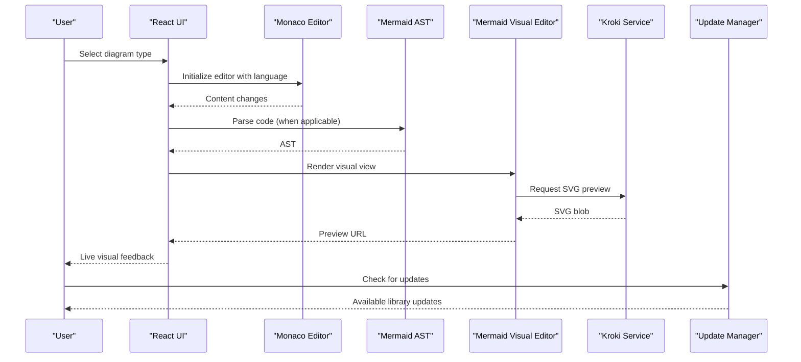
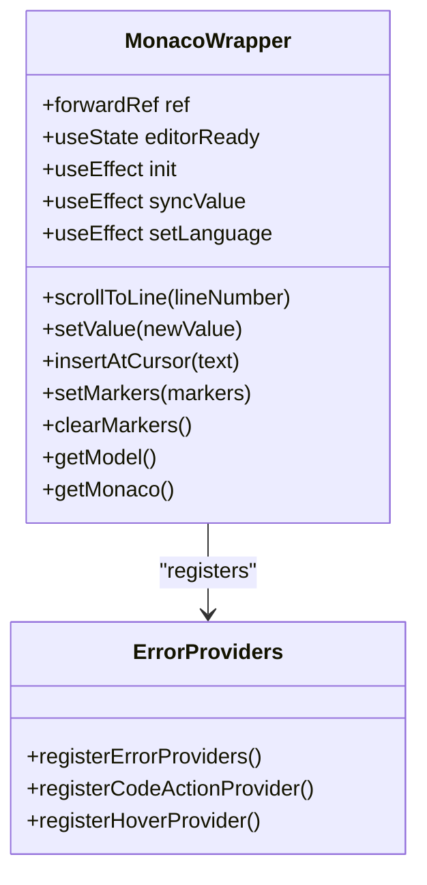
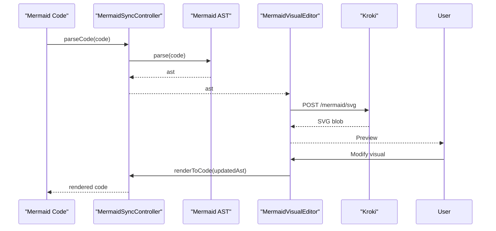
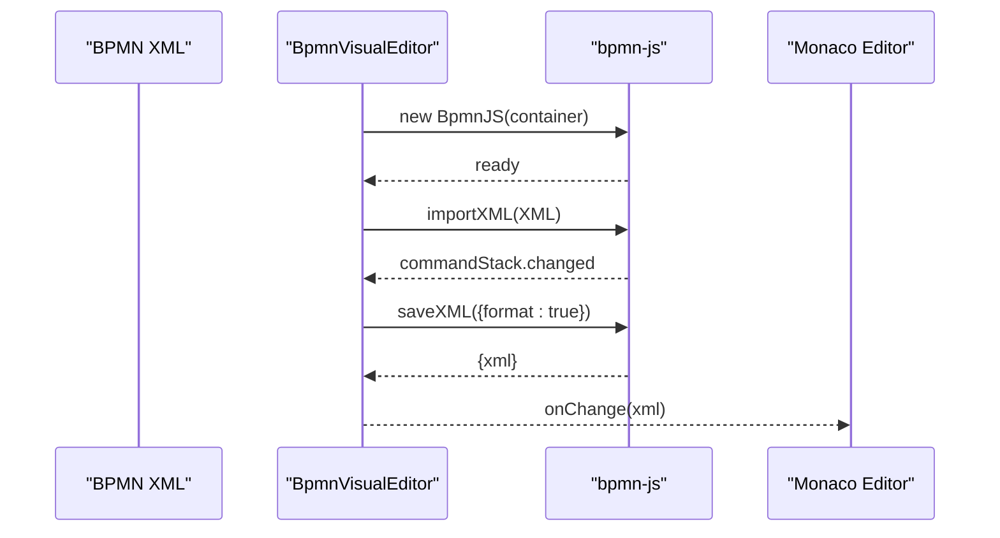
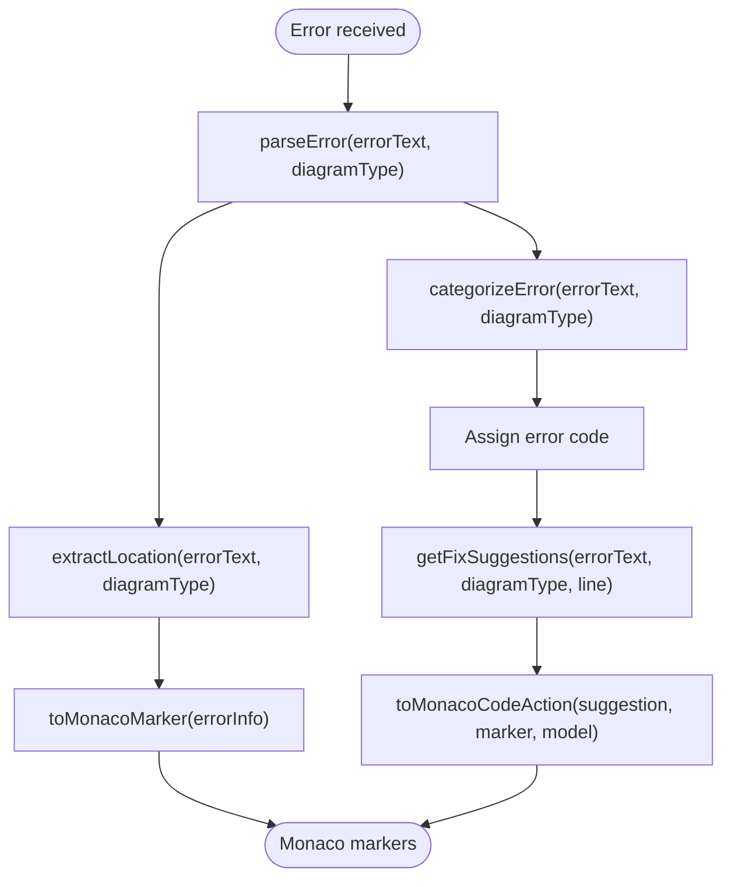
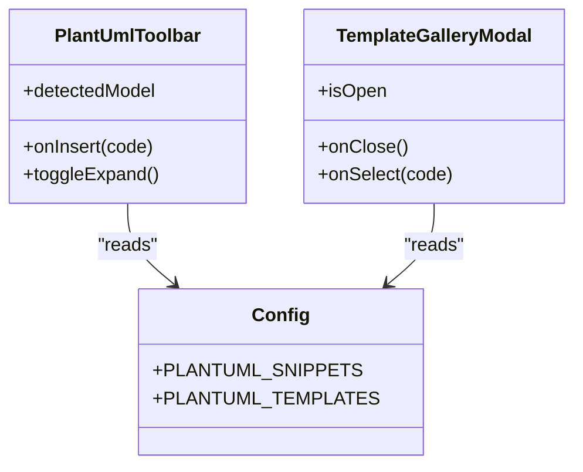
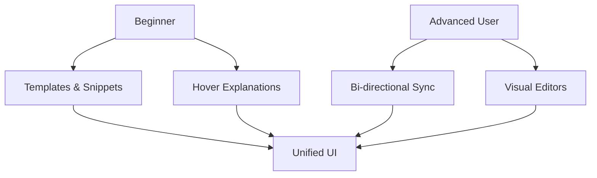
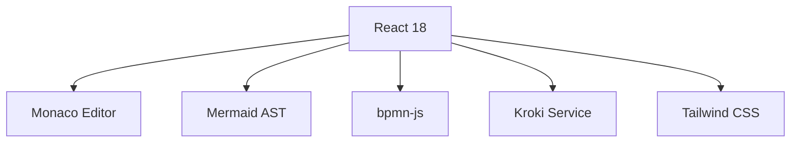

# Project Overview

<cite>
**Referenced Files in This Document**
- [index.html](file://index.html)
- [js/config.js](file://js/config.js)
- [js/utils.js](file://js/utils.js)
- [js/react-helpers.js](file://js/react-helpers.js)
- [js/components/MonacoWrapper.js](file://js/components/MonacoWrapper.js)
- [js/components/PlantUmlComponents.js](file://js/components/PlantUmlComponents.js)
- [js/components/ui.js](file://js/components/ui.js)
- [js/editors/mermaid/index.js](file://js/editors/mermaid/index.js)
- [js/editors/mermaid/MermaidSyncController.js](file://js/editors/mermaid/MermaidSyncController.js)
- [js/editors/bpmn/BpmnVisualEditor.js](file://js/editors/bpmn/BpmnVisualEditor.js)
- [js/error-diagnostics/index.js](file://js/error-diagnostics/index.js)
- [js/error-diagnostics/explanations.js](file://js/error-diagnostics/explanations.js)
- [js/error-diagnostics/fixes.js](file://js/error-diagnostics/fixes.js)
</cite>

## Table of Contents
1. [Introduction](#introduction)
2. [Project Structure](#project-structure)
3. [Core Components](#core-components)
4. [Architecture Overview](#architecture-overview)
5. [Detailed Component Analysis](#detailed-component-analysis)
6. [Dependency Analysis](#dependency-analysis)
7. [Performance Considerations](#performance-considerations)
8. [Troubleshooting Guide](#troubleshooting-guide)
9. [Conclusion](#conclusion)

## Introduction
Universal Diagram Generator is a web-based, unified diagramming tool that supports 20+ diagram formats through a single interface. It combines React for UI composition, Monaco Editor for code editing, and external rendering services (via Kroki) to deliver a dual-mode editing experience: code-first and visual-preview. The platform emphasizes intelligent error detection, a robust template system, and flexible export capabilities, targeting both beginners who want simple diagram creation and advanced users who require complex visual modeling.

Key benefits:
- Dual-mode editing: write code or manipulate visuals, with bidirectional synchronization for Mermaid.
- Intelligent error detection: real-time parsing, structured error extraction, and actionable quick fixes.
- Template system: curated snippets and templates for PlantUML and Mermaid to accelerate creation.
- Export-ready previews: live SVG rendering via Kroki for instant visual feedback.

Supported diagram families include BPMN, Mermaid (flowcharts, sequences, class/state/ER charts, Gantt, pie, timelines, journeys, mindmaps, git graphs, quadrants), PlantUML and C4 PlantUML (UML diagrams, ERDs, component diagrams, deployment diagrams, WBS), GraphViz, Excalidraw, Structurizr, Vega/Vega-Lite, ERD, and more.

Technology stack highlights:
- React 18 with a lightweight helper for JSX-like syntax.
- Monaco Editor with custom language support for PlantUML and Mermaid.
- External rendering via Kroki for Mermaid and other formats.
- bpmn-js for BPMN visual editing.
- Tailwind CSS for responsive UI.
- Mermaid AST for Mermaid code ↔ AST synchronization.

## Project Structure
The project is organized into modular JavaScript modules under js/, with HTML and CSS at the root. The structure separates concerns across configuration, UI components, editors, diagnostics, and utilities.

```mermaid
graph TB
Root["index.html<br/>Entry point and global libraries"]
Config["js/config.js<br/>Diagram types, snippets, templates"]
Utils["js/utils.js<br/>Encoding, detection, loaders"]
ReactHelpers["js/react-helpers.js<br/>JSX-like bindings"]
Monaco["js/components/MonacoWrapper.js<br/>Monaco editor wrapper"]
PlantUml["js/components/PlantUmlComponents.js<br/>PlantUML UI (toolbar, templates)"]
UI["js/components/ui.js<br/>Shared UI components"]
MermaidIndex["js/editors/mermaid/index.js<br/>Mermaid router"]
MermaidSync["js/editors/mermaid/MermaidSyncController.js<br/>AST sync controller"]
BpmnEditor["js/editors/bpmn/BpmnVisualEditor.js<br/>BPMN visual editor"]
Diagnostics["js/error-diagnostics/index.js<br/>Error parsing and markers"]
Explanations["js/error-diagnostics/explanations.js<br/>Error explanations"]
Fixes["js/error-diagnostics/fixes.js<br/>Quick fixes"]
Root --> Config
Root --> Utils
Root --> ReactHelpers
Root --> Monaco
Root --> PlantUml
Root --> UI
Root --> MermaidIndex
Root --> MermaidSync
Root --> BpmnEditor
Root --> Diagnostics
Root --> Explanations
Root --> Fixes
```

**Diagram sources**
- [index.html](file://index.html#L1-L120)
- [js/config.js](file://js/config.js#L1-L120)
- [js/utils.js](file://js/utils.js#L1-L60)
- [js/react-helpers.js](file://js/react-helpers.js#L1-L39)
- [js/components/MonacoWrapper.js](file://js/components/MonacoWrapper.js#L1-L60)
- [js/components/PlantUmlComponents.js](file://js/components/PlantUmlComponents.js#L1-L60)
- [js/components/ui.js](file://js/components/ui.js#L1-L60)
- [js/editors/mermaid/index.js](file://js/editors/mermaid/index.js#L1-L40)
- [js/editors/mermaid/MermaidSyncController.js](file://js/editors/mermaid/MermaidSyncController.js#L1-L40)
- [js/editors/bpmn/BpmnVisualEditor.js](file://js/editors/bpmn/BpmnVisualEditor.js#L1-L40)
- [js/error-diagnostics/index.js](file://js/error-diagnostics/index.js#L1-L40)
- [js/error-diagnostics/explanations.js](file://js/error-diagnostics/explanations.js#L1-L40)
- [js/error-diagnostics/fixes.js](file://js/error-diagnostics/fixes.js#L1-L40)

**Section sources**
- [index.html](file://index.html#L1-L120)
- [js/config.js](file://js/config.js#L1-L120)

## Core Components
- Diagram configuration and catalog: centralized definitions of supported diagram types, file extensions, Monaco language mappings, and documentation links.
- Monaco Editor wrapper: integrates Monaco with custom PlantUML and Mermaid language support, registers error providers, and exposes imperative editor methods.
- Mermaid visual editor: routes to specialized editors based on AST type and renders previews via Kroki.
- BPMN visual editor: integrates bpmn-js for visual BPMN editing with XML sync.
- Error diagnostics: parses raw errors, extracts structured information, categorizes error codes, and generates Monaco markers and quick fixes.
- Library Update Management System: automated dependency version tracking, iframe-based safe testing, and one-click updates for CDN libraries.
- UI components: reusable buttons, badges, loaders, empty states, and inline editable fields.
- Utilities: encoding for Kroki URLs, type detection from filenames and code content, script/CSS loaders, and debouncing.

**Section sources**
- [js/config.js](file://js/config.js#L1-L120)
- [js/components/MonacoWrapper.js](file://js/components/MonacoWrapper.js#L1-L120)
- [js/editors/mermaid/index.js](file://js/editors/mermaid/index.js#L1-L60)
- [js/editors/bpmn/BpmnVisualEditor.js](file://js/editors/bpmn/BpmnVisualEditor.js#L1-L60)
- [js/error-diagnostics/index.js](file://js/error-diagnostics/index.js#L1-L60)
- [js/components/ui.js](file://js/components/ui.js#L1-L60)
- [js/utils.js](file://js/utils.js#L1-L60)

## Architecture Overview
The application is a single-page React app that dynamically loads external libraries and services. The core flow:
- Users select a diagram type and open the editor.
- The Monaco editor provides syntax highlighting and error diagnostics.
- For Mermaid, an AST sync controller enables bidirectional editing between code and visual views.
- For BPMN, the visual editor integrates with bpmn-js and syncs XML to code.
- Rendering is delegated to external services (e.g., Kroki) for Mermaid and other formats.

**Diagram sources**
- [js/components/MonacoWrapper.js](file://js/components/MonacoWrapper.js#L90-L170)
- [js/editors/mermaid/index.js](file://js/editors/mermaid/index.js#L20-L70)
- [js/editors/mermaid/MermaidSyncController.js](file://js/editors/mermaid/MermaidSyncController.js#L9-L40)
- [index.html](file://index.html#L34-L80)

## Detailed Component Analysis

### Monaco Editor Integration
MonacoWrapper encapsulates the Monaco editor lifecycle, registers PlantUML and Mermaid languages with Monarch tokenizers, and wires up error providers for quick fixes and hover explanations. It exposes imperative methods to scroll to errors, insert text at the cursor, and manage markers.

**Diagram sources**
- [js/components/MonacoWrapper.js](file://js/components/MonacoWrapper.js#L13-L169)
- [js/components/MonacoWrapper.js](file://js/components/MonacoWrapper.js#L309-L423)

**Section sources**
- [js/components/MonacoWrapper.js](file://js/components/MonacoWrapper.js#L1-L170)

### Mermaid Visual Editor and AST Sync
The Mermaid editor routes to specialized editors based on AST type and renders previews via Kroki. The sync controller manages bi-directional synchronization, prevents infinite loops, and detects diagram types from code.

**Diagram sources**
- [js/editors/mermaid/index.js](file://js/editors/mermaid/index.js#L20-L121)
- [js/editors/mermaid/MermaidSyncController.js](file://js/editors/mermaid/MermaidSyncController.js#L9-L92)

**Section sources**
- [js/editors/mermaid/index.js](file://js/editors/mermaid/index.js#L1-L137)
- [js/editors/mermaid/MermaidSyncController.js](file://js/editors/mermaid/MermaidSyncController.js#L1-L93)

### BPMN Visual Editor
The BPMN editor integrates bpmn-js, loads required CSS and scripts, and synchronizes XML changes back to the code editor. It handles initial import and external updates safely.

**Diagram sources**
- [js/editors/bpmn/BpmnVisualEditor.js](file://js/editors/bpmn/BpmnVisualEditor.js#L14-L90)

**Section sources**
- [js/editors/bpmn/BpmnVisualEditor.js](file://js/editors/bpmn/BpmnVisualEditor.js#L1-L106)

### Error Diagnostics Pipeline
The error diagnostics module parses raw error messages, extracts line/column information, categorizes errors, and produces Monaco markers and quick fixes. It also formats human-readable explanations for hover tooltips.

**Diagram sources**
- [js/error-diagnostics/index.js](file://js/error-diagnostics/index.js#L13-L44)
- [js/error-diagnostics/index.js](file://js/error-diagnostics/index.js#L52-L145)
- [js/error-diagnostics/index.js](file://js/error-diagnostics/index.js#L153-L254)
- [js/error-diagnostics/index.js](file://js/error-diagnostics/index.js#L261-L276)
- [js/error-diagnostics/index.js](file://js/error-diagnostics/index.js#L285-L298)

**Section sources**
- [js/error-diagnostics/index.js](file://js/error-diagnostics/index.js#L1-L303)
- [js/error-diagnostics/explanations.js](file://js/error-diagnostics/explanations.js#L1-L302)
- [js/error-diagnostics/fixes.js](file://js/error-diagnostics/fixes.js#L1-L403)

### PlantUML Template Gallery and Snippets
The PlantUML UI provides a toolbar of contextual snippets and a modal gallery of templates to help users jumpstart diagrams. It detects the diagram model from code and adapts the snippet set accordingly.

**Diagram sources**
- [js/components/PlantUmlComponents.js](file://js/components/PlantUmlComponents.js#L8-L47)
- [js/components/PlantUmlComponents.js](file://js/components/PlantUmlComponents.js#L52-L95)
- [js/config.js](file://js/config.js#L118-L192)
- [js/config.js](file://js/config.js#L194-L565)

**Section sources**
- [js/components/PlantUmlComponents.js](file://js/components/PlantUmlComponents.js#L1-L249)
- [js/config.js](file://js/config.js#L118-L565)

### Conceptual Overview
The application’s design balances simplicity and power:
- Beginners benefit from templates, contextual snippets, and hover explanations.
- Advanced users leverage dual-mode editing, precise error markers, and visual editors for complex models.

[No sources needed since this diagram shows conceptual workflow, not actual code structure]

[No sources needed since this section doesn't analyze specific source files]

## Dependency Analysis
External dependencies and integration points:
- React 18 and JSX-like syntax via htm.
- Monaco Editor with custom language registrations and error providers.
- Mermaid AST for parsing and rendering Mermaid code.
- bpmn-js for BPMN visual editing.
- Kroki service for rendering Mermaid and other formats.
- Tailwind CSS for styling.

**Diagram sources**
- [index.html](file://index.html#L8-L45)
- [js/components/MonacoWrapper.js](file://js/components/MonacoWrapper.js#L100-L148)
- [js/editors/bpmn/BpmnVisualEditor.js](file://js/editors/bpmn/BpmnVisualEditor.js#L26-L38)
- [js/editors/mermaid/index.js](file://js/editors/mermaid/index.js#L34-L49)

**Section sources**
- [index.html](file://index.html#L8-L45)
- [js/utils.js](file://js/utils.js#L116-L146)

## Performance Considerations
- Debounce Mermaid parsing to reduce re-renders during rapid typing.
- Revoke object URLs for previews to prevent memory leaks.
- Lazy-load external libraries (bpmn-js, Mermaid AST) to minimize initial bundle size.
- Use minimaps and folding judiciously to balance usability and performance.
- Batch Monaco editor updates and clear decorations after navigation to keep UI responsive.

[No sources needed since this section provides general guidance]

## Troubleshooting Guide
Common issues and resolutions:
- Missing @startuml/@enduml in PlantUML: Quick fix adds the missing directive; hover explanation provides examples.
- Unclosed brackets/parentheses: Quick fix inserts the missing delimiter; hover explains correct syntax.
- Unknown diagram type in Mermaid: Quick fix suggests adding a diagram declaration; hover explains valid diagram types.
- XML parsing errors in BPMN: Hover explanation guides fixing unclosed tags and quoting attributes.
- Missing Mermaid AST: The Mermaid editor shows a loading state until AST is available.

**Section sources**
- [js/error-diagnostics/fixes.js](file://js/error-diagnostics/fixes.js#L11-L110)
- [js/error-diagnostics/fixes.js](file://js/error-diagnostics/fixes.js#L111-L176)
- [js/error-diagnostics/fixes.js](file://js/error-diagnostics/fixes.js#L178-L238)
- [js/error-diagnostics/fixes.js](file://js/error-diagnostics/fixes.js#L240-L278)
- [js/error-diagnostics/explanations.js](file://js/error-diagnostics/explanations.js#L89-L131)
- [js/error-diagnostics/explanations.js](file://js/error-diagnostics/explanations.js#L133-L166)
- [js/error-diagnostics/explanations.js](file://js/error-diagnostics/explanations.js#L168-L192)
- [js/error-diagnostics/explanations.js](file://js/error-diagnostics/explanations.js#L237-L271)
- [js/editors/mermaid/index.js](file://js/editors/mermaid/index.js#L62-L72)

## Conclusion
Universal Diagram Generator delivers a cohesive, web-native diagramming experience by unifying diverse diagram formats behind a single interface. Its architecture blends React, Monaco Editor, and external rendering services to offer dual-mode editing, intelligent diagnostics, and a rich template ecosystem. Whether you are a beginner seeking quick templates or an advanced user crafting complex visual models, the platform provides the tools to create, iterate, and export diagrams efficiently.