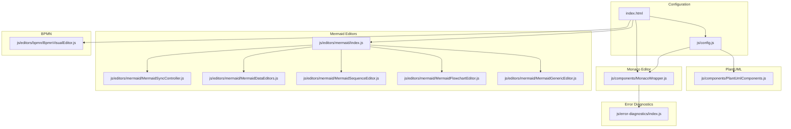
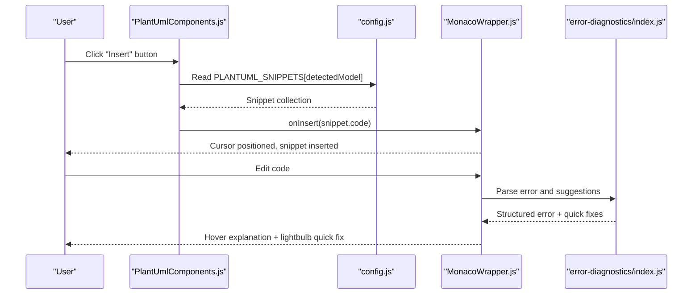
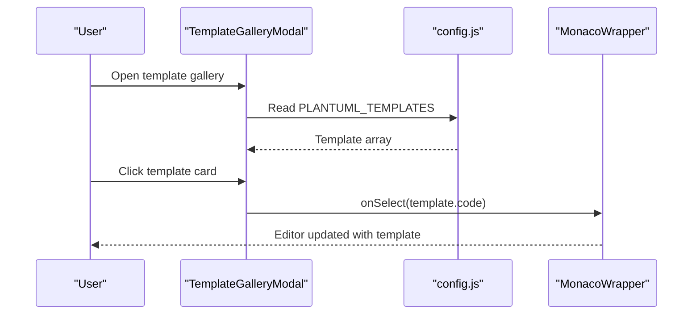
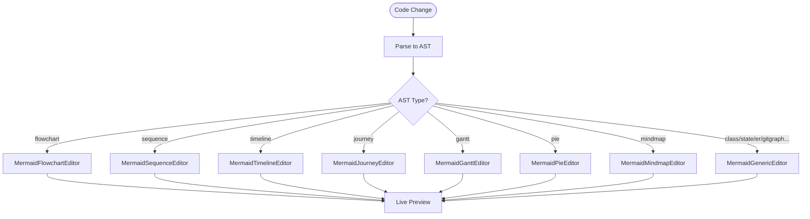
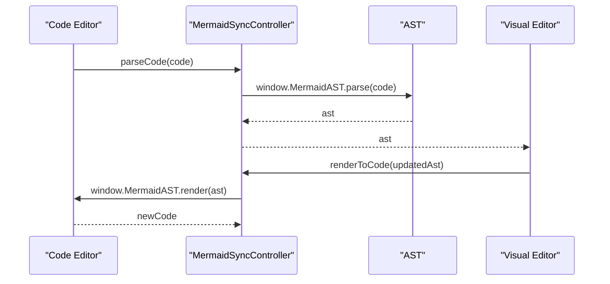
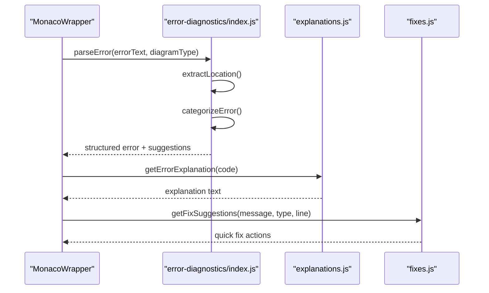
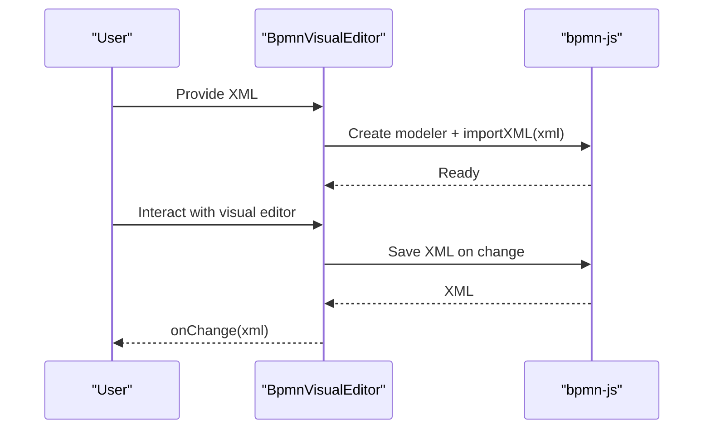
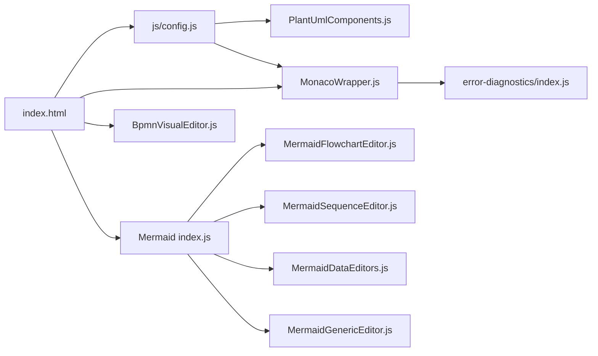

# Template System and Snippets

<cite>
**Referenced Files in This Document**
- [index.html](file://index.html)
- [js/config.js](file://js/config.js)
- [js/utils.js](file://js/utils.js)
- [js/components/PlantUmlComponents.js](file://js/components/PlantUmlComponents.js)
- [js/components/MonacoWrapper.js](file://js/components/MonacoWrapper.js)
- [js/editors/mermaid/index.js](file://js/editors/mermaid/index.js)
- [js/editors/mermaid/MermaidGenericEditor.js](file://js/editors/mermaid/MermaidGenericEditor.js)
- [js/editors/mermaid/MermaidFlowchartEditor.js](file://js/editors/mermaid/MermaidFlowchartEditor.js)
- [js/editors/mermaid/MermaidSequenceEditor.js](file://js/editors/mermaid/MermaidSequenceEditor.js)
- [js/editors/mermaid/MermaidDataEditors.js](file://js/editors/mermaid/MermaidDataEditors.js)
- [js/editors/mermaid/MermaidSyncController.js](file://js/editors/mermaid/MermaidSyncController.js)
- [js/editors/bpmn/BpmnVisualEditor.js](file://js/editors/bpmn/BpmnVisualEditor.js)
- [js/error-diagnostics/index.js](file://js/error-diagnostics/index.js)
</cite>

## Table of Contents
1. [Introduction](#introduction)
2. [Project Structure](#project-structure)
3. [Core Components](#core-components)
4. [Architecture Overview](#architecture-overview)
5. [Detailed Component Analysis](#detailed-component-analysis)
6. [Dependency Analysis](#dependency-analysis)
7. [Performance Considerations](#performance-considerations)
8. [Troubleshooting Guide](#troubleshooting-guide)
9. [Conclusion](#conclusion)

## Introduction
This document explains the template system and snippet functionality for diagram creation. It covers:
- The template gallery for PlantUML with categorized templates and selection workflow
- The snippet system for rapid insertion of diagram elements across PlantUML and Mermaid
- How templates and snippets integrate with editors and the Monaco-based code editor
- Practical workflows for inserting templates/snippets, customizing diagrams, and resolving errors

## Project Structure
The application is a single-page React application with embedded JSX. Key areas related to templates and snippets:
- Configuration and constants (templates, snippets, diagram types) are defined centrally
- Editor components provide visual and code editing experiences
- Monaco integration adds syntax highlighting, diagnostics, and quick fixes
- Error diagnostics module parses and explains errors with actionable suggestions

**Diagram sources**
- [js/config.js](file://js/config.js#L1-L566)
- [index.html](file://index.html#L62-L371)
- [js/components/PlantUmlComponents.js](file://js/components/PlantUmlComponents.js#L1-L249)
- [js/editors/mermaid/index.js](file://js/editors/mermaid/index.js#L1-L137)
- [js/editors/mermaid/MermaidGenericEditor.js](file://js/editors/mermaid/MermaidGenericEditor.js#L1-L101)
- [js/editors/mermaid/MermaidFlowchartEditor.js](file://js/editors/mermaid/MermaidFlowchartEditor.js#L1-L276)
- [js/editors/mermaid/MermaidSequenceEditor.js](file://js/editors/mermaid/MermaidSequenceEditor.js#L1-L110)
- [js/editors/mermaid/MermaidDataEditors.js](file://js/editors/mermaid/MermaidDataEditors.js#L1-L306)
- [js/editors/mermaid/MermaidSyncController.js](file://js/editors/mermaid/MermaidSyncController.js#L1-L93)
- [js/components/MonacoWrapper.js](file://js/components/MonacoWrapper.js#L1-L426)
- [js/editors/bpmn/BpmnVisualEditor.js](file://js/editors/bpmn/BpmnVisualEditor.js#L1-L106)
- [js/error-diagnostics/index.js](file://js/error-diagnostics/index.js#L1-L303)

**Section sources**
- [js/config.js](file://js/config.js#L1-L566)
- [index.html](file://index.html#L62-L371)

## Core Components
- Template gallery and snippet insertion for PlantUML:
  - Snippet toolbar dynamically selects category based on detected model
  - Template gallery modal displays categorized PlantUML templates
- Mermaid visual editors:
  - Router selects editor by AST type
  - Specialized editors for flowcharts, sequences, timelines, gantt, pie, mindmaps, journeys
  - Generic editor for other diagram types
- Monaco editor integration:
  - Syntax highlighting for PlantUML and Mermaid
  - Error diagnostics with hover explanations and quick fixes
- BPMN visual editor:
  - Visual editing powered by bpmn-js with XML export/import

**Section sources**
- [js/components/PlantUmlComponents.js](file://js/components/PlantUmlComponents.js#L1-L249)
- [js/editors/mermaid/index.js](file://js/editors/mermaid/index.js#L1-L137)
- [js/editors/mermaid/MermaidFlowchartEditor.js](file://js/editors/mermaid/MermaidFlowchartEditor.js#L1-L276)
- [js/editors/mermaid/MermaidSequenceEditor.js](file://js/editors/mermaid/MermaidSequenceEditor.js#L1-L110)
- [js/editors/mermaid/MermaidDataEditors.js](file://js/editors/mermaid/MermaidDataEditors.js#L1-L306)
- [js/components/MonacoWrapper.js](file://js/components/MonacoWrapper.js#L1-L426)
- [js/editors/bpmn/BpmnVisualEditor.js](file://js/editors/bpmn/BpmnVisualEditor.js#L1-L106)

## Architecture Overview
The template and snippet system centers around configuration-driven data and editor components:
- Configuration defines diagram types, templates, and snippets
- PlantUML components provide a toolbar and gallery for quick insertion
- Mermaid editors parse code into an AST and route to specialized editors
- Monaco provides language support and diagnostics for PlantUML, Mermaid, and BPMN
- Error diagnostics module parses errors and generates actionable suggestions

**Diagram sources**
- [js/components/PlantUmlComponents.js](file://js/components/PlantUmlComponents.js#L8-L47)
- [js/config.js](file://js/config.js#L118-L192)
- [js/components/MonacoWrapper.js](file://js/components/MonacoWrapper.js#L318-L423)
- [js/error-diagnostics/index.js](file://js/error-diagnostics/index.js#L13-L44)

## Detailed Component Analysis

### PlantUML Template Gallery and Snippet System
- Snippet toolbar:
  - Dynamically selects category based on detected model
  - Expands to show more snippets when available
- Template gallery modal:
  - Grid layout of templates with icons and descriptions
  - Selecting a template injects code into the editor
- Integration:
  - Snippets are inserted via Monaco’s insertAtCursor
  - Templates are injected via the same mechanism

**Diagram sources**
- [js/components/PlantUmlComponents.js](file://js/components/PlantUmlComponents.js#L52-L95)
- [js/config.js](file://js/config.js#L194-L565)
- [js/components/MonacoWrapper.js](file://js/components/MonacoWrapper.js#L42-L57)

**Section sources**
- [js/components/PlantUmlComponents.js](file://js/components/PlantUmlComponents.js#L8-L95)
- [js/config.js](file://js/config.js#L118-L565)
- [js/components/MonacoWrapper.js](file://js/components/MonacoWrapper.js#L42-L84)

### Mermaid Visual Editor Routing and Editors
- Router:
  - Determines diagram type from AST and routes to appropriate editor
  - Falls back to generic editor for unsupported types
- Specialized editors:
  - Flowchart editor: node/edge list with inline editing
  - Sequence editor: participant/message lists with add controls
  - Data editors: timeline, gantt, pie, mindmap, journey with add controls
- Generic editor:
  - Live preview and AST property panel

**Diagram sources**
- [js/editors/mermaid/index.js](file://js/editors/mermaid/index.js#L78-L121)
- [js/editors/mermaid/MermaidFlowchartEditor.js](file://js/editors/mermaid/MermaidFlowchartEditor.js#L18-L59)
- [js/editors/mermaid/MermaidSequenceEditor.js](file://js/editors/mermaid/MermaidSequenceEditor.js#L8-L36)
- [js/editors/mermaid/MermaidDataEditors.js](file://js/editors/mermaid/MermaidDataEditors.js#L12-L42)
- [js/editors/mermaid/MermaidGenericEditor.js](file://js/editors/mermaid/MermaidGenericEditor.js#L11-L97)

**Section sources**
- [js/editors/mermaid/index.js](file://js/editors/mermaid/index.js#L20-L121)
- [js/editors/mermaid/MermaidFlowchartEditor.js](file://js/editors/mermaid/MermaidFlowchartEditor.js#L10-L111)
- [js/editors/mermaid/MermaidSequenceEditor.js](file://js/editors/mermaid/MermaidSequenceEditor.js#L4-L50)
- [js/editors/mermaid/MermaidDataEditors.js](file://js/editors/mermaid/MermaidDataEditors.js#L7-L171)
- [js/editors/mermaid/MermaidGenericEditor.js](file://js/editors/mermaid/MermaidGenericEditor.js#L11-L97)

### Mermaid Sync Controller
- Bi-directional synchronization:
  - parseCode: converts code to AST (code → visual)
  - renderToCode: converts AST back to code (visual → code)
  - Debouncing prevents infinite loops during sync
- Type detection:
  - detectDiagramType via MermaidAST

**Diagram sources**
- [js/editors/mermaid/MermaidSyncController.js](file://js/editors/mermaid/MermaidSyncController.js#L21-L58)

**Section sources**
- [js/editors/mermaid/MermaidSyncController.js](file://js/editors/mermaid/MermaidSyncController.js#L9-L92)

### Monaco Editor Integration and Error Diagnostics
- Language registration:
  - PlantUML and Mermaid Monarch tokenizers
  - Comments, brackets, auto-closing pairs configured
- Error providers:
  - Code action provider: quick fixes for common errors
  - Hover provider: detailed explanations for error markers
- Error diagnostics:
  - parseError: extracts line/column, assigns error code, builds suggestions
  - toMonacoMarker/toMonacoCodeAction: convert to Monaco-compatible formats

**Diagram sources**
- [js/components/MonacoWrapper.js](file://js/components/MonacoWrapper.js#L318-L423)
- [js/error-diagnostics/index.js](file://js/error-diagnostics/index.js#L13-L44)

**Section sources**
- [js/components/MonacoWrapper.js](file://js/components/MonacoWrapper.js#L174-L303)
- [js/error-diagnostics/index.js](file://js/error-diagnostics/index.js#L13-L303)

### BPMN Visual Editor
- Uses bpmn-js to provide a visual modeling experience
- Imports initial XML and exports XML on changes
- Handles loading and cleanup of resources

**Diagram sources**
- [js/editors/bpmn/BpmnVisualEditor.js](file://js/editors/bpmn/BpmnVisualEditor.js#L19-L90)

**Section sources**
- [js/editors/bpmn/BpmnVisualEditor.js](file://js/editors/bpmn/BpmnVisualEditor.js#L14-L105)

## Dependency Analysis
- Central configuration:
  - Templates and snippets are defined in configuration files and consumed by components
- Editor routing:
  - Mermaid router depends on AST type detection
- Monaco integration:
  - Components depend on Monaco APIs for language support and diagnostics
- Error handling:
  - Error diagnostics module is used by Monaco providers

**Diagram sources**
- [js/config.js](file://js/config.js#L1-L566)
- [index.html](file://index.html#L62-L371)
- [js/components/PlantUmlComponents.js](file://js/components/PlantUmlComponents.js#L1-L249)
- [js/components/MonacoWrapper.js](file://js/components/MonacoWrapper.js#L1-L426)
- [js/editors/mermaid/index.js](file://js/editors/mermaid/index.js#L1-L137)
- [js/editors/mermaid/MermaidFlowchartEditor.js](file://js/editors/mermaid/MermaidFlowchartEditor.js#L1-L276)
- [js/editors/mermaid/MermaidSequenceEditor.js](file://js/editors/mermaid/MermaidSequenceEditor.js#L1-L110)
- [js/editors/mermaid/MermaidDataEditors.js](file://js/editors/mermaid/MermaidDataEditors.js#L1-L306)
- [js/editors/mermaid/MermaidGenericEditor.js](file://js/editors/mermaid/MermaidGenericEditor.js#L1-L101)
- [js/editors/bpmn/BpmnVisualEditor.js](file://js/editors/bpmn/BpmnVisualEditor.js#L1-L106)
- [js/error-diagnostics/index.js](file://js/error-diagnostics/index.js#L1-L303)

**Section sources**
- [js/config.js](file://js/config.js#L1-L566)
- [index.html](file://index.html#L62-L371)

## Performance Considerations
- Debouncing:
  - Mermaid AST parsing is debounced to avoid excessive re-renders
- Lazy loading:
  - External libraries (Mermaid AST, bpmn-js) are loaded on demand
- Efficient rendering:
  - Visual editors update previews asynchronously and reuse object URLs
- Monaco optimizations:
  - Minimap, folding, and lightbulb are enabled for better UX without heavy overhead

[No sources needed since this section provides general guidance]

## Troubleshooting Guide
Common issues and resolutions:
- Missing closing brackets or parentheses:
  - Quick fixes suggest adding missing delimiters
- Missing PlantUML directives:
  - Suggestions add missing @startuml or @enduml
- Unknown diagram type or unexpected tokens:
  - Hover explanations describe the issue and provide examples
- Error localization:
  - Error diagnostics extract line/column and highlight the problematic region

Practical steps:
- Use the lightbulb quick fix to apply suggested corrections
- Hover over error markers to read explanations
- Use the error diagnostics module to programmatically parse and present errors

**Section sources**
- [js/error-diagnostics/index.js](file://js/error-diagnostics/index.js#L13-L303)
- [js/components/MonacoWrapper.js](file://js/components/MonacoWrapper.js#L318-L423)

## Conclusion
The template and snippet system provides efficient diagram authoring:
- PlantUML templates and snippets streamline creation with contextual insertion
- Mermaid visual editors offer specialized editing experiences for different diagram types
- Monaco integration delivers robust syntax highlighting, diagnostics, and quick fixes
- Error diagnostics improve developer experience with actionable insights

[No sources needed since this section summarizes without analyzing specific files]