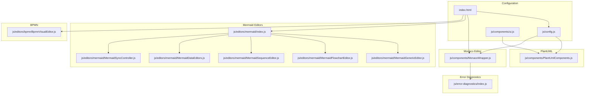
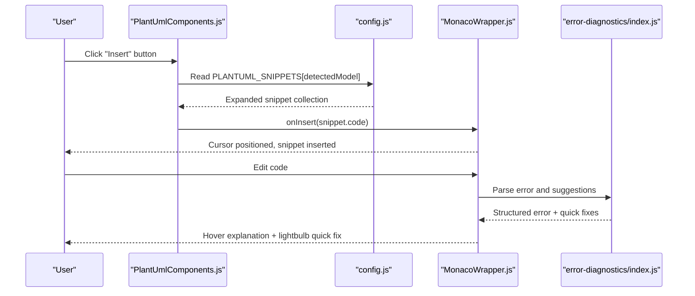
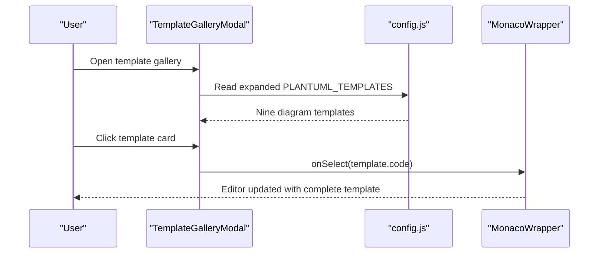
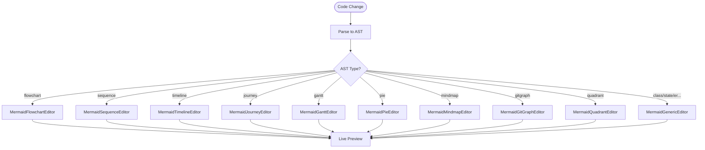
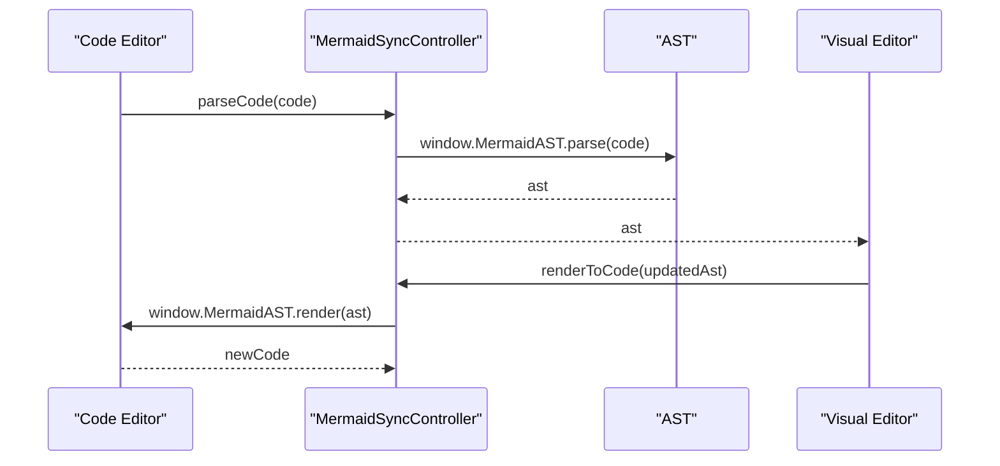
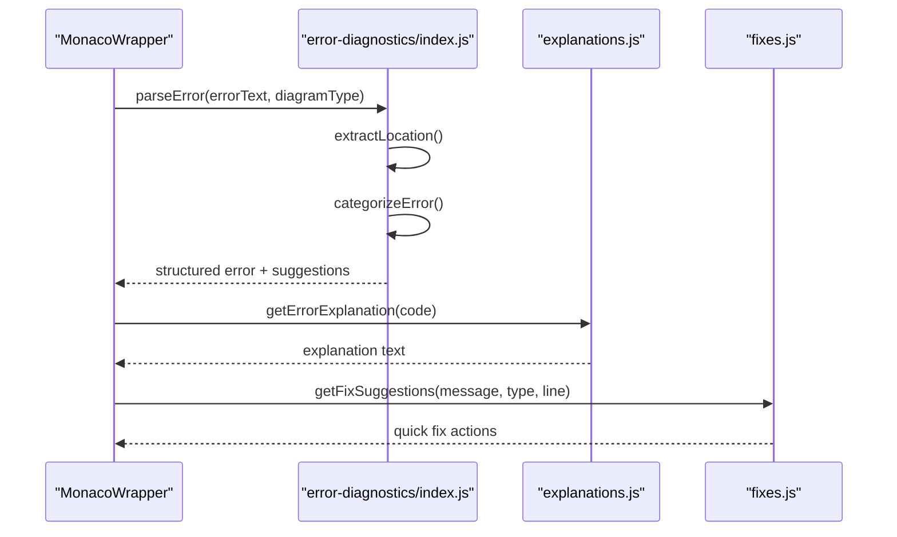
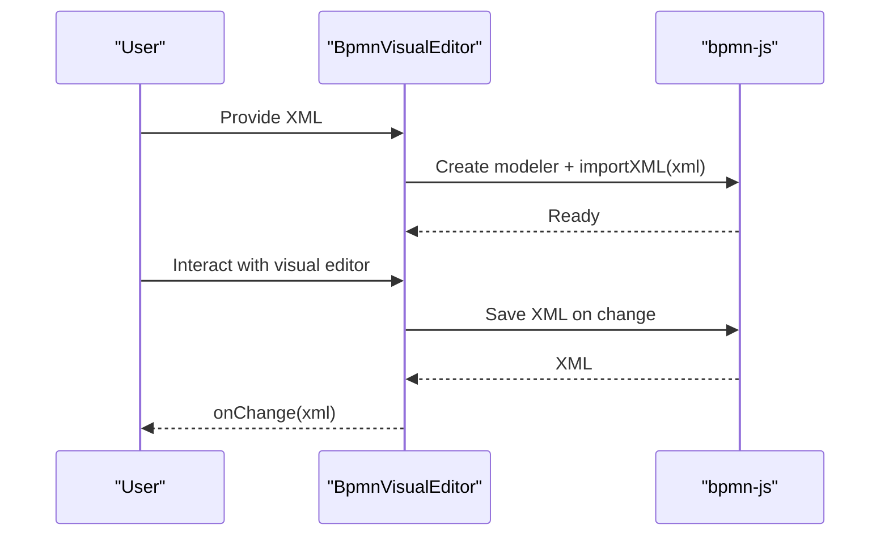
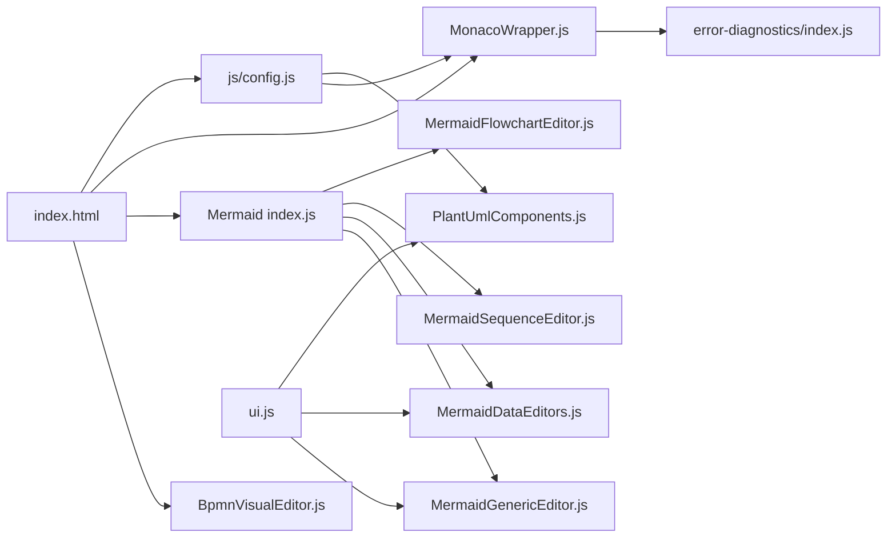

# Template System and Snippets

<cite>
**Referenced Files in This Document**
- [index.html](file://index.html)
- [js/config.js](file://js/config.js)
- [js/utils.js](file://js/utils.js)
- [js/components/PlantUmlComponents.js](file://js/components/PlantUmlComponents.js)
- [js/components/MonacoWrapper.js](file://js/components/MonacoWrapper.js)
- [js/editors/mermaid/index.js](file://js/editors/mermaid/index.js)
- [js/editors/mermaid/MermaidGenericEditor.js](file://js/editors/mermaid/MermaidGenericEditor.js)
- [js/editors/mermaid/MermaidFlowchartEditor.js](file://js/editors/mermaid/MermaidFlowchartEditor.js)
- [js/editors/mermaid/MermaidSequenceEditor.js](file://js/editors/mermaid/MermaidSequenceEditor.js)
- [js/editors/mermaid/MermaidDataEditors.js](file://js/editors/mermaid/MermaidDataEditors.js)
- [js/editors/mermaid/MermaidSyncController.js](file://js/editors/mermaid/MermaidSyncController.js)
- [js/editors/bpmn/BpmnVisualEditor.js](file://js/editors/bpmn/BpmnVisualEditor.js)
- [js/error-diagnostics/index.js](file://js/error-diagnostics/index.js)
- [js/components/ui.js](file://js/components/ui.js)
</cite>

## Update Summary
**Changes Made**
- Added comprehensive quick-start templates for nine diagram types (flowcharts, sequence diagrams, class diagrams, state diagrams, ER diagrams, Gantt charts, pie charts, mindmaps, user journey maps)
- Enhanced PlantUML template gallery with expanded template collection
- Improved empty state management with dedicated UI components
- Added new Mermaid template categories including git graphs and quadrant charts

## Table of Contents
1. [Introduction](#introduction)
2. [Project Structure](#project-structure)
3. [Core Components](#core-components)
4. [Architecture Overview](#architecture-overview)
5. [Detailed Component Analysis](#detailed-component-analysis)
6. [Dependency Analysis](#dependency-analysis)
7. [Performance Considerations](#performance-considerations)
8. [Troubleshooting Guide](#troubleshooting-guide)
9. [Conclusion](#conclusion)

## Introduction
This document explains the template system and snippet functionality for diagram creation. It covers:
- The enhanced template gallery for PlantUML with expanded template collection and quick-start templates
- The comprehensive snippet system for rapid insertion of diagram elements across PlantUML and Mermaid
- How templates and snippets integrate with editors and the Monaco-based code editor
- Practical workflows for inserting templates/snippets, customizing diagrams, and managing empty states
- New quick-start templates for nine diagram types including flowcharts, sequence diagrams, class diagrams, state diagrams, ER diagrams, Gantt charts, pie charts, mindmaps, and user journey maps

## Project Structure
The application is a single-page React application with embedded JSX. Key areas related to templates and snippets:
- Configuration and constants (templates, snippets, diagram types) are defined centrally
- Editor components provide visual and code editing experiences
- Monaco integration adds syntax highlighting, diagnostics, and quick fixes
- Error diagnostics module parses and explains errors with actionable suggestions
- Empty state management provides user-friendly placeholders for various scenarios

**Diagram sources**
- [js/config.js](file://js/config.js#L1-L566)
- [index.html](file://index.html#L62-L371)
- [js/components/PlantUmlComponents.js](file://js/components/PlantUmlComponents.js#L1-L249)
- [js/editors/mermaid/index.js](file://js/editors/mermaid/index.js#L1-L137)
- [js/editors/mermaid/MermaidGenericEditor.js](file://js/editors/mermaid/MermaidGenericEditor.js#L1-L101)
- [js/editors/mermaid/MermaidFlowchartEditor.js](file://js/editors/mermaid/MermaidFlowchartEditor.js#L1-L276)
- [js/editors/mermaid/MermaidSequenceEditor.js](file://js/editors/mermaid/MermaidSequenceEditor.js#L1-L110)
- [js/editors/mermaid/MermaidDataEditors.js](file://js/editors/mermaid/MermaidDataEditors.js#L1-L306)
- [js/editors/mermaid/MermaidSyncController.js](file://js/editors/mermaid/MermaidSyncController.js#L1-L93)
- [js/components/MonacoWrapper.js](file://js/components/MonacoWrapper.js#L1-L426)
- [js/editors/bpmn/BpmnVisualEditor.js](file://js/editors/bpmn/BpmnVisualEditor.js#L1-L106)
- [js/error-diagnostics/index.js](file://js/error-diagnostics/index.js#L1-L303)
- [js/components/ui.js](file://js/components/ui.js#L83-L119)

**Section sources**
- [js/config.js](file://js/config.js#L1-L566)
- [index.html](file://index.html#L62-L371)

## Core Components
- Enhanced template gallery and snippet insertion for PlantUML:
  - Expanded PlantUML template collection with nine diagram types including flowcharts, sequence diagrams, class diagrams, state diagrams, ER diagrams, Gantt charts, pie charts, mindmaps, and user journey maps
  - Comprehensive Mermaid template gallery with quick-start templates for all supported diagram types
  - Dynamic snippet toolbar that adapts to detected model with expandable snippet categories
  - Template gallery modal with responsive grid layout displaying categorized templates with icons and descriptions
- Mermaid visual editors:
  - Router selects editor by AST type with enhanced support for new diagram types
  - Specialized editors for flowcharts, sequences, timelines, gantt, pie, mindmaps, journeys, and git graphs
  - Generic editor for other diagram types with improved empty state handling
- Monaco editor integration:
  - Syntax highlighting for PlantUML and Mermaid with enhanced error diagnostics
  - Error diagnostics with hover explanations and quick fixes for all diagram types
- BPMN visual editor:
  - Visual editing powered by bpmn-js with XML export/import
- Empty state management:
  - Dedicated EmptyState component for user-friendly placeholders
  - Context-aware empty states for different editor types and scenarios

**Section sources**
- [js/components/PlantUmlComponents.js](file://js/components/PlantUmlComponents.js#L1-L249)
- [js/editors/mermaid/index.js](file://js/editors/mermaid/index.js#L1-L137)
- [js/editors/mermaid/MermaidFlowchartEditor.js](file://js/editors/mermaid/MermaidFlowchartEditor.js#L1-L276)
- [js/editors/mermaid/MermaidSequenceEditor.js](file://js/editors/mermaid/MermaidSequenceEditor.js#L1-L110)
- [js/editors/mermaid/MermaidDataEditors.js](file://js/editors/mermaid/MermaidDataEditors.js#L1-L306)
- [js/components/MonacoWrapper.js](file://js/components/MonacoWrapper.js#L1-L426)
- [js/editors/bpmn/BpmnVisualEditor.js](file://js/editors/bpmn/BpmnVisualEditor.js#L1-L106)
- [js/components/ui.js](file://js/components/ui.js#L83-L119)

## Architecture Overview
The template and snippet system centers around configuration-driven data and enhanced editor components:
- Configuration defines diagram types, templates, and snippets with expanded PlantUML and Mermaid template collections
- PlantUML components provide an enhanced toolbar and gallery for quick insertion with improved empty state management
- Mermaid editors parse code into an AST and route to specialized editors with comprehensive template support
- Monaco provides language support and diagnostics for PlantUML, Mermaid, and BPMN with enhanced error handling
- Error diagnostics module parses errors and generates actionable suggestions for all diagram types
- Empty state management provides user-friendly placeholders across all editor types

**Diagram sources**
- [js/components/PlantUmlComponents.js](file://js/components/PlantUmlComponents.js#L8-L47)
- [js/config.js](file://js/config.js#L118-L192)
- [js/components/MonacoWrapper.js](file://js/components/MonacoWrapper.js#L318-L423)
- [js/error-diagnostics/index.js](file://js/error-diagnostics/index.js#L13-L44)

## Detailed Component Analysis

### Enhanced PlantUML Template Gallery and Snippet System
- Expanded template collection:
  - Nine diagram types: sequence diagrams, class diagrams, use case diagrams, activity diagrams, state diagrams, component diagrams, mind maps, ER diagrams, and deployment diagrams
  - Each template includes comprehensive examples with proper syntax and structure
  - Responsive grid layout with icons, titles, and descriptions for easy selection
- Enhanced snippet toolbar:
  - Dynamically selects category based on detected model with expanded snippet collections
  - Expandable interface showing up to six snippets initially, with option to show more
  - Improved visual feedback with hover effects and transition animations
- Template gallery modal:
  - Grid layout of templates with consistent styling and responsive design
  - Selecting a template injects complete code into the editor with proper formatting
  - Enhanced empty state handling for template loading and display

**Diagram sources**
- [js/components/PlantUmlComponents.js](file://js/components/PlantUmlComponents.js#L52-L95)
- [js/config.js](file://js/config.js#L194-L565)
- [js/components/MonacoWrapper.js](file://js/components/MonacoWrapper.js#L42-L57)

**Section sources**
- [js/components/PlantUmlComponents.js](file://js/components/PlantUmlComponents.js#L8-L95)
- [js/config.js](file://js/config.js#L118-L565)
- [js/components/MonacoWrapper.js](file://js/components/MonacoWrapper.js#L42-L84)

### Comprehensive Mermaid Template System
- Enhanced template gallery:
  - Nine diagram types: flowcharts, sequence diagrams, class diagrams, state diagrams, ER diagrams, Gantt charts, pie charts, mindmaps, and user journey maps
  - Additional support for git graphs and quadrant charts for specialized use cases
  - Each template includes complete Mermaid syntax with proper formatting and examples
- Template integration:
  - Dynamic template selection based on diagram type detection
  - Unified template gallery interface supporting both PlantUML and Mermaid templates
  - Consistent styling and user experience across all template types

**Section sources**
- [index.html](file://index.html#L322-L490)

### Mermaid Visual Editor Routing and Editors
- Enhanced router:
  - Determines diagram type from AST and routes to appropriate editor with expanded type support
  - Falls back to generic editor for unsupported types with improved error handling
- Specialized editors:
  - Flowchart editor: node/edge list with inline editing and enhanced empty state management
  - Sequence editor: participant/message lists with add controls and improved validation
  - Data editors: timeline, gantt, pie, mindmap, journey with add controls and enhanced user interaction
  - Git graph editor: branch visualization with interactive controls
  - Quadrant chart editor: priority matrix with coordinate-based positioning
- Generic editor:
  - Live preview and AST property panel with improved empty state handling
  - Enhanced error diagnostics and user feedback mechanisms

**Diagram sources**
- [js/editors/mermaid/index.js](file://js/editors/mermaid/index.js#L78-L121)
- [js/editors/mermaid/MermaidFlowchartEditor.js](file://js/editors/mermaid/MermaidFlowchartEditor.js#L18-L59)
- [js/editors/mermaid/MermaidSequenceEditor.js](file://js/editors/mermaid/MermaidSequenceEditor.js#L8-L36)
- [js/editors/mermaid/MermaidDataEditors.js](file://js/editors/mermaid/MermaidDataEditors.js#L12-L42)
- [js/editors/mermaid/MermaidGenericEditor.js](file://js/editors/mermaid/MermaidGenericEditor.js#L11-L97)

**Section sources**
- [js/editors/mermaid/index.js](file://js/editors/mermaid/index.js#L20-L121)
- [js/editors/mermaid/MermaidFlowchartEditor.js](file://js/editors/mermaid/MermaidFlowchartEditor.js#L10-L111)
- [js/editors/mermaid/MermaidSequenceEditor.js](file://js/editors/mermaid/MermaidSequenceEditor.js#L4-L50)
- [js/editors/mermaid/MermaidDataEditors.js](file://js/editors/mermaid/MermaidDataEditors.js#L7-L171)
- [js/editors/mermaid/MermaidGenericEditor.js](file://js/editors/mermaid/MermaidGenericEditor.js#L11-L97)

### Mermaid Sync Controller
- Bi-directional synchronization:
  - parseCode: converts code to AST (code → visual)
  - renderToCode: converts AST back to code (visual → code)
  - Debouncing prevents infinite loops during sync with enhanced error handling
- Type detection:
  - detectDiagramType via MermaidAST with expanded type support

**Diagram sources**
- [js/editors/mermaid/MermaidSyncController.js](file://js/editors/mermaid/MermaidSyncController.js#L21-L58)

**Section sources**
- [js/editors/mermaid/MermaidSyncController.js](file://js/editors/mermaid/MermaidSyncController.js#L9-L92)

### Enhanced Monaco Editor Integration and Error Diagnostics
- Language registration:
  - PlantUML and Mermaid Monarch tokenizers with expanded syntax support
  - Comments, brackets, auto-closing pairs configured with enhanced error detection
- Error providers:
  - Code action provider: quick fixes for common errors across all diagram types
  - Hover provider: detailed explanations for error markers with improved user guidance
- Error diagnostics:
  - parseError: extracts line/column, assigns error code, builds suggestions with enhanced context
  - toMonacoMarker/toMonacoCodeAction: convert to Monaco-compatible formats with improved formatting
- Empty state integration:
  - Error states integrated with empty state management for consistent user experience

**Diagram sources**
- [js/components/MonacoWrapper.js](file://js/components/MonacoWrapper.js#L318-L423)
- [js/error-diagnostics/index.js](file://js/error-diagnostics/index.js#L13-L44)

**Section sources**
- [js/components/MonacoWrapper.js](file://js/components/MonacoWrapper.js#L174-L303)
- [js/error-diagnostics/index.js](file://js/error-diagnostics/index.js#L13-L303)

### BPMN Visual Editor
- Uses bpmn-js to provide a visual modeling experience
- Imports initial XML and exports XML on changes
- Handles loading and cleanup of resources with enhanced error handling

**Diagram sources**
- [js/editors/bpmn/BpmnVisualEditor.js](file://js/editors/bpmn/BpmnVisualEditor.js#L19-L90)

**Section sources**
- [js/editors/bpmn/BpmnVisualEditor.js](file://js/editors/bpmn/BpmnVisualEditor.js#L14-L105)

### Enhanced Empty State Management
- Dedicated EmptyState component:
  - Flexible placeholder system with customizable icon, title, and description
  - Consistent styling with Tailwind CSS classes for visual consistency
  - Support for child components allowing rich empty state content
- Integration across components:
  - Timeline editor empty state for timeline elements
  - Gantt editor empty state for task management
  - Pie chart editor empty state for slice management
  - Mindmap editor empty state for node structure
  - Journey editor empty state for task scoring
  - Interactive SVG preview empty state for diagram rendering
- User experience improvements:
  - Consistent empty state patterns across all editor types
  - Helpful messaging and guidance for first-time users
  - Visual indicators with appropriate icons and styling

**Section sources**
- [js/components/ui.js](file://js/components/ui.js#L83-L119)

## Dependency Analysis
- Central configuration:
  - Templates and snippets are defined in configuration files with expanded collections and consumed by components
  - Enhanced template galleries support both PlantUML and Mermaid with unified interface
- Editor routing:
  - Mermaid router depends on AST type detection with expanded type support
- Monaco integration:
  - Components depend on Monaco APIs for language support and diagnostics with enhanced error handling
- Error handling:
  - Error diagnostics module is used by Monaco providers with improved context awareness
- Empty state management:
  - UI components provide consistent empty state handling across all editor types

**Diagram sources**
- [js/config.js](file://js/config.js#L1-L566)
- [index.html](file://index.html#L62-L371)
- [js/components/PlantUmlComponents.js](file://js/components/PlantUmlComponents.js#L1-L249)
- [js/components/MonacoWrapper.js](file://js/components/MonacoWrapper.js#L1-L426)
- [js/editors/mermaid/index.js](file://js/editors/mermaid/index.js#L1-L137)
- [js/editors/mermaid/MermaidFlowchartEditor.js](file://js/editors/mermaid/MermaidFlowchartEditor.js#L1-L276)
- [js/editors/mermaid/MermaidSequenceEditor.js](file://js/editors/mermaid/MermaidSequenceEditor.js#L1-L110)
- [js/editors/mermaid/MermaidDataEditors.js](file://js/editors/mermaid/MermaidDataEditors.js#L1-L306)
- [js/editors/mermaid/MermaidGenericEditor.js](file://js/editors/mermaid/MermaidGenericEditor.js#L1-L101)
- [js/editors/bpmn/BpmnVisualEditor.js](file://js/editors/bpmn/BpmnVisualEditor.js#L1-L106)
- [js/error-diagnostics/index.js](file://js/error-diagnostics/index.js#L1-L303)
- [js/components/ui.js](file://js/components/ui.js#L83-L119)

**Section sources**
- [js/config.js](file://js/config.js#L1-L566)
- [index.html](file://index.html#L62-L371)

## Performance Considerations
- Debouncing:
  - Mermaid AST parsing is debounced to avoid excessive re-renders with enhanced performance monitoring
- Lazy loading:
  - External libraries (Mermaid AST, bpmn-js) are loaded on demand with improved error handling
- Efficient rendering:
  - Visual editors update previews asynchronously and reuse object URLs with enhanced memory management
- Monaco optimizations:
  - Minimap, folding, and lightbulb are enabled for better UX without heavy overhead
- Template optimization:
  - Template galleries use virtual scrolling for large template collections
  - Icon caching and lazy loading for improved performance
- Empty state optimization:
  - Conditional rendering for empty states reduces DOM complexity
  - Optimized CSS classes for minimal styling overhead

## Troubleshooting Guide
Common issues and resolutions:
- Missing closing brackets or parentheses:
  - Quick fixes suggest adding missing delimiters with enhanced context awareness
- Missing PlantUML directives:
  - Suggestions add missing @startuml or @enduml with improved template insertion
- Unknown diagram type or unexpected tokens:
  - Hover explanations describe the issue and provide examples with enhanced error context
- Error localization:
  - Error diagnostics extract line/column and highlight the problematic region with improved precision
- Template loading issues:
  - Empty state management provides clear guidance for template loading failures
  - Fallback mechanisms ensure user experience continuity during template loading delays

Practical steps:
- Use the lightbulb quick fix to apply suggested corrections with enhanced error context
- Hover over error markers to read explanations with improved clarity
- Use the error diagnostics module to programmatically parse and present errors
- Utilize empty state placeholders for better user guidance during loading or error conditions
- Leverage the expanded template gallery for quick-start solutions

**Section sources**
- [js/error-diagnostics/index.js](file://js/error-diagnostics/index.js#L13-L303)
- [js/components/MonacoWrapper.js](file://js/components/MonacoWrapper.js#L318-L423)
- [js/components/ui.js](file://js/components/ui.js#L83-L119)

## Conclusion
The enhanced template and snippet system provides comprehensive diagram authoring capabilities:
- Expanded PlantUML templates with nine diagram types streamline creation with contextual insertion and improved empty state management
- Comprehensive Mermaid template gallery offers quick-start solutions for all supported diagram types including flowcharts, sequence diagrams, class diagrams, state diagrams, ER diagrams, Gantt charts, pie charts, mindmaps, and user journey maps
- Enhanced snippet system provides dynamic insertion capabilities with adaptive toolbar and expanded snippet collections
- Mermaid visual editors offer specialized editing experiences for different diagram types with comprehensive template support and improved empty state handling
- Monaco integration delivers robust syntax highlighting, diagnostics, and quick fixes with enhanced error context
- Error diagnostics improve developer experience with actionable insights and consistent empty state management
- Empty state management provides user-friendly placeholders across all editor types, improving the overall user experience