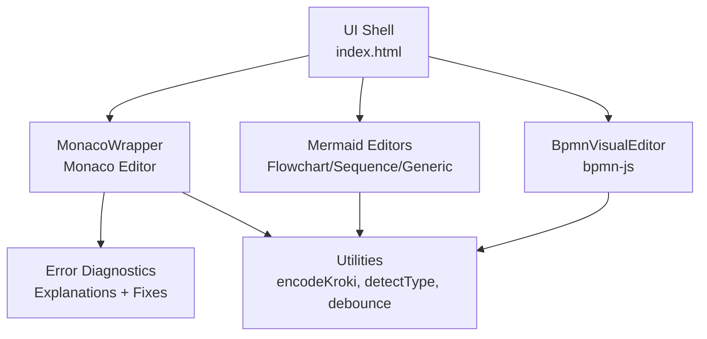
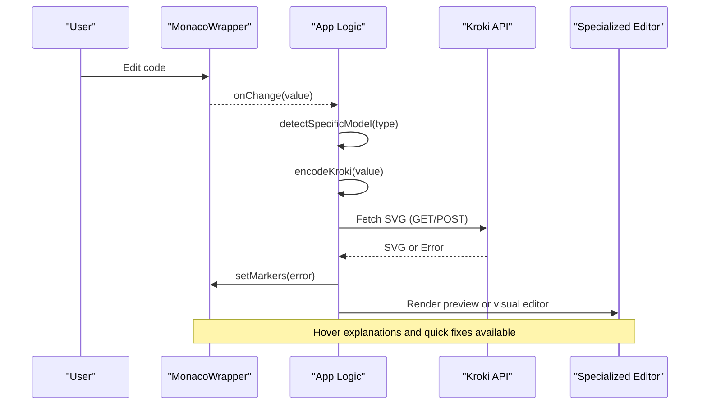
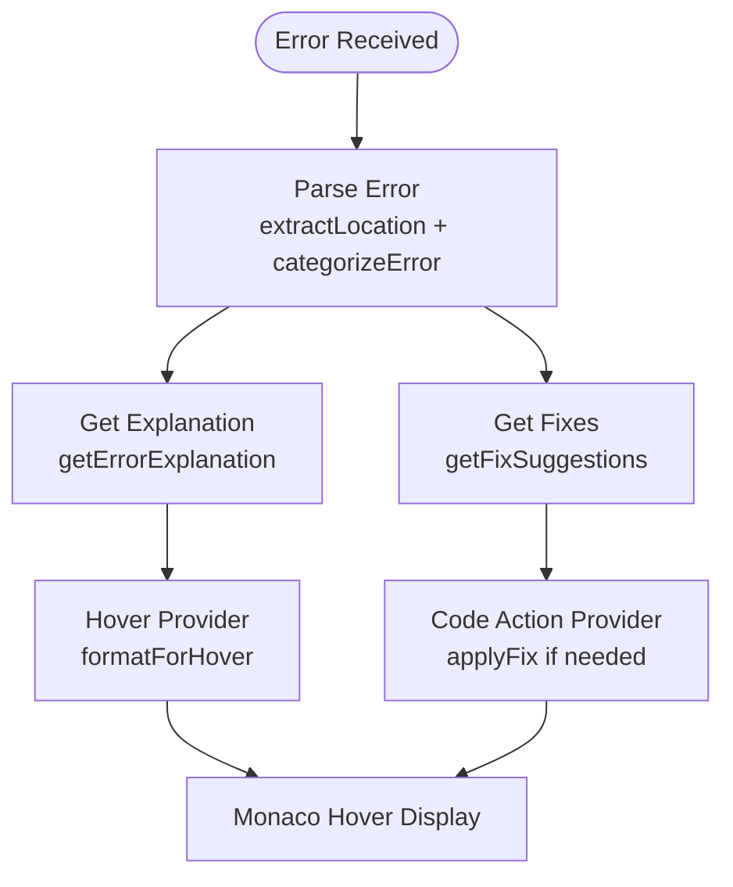
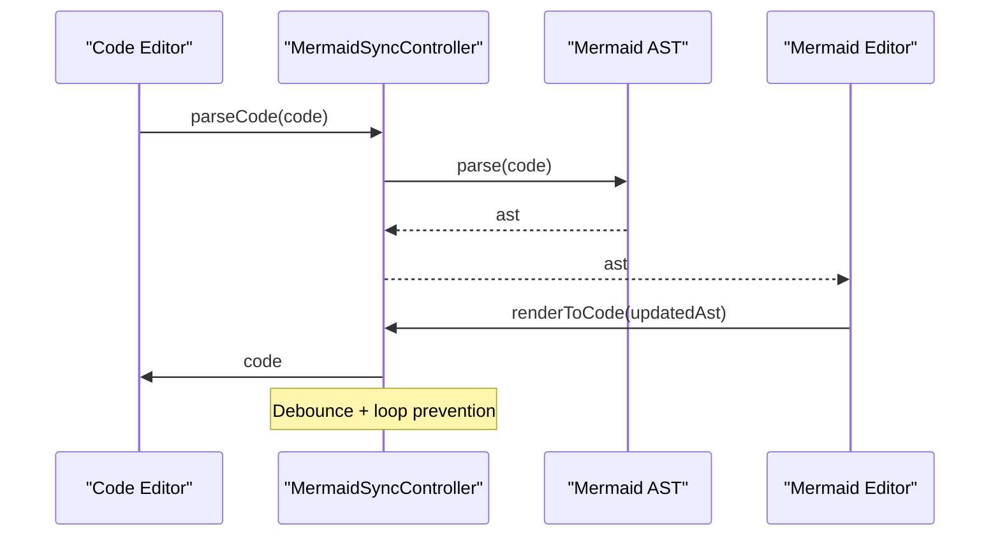
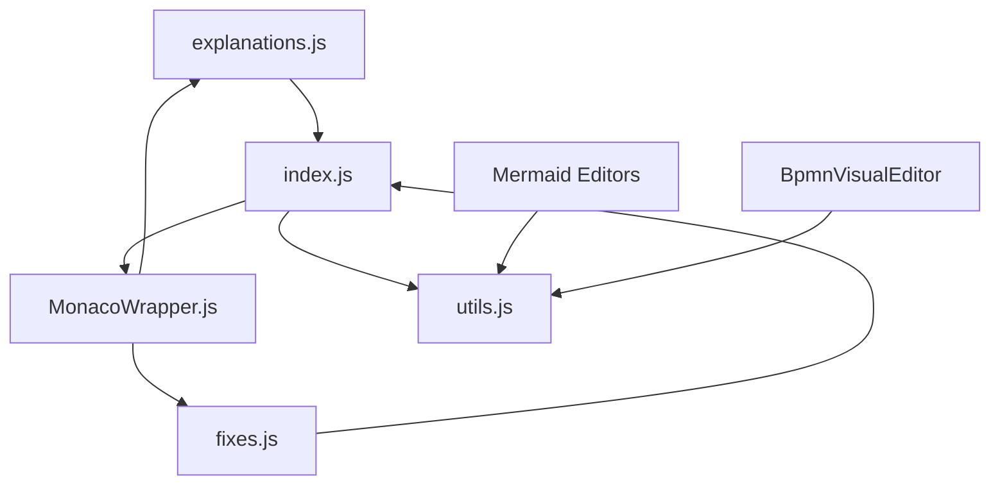

# Troubleshooting and FAQ

<cite>
**Referenced Files in This Document**
- [index.html](file://index.html)
- [js/error-diagnostics/explanations.js](file://js/error-diagnostics/explanations.js)
- [js/error-diagnostics/fixes.js](file://js/error-diagnostics/fixes.js)
- [js/error-diagnostics/index.js](file://js/error-diagnostics/index.js)
- [js/components/MonacoWrapper.js](file://js/components/MonacoWrapper.js)
- [js/editors/mermaid/MermaidSyncController.js](file://js/editors/mermaid/MermaidSyncController.js)
- [js/editors/mermaid/MermaidGenericEditor.js](file://js/editors/mermaid/MermaidGenericEditor.js)
- [js/editors/mermaid/MermaidFlowchartEditor.js](file://js/editors/mermaid/MermaidFlowchartEditor.js)
- [js/editors/mermaid/MermaidSequenceEditor.js](file://js/editors/mermaid/MermaidSequenceEditor.js)
- [js/editors/bpmn/BpmnVisualEditor.js](file://js/editors/bpmn/BpmnVisualEditor.js)
- [js/components/PlantUmlComponents.js](file://js/components/PlantUmlComponents.js)
- [js/utils.js](file://js/utils.js)
</cite>

## Table of Contents
1. [Introduction](#introduction)
2. [Project Structure](#project-structure)
3. [Core Components](#core-components)
4. [Architecture Overview](#architecture-overview)
5. [Detailed Component Analysis](#detailed-component-analysis)
6. [Dependency Analysis](#dependency-analysis)
7. [Performance Considerations](#performance-considerations)
8. [Troubleshooting Guide](#troubleshooting-guide)
9. [Conclusion](#conclusion)
10. [Appendices](#appendices)

## Introduction
This document provides comprehensive troubleshooting and FAQ guidance for the Universal Diagram Generator. It focuses on diagnosing and resolving common issues across diagram formats (Mermaid, PlantUML, BPMN, GraphViz, and others), editor functionality, integration scenarios, and best practices. It also documents the error explanation system, diagnostic tools, and self-help resources to help you quickly identify and fix problems.

## Project Structure
The application is a single-page React-based editor that supports multiple diagram formats. Key areas relevant to troubleshooting:
- Monaco editor integration with syntax highlighting and error diagnostics
- Error explanation and quick-fix systems
- Mermaid AST-based visual editor and sync controller
- BPMN visual editor powered by bpmn-js
- Utilities for encoding, detection, and debouncing

**Diagram sources**
- [index.html](file://index.html#L1398-L1599)
- [js/components/MonacoWrapper.js](file://js/components/MonacoWrapper.js#L1-L426)
- [js/error-diagnostics/index.js](file://js/error-diagnostics/index.js#L1-L303)
- [js/editors/mermaid/MermaidGenericEditor.js](file://js/editors/mermaid/MermaidGenericEditor.js#L1-L101)
- [js/editors/bpmn/BpmnVisualEditor.js](file://js/editors/bpmn/BpmnVisualEditor.js#L1-L106)
- [js/utils.js](file://js/utils.js#L1-L177)

**Section sources**
- [index.html](file://index.html#L1-L1759)

## Core Components
- MonacoWrapper integrates Monaco Editor with custom language support and registers error providers for hover explanations and quick fixes.
- Error diagnostics module parses raw errors, extracts locations, categorizes them, and provides explanations and suggested fixes.
- Mermaid editors include specialized editors for flowcharts, sequences, and a generic fallback with AST inspection.
- BPMN visual editor loads bpmn-js and synchronizes XML changes back to the code editor.
- Utilities provide encoding for Kroki URLs, diagram type detection, and helper functions.

**Section sources**
- [js/components/MonacoWrapper.js](file://js/components/MonacoWrapper.js#L1-L426)
- [js/error-diagnostics/index.js](file://js/error-diagnostics/index.js#L1-L303)
- [js/editors/mermaid/MermaidGenericEditor.js](file://js/editors/mermaid/MermaidGenericEditor.js#L1-L101)
- [js/editors/bpmn/BpmnVisualEditor.js](file://js/editors/bpmn/BpmnVisualEditor.js#L1-L106)
- [js/utils.js](file://js/utils.js#L1-L177)

## Architecture Overview
The system orchestrates user input, real-time previews, and error feedback:
- Users edit code in Monaco.
- The app detects diagram type and model, encodes to a Kroki URL, and fetches SVG.
- Errors are parsed, markers are applied in Monaco, and hover explanations are shown.
- Specialized editors (Mermaid and BPMN) provide visual editing with bidirectional synchronization.

**Diagram sources**
- [index.html](file://index.html#L1444-L1522)
- [js/components/MonacoWrapper.js](file://js/components/MonacoWrapper.js#L309-L423)
- [js/utils.js](file://js/utils.js#L14-L85)

## Detailed Component Analysis

### Error Diagnostics System
The diagnostics system provides:
- Error parsing: extracts line/column and assigns a categorized code
- Explanations: human-readable descriptions with examples per error family
- Quick fixes: actionable suggestions with auto-edit capabilities
- Monaco integration: code actions and hover provider

**Diagram sources**
- [js/error-diagnostics/index.js](file://js/error-diagnostics/index.js#L13-L276)
- [js/error-diagnostics/explanations.js](file://js/error-diagnostics/explanations.js#L237-L299)
- [js/error-diagnostics/fixes.js](file://js/error-diagnostics/fixes.js#L332-L366)
- [js/components/MonacoWrapper.js](file://js/components/MonacoWrapper.js#L309-L423)

**Section sources**
- [js/error-diagnostics/index.js](file://js/error-diagnostics/index.js#L13-L276)
- [js/error-diagnostics/explanations.js](file://js/error-diagnostics/explanations.js#L12-L302)
- [js/error-diagnostics/fixes.js](file://js/error-diagnostics/fixes.js#L11-L403)
- [js/components/MonacoWrapper.js](file://js/components/MonacoWrapper.js#L309-L423)

### Monaco Editor Integration
MonacoWrapper:
- Registers PlantUML and Mermaid languages with Monarch tokens
- Registers error providers for code actions and hover explanations
- Exposes methods to set/clear markers, scroll to line, and insert text

Key capabilities for troubleshooting:
- Squiggly underlines for errors
- Quick Fix lightbulb actions
- Hover tooltips with explanations and examples

**Section sources**
- [js/components/MonacoWrapper.js](file://js/components/MonacoWrapper.js#L13-L169)
- [js/components/MonacoWrapper.js](file://js/components/MonacoWrapper.js#L174-L303)
- [js/components/MonacoWrapper.js](file://js/components/MonacoWrapper.js#L309-L423)

### Mermaid Editors and Sync Controller
MermaidSyncController:
- Parses code to AST (Code → Visual)
- Renders AST back to code (Visual → Code)
- Debounces parse calls and prevents sync loops
- Detects diagram type and checks library availability

Mermaid editors:
- Flowchart editor: node/edge list with inline editing
- Sequence editor: participants/messages list
- Generic editor: live preview + AST explorer

**Diagram sources**
- [js/editors/mermaid/MermaidSyncController.js](file://js/editors/mermaid/MermaidSyncController.js#L9-L92)
- [js/editors/mermaid/MermaidFlowchartEditor.js](file://js/editors/mermaid/MermaidFlowchartEditor.js#L10-L276)
- [js/editors/mermaid/MermaidSequenceEditor.js](file://js/editors/mermaid/MermaidSequenceEditor.js#L4-L110)
- [js/editors/mermaid/MermaidGenericEditor.js](file://js/editors/mermaid/MermaidGenericEditor.js#L11-L101)

**Section sources**
- [js/editors/mermaid/MermaidSyncController.js](file://js/editors/mermaid/MermaidSyncController.js#L9-L92)
- [js/editors/mermaid/MermaidFlowchartEditor.js](file://js/editors/mermaid/MermaidFlowchartEditor.js#L10-L276)
- [js/editors/mermaid/MermaidSequenceEditor.js](file://js/editors/mermaid/MermaidSequenceEditor.js#L4-L110)
- [js/editors/mermaid/MermaidGenericEditor.js](file://js/editors/mermaid/MermaidGenericEditor.js#L11-L101)

### BPMN Visual Editor
BpmnVisualEditor:
- Loads bpmn-js CSS and library dynamically
- Imports initial XML and listens for changes
- Saves XML back to the code editor on command stack changes
- Handles initial import and external updates

Common issues:
- Library load failures
- XML import errors
- Editor readiness state

**Section sources**
- [js/editors/bpmn/BpmnVisualEditor.js](file://js/editors/bpmn/BpmnVisualEditor.js#L14-L106)

### PlantUML Components
PlantUML toolbar and template gallery:
- Snippet toolbar for quick insertion
- Template gallery modal with predefined templates
- Interactive SVG preview with click/context actions

**Section sources**
- [js/components/PlantUmlComponents.js](file://js/components/PlantUmlComponents.js#L8-L249)

### Utilities
Utilities include:
- Encoding for Kroki URLs using compression
- Diagram type detection from extension and content
- Error line extraction helpers
- Debounce and DOM loading helpers

**Section sources**
- [js/utils.js](file://js/utils.js#L14-L177)

## Dependency Analysis
The error diagnostics module depends on:
- Monaco editor APIs for markers and code actions
- Diagram-specific parsers and libraries (Mermaid AST, bpmn-js)
- Utility functions for encoding and detection

**Diagram sources**
- [js/error-diagnostics/index.js](file://js/error-diagnostics/index.js#L4-L6)
- [js/components/MonacoWrapper.js](file://js/components/MonacoWrapper.js#L6-L8)
- [js/utils.js](file://js/utils.js#L1-L3)

**Section sources**
- [js/error-diagnostics/index.js](file://js/error-diagnostics/index.js#L1-L303)
- [js/components/MonacoWrapper.js](file://js/components/MonacoWrapper.js#L1-L426)
- [js/utils.js](file://js/utils.js#L1-L177)

## Performance Considerations
- Debouncing: The Mermaid sync controller debounces parse calls to avoid excessive re-renders.
- Lazy loading: bpmn-js and Monaco are loaded on demand to reduce initial payload.
- Preview throttling: The main preview fetch is delayed slightly to avoid rapid successive requests.
- Compression: Diagram source is compressed before sending to Kroki to minimize payload size.

Best practices:
- Keep diagram code concise and well-formatted to improve parsing speed.
- Prefer incremental edits to avoid triggering full re-parses.
- Use templates and snippets to reduce manual typing and errors.

**Section sources**
- [js/editors/mermaid/MermaidSyncController.js](file://js/editors/mermaid/MermaidSyncController.js#L21-L38)
- [js/editors/bpmn/BpmnVisualEditor.js](file://js/editors/bpmn/BpmnVisualEditor.js#L26-L30)
- [js/utils.js](file://js/utils.js#L14-L28)
- [index.html](file://index.html#L1518-L1522)

## Troubleshooting Guide

### Browser Compatibility Problems
Symptoms:
- Monaco editor not rendering
- bpmn-js not loading
- Scripts failing to load

Resolutions:
- Ensure modern browsers with ES module support and dynamic imports.
- Verify CDN availability for Monaco, bpmn-js, and Mermaid AST libraries.
- Check for mixed-content warnings if using HTTPS.

Diagnostic steps:
- Open browser dev tools and inspect Network tab for failed script loads.
- Confirm that the Monaco loader and library scripts are being fetched successfully.
- For bpmn-js, confirm CSS and JS assets are loaded without errors.

**Section sources**
- [js/components/MonacoWrapper.js](file://js/components/MonacoWrapper.js#L95-L148)
- [js/editors/bpmn/BpmnVisualEditor.js](file://js/editors/bpmn/BpmnVisualEditor.js#L26-L30)
- [index.html](file://index.html#L54-L59)

### Performance Issues
Symptoms:
- Slow preview generation
- Editor lag during editing
- Frequent re-renders

Resolutions:
- Reduce diagram complexity and remove unnecessary comments.
- Use snippets/templates to minimize manual edits.
- Avoid extremely long lines or very large diagrams.

Diagnostic steps:
- Monitor network requests for large payloads.
- Use the debounced preview delay to your advantage—avoid rapid back-to-back edits.
- Consider switching to a simpler diagram type temporarily to isolate performance bottlenecks.

**Section sources**
- [js/editors/mermaid/MermaidSyncController.js](file://js/editors/mermaid/MermaidSyncController.js#L21-L38)
- [js/utils.js](file://js/utils.js#L14-L28)
- [index.html](file://index.html#L1518-L1522)

### Error Resolution Strategies
Common error families and resolutions:
- Missing closing bracket/paren/brace
  - Use the quick fix suggestions in Monaco to auto-insert missing delimiters.
  - Hover over the error marker to see a human-readable explanation and example.
- Unknown diagram type or missing declaration
  - Add the appropriate diagram declaration at the top of the code.
  - Use the quick fix lightbulb to insert the correct declaration.
- Unexpected token or syntax error
  - Review the highlighted line and surrounding context.
  - Use the hover explanation to understand the likely cause and correct syntax.

Diagnostic steps:
- Identify the error line number from the Monaco marker.
- Hover over the marker to read the explanation and example.
- Apply the suggested quick fix if available.

**Section sources**
- [js/error-diagnostics/explanations.js](file://js/error-diagnostics/explanations.js#L12-L302)
- [js/error-diagnostics/fixes.js](file://js/error-diagnostics/fixes.js#L11-L403)
- [js/error-diagnostics/index.js](file://js/error-diagnostics/index.js#L13-L276)
- [js/components/MonacoWrapper.js](file://js/components/MonacoWrapper.js#L309-L423)

### Feature Limitations
- Mermaid visual editors are specialized; unsupported diagram types fall back to generic preview and AST inspection.
- BPMN visual editor requires XML; non-XML content will not render visually.
- Some diagram formats may have limited export options; prefer SVG/PNG downloads when available.

Workarounds:
- Use the Code view for advanced editing when visual editors are unavailable.
- Switch to supported formats for visual editing.

**Section sources**
- [js/editors/mermaid/MermaidGenericEditor.js](file://js/editors/mermaid/MermaidGenericEditor.js#L56-L94)
- [js/editors/bpmn/BpmnVisualEditor.js](file://js/editors/bpmn/BpmnVisualEditor.js#L53-L61)

### Frequently Asked Questions

Q: How do I fix “Missing @enduml”?
A: Ensure your PlantUML code ends with the required directive. Use the quick fix suggestion to append it automatically.

Q: Why does my Mermaid diagram not render visually?
A: Visual editors are available for specific diagram types. If yours is not supported, use the Code view and rely on the live preview.

Q: How do I add a new participant or node quickly?
A: Use the toolbar snippets or the specialized editor buttons to insert boilerplate code.

Q: How do I export my diagram?
A: Use the download buttons to export as SVG or PNG. For higher quality, export PNG.

Q: How do I navigate to the code from an error?
A: Click the “Go to Definition” option in the context menu of interactive previews.

Q: How do I insert a snippet?
A: Use the Insert toolbar buttons to paste commonly used blocks.

Q: How do I switch between code and visual views?
A: Toggle the view mode in the UI controls.

Q: How do I reset the editor?
A: Use the template gallery to load a starter template.

**Section sources**
- [js/error-diagnostics/fixes.js](file://js/error-diagnostics/fixes.js#L111-L137)
- [js/editors/mermaid/MermaidFlowchartEditor.js](file://js/editors/mermaid/MermaidFlowchartEditor.js#L112-L124)
- [js/editors/mermaid/MermaidSequenceEditor.js](file://js/editors/mermaid/MermaidSequenceEditor.js#L38-L50)
- [js/components/PlantUmlComponents.js](file://js/components/PlantUmlComponents.js#L9-L47)
- [index.html](file://index.html#L1561-L1599)

### Step-by-Step Solutions

#### Loading Problems
Steps:
1. Check browser console for script load errors.
2. Verify CDN availability for Monaco, bpmn-js, and Mermaid AST.
3. Reload the page and try again.

#### Rendering Failures
Steps:
1. Inspect the error message and line number.
2. Hover over the error marker to read the explanation.
3. Apply the suggested quick fix if available.
4. Retry preview generation.

#### Synchronization Issues (Mermaid)
Steps:
1. Ensure the Mermaid AST library is loaded.
2. Avoid making visual edits while code is changing.
3. Use the debounced sync controller’s behavior by making incremental edits.

#### Export Problems
Steps:
1. Confirm that an SVG/PNG is available.
2. Use the download buttons to export.
3. If the image is blank, review the error markers and fix the code.

**Section sources**
- [js/editors/mermaid/MermaidSyncController.js](file://js/editors/mermaid/MermaidSyncController.js#L21-L58)
- [js/components/MonacoWrapper.js](file://js/components/MonacoWrapper.js#L58-L76)
- [index.html](file://index.html#L1561-L1599)

### Debugging Techniques and Diagnostic Commands
- Use the Monaco error markers to locate syntax issues.
- Use the hover provider to read explanations and examples.
- Use the quick fix actions to apply corrections.
- Use the debounced preview to stabilize frequent edits.
- Use the template gallery to validate your diagram type and structure.

Support resources:
- Diagram documentation links embedded in explanations.
- Template gallery for format-specific examples.
- Browser dev tools for network and console diagnostics.

**Section sources**
- [js/error-diagnostics/explanations.js](file://js/error-diagnostics/explanations.js#L278-L299)
- [js/error-diagnostics/fixes.js](file://js/error-diagnostics/fixes.js#L332-L400)
- [js/utils.js](file://js/utils.js#L166-L177)

## Conclusion
This guide consolidates the tools and workflows to diagnose and resolve common issues across diagram formats and editors. By leveraging Monaco’s error markers, hover explanations, quick fixes, and the specialized editors, most problems can be identified and resolved quickly. For persistent issues, use the diagnostic commands and support resources outlined above.

## Appendices

### Error Categories and Examples
- Missing closing delimiter: brackets, parentheses, braces
- Unknown diagram type or missing declaration
- Unexpected token or syntax error
- XML parsing errors (BPMN)
- Missing start/end directives (PlantUML)

**Section sources**
- [js/error-diagnostics/explanations.js](file://js/error-diagnostics/explanations.js#L12-L302)
- [js/error-diagnostics/fixes.js](file://js/error-diagnostics/fixes.js#L11-L403)